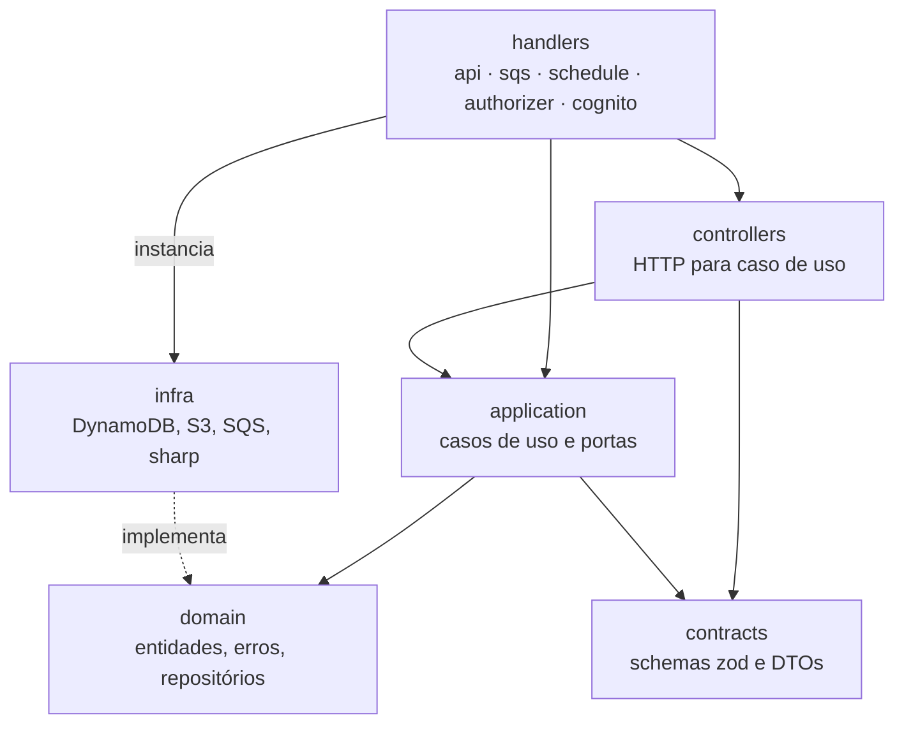

Todo o backend fica em `services/api`. É um único projeto TypeScript que gera sete funções Lambda, uma por arquivo em `src/handlers`. Não há framework web nem contêiner de injeção de dependência.

## Camadas

| Camada | Caminho | Responsabilidade |
| --- | --- | --- |
| Handlers | `src/handlers` | Ponto de entrada da Lambda. Monta as dependências, roteia e traduz erros em respostas. |
| Controllers | `src/controllers` | Extraem o `sub` ou o contexto do link do cliente, validam path e body e chamam o caso de uso. |
| HTTP | `src/http` | Respostas (`ok`, `noContent`, `error`), validação, leitura do `sub`, do contexto de acesso público e dos ids do path. |
| Casos de uso | `src/application/events`, `galleries`, `photos`, `orders`, `public` | Orquestram uma operação: criam entidades, chamam portas, devolvem DTOs. |
| Portas | `src/application/ports` | `IPhotoStorage`, `IPublisher` e `IBatchPublisher`, `ITokenGenerator`. |
| Domínio | `src/domain` | Entidades com suas regras, erros de domínio e as interfaces dos repositórios. |
| Infraestrutura | `src/infra` | Implementações sobre DynamoDB (`dynamodb`), S3 (`s3`), SQS (`sqs`), sharp (`sharp`) e criptografia (`crypto`). |
| Contratos | `src/contracts` | Schemas zod de entrada e saída e as funções `toXxxDto`. |
| Compartilhado | `src/shared` | Logger, métricas, erros transversais, `S3KeyBuilder` e `MediaUrlBuilder`. |
| CLI | `src/cli` | `process:local` e `process:image`, que rodam o processamento de imagem sem a AWS. |

## Handlers

### `studioApi`

Atende as rotas HTTP do fotógrafo. O roteamento é um `switch` sobre `event.routeKey`, por exemplo `'POST /events'`. As rotas também são declaradas uma a uma no template SAM, então autorização e throttling continuam configuráveis por rota.

As dependências são montadas no escopo do módulo, fora da função `handler`: clientes da AWS, repositórios e casos de uso são criados uma vez por ambiente de execução e reaproveitados entre invocações.

O `handler` envolve o roteamento em um `try/catch` que centraliza a conversão de exceções em respostas HTTP. Controllers também retornam 404 diretamente para ids inválidos, e `getMe` faz o mesmo quando o perfil não existe.

As exceções são mapeadas assim:

| Erro | Status | `code` |
| --- | --- | --- |
| `UnauthenticatedError` | 401 | `UNAUTHENTICATED` |
| `EventNotFoundError`, `GalleryNotFoundError` | 404 | `NOT_FOUND` |
| `DefaultGalleryCannotBeDeletedError` | 409 | `DEFAULT_GALLERY_NOT_DELETABLE` |
| `GalleryDeletingError` | 409 | `GALLERY_DELETING` |
| `PhotoNotReprocessableError` | 409 | `PHOTO_NOT_REPROCESSABLE` |
| `EventCannotBePublishedError` | 409 | `EVENT_NOT_PUBLISHABLE` |
| `EventPackageLockedError` | 409 | `EVENT_PACKAGE_LOCKED` |
| `EventPackageRequiredError` | 409 | `EVENT_PACKAGE_REQUIRED` |
| `EventNotEmptyError` | 409 | `EVENT_NOT_EMPTY` |
| `WriteConflictError` | 409 | `CONFLICT` |
| `InvalidRequestBodyError` | 400 | `INVALID_REQUEST` ou `INVALID_JSON` |
| `RequestValidationError`, `InvalidGalleryNameError`, `InvalidPhotoError`, `InvalidEventPackageError`, `InvalidAccessLinkValidityError` | 400 | `VALIDATION_ERROR` |
| `InvalidCursorError` | 400 | `INVALID_CURSOR` |
| qualquer outro | 500 | `INTERNAL_ERROR` |

Todo erro sai no formato `{ code, message, details }`. Erros inesperados são registrados em log e respondem com uma mensagem genérica, sem repassar detalhes de infraestrutura.

### `publicApi` e `publicAccessAuthorizer`

O `publicApi` atende as rotas `/public/*` do cliente, com o mesmo desenho do `studioApi`: um `switch` sobre `routeKey` e um `try/catch` que traduz erros. Ele não usa o JWT do Cognito. O contexto do `publicAccessAuthorizer` entrega o dono, o evento e o hash do token, e cada operação confere de novo o direito de acesso. Os erros do cliente estão em [Acesso público do cliente](/developers/flows/public-client-access#erros), [Seleção de fotos](/developers/flows/photo-selection) e [Pedidos](/developers/flows/orders).

### `imageProcessor`

Consome a fila SQS de processamento. Cada mensagem é um evento do S3 ou um job de reprocessamento, e `ImageJobNormalizer` converte as duas formas no mesmo formato. Para eventos do S3, o handler extrai dono, evento, galeria e foto com `S3KeyBuilder.parseOriginalKey`. Em seguida chama o caso de uso `ProcessUploadedPhoto`.

Ele devolve `batchItemFailures` com as mensagens que falharam, de modo que só elas voltam para a fila. Veja [Processamento de imagens](/developers/flows/image-processing) e [Reprocessamento e mídia](/developers/flows/reprocessing-and-media).

### `deletePhotosGalleryProcessor`

Consome a fila de exclusão e remove fotos e galerias em páginas, nos dois buckets e no DynamoDB. Veja [Exclusão de fotos e galerias](/developers/flows/photo-and-gallery-deletion).

### `eventDeletionReconciler`

Roda a cada 15 minutos e reenfileira a limpeza de eventos que deixou de avançar. Veja [Reconciliação da exclusão de eventos](/developers/flows/event-deletion-reconciliation).

### `postConfirmation`

Gatilho do Cognito. Cria o perfil do fotógrafo após a confirmação do cadastro. Veja [Criação do perfil](/developers/flows/account-bootstrap).

## Rotas

As rotas do fotógrafo abaixo são atendidas pelo `studioApi`. Todas, exceto `GET /health`, exigem o JWT do Cognito. As rotas `/public/*` são do `publicApi` e estão nas páginas de fluxo do cliente.

| Método e rota | Caso de uso | Fluxo |
| --- | --- | --- |
| `GET /health` | resposta fixa, pública | |
| `GET /me` | `controllers/getMe.ts` | [Criação do perfil](/developers/flows/account-bootstrap) |
| `POST /me/bootstrap` | `controllers/bootstrapMe.ts` | [Criação do perfil](/developers/flows/account-bootstrap) |
| `GET /events` | `ListEvents` | [Eventos e galerias](/developers/flows/events-and-galleries) |
| `POST /events` | `CreateEvent` | [Eventos e galerias](/developers/flows/events-and-galleries) |
| `GET /events/{eventId}` | `GetEvent` | [Eventos e galerias](/developers/flows/events-and-galleries) |
| `PATCH /events/{eventId}` | `UpdateEventDetails` | [Eventos e galerias](/developers/flows/events-and-galleries) |
| `PUT /events/{eventId}/package` | `SetEventPackage` | [Pacote, publicação e link](/developers/flows/event-publishing-and-access-link) |
| `POST /events/{eventId}/publish` | `PublishEvent` | [Pacote, publicação e link](/developers/flows/event-publishing-and-access-link) |
| `POST /events/{eventId}/access-link` | `CreateEventAccessLink` | [Pacote, publicação e link](/developers/flows/event-publishing-and-access-link) |
| `POST /events/{eventId}/delete` | `DeleteEvent`, exige `{ confirmation: "compreendo, excluir evento definitivamente" }` | [Reconciliação da exclusão de eventos](/developers/flows/event-deletion-reconciliation) |
| `GET /events/{eventId}/upload-summary` | `GetEventUploadSummary` | [Upload de fotos](/developers/flows/photo-upload) |
| `GET /events/{eventId}/galleries` | `ListGalleries` | [Eventos e galerias](/developers/flows/events-and-galleries) |
| `POST /events/{eventId}/galleries` | `CreateGallery` | [Eventos e galerias](/developers/flows/events-and-galleries) |
| `GET /events/{eventId}/galleries/{galleryId}` | `GetGallery` | [Eventos e galerias](/developers/flows/events-and-galleries) |
| `PATCH /events/{eventId}/galleries/{galleryId}` | `UpdateGallery` | [Eventos e galerias](/developers/flows/events-and-galleries) |
| `DELETE /events/{eventId}/galleries/{galleryId}` | `DeleteGallery` | [Exclusão de fotos e galerias](/developers/flows/photo-and-gallery-deletion) |
| `GET /events/{eventId}/galleries/{galleryId}/selection` | `GetStudioGallerySelection` | [Seleção de fotos](/developers/flows/photo-selection) |
| `GET /events/{eventId}/galleries/{galleryId}/selection/export` | `GetStudioGallerySelection` | [Seleção de fotos](/developers/flows/photo-selection) |
| `GET /events/{eventId}/galleries/{galleryId}/photos` | `ListGalleryPhotos` | [Upload de fotos](/developers/flows/photo-upload) |
| `POST /events/{eventId}/galleries/{galleryId}/photos/uploads` | `RequestPhotoUploads` | [Upload de fotos](/developers/flows/photo-upload) |
| `POST /events/{eventId}/galleries/{galleryId}/photos/delete` | `RequestDeleteSelectedPhotos` | [Exclusão de fotos e galerias](/developers/flows/photo-and-gallery-deletion) |
| `DELETE /events/{eventId}/galleries/{galleryId}/photos` | `RequestDeleteAllPhotosGallery` | [Exclusão de fotos e galerias](/developers/flows/photo-and-gallery-deletion) |
| `POST /events/{eventId}/galleries/{galleryId}/photos/{photoId}/reprocess` | `RequestPhotoReprocessing` | [Reprocessamento e mídia](/developers/flows/reprocessing-and-media) |
| `POST /events/{eventId}/photos/reprocess-failures` | `RequestEventFailuresReprocessing` | [Reprocessamento e mídia](/developers/flows/reprocessing-and-media) |
| `GET /orders` | `ListOrders` | [Pedidos](/developers/flows/orders) |

As rotas `/me` e `/me/bootstrap` chamam o repositório diretamente por funções em `src/controllers`, sem caso de uso. São as rotas mais antigas e seguem um formato anterior ao das demais.

## Controllers

Um controller é uma função, não uma classe. Ele faz três coisas, nesta ordem:

1. obtém o `sub` com `getPhotographerId`;
2. valida os ids do path e o corpo;
3. chama o caso de uso e embrulha o resultado com `ok`, `noContent` ou `error`.

Ids de path são validados por um schema antes de qualquer acesso ao banco. Um id malformado responde 404, igual a um recurso inexistente, sem consultar o DynamoDB.

## Casos de uso

Cada caso de uso é uma classe com um método `execute`, que recebe as portas pelo construtor. Vários declaram a dependência com `Pick`, pedindo só os métodos que usam, como `Pick<EventRepository, 'create'>`.

A maioria é fina: converte a entrada em entidade, chama uma porta e converte a saída em DTO. Os que carregam lógica própria são:

- `RequestPhotoUploads`, que decide se cada arquivo precisa ou não de um novo presigned POST;
- `ProcessUploadedPhoto`, que conduz o processamento e o reprocessamento de uma foto e classifica as falhas;
- `CreateOrder` e `CancelOrder`, que montam o pedido a partir da seleção;
- `DeleteSelectedPhotos`, `DeleteAllPhotosGallery` e `DeleteGallery`, que conduzem a exclusão em páginas;
- `ReconcileEventDeletions`, que reenfileira a limpeza parada de eventos.

## Domínio

O domínio tem cinco agregados, cada um em uma pasta de `src/domain`, além de `Money`:

| Entidade | Regras que carrega |
| --- | --- |
| `Photographer` | Apenas uma interface com `id`, `email` e `name`. |
| `Event` | Estados `DRAFT`, `PUBLISHED` e `ARCHIVED` e as transições `publish` e `archive`. Também guarda o pacote, o estado do link do cliente e as regras de acesso (`EventAccess`). |
| `Gallery` | Validação do nome, distinção entre galeria principal e adicional, `assertCanBeDeleted`, seleção do cliente (`GallerySelection`) e acesso (`GalleryAccess`). |
| `Photo` | Validação do arquivo, cálculo do fingerprint, `assertOriginalMatches`, `canBeReprocessed`. |
| `Order` | Estados do pedido, cotação (`Quote`) e a lista do fotógrafo (`OrderList`). |

`Event`, `Gallery` e `Photo` têm construtor privado e duas fábricas estáticas:

- `create`, para um recurso novo, que aplica as validações;
- `restore`, para reconstruir a entidade a partir do que está persistido.

### Limite entre domínio e infraestrutura

O domínio define **portas**: as interfaces `EventRepository`, `IEventAccessTokenRepository`, `GalleryRepository`, `PhotoRepository`, `PhotographerRepository`, `OrderRepository` e `OrderListRepository`. As implementações em `src/infra/dynamodb` dependem do domínio, e não o contrário.

Assim, `PhotoRepository` representa o que a aplicação precisa fazer com fotos, como registrar, reivindicar o processamento e marcar como disponível. Como isso vira `TransactWriteItems` ou `UpdateItem` condicional fica isolado em `DynamoDbPhotoRepository`.

O mesmo vale para o armazenamento e a mensageria: `IPhotoStorage` é a porta e `S3PhotoStorage` a implementação; `IPublisher` e `IBatchPublisher` são as portas e `SQSPublisher` a implementação.

O isolamento não é completo. Estes pontos fogem do desenho:

- `IPhotoStorage` fica em `src/application/ports`, e não em `src/domain`, e importa tipos de `PhotoRepository`.
- `Photo.ts` importa `node:crypto` para o fingerprint, e `Event.ts` importa `luxon`.
- `controllers/bootstrapMe.ts` e `handlers/cognito/postConfirmation.ts` tratam `ConditionalCheckFailedException` do SDK diretamente, em vez de um erro de domínio.
- As regras de `Event.publish` e `Event.archive` aparecem na entidade e nas `ConditionExpression` de `DynamoDbEventRepository`. Uma mudança precisa ser feita nos dois lugares.

A decisão e suas consequências estão no [ADR-004](/developers/adr/004-ports-and-repositories).

## Repositórios

Padrões que se repetem nas implementações DynamoDB:

- **Helpers de chaves.** `infra/dynamodb/keys.ts` reúne os formatos de chave de evento, galeria, foto, fingerprint e dos leases de exclusão. O repositório de perfil e parte do repositório de eventos ainda montam suas chaves diretamente.
- **Leitura validada.** Itens de evento, galeria e foto passam por schemas zod antes de virar entidades. O repositório de perfil verifica manualmente a presença de `id` e `email`; a contagem de fotos valida o `status` lido.
- **Leituras consistentes.** Eventos, galerias e fotos usam `ConsistentRead: true`. A leitura de perfil em `GET /me` e a consulta inicial do bootstrap usam `false`. Após perder uma corrida de criação, o bootstrap relê o perfil com consistência forte.
- **Escritas condicionais.** Criações usam `attribute_not_exists`; alterações e exclusões usam `attribute_exists` mais as condições da regra.
- **Erro de condição vira erro de domínio.** Os repositórios pedem `ReturnValuesOnConditionCheckFailure: ALL_OLD` e inspecionam o item devolvido para distinguir "não existe" de "regra violada" e de "já aplicado".
- **Transações com retry restrito.** `transactions.ts` repete uma transação até 3 vezes, com backoff e jitter, somente quando o cancelamento foi por `TransactionConflict`. Falhas de condição e erros de rede não são repetidos.
- **Cursor validado.** `cursor.ts` codifica a `LastEvaluatedKey` em base64url. Ao decodificar, o repositório confere formato, tamanho, partição e prefixo. Um cursor emitido para outro fotógrafo ou outra galeria é recusado com `InvalidCursorError`.

O modelo físico está em [Modelo de dados](/developers/architecture/data-model).

## Validação

A validação de entrada fica em `http/validation.ts`:

- `parseJsonBody` lê o corpo e o valida contra um schema;
- `validateInput` converte um `ZodError` em `RequestValidationError`, com uma lista de campos.

A resposta de validação traz o caminho do campo, o código e a mensagem genérica do zod. O valor enviado nunca volta na resposta.

Há duas linhas de defesa. O schema HTTP barra a entrada inválida, e as entidades repetem as regras essenciais, como o tamanho do nome da galeria. A segunda linha protege chamadores que não passem pelo contrato HTTP.

## Contratos

Os schemas de `src/contracts` definem o que entra e o que sai da API. As funções `toEventDto`, `toGalleryDto` e `toPhotoDto` são a fronteira de saída: copiam campo a campo e deixam de fora `ownerId`, `fingerprint` e qualquer chave do S3.

### Duplicação com `packages/contracts`

A fonte conceitual dos contratos é `packages/contracts`, que o frontend importa. O backend mantém uma **cópia** em `services/api/src/contracts`.

A cópia existe porque o build das Lambdas roda o esbuild do SAM com `npm ci` isolado em `services/api`, e ainda não empacota pacotes internos do workspace.

Testes em `tests/` protegem contra divergência: `event-contract-parity.test.ts`, `gallery-contract-parity.test.ts`, `photo-contract-parity.test.ts` e `order-contract-parity.test.ts`. Eles passam as mesmas entradas pelas duas cópias e falham se uma aceitar o que a outra rejeita. O `selection-price-parity.test.ts` faz o mesmo para o cálculo de preço da seleção, que existe no backend e no frontend.

<Warning>
  Ao alterar um contrato, altere as duas cópias na mesma mudança. O enum de status de foto também está duplicado, em `packages/contracts` e em `services/api/src/domain/photo/Photo.ts`.
</Warning>

## Identificadores

Eventos, galerias e fotos recebem um ULID, gerado no caso de uso. As listagens usam a ordem das chaves no DynamoDB. O timestamp do ULID aproxima essa ordem da criação, mas `ulid()` não é monotônico: ids gerados no mesmo milissegundo não preservam necessariamente a sequência de chamadas. A ordenação também não representa o nome do arquivo.

O identificador do fotógrafo é o `sub` do Cognito. A aplicação não gera um id próprio para ele.

A tentativa de processamento usa um UUID aleatório, gerado em `DynamoDbPhotoRepository.claimProcessing`.

## Logging

O log usa o Logger do AWS Lambda Powertools, em `shared/logger.ts`, que emite JSON estruturado. Há quatro instâncias, com `serviceName` `studio-api`, `image-processor`, `delete-photos-gallery-processor` e `event-deletion-reconciler`. O `imageProcessor` também publica métricas, em `shared/metrics.ts`.

- A `studio-api` acrescenta `requestId` e `routeKey` a cada log da requisição e os remove no `finally`.
- O `imageProcessor` acrescenta `messageId` e `senderId` por mensagem. Os logs de erro do processamento trazem `photoId`, `eventId`, `galleryId`, `sourceVersionId`, `processingAttemptId` e `stage`, a etapa em que a falha ocorreu.

Mais detalhes em [Observabilidade](/developers/operations/observability).

## Testes

| Tipo | Arquivos | O que cobre |
| --- | --- | --- |
| Unitário | `*.spec.ts` | Entidades, casos de uso com repositórios falsos, handlers com eventos de fixture. |
| Integração | `*.dynamodb.spec.ts` | Repositórios contra o DynamoDB Local, incluindo concorrência e isolamento entre fotógrafos. |
| Paridade | `tests/*-parity.test.ts` | Igualdade entre as duas cópias dos contratos e do cálculo de preço. |
| Infraestrutura | `tests/infra-template.test.ts` | Propriedades do template SAM, como escopos de autorização e políticas IAM. |

Os testes que usam o SDK da AWS simulam o cliente ou usam o DynamoDB Local. Eles não validam IAM, Cognito nem a entrega de eventos do S3. Esses pontos só se confirmam na stack real.
