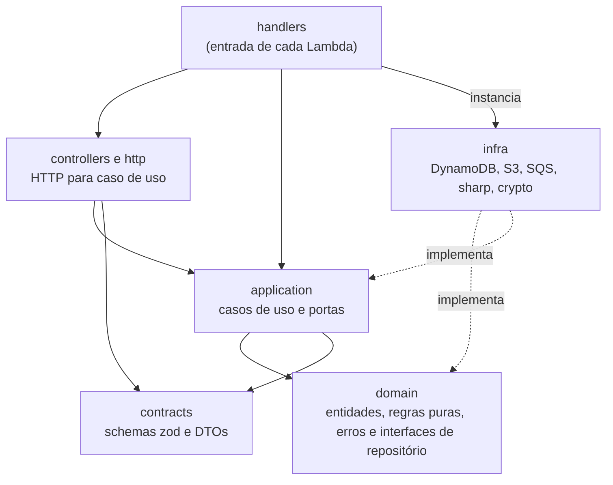

Todo o backend fica em `services/api`. É um único projeto TypeScript que gera **sete funções Lambda**, uma por arquivo em `src/handlers`. Não há framework web nem contêiner de injeção de dependência. Os imports usam o alias `@api/`, que aponta para `services/api/src`.

## As sete funções

| Handler | Gatilho | O que faz |
| --- | --- | --- |
| `handlers/api/studioApi.ts` | HTTP API, JWT do Cognito | Todas as rotas do fotógrafo. |
| `handlers/api/publicApi.ts` | HTTP API, authorizer do link | Todas as rotas do cliente: sessão, fotos, seleção e pedidos. |
| `handlers/authorizer/publicAccessAuthorizer.ts` | HTTP API, antes da `publicApi` | Autentica o token do link. |
| `handlers/cognito/postConfirmation.ts` | Cognito, `PostConfirmation` | Cria o perfil do fotógrafo. |
| `handlers/sqs/imageProcessor.ts` | SQS, fila de processamento | Gera miniatura e preview, e reprocessa. |
| `handlers/sqs/deletePhotosGalleryProcessor.ts` | SQS, fila de exclusão | Exclui fotos, galerias e o conteúdo de eventos. |
| `handlers/schedule/eventDeletionReconciler.ts` | Agenda do EventBridge, `rate(15 minutes)` | Retoma exclusões de evento paradas. |

Os recursos e as permissões de cada uma estão em [Infraestrutura](/developers/architecture/infrastructure).

## Camadas

| Camada | Caminho em `src` | Responsabilidade |
| --- | --- | --- |
| Handlers | `handlers/` | Ponto de entrada de cada Lambda. Monta as dependências, roteia e traduz erros em respostas. |
| HTTP | `http/` | `response` (`ok`, `noContent`, `error`), `validation`, `getPhotographerId` (o `sub` do JWT), `getPublicAccess` (o contexto do authorizer) e `parsePathIds`. |
| Controllers | `controllers/` | Extraem a identidade, validam path, query e corpo e chamam o caso de uso. Também reúnem a normalização das mensagens da fila (`ImageJobNormalizer`). |
| Casos de uso | `application/` | Orquestram uma operação. Pastas: `events`, `galleries`, `orders`, `photos`, `public` e `ports`. |
| Domínio | `domain/` | Entidades e regras puras, erros de domínio e as interfaces dos repositórios. Pastas: `event`, `gallery`, `order`, `money`, `photo`, `photographer`. |
| Infraestrutura | `infra/` | Implementações das portas: `dynamodb`, `s3`, `sqs`, `sharp`, `crypto`. |
| Contratos | `contracts/` | Schemas zod de entrada e saída e as funções `toXxxDto`. Pastas: `event`, `gallery`, `order`, `photo`. |
| Compartilhado | `shared/` | `logger`, `metrics`, `errors`, `helpers` e `storage` (`S3KeyBuilder`, `MediaUrlBuilder`). |
| CLI | `cli/` | Ferramentas locais de processamento de imagem, sem AWS. Veja [Desenvolvimento local](/developers/operations/local-development). |

## Handlers

Os handlers montam suas dependências **no escopo do módulo**, fora da função `handler`: clientes da AWS, repositórios e casos de uso são criados uma vez por ambiente de execução e reaproveitados entre invocações.

### `studioApi`

Atende as rotas do fotógrafo. O roteamento é um `switch` sobre `event.routeKey`, por exemplo `'POST /events'`. As rotas também são declaradas uma a uma no template SAM, então autorização e throttling continuam configuráveis por rota.

O `handler` envolve o roteamento em um `try/catch` que converte exceções em respostas HTTP. Controllers também retornam 404 diretamente para ids inválidos, e `getMe` faz o mesmo quando o perfil não existe.

| Erro | Status | `code` |
| --- | --- | --- |
| `UnauthenticatedError` | 401 | `UNAUTHENTICATED` |
| `EventNotFoundError`, `GalleryNotFoundError` | 404 | `NOT_FOUND` |
| `DefaultGalleryCannotBeDeletedError` | 409 | `DEFAULT_GALLERY_NOT_DELETABLE` |
| `GalleryDeletingError` | 409 | `GALLERY_DELETING` |
| `PhotoNotReprocessableError` | 409 | `PHOTO_NOT_REPROCESSABLE` |
| `EventCannotBePublishedError` | 409 | `EVENT_NOT_PUBLISHABLE` |
| `EventPackageLockedError` | 409 | `EVENT_PACKAGE_LOCKED` |
| `EventPackageRequiredError` | 409 | `EVENT_PACKAGE_REQUIRED` |
| `EventNotEmptyError` | 409 | `EVENT_NOT_EMPTY` |
| `WriteConflictError` | 409 | `CONFLICT` |
| `InvalidRequestBodyError` | 400 | `INVALID_REQUEST` ou `INVALID_JSON` |
| `RequestValidationError`, `InvalidGalleryNameError`, `InvalidPhotoError`, `InvalidEventPackageError`, `InvalidAccessLinkValidityError` | 400 | `VALIDATION_ERROR` |
| `InvalidCursorError` | 400 | `INVALID_CURSOR` |
| qualquer outro | 500 | `INTERNAL_ERROR` |

`EventNotEmptyError` ainda é mapeado, mas nenhum caso de uso atual o lança: a exclusão de evento não exige que ele esteja vazio.

Todo erro sai no formato `{ code, message, details }`. Erros inesperados são registrados em log e respondem com uma mensagem genérica, sem repassar detalhes de infraestrutura.

### `publicApi` e o authorizer

A `publicApi` atende o cliente do link. Dono e evento vêm **somente** do contexto que o `publicAccessAuthorizer` injeta, lido por `getPublicAccess`. O desenho está em [Acesso do cliente](/developers/flows/public-access).

| Erro | Status | `code` |
| --- | --- | --- |
| `UnauthenticatedError` (contexto do authorizer ausente) | 401 | `UNAUTHENTICATED` |
| `EventAccessDeniedError` | 403 | `ACCESS_DENIED` |
| `GalleryNotFoundError`, `PhotoNotSelectableError`, `OrderNotFoundError` | 404 | `NOT_FOUND` |
| `SelectionLimitReachedError`, `ExtraPhotosNotForSaleError` | 409 | `SELECTION_LIMIT` |
| `SelectionLockedError` | 409 | `SELECTION_LOCKED` |
| `EmptySelectionError` | 409 | `EMPTY_SELECTION` |
| `OrderNotActiveError` | 409 | `ORDER_NOT_ACTIVE` |
| `OrderNotCancelableError` | 409 | `ORDER_NOT_CANCELABLE` |
| `WriteConflictError` | 409 | `CONFLICT` |
| `RequestValidationError` | 400 | `VALIDATION_ERROR` |
| `InvalidCursorError` | 400 | `INVALID_CURSOR` |
| qualquer outro | 500 | `INTERNAL_ERROR` |

### `imageProcessor`

Consome a fila de processamento. O `ImageJobNormalizer` classifica cada mensagem (evento do S3 ou job de reprocessamento) e o caso de uso `ProcessUploadedPhoto` conduz o trabalho. Devolve `batchItemFailures` com as mensagens que falharam, de modo que só elas voltam para a fila. Veja [Processamento de imagens](/developers/flows/image-processing).

### `deletePhotosGalleryProcessor`

Consome a fila de exclusão. O campo `type` da mensagem escolhe entre excluir uma página de uma galeria (`GALLERY`) e excluir fotos escolhidas (`SELECTED`). Veja [Exclusão de fotos](/developers/flows/photo-deletion).

### `eventDeletionReconciler`

Roda a cada 15 minutos. Executa `ReconcileEventDeletions`, que lê as exclusões vencidas no GSI1 e reenfileira o trabalho parado. Se alguma reconciliação falhar, o handler lança erro, para que a falha apareça na métrica de erros da função. Veja [Reconciliação da exclusão de eventos](/developers/flows/event-deletion-reconciliation).

### `postConfirmation`

Gatilho do Cognito. Cria o perfil do fotógrafo após a confirmação do cadastro. Veja [Criação do perfil](/developers/flows/account-bootstrap).

## Rotas do Studio

| Método e rota | Caso de uso |
| --- | --- |
| `GET /health` | resposta fixa, pública |
| `GET /me` | `getMe` (controller, sem caso de uso) |
| `POST /me/bootstrap` | `bootstrapMe` (controller, sem caso de uso) |
| `GET /events` | `ListEvents` |
| `POST /events` | `CreateEvent` |
| `GET /events/{eventId}` | `GetEvent` |
| `PATCH /events/{eventId}` | `UpdateEventDetails` |
| `PUT /events/{eventId}/package` | `SetEventPackage` |
| `POST /events/{eventId}/publish` | `PublishEvent` |
| `POST /events/{eventId}/access-link` | `CreateEventAccessLink` |
| `POST /events/{eventId}/delete` | `DeleteEvent`. Exige `{ confirmation: "compreendo, excluir evento definitivamente" }`. |
| `GET /events/{eventId}/upload-summary` | `GetEventUploadSummary` |
| `POST /events/{eventId}/photos/reprocess-failures` | `RequestEventFailuresReprocessing` |
| `GET /events/{eventId}/galleries` | `ListGalleries` |
| `POST /events/{eventId}/galleries` | `CreateGallery` |
| `GET /events/{eventId}/galleries/{galleryId}` | `GetGallery` |
| `PATCH /events/{eventId}/galleries/{galleryId}` | `UpdateGallery` |
| `DELETE /events/{eventId}/galleries/{galleryId}` | `DeleteGallery` |
| `GET /events/{eventId}/galleries/{galleryId}/selection` | `GetStudioGallerySelection.execute` |
| `GET /events/{eventId}/galleries/{galleryId}/selection/export` | `GetStudioGallerySelection.exportText` |
| `GET /events/{eventId}/galleries/{galleryId}/photos` | `ListGalleryPhotos` |
| `DELETE /events/{eventId}/galleries/{galleryId}/photos` | `RequestDeleteAllPhotosGallery` |
| `POST /events/{eventId}/galleries/{galleryId}/photos/uploads` | `RequestPhotoUploads` |
| `POST /events/{eventId}/galleries/{galleryId}/photos/delete` | `RequestDeleteSelectedPhotos` |
| `POST /events/{eventId}/galleries/{galleryId}/photos/{photoId}/reprocess` | `RequestPhotoReprocessing` |
| `GET /orders` | `ListOrders` |

## Rotas do cliente

| Método e rota | Caso de uso |
| --- | --- |
| `GET /public/session` | `GetPublicSession` |
| `GET /public/photos` | `ListPublicGalleryPhotos` |
| `GET /public/selection` | `ListGallerySelection` |
| `PUT /public/selection/{photoId}` | `SelectGalleryPhoto` |
| `DELETE /public/selection/{photoId}` | `DeselectGalleryPhoto` |
| `POST /public/orders` | `CreateOrder` |
| `POST /public/orders/{orderId}/cancel` | `CancelOrder` |

Todas aceitam o header `x-access-token`. A galeria vai na query (`?galleryId=`), e a foto, no path.

## Controllers

Um controller é uma função, não uma classe. Ele faz três coisas, nesta ordem:

1. obtém a identidade: `getPhotographerId` (Studio) ou `getPublicAccess` (cliente);
2. valida os ids do path, a query e o corpo;
3. chama o caso de uso e embrulha o resultado com `ok`, `noContent` ou `error`.

Ids de path são validados por um schema antes de qualquer acesso ao banco. Um id malformado responde 404, igual a um recurso inexistente, sem consultar o DynamoDB. Os controllers de pedidos e de seleção da `publicApi` ficam no próprio `switch` do handler.

As rotas `/me` e `/me/bootstrap` são as mais antigas. Seus controllers (`getMe`, `bootstrapMe`) chamam o repositório diretamente, sem caso de uso, e seguem um formato anterior ao das demais. `bootstrapMe` também chama o Cognito (`GetUser`) com o token do chamador.

## Casos de uso

Cada caso de uso é uma classe com um método `execute`, que recebe as portas pelo construtor. Vários declaram a dependência com `Pick`, pedindo só os métodos que usam, como `Pick<EventRepository, 'getWithSelection'>`.

A maioria é fina: converte a entrada em entidade, chama uma porta e converte a saída em DTO. Os que têm lógica própria relevante:

| Caso de uso | A lógica que carrega |
| --- | --- |
| `RequestPhotoUploads` | Decide se cada arquivo precisa de um novo presigned POST. |
| `ProcessUploadedPhoto` | Conduz o processamento de uma foto e classifica as falhas. |
| `CreateOrder` | Abre o pedido, monta a seleção em etapas e publica o valor. Veja [Criação de pedidos](/developers/flows/order-creation). |
| `CancelOrder` | Cancela o pedido que espera pagamento. |
| `SelectGalleryPhoto`, `DeselectGalleryPhoto` | Tentam a escrita e só depois decidem o motivo da recusa. |
| `ListGallerySelection` | Cerca a leitura da seleção pela revisão. |
| `PublicAccessService` | Reúne as leituras que decidem se o link pode ver ou selecionar. |
| `ReconcileEventDeletions` | Recria o trabalho de exclusões de evento paradas. |

## Domínio

| Pasta | Conteúdo |
| --- | --- |
| `photographer` | Apenas a interface `Photographer` (`id`, `email`, `name`) e a do repositório. |
| `event` | `Event`, com estados `DRAFT`, `PUBLISHED` e `ARCHIVED`; `EventPackage`; as regras de acesso `canAccessEvent` e `accessLinkTtlMs`; os tipos do link; o tombstone de exclusão e seus tempos. |
| `gallery` | `Gallery` (nome, galeria principal, estado `ACTIVE`/`DELETING`); `canView` e `canSelect`; `selectionLimit`, `lightroomFilter` e as interfaces da seleção. |
| `order` | `Order`, `OrderStatusEnum`, a montagem (`Assembly`) e a interface `OrderRepository`; a lista (`OrderList`); `quote`. |
| `money` | `Money`, que só aceita centavos inteiros seguros. |
| `photo` | `Photo`, `PhotoStatusEnum`, validação do arquivo, fingerprint e `assertOriginalMatches`. |

`Event`, `Gallery` e `Photo` têm construtor privado e duas fábricas estáticas: `create`, para um recurso novo, que aplica as validações; e `restore`, para reconstruir a entidade a partir do que está persistido.

Várias regras são **funções puras**, que recebem tudo de que precisam e devolvem um resultado. `canAccessEvent`, `canView`, `selectionLimit`, `quote` e `lightroomFilter` não leem banco nem relógio: quem chama informa o instante.

### Limite entre domínio e infraestrutura

O domínio define **portas**: as interfaces dos repositórios (`EventRepository`, `IEventAccessTokenRepository`, `GalleryRepository`, `GallerySelectionRepository`, `OrderRepository`, `OrderListRepository`, `PhotoRepository`, `PhotographerRepository`). Os casos de uso definem as portas de serviços externos, em `application/ports`: `IPhotoStorage`, `IPublisher` (e `IBatchPublisher`) e `ITokenGenerator`. As implementações em `infra/` dependem do domínio, e não o contrário.

Assim, `OrderRepository` representa o que a aplicação precisa fazer com pedidos, como abrir, copiar uma página e publicar. Como isso vira `TransactWriteItems` ou `UpdateItem` condicional fica isolado em `DynamoDbOrderRepository`.

O isolamento não é completo. Estes pontos fogem do desenho:

- `Photo.ts` importa `node:crypto` para o fingerprint, e `Event.ts` importa `luxon`.
- `controllers/bootstrapMe.ts` e `handlers/cognito/postConfirmation.ts` tratam `ConditionalCheckFailedException` do SDK diretamente, em vez de um erro de domínio.
- As regras de `Event.publish` e `Event.archive` existem também nas `ConditionExpression` de `DynamoDbEventRepository`. A regra de acesso do cliente tem duas formas, `canAccessEvent` e `LINK_GRANTS_ACCESS`, e a de teto de seleção também, `selectionLimit` e `BELOW_SELECTION_LIMIT`. Uma mudança precisa ser feita nos dois lugares.

A decisão e suas consequências estão no [ADR-004](/developers/adr/004-ports-and-repositories).

## Repositórios

Padrões que se repetem nas implementações DynamoDB:

- **Helpers de chaves.** `infra/dynamodb/keys.ts` reúne os formatos de chave de evento, galeria, foto, fingerprint, seleção, pedido, item de pedido, token de acesso e a lista de pedidos no GSI1. O repositório de perfil ainda monta suas chaves diretamente.
- **Leitura validada.** Itens de evento, galeria, foto e pedido passam por schemas zod antes de virar entidades. O repositório de perfil verifica manualmente a presença de `id` e `email`.
- **Leituras consistentes.** Eventos, galerias, fotos, seleção e pedidos usam `ConsistentRead: true`. Duas leituras são **eventualmente consistentes** de propósito: a lista de pedidos, que usa o GSI1, e a listagem pública de fotos. A leitura de perfil em `GET /me` e a consulta inicial do bootstrap também usam `false`.
- **Escritas condicionais.** Criações usam `attribute_not_exists`; alterações e exclusões usam `attribute_exists` mais as condições da regra. Várias regras de negócio são **condições da escrita**, e não leituras anteriores. É o caso do teto de seleção e da unicidade do pedido ativo.
- **Erro de condição vira erro de domínio.** Os repositórios pedem `ReturnValuesOnConditionCheckFailure: ALL_OLD` e inspecionam o item devolvido para distinguir "não existe" de "regra violada" e de "já aplicado". Em transações, a ordem dos itens é a dos motivos de cancelamento lidos depois.
- **Transações com retry restrito.** `transactions.ts` repete uma transação até 3 vezes, com backoff e jitter, somente quando o cancelamento foi por `TransactionConflict`. Falhas de condição e erros de rede não são repetidos. Se o conflito persistir, `unexpectedCancellation` devolve `WriteConflictError`.
- **Três tipos de cursor.** `cursor.ts` codifica cursores em base64url e os valida ao decodificar: a chave da tabela com escopo opcional (Studio), a posição com escopo (listagem pública de fotos) e a data com posição (lista de pedidos). Os dois últimos **não carregam chave da tabela** nem dono. Um cursor de outra consulta é recusado com `InvalidCursorError`.

O modelo físico está em [Modelo de dados](/developers/architecture/data-model).

## Validação

A validação de entrada fica em `http/validation.ts`:

- `parseJsonBody` lê o corpo e o valida contra um schema;
- `validateInput` converte um `ZodError` em `RequestValidationError`, com uma lista de campos.

A resposta de validação traz o caminho do campo, o código e a mensagem genérica do zod. O valor enviado nunca volta na resposta.

Há duas linhas de defesa. O schema HTTP barra a entrada inválida, e as entidades repetem as regras essenciais, como o tamanho do nome da galeria e os limites do pacote. A segunda linha protege chamadores que não passem pelo contrato HTTP.

## Contratos

Os schemas de `src/contracts` definem o que entra e o que sai da API. As funções `toEventDto`, `toGalleryDto`, `toPhotoDto`, `toPublicPhotoDto`, `toOrderDto` e `toPublicOrderDto` são a fronteira de saída: copiam campo a campo e deixam de fora `ownerId`, `fingerprint` e qualquer chave do S3. Há DTOs distintos para o Studio e para o cliente do link, e o do cliente é o menor possível.

### Duplicação com `packages/contracts`

A fonte conceitual dos contratos é `packages/contracts`, que o frontend importa. O backend mantém uma **cópia** em `services/api/src/contracts`.

A cópia existe porque o build das Lambdas roda o esbuild do SAM com `npm ci` isolado em `services/api`, e ainda não empacota pacotes internos do workspace.

Cinco testes em `tests` protegem contra divergência: `event-contract-parity`, `gallery-contract-parity`, `order-contract-parity`, `photo-contract-parity` e `selection-price-parity`. Os quatro primeiros passam as mesmas entradas pelas duas cópias e falham se uma aceitar o que a outra rejeita. O último compara o cálculo de preço do frontend com o `quote` do backend.

<Warning>
  Ao alterar um contrato, altere as duas cópias na mesma mudança.
</Warning>

## Identificadores

Eventos, galerias, fotos e pedidos recebem um ULID, gerado no caso de uso. As listagens do Studio usam a ordem das chaves no DynamoDB. O timestamp do ULID aproxima essa ordem da criação, mas `ulid()` não é monotônico: ids gerados no mesmo milissegundo não preservam necessariamente a sequência de chamadas.

O identificador do fotógrafo é o `sub` do Cognito. A aplicação não gera um id próprio para ele.

Outros identificadores:

| Identificador | Formato | Gerado em |
| --- | --- | --- |
| Token do link | 32 bytes aleatórios em base64url (43 caracteres); só o hash SHA-256 é guardado | `CryptoTokenGenerator` |
| `attemptId` de processamento, de exclusão e de reprocessamento | UUID | O repositório, a cada reivindicação |
| `operationId` de exclusão de fotos escolhidas | UUID | `RequestDeleteSelectedPhotos` |
| `requestId` de reprocessamento | UUID | `RequestPhotoReprocessing` |
| `assembly.id` | ULID | `CreateOrder` |

## Logging e métricas

O log usa o Logger do AWS Lambda Powertools, em `shared/logger.ts`, que emite JSON estruturado. Há quatro instâncias, com `serviceName` próprio:

| `serviceName` | Usado por |
| --- | --- |
| `studio-api` | `studioApi`, **`publicApi`** e `postConfirmation` |
| `image-processor` | `imageProcessor` |
| `delete-photos-gallery-processor` | `deletePhotosGalleryProcessor` |
| `event-deletion-reconciler` | `eventDeletionReconciler` |

Os logs da `publicApi` saem, portanto, com `serviceName` `studio-api`. O que os distingue é o `routeKey`.

- As APIs acrescentam `requestId` e `routeKey` a cada log da requisição e os removem no `finally`.
- O `imageProcessor` acrescenta `messageId` e `senderId` por mensagem. Os logs de erro do processamento trazem `photoId`, `eventId`, `galleryId`, `sourceVersionId`, `processingAttemptId` e `stage`, a etapa em que a falha ocorreu.

As métricas customizadas usam o Powertools Metrics, no namespace `Lumora`, serviço `image-processor`. Veja [Observabilidade](/developers/operations/observability).

## Testes

| Tipo | Arquivos | O que cobre |
| --- | --- | --- |
| Unitário | `*.spec.ts` em `services/api` | Entidades, casos de uso com repositórios falsos, handlers com eventos de fixture. |
| Integração | `*.dynamodb.spec.ts` | Repositórios e fluxos contra o DynamoDB Local, incluindo concorrência, isolamento entre fotógrafos e o fluxo de pedidos. |
| Paridade | `tests/*-contract-parity.test.ts`, `tests/selection-price-parity.test.ts` | Igualdade entre as cópias dos contratos e entre os cálculos de preço. |
| Infraestrutura | `tests/infra-template.test.ts` | Propriedades do template SAM, como entrypoints, escopos de autorização e políticas IAM. |
| Frontend | `apps/web` | Componentes e hooks, com Vitest, Testing Library e MSW. |

Os testes de integração rodam com `pnpm test:dynamodb`, numa configuração separada que não executa em paralelo, porque os arquivos dividem uma tabela. Os demais rodam com `pnpm test`.

Os testes que usam o SDK da AWS simulam o cliente ou usam o DynamoDB Local. Eles não validam IAM, Cognito, authorizers nem a entrega de eventos do S3. Esses pontos só se confirmam na stack real.
