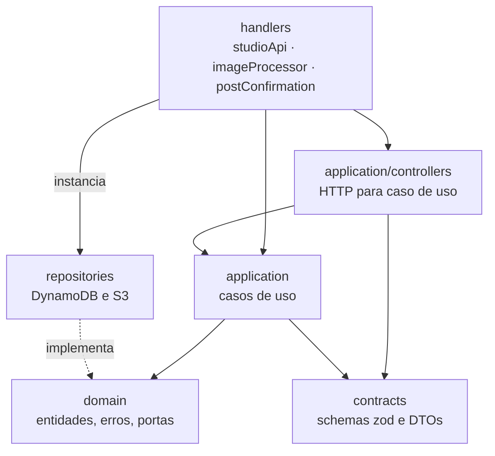

Todo o backend fica em `services/api`. É um único projeto TypeScript que gera três funções Lambda, uma por arquivo em `src/handlers`. Não há framework web nem contêiner de injeção de dependência.

## Camadas

| Camada | Caminho | Responsabilidade |
| --- | --- | --- |
| Handlers | `src/handlers` | Ponto de entrada da Lambda. Monta as dependências, roteia e traduz erros em respostas. |
| Controllers | `src/application/controllers` | Extraem o `sub`, validam path e body e chamam o caso de uso. |
| Casos de uso | `src/application/events`, `galleries`, `photos` | Orquestram uma operação: criam entidades, chamam portas, devolvem DTOs. |
| Domínio | `src/domain` | Entidades com suas regras, erros de domínio e as interfaces dos repositórios. |
| Repositórios | `src/repositories` | Implementações das portas sobre DynamoDB e S3. |
| Contratos | `src/contracts` | Schemas zod de entrada e saída e as funções `toXxxDto`. |
| Compartilhado | `src/shared` | Logger, validação, erros transversais, `S3KeyBuilder`, `SharpProcessor`. |

## Handlers

### `studioApi`

Atende todas as rotas HTTP do fotógrafo. O roteamento é um `switch` sobre `event.routeKey`, por exemplo `'POST /events'`. As rotas também são declaradas uma a uma no template SAM, então autorização e throttling continuam configuráveis por rota.

As dependências são montadas no escopo do módulo, fora da função `handler`: clientes da AWS, repositórios e casos de uso são criados uma vez por ambiente de execução e reaproveitados entre invocações.

O `handler` envolve o roteamento em um `try/catch` que é o **único** lugar onde erros viram respostas HTTP:

| Erro | Status | `code` |
| --- | --- | --- |
| `UnauthenticatedError` | 401 | `UNAUTHENTICATED` |
| `EventNotFoundError`, `GalleryNotFoundError` | 404 | `NOT_FOUND` |
| `DefaultGalleryCannotBeDeletedError` | 409 | `DEFAULT_GALLERY_NOT_DELETABLE` |
| `EventNotEmptyError` | 409 | `EVENT_NOT_EMPTY` |
| `WriteConflictError` | 409 | `CONFLICT` |
| `InvalidRequestBodyError` | 400 | `INVALID_REQUEST` ou `INVALID_JSON` |
| `RequestValidationError`, `InvalidGalleryNameError`, `InvalidPhotoError` | 400 | `VALIDATION_ERROR` |
| `InvalidCursorError` | 400 | `INVALID_CURSOR` |
| qualquer outro | 500 | `INTERNAL_ERROR` |

Todo erro sai no formato `{ code, message, details }`. Erros inesperados são registrados em log e respondem com uma mensagem genérica, sem repassar detalhes de infraestrutura.

### `imageProcessor`

Consome a fila SQS. Cada mensagem contém um evento do S3. O handler decodifica a chave do objeto, extrai dono, evento, galeria e foto com `S3KeyBuilder.parseOriginalKey` e chama o caso de uso `ProcessUploadedPhoto`.

Ele devolve `batchItemFailures` com as mensagens que falharam, de modo que só elas voltam para a fila. Veja [Processamento de imagens](/developers/flows/image-processing).

### `postConfirmation`

Gatilho do Cognito. Cria o perfil do fotógrafo após a confirmação do cadastro. Veja [Criação do perfil](/developers/flows/account-bootstrap).

## Rotas

| Método e rota | Caso de uso |
| --- | --- |
| `GET /health` | resposta fixa, pública |
| `GET /me` | `routes/getMe.ts` |
| `POST /me/bootstrap` | `routes/bootstrapMe.ts` |
| `GET /events` | `ListEvents` |
| `POST /events` | `CreateEvent` |
| `GET /events/{eventId}` | `GetEvent` |
| `PATCH /events/{eventId}` | `UpdateEventDetails` |
| `DELETE /events/{eventId}` | `DeleteEvent` |
| `GET /events/{eventId}/upload-summary` | `GetEventUploadSummary` |
| `GET /events/{eventId}/galleries` | `ListGalleries` |
| `POST /events/{eventId}/galleries` | `CreateGallery` |
| `GET /events/{eventId}/galleries/{galleryId}` | `GetGallery` |
| `PATCH /events/{eventId}/galleries/{galleryId}` | `UpdateGallery` |
| `DELETE /events/{eventId}/galleries/{galleryId}` | `DeleteGallery` |
| `GET /events/{eventId}/galleries/{galleryId}/photos` | `ListGalleryPhotos` |
| `POST /events/{eventId}/galleries/{galleryId}/photos/uploads` | `RequestPhotoUploads` |

As rotas `/me` e `/me/bootstrap` ficam em `src/routes` e chamam o repositório diretamente, sem controller nem caso de uso. São as rotas mais antigas e seguem um formato anterior ao das demais.

## Controllers

Um controller é uma função, não uma classe. Ele faz três coisas, nesta ordem:

1. obtém o `sub` com `getPhotographerId`;
2. valida os ids do path e o corpo;
3. chama o caso de uso e embrulha o resultado com `ok`, `noContent` ou `error`.

Ids de path são validados por um schema antes de qualquer acesso ao banco. Um id malformado responde 404, igual a um recurso inexistente, sem consultar o DynamoDB.

## Casos de uso

Cada caso de uso é uma classe com um método `execute`, que recebe as portas pelo construtor. Vários declaram a dependência com `Pick`, pedindo só os métodos que usam, como `Pick<EventRepository, 'create'>`.

A maioria é fina: converte a entrada em entidade, chama uma porta e converte a saída em DTO. Os dois com lógica própria são:

- `RequestPhotoUploads`, que decide se cada arquivo precisa ou não de um novo presigned POST;
- `ProcessUploadedPhoto`, que conduz o processamento de uma foto e classifica as falhas.

## Domínio

O domínio tem quatro agregados, cada um em uma pasta de `src/domain`:

| Entidade | Regras que carrega |
| --- | --- |
| `Photographer` | Apenas uma interface com `id`, `email` e `name`. |
| `Event` | Estados `DRAFT`, `PUBLISHED` e `ARCHIVED` e as transições `publish` e `archive`. |
| `Gallery` | Validação do nome, distinção entre galeria principal e adicional, `assertCanBeDeleted`. |
| `Photo` | Validação do arquivo, cálculo do fingerprint, `assertOriginalMatches`. |

`Event`, `Gallery` e `Photo` têm construtor privado e duas fábricas estáticas:

- `create`, para um recurso novo, que aplica as validações;
- `restore`, para reconstruir a entidade a partir do que está persistido.

### Limite entre domínio e infraestrutura

O domínio define **portas**: as interfaces `EventRepository`, `GalleryRepository`, `PhotoRepository` e `PhotographerRepository`. As implementações em `src/repositories/dynamodb` dependem do domínio, e não o contrário.

Assim, `PhotoRepository` representa o que a aplicação precisa fazer com fotos, como registrar, reivindicar o processamento e marcar como disponível. Como isso vira `TransactWriteItems` ou `UpdateItem` condicional fica isolado em `DynamoDbPhotoRepository`.

O mesmo vale para o armazenamento: `IPhotoStorage` é a porta e `S3PhotoStorage` a implementação.

O isolamento não é completo. Estes pontos fogem do desenho:

- `IPhotoStorage` fica em `src/contracts/photo`, e não em `src/domain`.
- `Photo.ts` importa `node:crypto` para o fingerprint, e `Event.ts` importa `luxon`.
- `routes/bootstrapMe.ts` e `handlers/postConfirmation.ts` tratam `ConditionalCheckFailedException` do SDK diretamente, em vez de um erro de domínio.
- As regras de `Event.publish` e `Event.archive` estão duplicadas nas `ConditionExpression` de `DynamoDbEventRepository`. Um comentário no código avisa que uma mudança precisa ser feita nos dois lugares.

A decisão e suas consequências estão no [ADR-004](/developers/adr/004-ports-and-repositories).

## Repositórios

Padrões que se repetem nas implementações DynamoDB:

- **Chaves em um só lugar.** `repositories/dynamodb/keys.ts` monta todas as chaves de partição e ordenação.
- **Leitura validada.** Cada item lido passa por um schema zod antes de virar entidade. Um item fora do formato lança erro em vez de produzir uma entidade inválida.
- **Leituras consistentes.** As leituras usam `ConsistentRead: true`, com exceção da consulta de perfil em `GET /me`.
- **Escritas condicionais.** Criações usam `attribute_not_exists`; alterações e exclusões usam `attribute_exists` mais as condições da regra.
- **Erro de condição vira erro de domínio.** Os repositórios pedem `ReturnValuesOnConditionCheckFailure: ALL_OLD` e inspecionam o item devolvido para distinguir "não existe" de "regra violada" e de "já aplicado".
- **Transações com retry restrito.** `transactions.ts` repete uma transação até 3 vezes, com backoff e jitter, somente quando o cancelamento foi por `TransactionConflict`. Falhas de condição e erros de rede não são repetidos.
- **Cursor validado.** `cursor.ts` codifica a `LastEvaluatedKey` em base64url. Ao decodificar, o repositório confere formato, tamanho, partição e prefixo. Um cursor emitido para outro fotógrafo ou outra galeria é recusado com `InvalidCursorError`.

O modelo físico está em [Modelo de dados](/developers/architecture/data-model).

## Validação

A validação de entrada fica em `shared/validation.ts`:

- `parseJsonBody` lê o corpo e o valida contra um schema;
- `validateInput` converte um `ZodError` em `RequestValidationError`, com uma lista de campos.

A resposta de validação traz o caminho do campo, o código e a mensagem genérica do zod. O valor enviado nunca volta na resposta.

Há duas linhas de defesa. O schema HTTP barra a entrada inválida, e as entidades repetem as regras essenciais, como o tamanho do nome da galeria. A segunda linha protege chamadores que não passem pelo contrato HTTP.

## Contratos

Os schemas de `src/contracts` definem o que entra e o que sai da API. As funções `toEventDto`, `toGalleryDto` e `toPhotoDto` são a fronteira de saída: copiam campo a campo e deixam de fora `ownerId`, `fingerprint` e qualquer chave do S3.

### Duplicação com `packages/contracts`

A fonte conceitual dos contratos é `packages/contracts`, que o frontend importa. O backend mantém uma **cópia** em `services/api/src/contracts`.

A cópia existe porque o build das Lambdas roda o esbuild do SAM com `npm ci` isolado em `services/api`, e ainda não empacota pacotes internos do workspace.

Três testes em `scripts` protegem contra divergência: `event-contract-parity.test.ts`, `gallery-contract-parity.test.ts` e `photo-contract-parity.test.ts`. Eles passam as mesmas entradas pelas duas cópias e falham se uma aceitar o que a outra rejeita.

<Warning>
  Ao alterar um contrato, altere as duas cópias na mesma mudança. O enum de status de foto também está duplicado, em `packages/domain` e em `services/api/src/domain/photo/Photo.ts`.
</Warning>

## Identificadores

Eventos, galerias e fotos recebem um ULID, gerado no caso de uso. Como o ULID é ordenável pelo tempo, a ordem das chaves no DynamoDB coincide com a ordem de criação.

O identificador do fotógrafo é o `sub` do Cognito. A aplicação não gera um id próprio para ele.

A tentativa de processamento usa um UUID aleatório, gerado em `DynamoDbPhotoRepository.claimProcessing`.

## Logging

O log usa o Logger do AWS Lambda Powertools, em `shared/logger.ts`, que emite JSON estruturado. Há duas instâncias, com `serviceName` `studio-api` e `image-processor`.

- A `studio-api` acrescenta `requestId` e `routeKey` a cada log da requisição e os remove no `finally`.
- O `imageProcessor` acrescenta `messageId` e `senderId` por mensagem. Os logs de erro do processamento trazem `photoId`, `eventId`, `galleryId`, `sourceVersionId`, `processingAttemptId` e `stage`, a etapa em que a falha ocorreu.

Mais detalhes em [Observabilidade](/developers/operations/observability).

## Testes

| Tipo | Arquivos | O que cobre |
| --- | --- | --- |
| Unitário | `*.spec.ts` | Entidades, casos de uso com repositórios falsos, handlers com eventos de fixture. |
| Integração | `*.dynamodb.spec.ts` | Repositórios contra o DynamoDB Local, incluindo concorrência e isolamento entre fotógrafos. |
| Paridade | `scripts/*-contract-parity.test.ts` | Igualdade entre as duas cópias dos contratos. |
| Infraestrutura | `scripts/infra-template.test.ts` | Propriedades do template SAM, como escopos de autorização e políticas IAM. |

Os testes que usam o SDK da AWS simulam o cliente ou usam o DynamoDB Local. Eles não validam IAM, Cognito nem a entrega de eventos do S3. Esses pontos só se confirmam na stack real.
