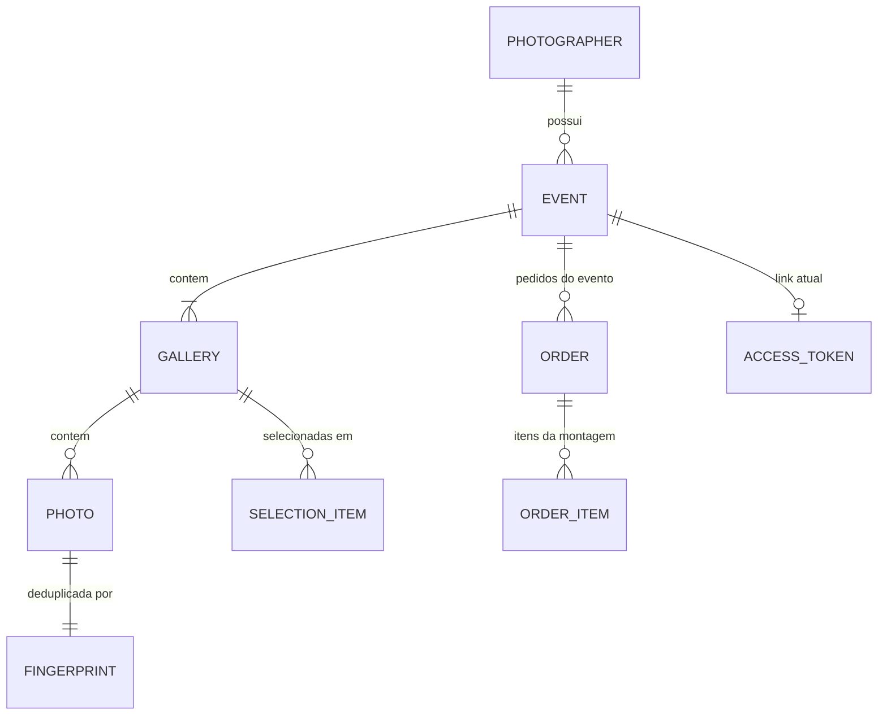

O Lumora guarda todos os metadados em uma única tabela DynamoDB, `lumora-app`. Os arquivos ficam no S3; a tabela guarda apenas referências lógicas a eles.

As chaves são montadas em `services/api/src/infra/dynamodb/keys.ts`.

## Estrutura da tabela

| Elemento | Definição |
| --- | --- |
| Chave de partição | `PK`, string |
| Chave de ordenação | `SK`, string |
| Índice global | `GSI1`, com `GSI1PK` e `GSI1SK`, projeção completa (`ALL`). Veja [GSI1](#gsi1). |
| TTL | Não configurado |
| Modo de capacidade | Sob demanda |

## Entidades e chaves

Há **cinco famílias de partição**:

| Família | `PK` | Contém |
| --- | --- | --- |
| Fotógrafo | `USER#{sub}` | Perfil, eventos e tombstones de exclusão de evento |
| Evento | `USER#{sub}#EVENT#{eventId}` | Galerias, fotos, fingerprints e leases de exclusão de fotos escolhidas |
| Galeria (seleção) | `GALLERY#{galleryId}` | Um item por foto selecionada pelo cliente |
| Pedido | `ORDER#{orderId}` | O registro do pedido e os itens de cada montagem |
| Token de acesso | `PUBLIC_TOKEN#{tokenHash}` | O registro que o authorizer consulta |

| Entidade | `PK` | `SK` |
| --- | --- | --- |
| Perfil do fotógrafo | `USER#{sub}` | `PROFILE` |
| Evento | `USER#{sub}` | `EVENT#{eventId}` |
| Exclusão de evento (tombstone) | `USER#{sub}` | `EVENT_DELETION#{eventId}` |
| Galeria | `USER#{sub}#EVENT#{eventId}` | `GALLERY#{galleryId}` |
| Foto | `USER#{sub}#EVENT#{eventId}` | `PHOTO#{galleryId}#{photoId}` |
| Fingerprint | `USER#{sub}#EVENT#{eventId}` | `FP#{galleryId}#{sha256}` |
| Lease de exclusão de fotos escolhidas | `USER#{sub}#EVENT#{eventId}` | `DELETE_SELECTED#{operationId}#{step}` |
| Seleção do cliente | `GALLERY#{galleryId}` | `SEL#{photoId}` |
| Pedido | `ORDER#{orderId}` | `META` |
| Item do pedido | `ORDER#{orderId}` | `ITEM#{assemblyId}#{photoId}` |
| Token de acesso | `PUBLIC_TOKEN#{tokenHash}` | `PUBLIC_GALLERY` |

### Exemplo

Os identificadores abaixo são fictícios.

| `PK` | `SK` | Item |
| --- | --- | --- |
| `USER#a1b2c3d4-0000-4000-8000-000000000001` | `PROFILE` | perfil |
| `USER#a1b2c3d4-0000-4000-8000-000000000001` | `EVENT#01JEXAMPLEEVENT0000000000A` | evento |
| `USER#a1b2c3d4-...#EVENT#01JEXAMPLEEVENT0000000000A` | `GALLERY#01JEXAMPLEGALLERY00000000A` | galeria principal |
| `USER#a1b2c3d4-...#EVENT#01JEXAMPLEEVENT0000000000A` | `PHOTO#01JEXAMPLEGALLERY00000000A#01JEXAMPLEPHOTO000000000A` | foto |
| `USER#a1b2c3d4-...#EVENT#01JEXAMPLEEVENT0000000000A` | `FP#01JEXAMPLEGALLERY00000000A#9f2c...e1` | fingerprint |
| `GALLERY#01JEXAMPLEGALLERY00000000A` | `SEL#01JEXAMPLEPHOTO000000000A` | foto selecionada |
| `ORDER#01JEXAMPLEORDER00000000A` | `META` | pedido |
| `ORDER#01JEXAMPLEORDER00000000A` | `ITEM#01JEXAMPLEASSEMBLY000000A#01JEXAMPLEPHOTO000000000A` | item do pedido |
| `PUBLIC_TOKEN#3b4c...f0` | `PUBLIC_GALLERY` | registro do token |

## Por que o dono está na chave do evento

A partição do evento inclui o `sub` do fotógrafo. Sem o `sub`, não há como montar a chave de uma galeria ou de uma foto.

A consequência é o isolamento por construção: um `eventId` de outro fotógrafo, recebido pela URL, resulta em uma chave que não existe. Não é preciso uma verificação de propriedade separada, e não há como esquecê-la.

A partição continua sendo uma por evento. Os eventos de um fotógrafo com muito conteúdo não se concentram em uma única partição.

Os repositórios de galeria ainda conferem o atributo `ownerId` do item como segunda barreira.

### Partições que não levam o dono

Três famílias não incluem o dono na chave: a **seleção** (`GALLERY#`), o **pedido** (`ORDER#`) e o **token** (`PUBLIC_TOKEN#`). Para elas, o isolamento não vem da chave, e sim de uma regra do código:

| Família | Como o isolamento é garantido |
| --- | --- |
| Seleção | Quem lê uma galeria prova antes que ela pertence ao evento do link (cliente) ou ao fotógrafo autenticado (Studio). Os itens guardam `ownerId` e `eventId`, e a cópia para o pedido e as escritas os conferem. |
| Pedido | O registro guarda `ownerId` e `eventId`, e quem o lê confere os dois. Um pedido de outro evento responde como inexistente. |
| Token | O registro leva o dono (`id`) e o evento. O authorizer os injeta no contexto, e nenhuma rota pública aceita esses valores de outra fonte. |

Esta é uma diferença de desenho a preservar: **acrescentar uma leitura nessas partições sem a prova de propriedade abre um acesso entre fotógrafos**.

## Padrões de acesso

| Operação | Acesso |
| --- | --- |
| Ler o perfil | `GetItem` em `USER#{sub}` / `PROFILE` |
| Listar eventos do fotógrafo | `Query` em `USER#{sub}` com `begins_with(SK, 'EVENT#')`, ordem decrescente, 20 por página, leitura consistente |
| Ler um evento | `GetItem` em `USER#{sub}` / `EVENT#{eventId}`, leitura consistente |
| Nomes de eventos de uma página de pedidos | `BatchGetItem` do evento, projetando `id` e `name`, em blocos de 100 |
| Listar galerias do evento | `Query` na partição do evento com `begins_with(SK, 'GALLERY#')`, todas as páginas |
| Ler uma galeria | `GetItem` na partição do evento |
| Listar fotos de uma galeria (Studio) | `Query` na partição do evento com `begins_with(SK, 'PHOTO#{galleryId}#')`, ordem crescente, 24 por página; com filtro de estado, blocos de 250 e até 4 leituras |
| Listar fotos prontas (cliente) | A mesma `Query`, filtrando `AVAILABLE`, leitura **eventual**, 60 por página (até 200), até 4 leituras |
| Contar fotos do evento por estado | `Query` com `begins_with(SK, 'PHOTO#')`, projetando só `status`, todas as páginas |
| Listar fotos `FAILED` do evento | A mesma varredura, filtrando `FAILED` com `sourceVersionId` |
| Ler uma foto | `GetItem` na partição do evento |
| Verificar duplicidade de arquivo | escrita condicional do item `FP#...` |
| Autenticar o token do link | `GetItem` em `PUBLIC_TOKEN#{hash}` / `PUBLIC_GALLERY` |
| Ler a seleção de uma galeria | `Query` em `GALLERY#{galleryId}` com `begins_with(SK, 'SEL#')`, leitura consistente, todas as páginas |
| Ler contador, revisão, pacote e pedido ativo | `GetItem` do evento com projeção, leitura consistente |
| Nomes das fotos selecionadas | `BatchGetItem` das fotos, projetando `id` e `originalName` |
| Ler um pedido | `GetItem` em `ORDER#{orderId}` / `META`, leitura consistente |
| Copiar a seleção para o pedido | `Query` da galeria com `Limit` 99, depois `TransactWriteItems` |
| Listar pedidos do fotógrafo | `Query` no `GSI1` com `GSI1PK = USER#{sub}`, ordem decrescente, 20 por página, leitura eventual |

Duas escolhas de ordenação seguem dos ULIDs:

- A `SK` do evento termina no ULID. A listagem usa a ordem decrescente dessa chave.
- A `SK` da foto traz a galeria **antes** do id da foto. Um único `begins_with` devolve as fotos de uma galeria, em ordem crescente de ULID.

Essa ordenação aproxima a ordem de criação, mas não a garante entre ids gerados no mesmo milissegundo: o código usa `ulid()`, sem geração monotônica. As fotos não são ordenadas por nome na consulta. Eventos legados com UUID também não seguem a ordenação temporal dos ULIDs.

Todas as listagens são `Query`. Não há `Scan` em nenhum repositório.

### GSI1

O `GSI1` é um índice **esparso** com dois usos. Cada um tem uma partição de índice própria:

| Uso | `GSI1PK` | `GSI1SK` | Quem grava | Quem lê |
| --- | --- | --- | --- | --- |
| Exclusões de evento pendentes | `EVENT_DELETION#PENDING` | Instante da próxima conferência (ISO 8601) | `DynamoDbEventRepository` (tombstone) | `EventDeletionReconciler` |
| Pedidos do fotógrafo | `USER#{sub}` | `ORDER#{createdAt}` | `DynamoDbOrderRepository.publish` | `DynamoDbOrderListRepository` |

Apenas esses itens carregam as chaves do índice. O pedido só entra no índice ao ser **publicado**; um pedido em `ASSEMBLING` não está nele.

Como a projeção é `ALL`, o item do pedido é copiado inteiro para o índice, incluindo o retrato do pacote, o valor e o estado da montagem. A leitura do índice é eventualmente consistente.

## Atributos

### Perfil

`id`, `email`, `name`.

### Evento

| Atributo | Significado |
| --- | --- |
| `id`, `ownerId`, `name` | Identificação |
| `status` | `DRAFT`, `PUBLISHED` ou `ARCHIVED`. Eventos nascem em `DRAFT`. |
| `eventDate` | Data de calendário, sem fuso |
| `createdAt`, `expiresAt` | Instantes em ISO 8601, UTC |
| `archivedAt` | `NULL` até o evento ser arquivado |
| `galleryCount` | Número de galerias. Começa em 1, por causa da galeria principal. |
| `registeredPhotoCount` | Número de fotos registradas. Sobe no registro e desce na exclusão. Também é copiado para o tombstone. |
| `orderCount` | Quantos pedidos já foram abertos. **Nunca desce.** Trava o pacote. |
| `package` | O pacote: `priceCents`, `includedPhotos`, `extraPhotoPriceCents` (pode ser nulo) e `billing`. Ausente até o fotógrafo defini-lo. |
| `accessTokenHash` | Hash do token do link atual. Ausente até o primeiro link. |
| `accessLinkCreatedAt`, `accessLinkExpiresAt` | Instantes do link, em milissegundos desde a época Unix |
| `accessLinkRevokedAt` | Fim antecipado do link. Lido pela regra de acesso; **nenhum código o grava** hoje. |
| `selectionCount` | Fotos selecionadas pelo cliente, somando as galerias |
| `selectionRevision` | Número que só cresce a cada mudança da seleção |
| `activeOrderId` | O pedido que congelou a seleção. Ausente sem pedido ativo. |

### Galeria

`id`, `eventId`, `ownerId`, `name`, `isDefault`, `createdAt`, `updatedAt`, e `status` (`ACTIVE` ou `DELETING`).

`isDefault` é `true` somente na galeria criada junto com o evento. Galerias gravadas antes do campo `status` contam como `ACTIVE`.

Durante a exclusão, a galeria guarda `deletingAttemptId` e `deletingLeaseUntil`, o lease do worker de exclusão.

### Foto

| Atributo | Significado |
| --- | --- |
| `id`, `eventId`, `galleryId`, `ownerId` | Identificação |
| `originalName` | Nome do arquivo no computador do fotógrafo |
| `contentType`, `size` | Tipo e tamanho declarados no registro, conferidos depois contra o objeto recebido |
| `fingerprint` | SHA-256 de nome, tamanho e data de modificação |
| `status` | `PENDING_UPLOAD`, `PROCESSING`, `AVAILABLE`, `FAILED` ou `ARCHIVED`. O enum também declara `DELETING`, que nenhum código grava. |
| `createdAt`, `updatedAt` | Instantes em ISO 8601, UTC |
| `sourceVersionId` | Versão do objeto no S3 que foi aceita como original |
| `processingAttemptId`, `processingLeaseUntil` | Tentativa em andamento e a validade dela |
| `completedAttemptId` | Tentativa que publicou os derivados atuais |
| `previewWidth`, `previewHeight` | Dimensões da preview publicada |
| `failureReason` | Por que a foto está `FAILED`. Hoje só `INVALID_CONTENT`. |
| `reprocessRequestId`, `reprocessAttemptId` | O último reprocessamento concluído ou recusado |

### Fingerprint

`photoId` e `ownerId`. O item existe só para garantir unicidade: a sua chave contém o hash, e o seu conteúdo aponta para a foto já registrada.

### Seleção

`ownerId`, `eventId`, `galleryId`, `photoId`, `selectedAt`.

### Pedido (`META`)

| Atributo | Significado |
| --- | --- |
| `id`, `ownerId`, `eventId` | Identificação |
| `status` | `ASSEMBLING`, `PENDING_PAYMENT`, `CONFIRMED` ou `CANCELED` |
| `currency` | Sempre `BRL` |
| `package` | Retrato do pacote do evento no instante em que o pedido foi aberto |
| `quote` | O valor calculado. Ausente até a publicação. |
| `assembly` | Estado da montagem: `id`, `selectionRevision`, `galleryIds`, `galleryIndex`, `after`, `copied`, `step` |
| `createdAt`, `updatedAt` | Instantes em ISO 8601, UTC |
| `GSI1PK`, `GSI1SK` | Presentes só depois de publicado |

### Item do pedido

`orderId`, `assemblyId`, `ownerId`, `eventId`, `galleryId`, `photoId`. Os itens de cada montagem ficam separados pelo `assemblyId` e nunca são apagados.

### Registro do token

`id` (o `sub` do dono), `eventId`, `tokenHash`, `expiresAt`, `createdAt`, `updatedAt`.

### Tombstone de exclusão de evento

`ownerId`, `eventId`, `status` (`DELETING` ou `DELETED`), `requestedAt`, `reconcileAttempts`, `queuedAt`, `lastReconciledAt`, `deletedAt`, as chaves do `GSI1` enquanto pendente e um retrato informativo do evento. Veja [Reconciliação da exclusão de eventos](/developers/flows/event-deletion-reconciliation).

## Campos de concorrência

### Da foto

| Campo | Gravado quando | Removido quando | Problema que resolve |
| --- | --- | --- | --- |
| `sourceVersionId` | Na primeira reivindicação | Nunca | Garante que só uma versão do objeto seja processada, mesmo que o arquivo seja enviado de novo para a mesma chave. |
| `processingAttemptId` | A cada reivindicação | Ao concluir | Identifica quem é o dono atual do processamento. Uma tentativa antiga não consegue concluir. |
| `processingLeaseUntil` | A cada reivindicação | Ao concluir | Permite que outra tentativa assuma se a atual morrer sem concluir. |
| `completedAttemptId` | Ao concluir | Nunca (é substituído) | Aponta para a pasta dos derivados publicados e torna a conclusão repetível. |
| `reprocessRequestId`, `reprocessAttemptId` | Ao concluir ou recusar um reprocessamento | Nunca (são substituídos) | Reconhecem a repetição de um job já tratado. |

`processingLeaseUntil` é um número comparado em expressões condicionais. Não é um atributo de TTL: o DynamoDB não remove nada quando ele vence.

O uso desses campos está em [Processamento de imagens](/developers/flows/image-processing) e [Reprocessamento de fotos](/developers/flows/photo-reprocessing).

### Do evento

| Campo | Problema que resolve |
| --- | --- |
| `selectionRevision` | Permite saber que nada mudou entre duas leituras da seleção e que a montagem de um pedido copiou a seleção atual. |
| `activeOrderId` | Congela a seleção e garante um único pedido ativo por evento. |
| `orderCount` | Trava o pacote depois do primeiro pedido. |
| `accessTokenHash` | Identifica o link atual: um link substituído deixa de valer. |

### Do pedido

| Campo | Problema que resolve |
| --- | --- |
| `assembly.id` | Uma chamada atrasada que ainda grava na montagem antiga não afeta a atual. |
| `assembly.step` | Só quem leu o passo anterior grava o próximo: cada página é contada uma vez. |
| `assembly.selectionRevision` | A publicação só vale se a seleção do evento ainda está nessa revisão. |

### Dos leases de exclusão

`deletingLeaseUntil` na galeria e o item `DELETE_SELECTED#...` evitam que duas entregas excluam a mesma página ao mesmo tempo. O valor do lease é de 90 segundos.

## Escritas transacionais

As operações que gravam mais de um item usam `TransactWriteItems`:

| Operação | Itens envolvidos | Invariante protegida |
| --- | --- | --- |
| Criar evento | evento e galeria principal | Não existe evento sem galeria principal. |
| Criar galeria | galeria e `galleryCount` do evento | A galeria só é criada se o evento existir. |
| Concluir exclusão de galeria | galeria e `galleryCount` do evento | A galeria principal não é excluída. |
| Registrar foto | fingerprint, foto, `registeredPhotoCount` do evento e verificação da galeria | Um arquivo é registrado uma vez por galeria, e só em galeria existente e fora de exclusão. |
| Excluir evento | evento ativo, tombstone e registro do token | A remoção visível do evento e o registro da limpeza pendente acontecem atomicamente. |
| Gerar link de acesso | evento, novo registro do token, registro do token anterior | Um único link por evento. |
| Selecionar foto | evento, galeria, foto e item da seleção | O teto do pacote vale, e repetir não conta duas vezes. |
| Desmarcar foto | evento, galeria e item da seleção | O contador só desce com o item. |
| Abrir pedido | evento e registro do pedido | Um único pedido ativo, e a seleção congelada na revisão lida. |
| Copiar uma página | registro do pedido e até 99 itens | O progresso e os itens mudam juntos. |
| Publicar pedido | registro do pedido e verificação do evento | O valor só vale sobre a seleção da revisão copiada. |
| Descartar pedido sem fotos | registro do pedido e evento | A seleção volta a aceitar escritas. |
| Cancelar pedido | registro do pedido e evento | Só `PENDING_PAYMENT` cancela, e só libera a seleção deste pedido. |
| Excluir um lote de fotos | fotos, fingerprints, itens da seleção (até 25 fotos) e contadores do evento | A seleção e os contadores acompanham as fotos removidas. |

As transições do processamento de imagens, ao contrário, usam um único `UpdateItem` condicional sobre a foto, sem transação e sem tocar no evento.

## Contadores

Há dois tipos de contador, com propósitos diferentes.

**Contadores persistidos** são atributos do evento atualizados junto com as escritas que eles contam:

| Contador | Sobe | Desce |
| --- | --- | --- |
| `galleryCount` | Ao criar a galeria | Ao concluir a exclusão da galeria |
| `registeredPhotoCount` | Ao registrar a foto | Ao excluir a foto |
| `selectionCount` | Ao selecionar | Ao desmarcar ou excluir uma foto selecionada |
| `selectionRevision` | A cada mudança da seleção | Nunca |
| `orderCount` | Ao abrir um pedido | Nunca |

A exclusão definitiva do evento não usa esses contadores para recusar eventos com conteúdo. `DynamoDbEventRepository.delete` lê o item atual, copia alguns valores para o tombstone como retrato informativo e inicia a limpeza assíncrona.

**Contadores de progresso** não são armazenados. O resumo de upload é calculado na leitura, percorrendo as fotos do evento e contando por `status`. Só essa rota faz a contagem: listar, ler e editar um evento usam apenas o item do evento.

A decisão e o custo dela estão no [ADR-009](/developers/adr/009-derived-photo-counters).

## Paginação

Há três formatos de cursor, todos opacos para o cliente e codificados em base64url. Nenhum é criptografado nem assinado, e por isso o repositório os trata como entrada não confiável.

| Cursor | Usado em | Conteúdo |
| --- | --- | --- |
| Chave da tabela, com escopo opcional | Eventos e fotos do Studio | `PK` e `SK` da `LastEvaluatedKey`. O escopo (por exemplo, o filtro de estado) prende o cursor à consulta. |
| Posição com escopo | Fotos da área do cliente | Apenas o id da última foto lida e o escopo `AVAILABLE#{galleryId}`. |
| Data e posição com escopo | Lista de pedidos | A data de criação e o id do último pedido, com o escopo `ORDERS`. |

Antes de usar um cursor, o repositório confere formato, tamanho, escopo e, para o cursor de chave, a partição e o prefixo da chave de ordenação. Os dois cursores de posição **não carregam chave da tabela**: a partição é remontada a partir da identidade autenticada ou do contexto do authorizer.

Um cursor de outro fotógrafo, de outro evento, de outra galeria ou de outra consulta é recusado com 400 `INVALID_CURSOR`.

## Registros legados

O código contém tolerâncias a formatos anteriores, sinal de que o modelo mudou enquanto já havia dados:

- A reivindicação de processamento aceita fotos em `PROCESSING` sem `processingLeaseUntil`.
- A leitura de derivados aceita fotos sem `completedAttemptId`, cujos arquivos ficam direto na pasta da foto, sem `attempts/`.
- Galerias sem o campo `status` são lidas como `ACTIVE`.
- A validação de ids aceita UUID, além de ULID.

Não há script de migração no repositório.
