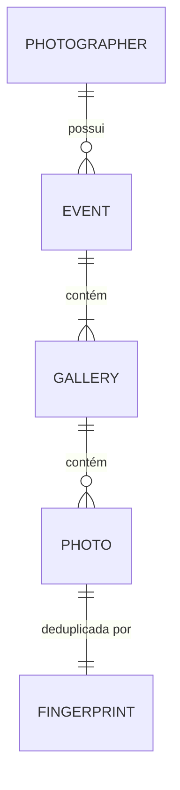

O Lumora guarda todos os metadados em uma única tabela DynamoDB, `lumora-app`. Os arquivos ficam no S3; a tabela guarda apenas referências lógicas a eles.

As chaves são montadas em `services/api/src/repositories/dynamodb/keys.ts`.

## Estrutura da tabela

| Elemento | Definição |
| --- | --- |
| Chave de partição | `PK`, string |
| Chave de ordenação | `SK`, string |
| Índice global | `GSI1`, com `GSI1PK` e `GSI1SK`, projeção completa. Atualmente sem uso. |
| TTL | Não configurado |
| Modo de capacidade | Sob demanda |

## Entidades e chaves

Há duas famílias de partição:

- a **partição do fotógrafo**, `USER#{sub}`, com o perfil e os eventos;
- a **partição do evento**, `USER#{sub}#EVENT#{eventId}`, com as galerias, as fotos e as marcas de deduplicação daquele evento.

| Entidade | `PK` | `SK` |
| --- | --- | --- |
| Perfil do fotógrafo | `USER#{sub}` | `PROFILE` |
| Evento | `USER#{sub}` | `EVENT#{eventId}` |
| Galeria | `USER#{sub}#EVENT#{eventId}` | `GALLERY#{galleryId}` |
| Foto | `USER#{sub}#EVENT#{eventId}` | `PHOTO#{galleryId}#{photoId}` |
| Fingerprint | `USER#{sub}#EVENT#{eventId}` | `FP#{galleryId}#{sha256}` |

### Exemplo

Os identificadores abaixo são fictícios.

| `PK` | `SK` | Item |
| --- | --- | --- |
| `USER#a1b2c3d4-0000-4000-8000-000000000001` | `PROFILE` | perfil |
| `USER#a1b2c3d4-0000-4000-8000-000000000001` | `EVENT#01JEXAMPLEEVENT0000000000A` | evento |
| `USER#a1b2c3d4-...#EVENT#01JEXAMPLEEVENT0000000000A` | `GALLERY#01JEXAMPLEGALLERY00000000A` | galeria principal |
| `USER#a1b2c3d4-...#EVENT#01JEXAMPLEEVENT0000000000A` | `PHOTO#01JEXAMPLEGALLERY00000000A#01JEXAMPLEPHOTO000000000A` | foto |
| `USER#a1b2c3d4-...#EVENT#01JEXAMPLEEVENT0000000000A` | `FP#01JEXAMPLEGALLERY00000000A#9f2c...e1` | fingerprint |

## Por que o dono está na chave do evento

A partição do evento inclui o `sub` do fotógrafo. Sem o `sub`, não há como montar a chave de uma galeria ou de uma foto.

A consequência é o isolamento por construção: um `eventId` de outro fotógrafo, recebido pela URL, resulta em uma chave que não existe. Não é preciso uma verificação de propriedade separada, e não há como esquecê-la.

A partição continua sendo uma por evento. Os eventos de um fotógrafo com muito conteúdo não se concentram em uma única partição.

Os repositórios de galeria ainda conferem o atributo `ownerId` do item como segunda barreira.

## Padrões de acesso

| Operação | Acesso |
| --- | --- |
| Ler o perfil | `GetItem` em `USER#{sub}` / `PROFILE` |
| Listar eventos do fotógrafo | `Query` em `USER#{sub}` com `begins_with(SK, 'EVENT#')`, ordem decrescente, 20 por página |
| Ler um evento | `GetItem` em `USER#{sub}` / `EVENT#{eventId}` |
| Listar galerias do evento | `Query` na partição do evento com `begins_with(SK, 'GALLERY#')`, todas as páginas |
| Ler uma galeria | `GetItem` na partição do evento |
| Listar fotos de uma galeria | `Query` na partição do evento com `begins_with(SK, 'PHOTO#{galleryId}#')`, ordem crescente, 24 por página |
| Contar fotos do evento por estado | `Query` na partição do evento com `begins_with(SK, 'PHOTO#')`, projetando só `status`, todas as páginas |
| Ler uma foto | `GetItem` na partição do evento |
| Verificar duplicidade de arquivo | escrita condicional do item `FP#...` |

Duas escolhas de ordenação seguem dos ULIDs:

- A `SK` do evento termina no ULID. A listagem usa a ordem decrescente dessa chave.
- A `SK` da foto traz a galeria **antes** do id da foto. Um único `begins_with` devolve as fotos de uma galeria, em ordem crescente de ULID.

Essa ordenação aproxima a ordem de criação, mas não a garante entre ids gerados no mesmo milissegundo: o código usa `ulid()`, sem geração monotônica. As fotos não são ordenadas por nome na consulta. Eventos legados com UUID também não seguem a ordenação temporal dos ULIDs.

Todas as listagens são `Query`. Não há `Scan` em nenhum repositório.

## Atributos

### Perfil

`id`, `email`, `name`.

### Evento

| Atributo | Significado |
| --- | --- |
| `id`, `ownerId`, `name` | Identificação |
| `status` | `DRAFT`, `PUBLISHED` ou `ARCHIVED`. Eventos nascem em `DRAFT`. |
| `eventDate` | Data de calendário, sem fuso |
| `createdAt`, `expiresAt` | Instantes em ISO 8601, UTC |
| `archivedAt` | `NULL` até o evento ser arquivado |
| `galleryCount` | Número de galerias. Começa em 1, por causa da galeria principal. |
| `registeredPhotoCount` | Número de fotos já registradas no evento. Protege a exclusão. |
| `photoCount` | Contador legado, gravado como 0. Não sai na API. Veja a seção sobre contadores. |
| `orderCount` | Gravado como 0. Não há pedidos implementados. |

### Galeria

`id`, `eventId`, `ownerId`, `name`, `isDefault`, `createdAt`, `updatedAt`.

`isDefault` é `true` somente na galeria criada junto com o evento.

### Foto

| Atributo | Significado |
| --- | --- |
| `id`, `eventId`, `galleryId`, `ownerId` | Identificação |
| `originalName` | Nome do arquivo no computador do fotógrafo |
| `contentType`, `size` | Tipo e tamanho declarados no registro, conferidos depois contra o objeto recebido |
| `fingerprint` | SHA-256 de nome, tamanho e data de modificação |
| `status` | `PENDING_UPLOAD`, `PROCESSING`, `AVAILABLE`, `FAILED` ou `ARCHIVED` |
| `createdAt`, `updatedAt` | Instantes em ISO 8601, UTC |
| `sourceVersionId` | Versão do objeto no S3 que foi aceita como original |
| `processingAttemptId` | Tentativa de processamento em andamento |
| `processingLeaseUntil` | Validade da tentativa em andamento, em milissegundos desde a época Unix |
| `completedAttemptId` | Tentativa que concluiu o processamento |

Os quatro últimos atributos controlam a concorrência do processamento.

### Fingerprint

`photoId` e `ownerId`. O item existe só para garantir unicidade: a sua chave contém o hash, e o seu conteúdo aponta para a foto já registrada.

## Campos de concorrência da foto

| Campo | Gravado quando | Removido quando | Problema que resolve |
| --- | --- | --- | --- |
| `sourceVersionId` | Na primeira reivindicação | Nunca | Garante que só uma versão do objeto seja processada, mesmo que o arquivo seja enviado de novo para a mesma chave. |
| `processingAttemptId` | A cada reivindicação | Ao concluir | Identifica quem é o dono atual do processamento. Uma tentativa antiga não consegue concluir. |
| `processingLeaseUntil` | A cada reivindicação | Ao concluir | Permite que outra tentativa assuma se a atual morrer sem concluir. |
| `completedAttemptId` | Ao concluir | Nunca | Aponta para a pasta dos derivados publicados e torna a conclusão repetível. |

`processingLeaseUntil` é um número comparado em expressões condicionais. Não é um atributo de TTL: o DynamoDB não remove nada quando ele vence.

O uso desses campos está em [Processamento de imagens](/developers/flows/image-processing).

## Escritas transacionais

Cinco operações gravam mais de um item e usam `TransactWriteItems`:

| Operação | Itens envolvidos | Invariante protegida |
| --- | --- | --- |
| Criar evento | evento e galeria principal | Não existe evento sem galeria principal. |
| Criar galeria | galeria e `galleryCount` do evento | A galeria só é criada se o evento existir. |
| Excluir galeria | galeria e `galleryCount` do evento | A galeria principal não é excluída. |
| Registrar foto | fingerprint, foto, `registeredPhotoCount` do evento e verificação da galeria | Um arquivo é registrado uma vez por galeria, e só em galeria existente. |
| Excluir evento | evento e galeria principal | Só evento vazio é excluído. |

As transições do processamento, ao contrário, usam um único `UpdateItem` condicional sobre a foto, sem transação e sem tocar no evento.

## Contadores

Há dois tipos de contador, com propósitos diferentes.

**Contadores que protegem invariantes** são atributos do evento, atualizados na mesma transação que a escrita que eles contam:

- `galleryCount`, incrementado e decrementado com as galerias;
- `registeredPhotoCount`, incrementado a cada foto registrada.

Eles existem para que a exclusão do evento possa ser condicionada a "nenhuma galeria extra, nenhuma foto", na própria escrita.

**Contadores de progresso** não são armazenados. O resumo de upload é calculado na leitura, percorrendo as fotos do evento e contando por `status`. Só essa rota faz a contagem: listar, ler e editar um evento usam apenas o item do evento.

O atributo `photoCount` do item do evento é legado. Ele continua sendo gravado como 0 e continua nas condições de exclusão, mas nenhum código o lê ou atualiza, e o contrato de evento não tem esse campo. `registeredPhotoCount` também não sai na API.

A decisão e o custo dela estão no [ADR-009](/developers/adr/009-derived-photo-counters).

## Paginação

O cursor de paginação é a `LastEvaluatedKey` do DynamoDB em JSON, codificada em base64url. É um valor opaco para o cliente, mas não é criptografado nem assinado.

Por isso o repositório o trata como entrada não confiável. Antes de usá-lo, confere:

- formato e tamanho;
- se a `PK` é a partição da consulta atual;
- se a `SK` tem o prefixo esperado.

Um cursor de outro fotógrafo, de outro evento ou de outra galeria é recusado com 400 `INVALID_CURSOR`.

## Registros legados

O código contém tolerâncias a formatos anteriores, sinal de que o modelo mudou enquanto já havia dados:

- A exclusão de evento aceita eventos sem galeria principal (`galleryCount` igual a 0) e considera o atributo antigo `pendingPhotoCount`.
- A reivindicação de processamento aceita fotos em `PROCESSING` sem `processingLeaseUntil`.
- A leitura de derivados aceita fotos sem `completedAttemptId`, cujos arquivos ficam direto na pasta da foto, sem `attempts/`.
- A validação de ids de evento aceita UUID, além de ULID.

Não há script de migração no repositório.
