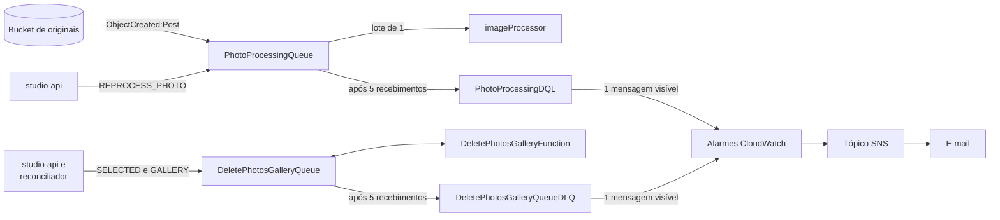

Toda a infraestrutura é declarada em um único arquivo, `infra/template.yaml`, com AWS SAM. O estado fica no CloudFormation. Não há Terraform, CDK nem recursos criados manualmente descritos no repositório.

Esta página explica o papel de cada recurso. Para valores exatos, consulte o template.

## Serviços utilizados

| Serviço | Recurso | Papel |
| --- | --- | --- |
| API Gateway | HTTP API | Entrada HTTP, CORS, validação do JWT do fotógrafo e autenticação do token do cliente. |
| Lambda | `studio-api` | Rotas do fotógrafo. |
| Lambda | `public-api` | Rotas do cliente do link. |
| Lambda | `public-access-authorizer` | Autentica o token do link. |
| Lambda | `PostConfirmationFunction` | Criação do perfil no cadastro. |
| Lambda | `ImageProcessorFunction` | Geração de derivados e reprocessamento. |
| Lambda | `DeletePhotosGalleryFunction` | Exclusão de fotos, galerias e conteúdo de eventos. |
| Lambda | `EventDeletionReconcilerFunction` | Retomada de exclusões de evento paradas. |
| Lambda Layer | `SharpLayer` | Binário nativo do sharp para arm64. |
| Cognito | User Pool e App Client | Identidade e tokens do fotógrafo. |
| DynamoDB | `lumora-app` | Todos os metadados. |
| S3 | bucket de fotos | Originais. Privado e versionado. |
| S3 | bucket de mídia | Miniaturas e previews. Privado, lido só pelo CloudFront. |
| CloudFront | `MediaDistribution` e OAC | Entrega os derivados ao navegador. |
| SQS | fila de processamento, fila de exclusão e uma DLQ de cada | Desacoplamento e retry. |
| SNS | tópico de alarme e assinatura por e-mail | Destino dos alarmes das DLQs. |
| CloudWatch | log groups e dois alarmes | Logs das sete funções e alarmes das DLQs. |
| EventBridge | regra agendada (criada pelo evento `Schedule` do SAM) | Dispara o reconciliador. |
| IAM | políticas por função | Permissões mínimas de cada Lambda. |

Serviços que o `README.md` do `lumora` menciona, mas que **não** estão no template: EventBridge Scheduler (a agenda usa uma regra do EventBridge), SSM Parameter Store, WAF e X-Ray.

## Funções Lambda

As sete funções compartilham o mesmo código-fonte, `services/api`, e são empacotadas separadamente pelo esbuild, cada uma a partir do seu handler. Todas rodam em Node.js 22 sobre arm64.

| Função | Gatilho | Timeout | Memória |
| --- | --- | --- | --- |
| `studio-api` | HTTP API, JWT | 10 s | 256 MB |
| `public-api` | HTTP API, authorizer do link | 10 s | 256 MB |
| `public-access-authorizer` | Authorizer do HTTP API | 10 s | 256 MB |
| `PostConfirmationFunction` | Cognito, `PostConfirmation` | 10 s | 256 MB |
| `ImageProcessorFunction` | SQS | 60 s | 1536 MB |
| `DeletePhotosGalleryFunction` | SQS | 60 s | 256 MB |
| `EventDeletionReconcilerFunction` | Agenda, a cada 15 minutos | 60 s | 256 MB |

O `ImageProcessorFunction` tem mais memória e tempo porque decodifica e redimensiona imagens de até 50 MB em memória. A concorrência dos dois consumidores de SQS é limitada a 30 invocações simultâneas.

`DeletePhotosGalleryFunction` declara `RecursiveLoop: Allow`. Ela publica a próxima página na própria fila, o que o Lambda tratará como um laço recursivo por padrão. O laço é intencional e termina quando não há mais páginas.

### Layer do sharp

O sharp depende de um binário nativo compilado para a plataforma de execução. Por isso ele não entra no bundle do esbuild: é marcado como `External` e fornecido pela `SharpLayer`, construída por `infra/layers/sharp/Makefile` para linux arm64.

<Warning>
  A versão do sharp no `Makefile` precisa ser igual à de `services/api/package.json`. Um comentário no `Makefile` registra essa exigência; não há verificação automática.
</Warning>

### Permissões

Cada função recebe só o que usa:

| Função | DynamoDB | S3 | Outros |
| --- | --- | --- | --- |
| `studio-api` | `GetItem`, `PutItem`, `Query`, `UpdateItem`, `DeleteItem`, `ConditionCheckItem` e `BatchGetItem` na tabela; só `Query` no `GSI1` | `PutObject` e `GetObject` em `photos/*` do bucket de originais; `ListBucket` restrito ao prefixo `photos/` | `SendMessage` nas duas filas |
| `public-api` | `GetItem`, `Query`, `PutItem`, `UpdateItem`, `DeleteItem` e `ConditionCheckItem` | nenhum | nenhum |
| `public-access-authorizer` | `GetItem` | nenhum | nenhum |
| `PostConfirmationFunction` | `PutItem` | nenhum | nenhum |
| `ImageProcessorFunction` | `GetItem`, `UpdateItem` | `GetObject`, `GetObjectVersion`, `DeleteObject` em `photos/*` do bucket de originais; `PutObject` e `DeleteObject` em `photos/*` do bucket de mídia | leitura da fila de processamento |
| `DeletePhotosGalleryFunction` | `GetItem`, `Query`, `UpdateItem`, `DeleteItem`, `BatchGetItem` | `DeleteObject` em `photos/*` dos dois buckets | leitura e `SendMessage` na fila de exclusão |
| `EventDeletionReconcilerFunction` | `Query` e `UpdateItem` na tabela e no `GSI1` | nenhum | `SendMessage` na fila de exclusão |

Observações:

- A `studio-api` não lê nem grava bytes de fotos. As permissões de S3 existem para **assinar** as URLs de upload e para verificar se um original já chegou (`ListBucket`). A API entrega a mídia por URLs do CloudFront e não assina leituras.
- A `public-api` não tem acesso a S3 nem a filas. Ela recebe apenas a base das URLs de mídia (`MEDIA_BASE_URL`). As escritas dela são as da seleção e do pedido.
- O authorizer só lê. A `public-api` é a única função que escreve pedidos.
- O `imageProcessor` não tem `Query`, `PutItem` nem `DeleteItem`. Ele só lê e atualiza a foto que está processando. `DeleteObject` serve para descartar o que gravou para uma foto excluída no meio do caminho.
- `ConditionCheckItem` aparece nas funções que usam `TransactWriteItems`, porque a transação exige a permissão de cada operação que contém.

O teste `tests/infra-template.test.ts` verifica várias dessas políticas.

## API Gateway

A API é uma HTTP API (v2) com estágio `dev`.

- **Autorizadores.** Dois, e cada rota usa exatamente um:
  - `CognitoJwtAuthorizer`, nativo, valida o token contra o User Pool e exige o scope `aws.cognito.signin.user.admin`. É o authorizer padrão, e cada rota protegida do Studio o declara explicitamente.
  - `PublicAccessAuthorizer`, uma Lambda authorizer com resposta simples, lê o header `x-access-token` e guarda a resposta em cache por 60 segundos (`ReauthorizeEvery`). Protege todas as rotas `/public/*`.
- **Rota pública.** Somente `GET /health` usa `Authorizer: NONE`.
- **Throttling.** `GET /health` aceita 5 requisições por segundo, com rajada de 10. Cada rota `/public/*` aceita 20 por segundo, com rajada de 40. As rotas do Studio ficam nos limites da conta.
- **CORS.** A API aceita qualquer origem, com os métodos `GET`, `POST`, `PUT`, `PATCH`, `DELETE` e `OPTIONS` e os headers `Content-Type`, `Authorization` e `x-access-token`.

O fluxo do authorizer está em [Acesso do cliente](/developers/flows/public-access).

## Cognito

O User Pool usa o e-mail como nome de usuário, sem distinção de maiúsculas, e verifica o e-mail automaticamente.

O App Client não tem secret, pois é usado por uma SPA, e habilita dois fluxos: SRP e refresh token. A revogação de tokens está habilitada, e `PreventUserExistenceErrors` evita que a tela de login revele se um e-mail está cadastrado.

O gatilho `PostConfirmation` invoca a `PostConfirmationFunction`.

## DynamoDB

Há uma única tabela, `lumora-app`, em modo sob demanda (`PAY_PER_REQUEST`), com chave `PK` e `SK` e um índice global `GSI1` com projeção completa.

O nome da tabela é fixo no template. Isso impede duas stacks na mesma conta e região.

O `GSI1` tem dois usos: as exclusões de evento pendentes e a lista de pedidos do fotógrafo. A tabela não tem TTL configurado.

O modelo lógico está em [Modelo de dados](/developers/architecture/data-model).

## S3 e CloudFront

Há **dois buckets**, ambos privados, com ACLs desabilitadas (`BucketOwnerEnforced`), criptografia SSE-S3 e uma bucket policy que nega acesso sem TLS.

### Bucket de originais (`PhotosBucket`)

Guarda só os originais.

| Configuração | Valor e motivo |
| --- | --- |
| Acesso público | Totalmente bloqueado. Nenhuma distribuição o enxerga. |
| Versionamento | Habilitado. Cada envio cria uma versão imutável, que o processador usa como identidade do original. |
| Lifecycle | Versões não correntes expiram em 15 dias. Uploads multipart incompletos são abortados em 3 dias. |
| CORS | Permite `GET` e `POST` a partir da origem do frontend, definida pelo parâmetro `WebOrigin`. |
| Notificação | `s3:ObjectCreated:Post`, com prefixo `photos/` e sufixo `/original.jpeg`, para a fila de processamento. |

### Bucket de mídia (`MediaBucket`)

Guarda as miniaturas e as previews.

| Configuração | Valor e motivo |
| --- | --- |
| Acesso público | Totalmente bloqueado. |
| Leitura | Somente a distribuição, por uma bucket policy que restringe `s3:GetObject` ao ARN dela. |
| Versionamento | Não habilitado. |
| Notificação | Nenhuma. |

O template registra o motivo da separação: a distribuição só enxerga o bucket de mídia, então nenhum erro de configuração do CDN alcança um original.

### CloudFront (`MediaDistribution`)

Entrega os derivados ao navegador, por HTTPS, com HTTP/2 e HTTP/3. A origem é o bucket de mídia, acessado por Origin Access Control (SigV4). Permite só `GET` e `HEAD`, comprime as respostas e usa a política de cache gerenciada `CachingOptimized`. A classe de preço é `PriceClass_All`, porque os pontos de presença no Brasil só entram na classe completa.

O domínio da distribuição é passado às funções como `MEDIA_BASE_URL` e publicado como saída da stack (`MediaBaseUrl`). As URLs entregues **não são assinadas**. Veja o aviso em [Acesso do cliente](/developers/flows/public-access#entrega-da-mídia).

A distribuição serve apenas a mídia. Ela **não** hospeda o frontend.

### Layout das chaves

Originais, no bucket de originais:

```
photos/{ownerId}/{eventId}/{galleryId}/{photoId}/original.jpeg
```

Derivados, no bucket de mídia:

```
photos/{ownerId}/{eventId}/{galleryId}/{photoId}/attempts/{attemptId}/thumb-v1.webp
photos/{ownerId}/{eventId}/{galleryId}/{photoId}/attempts/{attemptId}/preview-v1.webp
```

As chaves são montadas e interpretadas por `S3KeyBuilder`, em `services/api/src/shared/storage`. O `v1` vem da constante `IMAGE_PROCESSING_VERSION`.

A notificação só existe no bucket de originais, e o filtro de sufixo impede qualquer ciclo: os derivados vão para outro bucket.

### Por que a notificação é só para `Post`

O filtro usa `s3:ObjectCreated:Post`, e não `s3:ObjectCreated:*`. Somente objetos criados por formulário POST, que é como o navegador envia, disparam o processamento. Um original gravado com `PutObject` ou por cópia não é processado.

## SQS

Há duas filas standard, cada uma com sua DLQ e seu alarme.



| Configuração | Fila de processamento | Fila de exclusão |
| --- | --- | --- |
| Tipo | Standard, entrega pelo menos uma vez | Standard, entrega pelo menos uma vez |
| Visibility timeout | 360 s | 360 s |
| Tentativas antes da DLQ | 5 (`maxReceiveCount`) | 5 (`maxReceiveCount`) |
| Retenção da DLQ | 14 dias | 14 dias |
| Tamanho do lote | 1 mensagem por invocação | 1 mensagem por invocação |
| Concorrência máxima | 30 | 30 |
| Resposta parcial | `ReportBatchItemFailures` | `ReportBatchItemFailures` |
| Quem publica | S3 (uploads) e `studio-api` (reprocessamento) | `studio-api`, o próprio worker e o reconciliador |

Uma `QueuePolicy` permite que apenas o S3, a partir do bucket de originais e da própria conta, envie mensagens para a fila de processamento.

Os três tempos de cada fila foram escolhidos em conjunto:

```
timeout da Lambda (60 s)  <  lease (90 s)  <  visibility timeout (360 s)
```

O motivo dessa ordem está em [Processamento de imagens](/developers/flows/image-processing#os-três-tempos). A mesma relação vale para o worker de exclusão.

<Note>
  O recurso da DLQ de processamento se chama `PhotoProcessingDQL` no template, com as letras trocadas. O nome é apenas o identificador lógico do CloudFormation.
</Note>

### Dependência circular entre bucket e fila

O bucket de originais precisa da fila para configurar a notificação, e a política da fila precisa restringir o envio ao bucket. Para evitar a referência circular:

- o nome do bucket é composto só por pseudoparâmetros: nome da stack, conta e região;
- a política da fila reconstrói o ARN do bucket com os mesmos pseudoparâmetros, sem referenciar o recurso;
- o bucket declara `DependsOn` na política da fila, para que ela exista antes da notificação.

## Observabilidade provisionada

- Um log group por função (sete), com retenção de 14 dias.
- Dois alarmes, um por DLQ, que disparam quando há ao menos uma mensagem visível, avaliados a cada minuto.
- Um tópico SNS que recebe os alarmes, com uma assinatura por e-mail. O endereço vem do parâmetro `AlarmEmail`. O destinatário precisa confirmar a assinatura do SNS para receber os avisos.

Não há dashboard, alarmes de erro das funções nem tracing. Veja [Observabilidade](/developers/operations/observability).

## Parâmetros e saídas da stack

| Parâmetro | Função |
| --- | --- |
| `WebOrigin` | Origem aceita pelo CORS do bucket de originais. O padrão aponta para o servidor de desenvolvimento do Vite. |
| `AlarmEmail` | E-mail que recebe os alarmes. **Obrigatório**, sem valor padrão, validado por um padrão de e-mail. |

As saídas são a URL da API, o nome da tabela, os ids do User Pool e do App Client, o nome e o ARN do bucket de originais, o ARN do tópico de alarme e a URL base da mídia. O frontend precisa de três delas. Veja [Desenvolvimento local](/developers/operations/local-development#variáveis-do-frontend).

Duas variáveis de ambiente das funções são valores fixos no template, e não parâmetros: `PUBLIC_APP_URL` da `studio-api`, que é `http://localhost:5173`, e o estágio `dev` da API.

## O que não está na infraestrutura

- **Hospedagem do frontend.** O template não cria bucket de site, distribuição para a SPA nem domínio. O repositório não define como a SPA é publicada.
- **Ambiente de produção.** O `samconfig.toml` define apenas o ambiente `dev`.
- **Proteção contra exclusão.** A tabela e os buckets não têm `DeletionPolicy` nem `UpdateReplacePolicy`.
- **Restrição de acesso à mídia.** A distribuição não usa URLs assinadas, cookies assinados nem WAF.
- **Restrição de origem da API.** O CORS da API é aberto.
