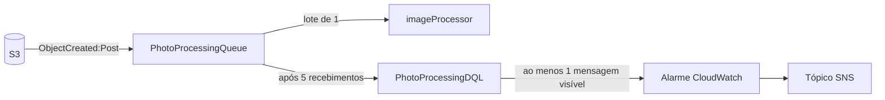

Toda a infraestrutura é declarada em um único arquivo, `infra/template.yaml`, com AWS SAM. O estado fica no CloudFormation. Não há Terraform, CDK nem recursos criados manualmente descritos no repositório.

Esta página explica o papel de cada recurso. Para valores exatos, consulte o template.

## Serviços utilizados

| Serviço | Recurso | Papel |
| --- | --- | --- |
| API Gateway | HTTP API | Entrada HTTP, CORS e validação do JWT. |
| Lambda | `studio-api` | Rotas do fotógrafo. |
| Lambda | `PostConfirmationFunction` | Criação do perfil no cadastro. |
| Lambda | `ImageProcessorFunction` | Geração de derivados. |
| Lambda Layer | `SharpLayer` | Binário nativo do sharp para arm64. |
| Cognito | User Pool e App Client | Identidade e tokens do fotógrafo. |
| DynamoDB | `lumora-app` | Todos os metadados. |
| S3 | bucket de fotos | Originais e derivados. |
| SQS | fila de processamento e DLQ | Desacoplamento e retry do processamento. |
| SNS | tópico de alarme | Destino do alarme da DLQ. |
| CloudWatch | log groups e um alarme | Logs das três funções e alarme da DLQ. |
| IAM | políticas por função | Permissões mínimas de cada Lambda. |

Serviços que o `README.md` do `lumora` menciona, mas que **não** estão no template: CloudFront, EventBridge Scheduler, SSM Parameter Store, WAF e X-Ray.

## Funções Lambda

As três funções compartilham o mesmo código-fonte, `services/api`, e são empacotadas separadamente pelo esbuild, cada uma a partir do seu handler. Todas rodam em Node.js 22 sobre arm64.

| Função | Gatilho | Timeout | Memória |
| --- | --- | --- | --- |
| `studio-api` | HTTP API | 10 s | 256 MB |
| `PostConfirmationFunction` | Cognito, `PostConfirmation` | 10 s | 256 MB |
| `ImageProcessorFunction` | SQS | 60 s | 1536 MB |

O `imageProcessor` tem mais memória e tempo porque decodifica e redimensiona imagens de até 50 MB em memória.

### Layer do sharp

O sharp depende de um binário nativo compilado para a plataforma de execução. Por isso ele não entra no bundle do esbuild: é marcado como `External` e fornecido pela `SharpLayer`, construída por `infra/layers/sharp/Makefile` para linux arm64.

<Warning>
  A versão do sharp no `Makefile` precisa ser igual à de `services/api/package.json`. Um comentário no `Makefile` registra essa exigência; não há verificação automática.
</Warning>

### Permissões

Cada função recebe só o que usa:

| Função | DynamoDB | S3 | Outros |
| --- | --- | --- | --- |
| `studio-api` | `GetItem`, `PutItem`, `Query`, `UpdateItem`, `DeleteItem`, `ConditionCheckItem` | `PutObject` e `GetObject` em `photos/*`; `ListBucket` restrito ao prefixo `photos/` | nenhum |
| `PostConfirmationFunction` | `PutItem` | nenhum | nenhum |
| `ImageProcessorFunction` | `GetItem`, `UpdateItem` | `GetObject`, `GetObjectVersion`, `PutObject` em `photos/*` | leitura da fila |

Duas observações:

- A `studio-api` não lê nem grava bytes de fotos. As permissões de S3 existem para **assinar** as URLs de upload e de leitura, e `ListBucket` serve para verificar se um original já chegou.
- O `imageProcessor` não tem `Query`, `PutItem` nem `DeleteItem`. Ele só lê e atualiza a foto que está processando.

O teste `scripts/infra-template.test.ts` verifica parte dessas políticas.

## API Gateway

A API é uma HTTP API (v2) com estágio `dev`.

- **Autorização.** Um JWT authorizer nativo valida o token contra o User Pool. Ele é o authorizer padrão e exige o scope `aws.cognito.signin.user.admin`. Cada rota protegida declara o authorizer e o scope explicitamente.
- **Rota sem credencial.** Somente `GET /health` usa `Authorizer: NONE`.
- **Rotas do cliente.** As rotas `/public/*` usam o `PublicAccessAuthorizer`, um Lambda authorizer que lê o header `x-access-token`, com resposta em cache por token por 60 segundos. Cada uma declara limite de 20 requisições por segundo, com rajada de 40. Veja [Acesso público do cliente](/developers/flows/public-client-access).
- **CORS.** A API aceita qualquer origem, com os headers `Content-Type`, `Authorization` e `x-access-token`.

## Cognito

O User Pool usa o e-mail como nome de usuário, sem distinção de maiúsculas, e verifica o e-mail automaticamente.

O App Client não tem secret, pois é usado por uma SPA, e habilita dois fluxos: SRP e refresh token. A revogação de tokens está habilitada, e `PreventUserExistenceErrors` evita que a tela de login revele se um e-mail está cadastrado.

O gatilho `PostConfirmation` invoca a `PostConfirmationFunction`.

## DynamoDB

Há uma única tabela, `lumora-app`, em modo sob demanda (`PAY_PER_REQUEST`), com chave `PK` e `SK` e um índice global `GSI1`.

O nome da tabela é fixo no template. Isso impede duas stacks na mesma conta e região.

<Note>
  O `GSI1` está declarado, mas nenhum código grava `GSI1PK` ou `GSI1SK` nem consulta o índice. A tabela não tem TTL configurado.
</Note>

O modelo lógico está em [Modelo de dados](/developers/architecture/data-model).

## S3

Há um único bucket, privado, que guarda originais e derivados sob o prefixo `photos/`.

| Configuração | Valor e motivo |
| --- | --- |
| Acesso público | Totalmente bloqueado. |
| ACLs | Desabilitadas (`BucketOwnerEnforced`). |
| Criptografia | SSE-S3 (AES256) por padrão. |
| Transporte | Uma bucket policy nega qualquer acesso sem TLS. |
| Versionamento | Habilitado. Cada envio cria uma versão imutável, que o processador usa como identidade do original. |
| Lifecycle | Versões não correntes expiram em 15 dias. Uploads multipart incompletos são abortados em 3 dias. |
| CORS | Permite `GET` e `POST` a partir da origem do frontend, definida pelo parâmetro `WebOrigin`. |
| Notificação | `s3:ObjectCreated:Post`, com prefixo `photos/` e sufixo `/original.jpeg`, para a fila SQS. |

### Layout das chaves

```
photos/{ownerId}/{eventId}/{galleryId}/{photoId}/original.jpeg
photos/{ownerId}/{eventId}/{galleryId}/{photoId}/attempts/{attemptId}/thumb-v1.webp
photos/{ownerId}/{eventId}/{galleryId}/{photoId}/attempts/{attemptId}/preview-v1.webp
```

As chaves são montadas e interpretadas por `S3KeyBuilder`, em `services/api/src/shared/storage`. O `v1` vem da constante `IMAGE_PROCESSING_VERSION`.

O filtro de sufixo da notificação é o que impede um ciclo: os derivados gravados pelo `imageProcessor` terminam em `.webp` e não geram novos eventos.

### Por que a notificação é só para `Post`

O filtro usa `s3:ObjectCreated:Post`, e não `s3:ObjectCreated:*`. Somente objetos criados por formulário POST, que é como o navegador envia, disparam o processamento. Um original gravado com `PutObject` ou por cópia não é processado.

## SQS



| Configuração | Valor |
| --- | --- |
| Tipo da fila | Standard, com entrega pelo menos uma vez |
| Visibility timeout | 360 s |
| Tentativas antes da DLQ | 5 (`maxReceiveCount`) |
| Retenção da DLQ | 14 dias |
| Tamanho do lote | 1 mensagem por invocação |
| Concorrência máxima | 30 invocações simultâneas |
| Resposta parcial | `ReportBatchItemFailures` habilitado |

Uma `QueuePolicy` permite que apenas o S3, a partir do bucket de fotos e da própria conta, envie mensagens para a fila.

Os três tempos do processamento foram escolhidos em conjunto:

```
timeout da Lambda (60 s)  <  lease de processamento (90 s)  <  visibility timeout (360 s)
```

O motivo dessa ordem está em [Processamento de imagens](/developers/flows/image-processing#os-três-tempos).

<Note>
  O recurso da DLQ se chama `PhotoProcessingDQL` no template, com as letras trocadas. O nome é apenas o identificador lógico do CloudFormation.
</Note>

### Dependência circular entre bucket e fila

O bucket precisa da fila para configurar a notificação, e a política da fila precisa restringir o envio ao bucket. Para evitar a referência circular:

- o nome do bucket é composto só por pseudoparâmetros: nome da stack, conta e região;
- a política da fila reconstrói o ARN do bucket com os mesmos pseudoparâmetros, sem referenciar o recurso;
- o bucket declara `DependsOn` na política da fila, para que ela exista antes da notificação.

## Observabilidade provisionada

- Um log group por função, com retenção de 14 dias.
- Um alarme que dispara quando há ao menos uma mensagem visível na DLQ, avaliado a cada minuto.
- Um tópico SNS que recebe o alarme. O template não cria nenhuma assinatura: quem deve ser notificado precisa assinar o tópico.

Veja [Observabilidade](/developers/operations/observability).

## Parâmetros e saídas da stack

O template tem um parâmetro, `WebOrigin`, com valor padrão apontando para o servidor de desenvolvimento do Vite. Ele define a origem aceita pelo CORS do bucket.

As saídas incluem a URL da API, o nome da tabela, os ids do User Pool e do App Client, o nome e o ARN do bucket e o ARN do tópico de alarme. O frontend precisa de três delas. Veja [Desenvolvimento local](/developers/operations/local-development#variáveis-do-frontend).

## O que não está na infraestrutura

- **Hospedagem do frontend.** O template não cria bucket de site, distribuição nem domínio. O repositório não define como a SPA é publicada.
- **Ambiente de produção.** O `samconfig.toml` define apenas o ambiente `dev`.
- **Proteção contra exclusão.** A tabela e o bucket não têm `DeletionPolicy` nem `UpdateReplacePolicy`.
- **CDN para os derivados.** As miniaturas são servidas por URL assinada do S3.
