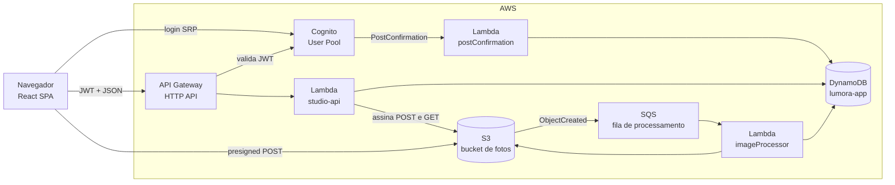
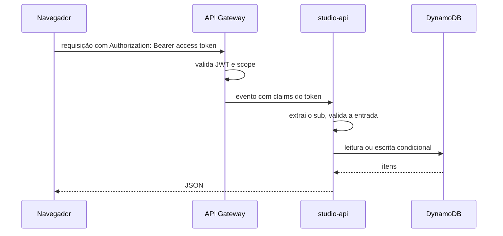
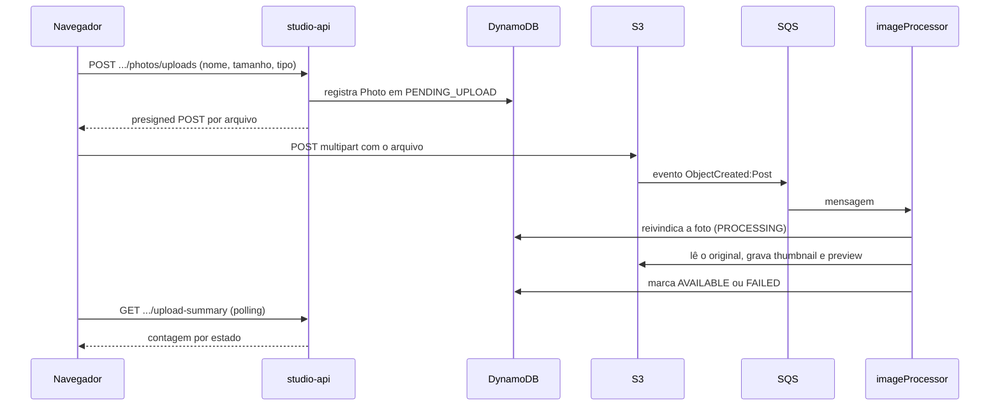
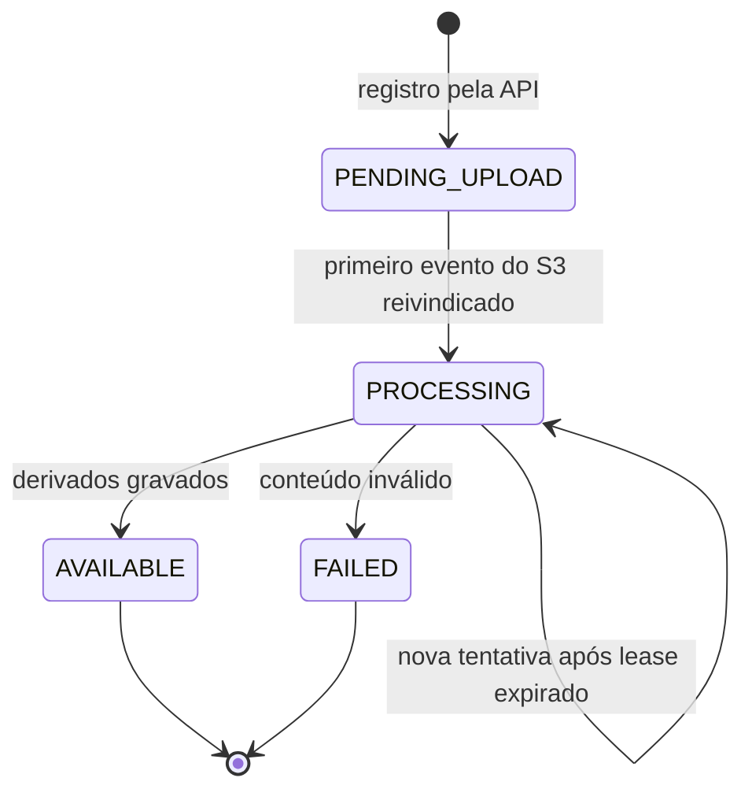

O Lumora é uma aplicação serverless na AWS. Não há servidor nem processo permanente: a lógica roda em três funções Lambda, acionadas por requisições HTTP, por um gatilho do Cognito e por uma fila.

O sistema tem dois caminhos de dados distintos:

- o **caminho de API**, síncrono, por onde passam metadados: perfil, eventos, galerias e registros de fotos;
- o **caminho de fotos**, por onde passam os arquivos. Os bytes vão do navegador direto para o S3 e nunca atravessam a API.

## Componentes

| Componente | Responsabilidade |
| --- | --- |
| Navegador (React) | Interface do fotógrafo. Mantém a sessão Cognito, chama a API e envia os arquivos direto ao S3. |
| Cognito User Pool | Cadastro, login e emissão dos tokens. É a única fonte de identidade do fotógrafo. |
| API Gateway (HTTP API) | Expõe as rotas e valida o JWT antes de invocar a Lambda. |
| Lambda `studio-api` | Todas as rotas do fotógrafo. Lê e grava metadados e emite credenciais temporárias de upload e de leitura. |
| Lambda `postConfirmation` | Cria o perfil do fotógrafo quando o cadastro é confirmado no Cognito. |
| DynamoDB `lumora-app` | Tabela única com perfis, eventos, galerias, fotos e marcas de deduplicação. |
| S3 (bucket de fotos) | Guarda os originais e os derivados. Privado e versionado. |
| SQS | Recebe os eventos de criação de objeto do S3 e desacopla o upload do processamento. Tem uma DLQ. |
| Lambda `imageProcessor` | Consome a fila, valida o original, gera thumbnail e preview e atualiza o estado da foto. |

Os detalhes de cada serviço estão em [Infraestrutura](/developers/architecture/infrastructure).

## Caminho de API

Pontos centrais desse caminho:

- A identidade do fotógrafo vem somente do claim `sub` do token validado pelo API Gateway. Nenhuma rota aceita o dono por path, query ou body.
- O `sub` faz parte das chaves do DynamoDB. Um recurso de outro fotógrafo simplesmente não é encontrado e responde 404, igual a um recurso inexistente.
- O frontend valida toda resposta com schemas zod antes de usá-la.

## Caminho de fotos

Pontos centrais desse caminho:

- A API registra a foto **antes** de o arquivo existir. A foto nasce em `PENDING_UPLOAD`.
- A chegada do arquivo é confirmada pelo evento do S3, nunca por uma chamada do navegador. O S3 aceitar os bytes não muda o estado da foto; só o `imageProcessor` muda.
- O processamento é assíncrono e tolera mensagens duplicadas, reentregas e workers atrasados. Esse desenho está em [Processamento de imagens](/developers/flows/image-processing).
- O frontend descobre o resultado por polling de um resumo por evento. Não há push nem WebSocket.

## Estados de uma foto

O enum `PhotoStatusEnum` também declara `ARCHIVED`. Atualmente nenhum código leva uma foto a esse estado.

## Onde cada parte vive no código

| Assunto | Caminho |
| --- | --- |
| Rotas e roteamento | `services/api/src/handlers/studioApi.ts` |
| Consumidor da fila | `services/api/src/handlers/imageProcessor.ts` |
| Gatilho do Cognito | `services/api/src/handlers/postConfirmation.ts` |
| Casos de uso | `services/api/src/application` |
| Entidades e portas | `services/api/src/domain` |
| Persistência | `services/api/src/repositories` |
| Infraestrutura | `infra/template.yaml` |
| Upload no navegador | `apps/web/src/studio/galleries/uploadManager.ts` |
| Chamadas à API | `apps/web/src/studio/hooks` |

## Princípios que atravessam o sistema

Estes princípios aparecem em várias partes do código e explicam muitas decisões locais:

1. **O dono vem do token.** O `sub` é lido de `requestContext.authorizer.jwt.claims.sub` e de nenhum outro lugar.
2. **Alheio é igual a inexistente.** Recurso de outro fotógrafo responde 404, nunca 403.
3. **Arquivos não passam pela API.** A `studio-api` só emite credenciais. O `imageProcessor` é a única função que lê os bytes de uma foto.
4. **Escritas que mudam estado são condicionais.** Transições usam `ConditionExpression`, de modo que repetir uma operação não a aplica duas vezes.
5. **Chaves do S3 não usam o nome original do arquivo.** O nome fica apenas no DynamoDB.
6. **DTOs de evento, galeria e foto omitem campos internos.** A conversão não inclui campos explícitos de `ownerId` nem chaves do S3. Os tickets de upload e as URLs assinadas expõem os caminhos necessários ao acesso, que contêm o identificador do fotógrafo. Isso não é uma garantia de sigilo desses identificadores.
