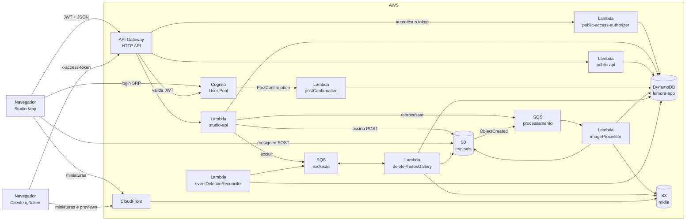
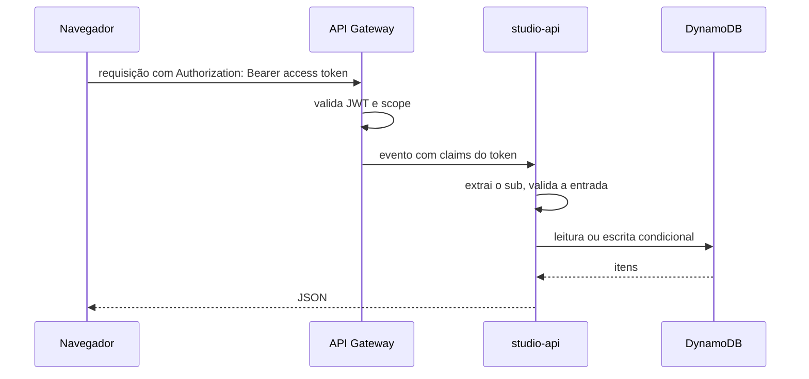
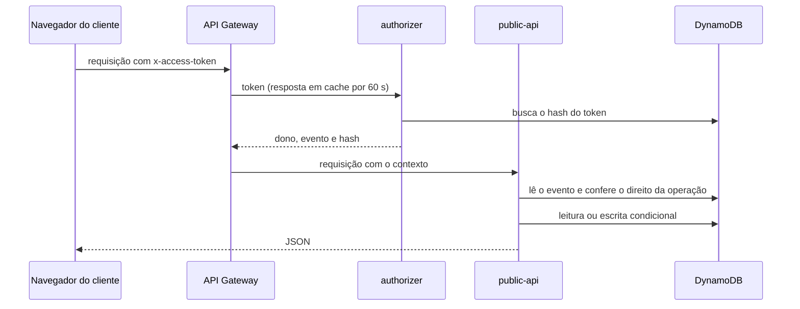
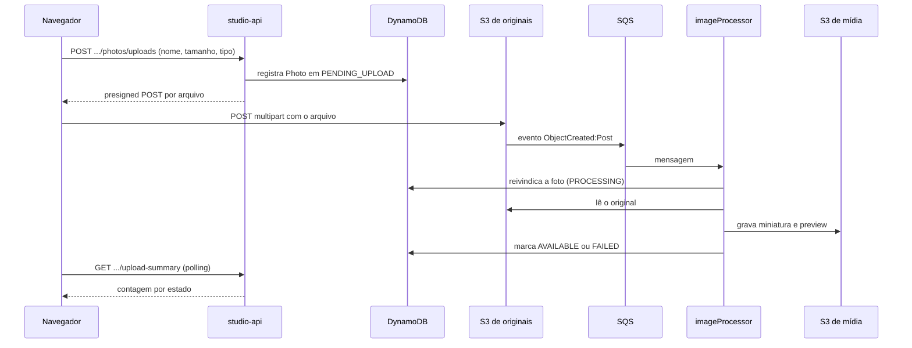
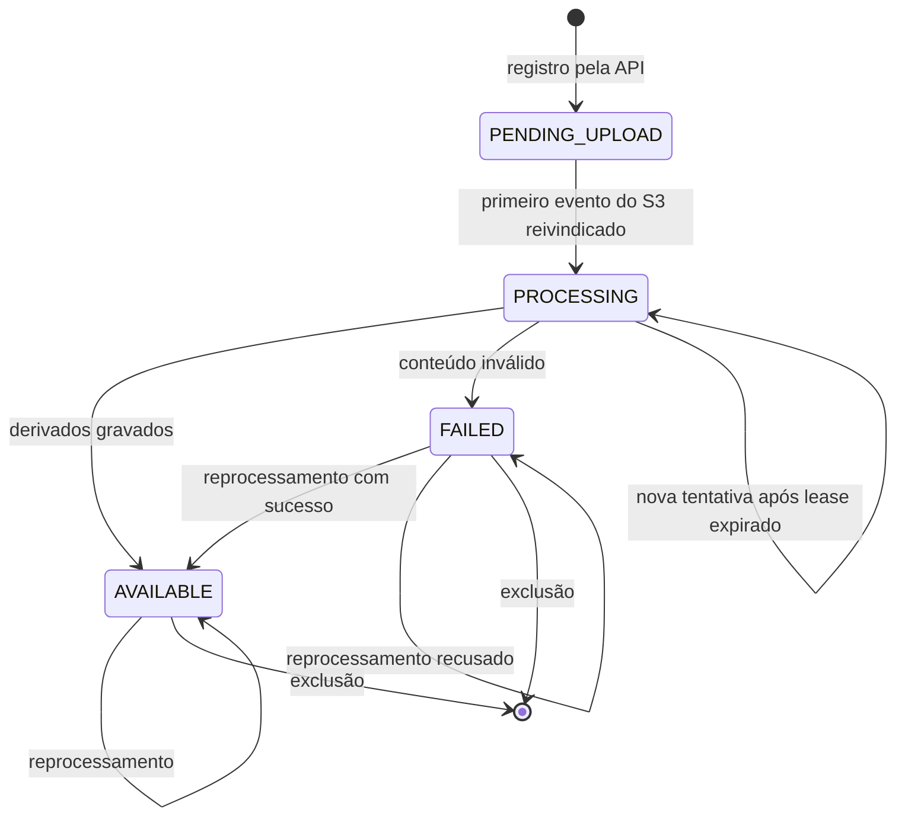

O Lumora é uma aplicação serverless na AWS. Não há servidor nem processo permanente: a lógica roda em sete funções Lambda, acionadas por requisições HTTP, por um gatilho do Cognito, por duas filas e por uma agenda.

O sistema tem quatro caminhos de dados distintos:

- o **caminho do fotógrafo**, síncrono, por onde passam metadados: perfil, eventos, pacote, galerias e registros de fotos;
- o **caminho do cliente**, síncrono, aberto por um link: sessão, listagem de fotos, seleção e pedidos;
- o **caminho de fotos**, por onde passam os arquivos. Os bytes vão do navegador direto para o S3 e nunca atravessam a API;
- o **caminho da mídia**, por onde as miniaturas e previews chegam ao navegador: do S3 de mídia, pelo CloudFront.

## Componentes

| Componente | Responsabilidade |
| --- | --- |
| Navegador (React) | Duas áreas na mesma SPA: o Studio, do fotógrafo, e a área do cliente. Cada uma tem a sua credencial e o seu cache. |
| Cognito User Pool | Cadastro, login e emissão dos tokens. É a única fonte de identidade do fotógrafo. |
| API Gateway (HTTP API) | Expõe as rotas, valida o JWT do fotógrafo e aciona o authorizer do token do cliente. |
| Lambda `public-access-authorizer` | Autentica o token do link e injeta dono e evento no contexto. |
| Lambda `studio-api` | Todas as rotas do fotógrafo. Lê e grava metadados, emite credenciais de upload e publica jobs nas filas. |
| Lambda `public-api` | Todas as rotas do cliente. Lê o evento, lista fotos prontas e grava a seleção e os pedidos. |
| Lambda `postConfirmation` | Cria o perfil do fotógrafo quando o cadastro é confirmado no Cognito. |
| DynamoDB `lumora-app` | Tabela única com perfis, eventos, galerias, fotos, seleção, pedidos e tokens. |
| S3 de originais | Guarda os originais. Privado e versionado. |
| S3 de mídia | Guarda miniaturas e previews. Privado, lido só pelo CloudFront. |
| CloudFront | Entrega a mídia ao navegador. |
| SQS de processamento | Recebe os eventos de criação de objeto do S3 e os jobs de reprocessamento. Tem uma DLQ. |
| Lambda `imageProcessor` | Consome a fila, valida o original, gera miniatura e preview com marca d'água e atualiza o estado da foto. |
| SQS de exclusão | Transporta as páginas de exclusão de fotos e galerias. Tem uma DLQ. |
| Lambda `deletePhotosGallery` | Remove fotos, galerias e o conteúdo de eventos, em páginas. |
| Lambda `eventDeletionReconciler` | A cada 15 minutos, retoma exclusões de evento que pararam. |

Os detalhes de cada serviço estão em [Infraestrutura](/developers/architecture/infrastructure).

## Caminho do fotógrafo

Pontos centrais desse caminho:

- A identidade do fotógrafo vem somente do claim `sub` do token validado pelo API Gateway. Nenhuma rota aceita o dono por path, query ou body.
- O `sub` faz parte das chaves do DynamoDB. Um recurso de outro fotógrafo simplesmente não é encontrado e responde 404, igual a um recurso inexistente.
- O frontend valida toda resposta com schemas zod antes de usá-la.

## Caminho do cliente

Pontos centrais:

- O authorizer só **autentica** o token. O direito de ver ou selecionar é conferido em cada operação, contra o evento lido naquele momento.
- Dono e evento vêm só do contexto do authorizer. Nenhuma rota pública os aceita do cliente.
- Escritas do cliente (seleção, pedido) são condicionais: a regra de negócio está na condição da escrita, e não numa leitura anterior.

Os fluxos estão em [Acesso do cliente](/developers/flows/public-access), [Seleção de fotos](/developers/flows/photo-selection) e [Criação de pedidos](/developers/flows/order-creation).

## Caminho de fotos

Pontos centrais desse caminho:

- A API registra a foto **antes** de o arquivo existir. A foto nasce em `PENDING_UPLOAD`.
- A chegada do arquivo é confirmada pelo evento do S3, nunca por uma chamada do navegador. O S3 aceitar os bytes não muda o estado da foto; só o `imageProcessor` muda.
- O processamento é assíncrono e tolera mensagens duplicadas, reentregas e workers atrasados. Esse desenho está em [Processamento de imagens](/developers/flows/image-processing).
- O frontend descobre o resultado por polling de um resumo por evento. Não há push nem WebSocket.

## Caminho da mídia

As miniaturas e as previews são buscadas pelo navegador direto no CloudFront, que lê o bucket de mídia. A API entrega só as URLs. O bucket de originais **não** está atrás de nenhuma distribuição.

As URLs não são assinadas. Veja [Acesso do cliente](/developers/flows/public-access#entrega-da-mídia).

## Estados de uma foto

Durante um reprocessamento a foto **mantém o estado** que tinha. Veja [Reprocessamento de fotos](/developers/flows/photo-reprocessing).

O enum `PhotoStatusEnum` também declara `ARCHIVED` e `DELETING`. Atualmente nenhum código leva uma foto a esses estados. A exclusão remove o registro; não há um estado intermediário.

## Estados do evento e do pedido

| Entidade | Estados | Onde está descrito |
| --- | --- | --- |
| Evento | `DRAFT` → `PUBLISHED`. `ARCHIVED` existe no domínio, sem rota. | [Pacote, publicação e link de acesso](/developers/flows/event-package-and-access-link) |
| Galeria | `ACTIVE` ou `DELETING` | [Exclusão de fotos](/developers/flows/photo-deletion) |
| Pedido | `ASSEMBLING` → `PENDING_PAYMENT` ou `CONFIRMED`; `CANCELED` | [Criação de pedidos](/developers/flows/order-creation) |

## Onde cada parte vive no código

| Assunto | Caminho |
| --- | --- |
| Rotas do fotógrafo | `services/api/src/handlers/api/studioApi.ts` |
| Rotas do cliente | `services/api/src/handlers/api/publicApi.ts` |
| Authorizer do link | `services/api/src/handlers/authorizer/publicAccessAuthorizer.ts` |
| Consumidor da fila de processamento | `services/api/src/handlers/sqs/imageProcessor.ts` |
| Consumidor da fila de exclusão | `services/api/src/handlers/sqs/deletePhotosGalleryProcessor.ts` |
| Reconciliador de exclusões | `services/api/src/handlers/schedule/eventDeletionReconciler.ts` |
| Gatilho do Cognito | `services/api/src/handlers/cognito/postConfirmation.ts` |
| Casos de uso | `services/api/src/application` |
| Entidades, regras e portas | `services/api/src/domain` |
| Persistência, S3, SQS e sharp | `services/api/src/infra` |
| Contratos HTTP | `services/api/src/contracts` e `packages/contracts` |
| Infraestrutura | `infra/template.yaml` |
| Área do fotógrafo | `apps/web/src/studio` |
| Área do cliente | `apps/web/src/public` |
| Upload no navegador | `apps/web/src/studio/galleries/uploadManager.ts` |

## Princípios que atravessam o sistema

Estes princípios aparecem em várias partes do código e explicam muitas decisões locais:

1. **O dono vem de uma credencial validada.** No Studio, é o `sub` de `requestContext.authorizer.jwt.claims.sub`. Na área do cliente, é o contexto do authorizer. Nunca de path, query ou corpo.
2. **Alheio é igual a inexistente.** Recurso de outro fotógrafo, galeria de outro evento ou pedido de outro evento responde 404, nunca 403. Um link sem direito responde 403 sem revelar se o recurso existe.
3. **Arquivos não passam pela API.** A `studio-api` só emite credenciais. O `imageProcessor` é a única função que lê os bytes de uma foto. A mídia chega ao navegador pelo CloudFront.
4. **Escritas que mudam estado são condicionais.** Transições usam `ConditionExpression`, de modo que repetir uma operação não a aplica duas vezes. Várias regras de negócio, como o teto de seleção e o pedido único por evento, são condições da escrita.
5. **O valor é calculado no servidor.** O cliente envia, no máximo, a identificação da foto. O total do pedido sai do pacote gravado no evento.
6. **Chaves do S3 não usam o nome original do arquivo.** O nome fica apenas no DynamoDB.
7. **DTOs omitem campos internos.** As conversões não incluem `ownerId` nem chaves do S3. As URLs de mídia e os tickets de upload expõem os caminhos necessários ao acesso, que contêm o identificador do fotógrafo. Isso não é uma garantia de sigilo desses identificadores.
8. **Operações demoradas são retomáveis.** A montagem do pedido, a exclusão e o processamento guardam o progresso no banco e toleram reentrega.
