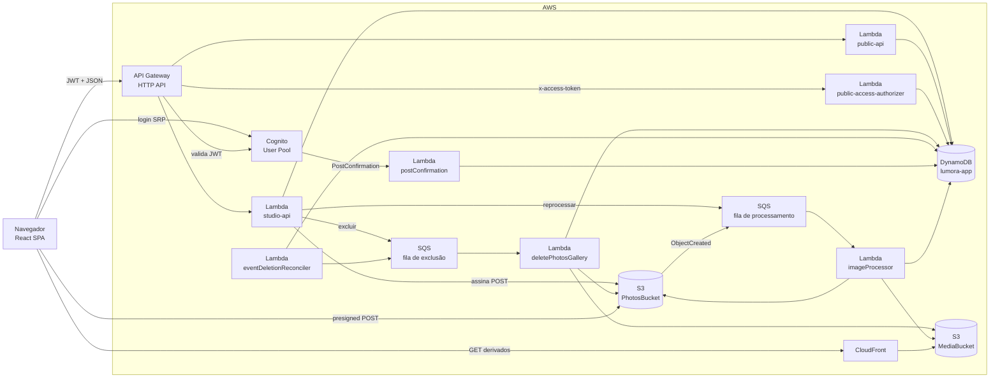
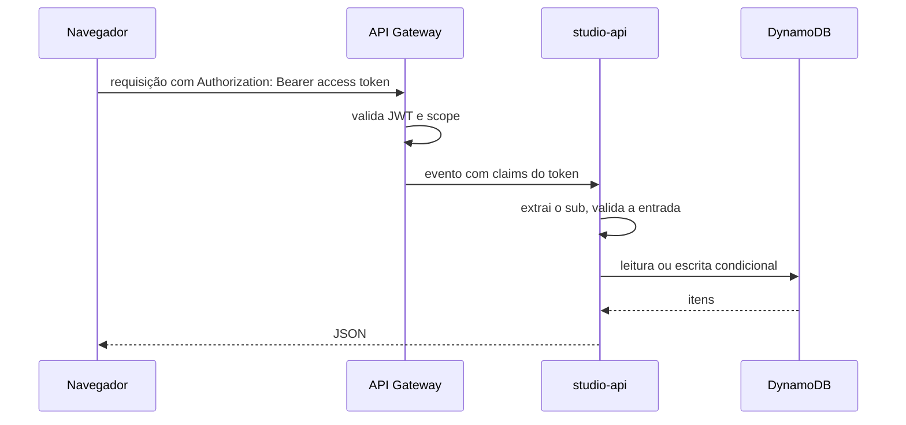
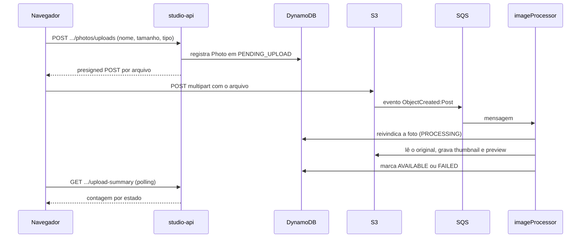
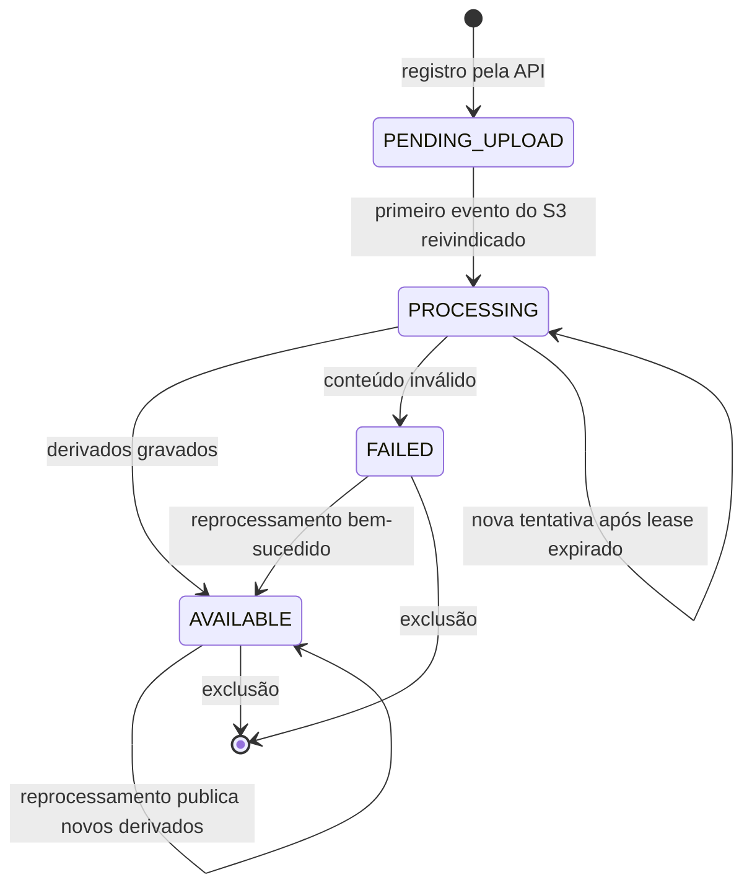

O Lumora é uma aplicação serverless na AWS. Não há servidor nem processo permanente: a lógica roda em sete funções Lambda, acionadas por requisições HTTP, por um gatilho do Cognito, por duas filas e por um agendamento.

O sistema tem dois caminhos de dados distintos:

- o **caminho de API**, síncrono, por onde passam metadados: perfil, eventos, galerias, registros de fotos, seleção e pedidos. Tem duas entradas, a do fotógrafo (JWT do Cognito) e a do cliente (token do link);
- o **caminho de fotos**, por onde passam os arquivos. Os bytes vão do navegador direto para o S3 e nunca atravessam a API. Os derivados voltam ao navegador por uma distribuição CloudFront.

## Componentes

| Componente | Responsabilidade |
| --- | --- |
| Navegador (React) | Interface do fotógrafo e do cliente. O fotógrafo mantém a sessão Cognito, chama a API e envia os arquivos direto ao S3. O cliente usa o token do link. |
| Cognito User Pool | Cadastro, login e emissão dos tokens. É a única fonte de identidade do fotógrafo. |
| API Gateway (HTTP API) | Expõe as rotas e valida o JWT, ou chama o authorizer do cliente, antes de invocar a Lambda. |
| Lambda `studio-api` | Rotas do fotógrafo. Lê e grava metadados, emite credenciais temporárias de upload e publica jobs de exclusão e reprocessamento. |
| Lambda `public-api` e `public-access-authorizer` | Rotas `/public/*` do cliente: sessão, fotos, seleção e pedido. O authorizer reconhece o token do link. |
| Lambda `postConfirmation` | Cria o perfil do fotógrafo quando o cadastro é confirmado no Cognito. |
| DynamoDB `lumora-app` | Tabela única com perfis, eventos, galerias, fotos, seleção, pedidos, tokens de link e marcas de deduplicação. |
| S3 (`PhotosBucket`) | Guarda os originais. Privado e versionado. |
| S3 (`MediaBucket`) e CloudFront | O bucket guarda os derivados. A distribuição os entrega ao navegador. |
| SQS, processamento | Recebe os eventos de criação de objeto do S3 e os pedidos de reprocessamento. Tem uma DLQ. |
| Lambda `imageProcessor` | Consome a fila, valida o original, gera thumbnail e preview com marca d'água e atualiza o estado da foto. |
| SQS, exclusão | Recebe o trabalho de exclusão de fotos e galerias. Tem uma DLQ. |
| Lambda `deletePhotosGallery` | Remove fotos e galerias em páginas, nos dois buckets e no DynamoDB. |
| Lambda `eventDeletionReconciler` | Agendada a cada 15 minutos, reenfileira a limpeza parada de eventos excluídos. |

Os detalhes de cada serviço estão em [Infraestrutura](/developers/architecture/infrastructure).

## Caminho de API

Pontos centrais desse caminho:

- A identidade do fotógrafo vem somente do claim `sub` do token validado pelo API Gateway. Nenhuma rota aceita o dono por path, query ou body.
- O `sub` faz parte das chaves do DynamoDB. Um recurso de outro fotógrafo simplesmente não é encontrado e responde 404, igual a um recurso inexistente.
- O frontend valida toda resposta com schemas zod antes de usá-la.

## Caminho de fotos

Pontos centrais desse caminho:

- A API registra a foto **antes** de o arquivo existir. A foto nasce em `PENDING_UPLOAD`.
- A chegada do arquivo é confirmada pelo evento do S3, nunca por uma chamada do navegador. O S3 aceitar os bytes não muda o estado da foto; só o `imageProcessor` muda.
- O processamento é assíncrono e tolera mensagens duplicadas, reentregas e workers atrasados. Esse desenho está em [Processamento de imagens](/developers/flows/image-processing).
- O frontend descobre o resultado por polling de um resumo por evento. Não há push nem WebSocket.

## Estados de uma foto

Durante um reprocessamento a foto não muda de estado. Veja [Reprocessamento e mídia](/developers/flows/reprocessing-and-media). O enum `PhotoStatusEnum` também declara `ARCHIVED`. Atualmente nenhum código leva uma foto a esse estado.

## Onde cada parte vive no código

| Assunto | Caminho |
| --- | --- |
| Rotas do fotógrafo | `services/api/src/handlers/api/studioApi.ts` |
| Rotas do cliente | `services/api/src/handlers/api/publicApi.ts` e `handlers/authorizer/publicAccessAuthorizer.ts` |
| Consumidores de fila | `services/api/src/handlers/sqs/imageProcessor.ts` e `deletePhotosGalleryProcessor.ts` |
| Reconciliador agendado | `services/api/src/handlers/schedule/eventDeletionReconciler.ts` |
| Gatilho do Cognito | `services/api/src/handlers/cognito/postConfirmation.ts` |
| Casos de uso | `services/api/src/application` |
| Entidades e repositórios | `services/api/src/domain` |
| Persistência e integrações | `services/api/src/infra` |
| Infraestrutura | `infra/template.yaml` |
| Upload no navegador | `apps/web/src/studio/galleries/uploadManager.ts` |
| Chamadas à API | Um hook por operação, ao lado da tela que o usa, em `apps/web/src/studio/*` e `apps/web/src/public` |

## Princípios que atravessam o sistema

Estes princípios aparecem em várias partes do código e explicam muitas decisões locais:

1. **O dono vem do token.** Nas rotas do fotógrafo, o `sub` é lido de `requestContext.authorizer.jwt.claims.sub` e de nenhum outro lugar. Nas rotas do cliente, dono e evento vêm do registro do token, nunca da requisição.
2. **Alheio é igual a inexistente.** Recurso de outro fotógrafo responde 404, nunca 403.
3. **Arquivos não passam pela API.** A `studio-api` só emite credenciais de upload. O `imageProcessor` é a única função que lê os bytes de uma foto. As funções de exclusão só apagam objetos.
4. **Escritas que mudam estado são condicionais.** Transições usam `ConditionExpression`, de modo que repetir uma operação não a aplica duas vezes.
5. **Chaves do S3 não usam o nome original do arquivo.** O nome fica apenas no DynamoDB.
6. **DTOs de evento, galeria e foto omitem campos internos.** A conversão não inclui campos explícitos de `ownerId` nem chaves do S3. Os tickets de upload e as URLs assinadas expõem os caminhos necessários ao acesso, que contêm o identificador do fotógrafo. Isso não é uma garantia de sigilo desses identificadores.
