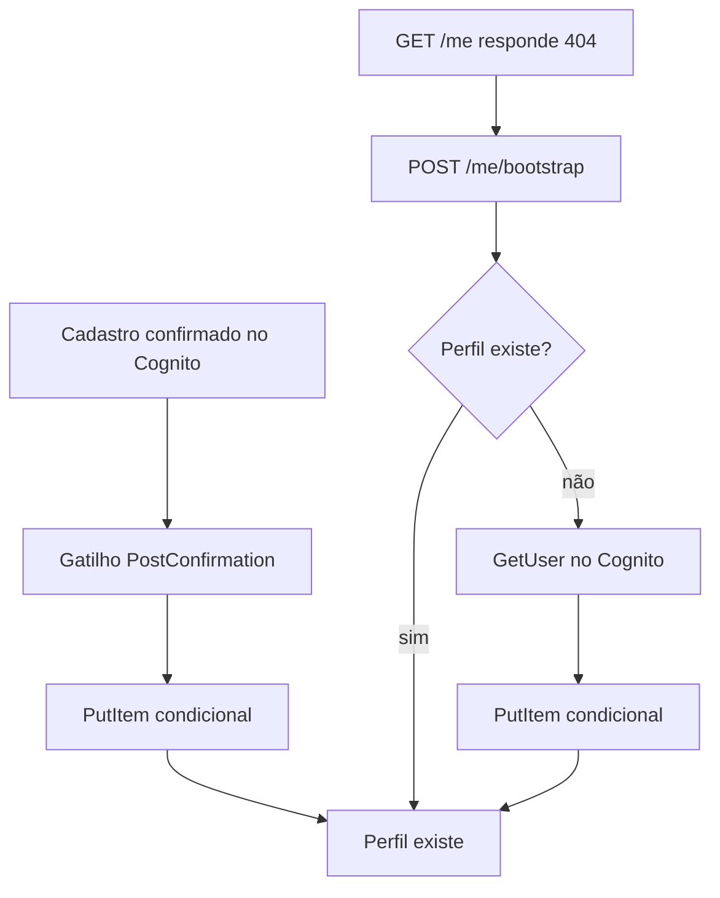

## Objetivo

Garantir que todo fotógrafo autenticado tenha um item de perfil no DynamoDB, com `id`, `email` e `name`.

O Cognito guarda as credenciais. O perfil é o registro da aplicação, e seu `id` é o `sub` do Cognito.

## Dois caminhos para o mesmo resultado

O perfil pode ser criado de duas formas. As duas gravam o mesmo item e são idempotentes.

### Caminho principal: gatilho `PostConfirmation`

1. O fotógrafo confirma o cadastro com o código recebido por e-mail.
2. O Cognito invoca a `PostConfirmationFunction`.
3. O handler lê `sub`, `email` e `name` dos atributos do evento.
4. O repositório grava o perfil com `attribute_not_exists(PK)`.

O handler só age quando `triggerSource` é `PostConfirmation_ConfirmSignUp`. O Cognito usa o mesmo gatilho na confirmação de recuperação de senha, e esse caso é ignorado.

Se o perfil já existe, a escrita condicional falha e o handler trata isso como sucesso. Uma nova entrega do mesmo evento não sobrescreve os dados.

Qualquer outro erro é propagado, e o Cognito devolve erro ao cliente. Nessa situação o usuário pode ficar confirmado no Cognito sem ter perfil no DynamoDB. É para esse caso que o segundo caminho existe.

### Caminho de reserva: `POST /me/bootstrap`

Um usuário pode existir no Cognito sem perfil no DynamoDB: se o gatilho falhou, ou se o usuário foi criado antes de o gatilho existir.

O frontend cobre esse caso na página **Minha conta**:

1. `useMe` chama `GET /me`.
2. Se a resposta for 404, a página dispara `POST /me/bootstrap`, uma única vez.
3. O resultado é gravado no cache como o perfil.

No backend, `routes/bootstrapMe.ts`:

1. lê o `sub` do token;
2. consulta o perfil e, se existir, o devolve;
3. chama `GetUser` no Cognito **com o access token do próprio usuário**, para obter e-mail e nome;
4. grava o perfil com escrita condicional.

O passo 3 usa o token do usuário, e não credenciais da Lambda. Por isso a `studio-api` não precisa de permissão IAM para o Cognito, e os dados gravados são os do dono do token.

## Concorrência

Duas requisições de bootstrap, ou um bootstrap simultâneo ao gatilho, podem tentar criar o mesmo perfil.

A escrita é condicionada à inexistência do item, então só uma vence. A que perde recebe `ConditionalCheckFailedException` e lê o perfil de novo, desta vez com leitura consistente. A leitura consistente evita devolver "não encontrado" logo depois de a outra escrita ter sido confirmada.

## Persistência

| Item | Chave |
| --- | --- |
| Perfil | `PK = USER#{sub}`, `SK = PROFILE` |

## Falhas

| Situação | Resultado |
| --- | --- |
| Atributos `sub` ou `email` ausentes no evento do Cognito | O gatilho lança erro. |
| Token recusado pelo Cognito no `GetUser` | 401 `UNAUTHENTICATED` |
| Falha do DynamoDB | 500 `INTERNAL_ERROR`. A página oferece **Tentar novamente**. |

## Observações

- O bootstrap só é disparado pela página **Minha conta**. As demais páginas não dependem do perfil: eventos, galerias e fotos são endereçados pelo `sub` e funcionam mesmo sem o item `PROFILE`.
- O perfil não tem rota de atualização. Uma mudança de nome ou e-mail no Cognito não é propagada.
- O script `pnpm create:test-user` cria um usuário e o confirma por `AdminConfirmSignUp`, o que também dispara o gatilho. Veja [Desenvolvimento local](/developers/operations/local-development#usuário-de-teste).
