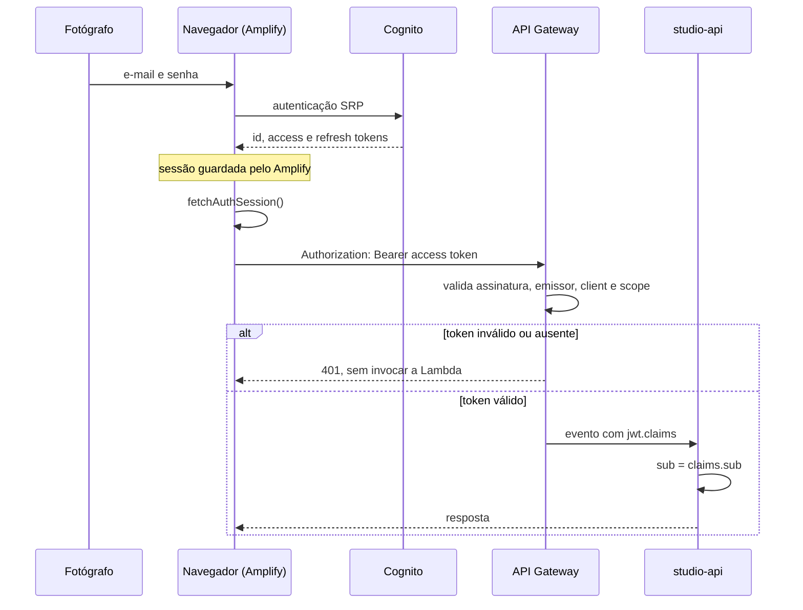

## Objetivo

Identificar o fotógrafo em cada requisição e garantir que ele só alcance os próprios dados.

## Componentes

| Componente | Papel |
| --- | --- |
| Cognito User Pool | Guarda as credenciais e emite os tokens. |
| Amplify, no navegador | Conduz cadastro e login, guarda e renova a sessão. |
| JWT authorizer do API Gateway | Valida o token antes de invocar a Lambda. |
| `getPhotographerId` | Extrai o `sub` das claims já validadas. |

## Sequência

### Entrada

`studio/StudioRoutes.tsx` envolve todas as rotas do Studio no componente `Authenticator`. Sem sessão, ele mostra as telas de entrada e cadastro. O cadastro pede e-mail, senha e o atributo `name`.

O login usa o fluxo SRP: a senha não trafega em texto para o Cognito. O App Client não tem secret.

### Envio do token

`studio/api.ts` chama `fetchAuthSession()` antes de cada requisição e envia o **access token** no header `Authorization`. O Amplify renova o token com o refresh token quando necessário.

Se não houver token, a requisição nem é feita: o cliente lança `ApiError` 401 `UNAUTHENTICATED`.

### Validação no API Gateway

O authorizer confere:

- a assinatura e a validade do token;
- o emissor, que deve ser o User Pool da stack;
- o client, que deve ser o App Client da stack;
- o scope `aws.cognito.signin.user.admin`.

A exigência do scope tem um efeito prático: só o access token é aceito. O id token do Cognito não carrega esse scope e é recusado.

Uma requisição recusada pelo authorizer não chega à Lambda e não aparece nos logs da `studio-api`.

### Identidade na Lambda

`http/getPhotographerId.ts` lê `requestContext.authorizer.jwt.claims.sub`. Se o claim faltar, lança `UnauthenticatedError`, que vira 401.

Esse `sub` é o único identificador de fotógrafo que o backend usa. Ele é passado a cada caso de uso e entra nas chaves do DynamoDB.

## Autorização

O Lumora não tem papéis nem permissões. A regra é uma só: o fotógrafo acessa o que está sob o próprio `sub`.

A regra é aplicada pelo modelo de dados, não por verificações espalhadas:

- o `sub` nunca vem de path, query, body ou cursor;
- toda chave de evento, galeria e foto contém o `sub`. As partições de seleção, pedido e token não o contêm, e o isolamento delas vem de conferências explícitas, descritas em [Modelo de dados](/developers/architecture/data-model#partições-que-não-levam-o-dono);
- um id de recurso de outro fotógrafo leva a uma chave inexistente, e a resposta é 404.

Responder 404, e não 403, evita revelar que o recurso existe.

O teste `studioApi.isolation.dynamodb.spec.ts` exercita esse isolamento contra o DynamoDB Local, com dois fotógrafos.

## Sessão no frontend

O frontend trata a troca de usuário no mesmo navegador como um risco:

- as query keys de dados do fotógrafo incluem o `sub`; a consulta de saúde usa `['health']`, sem dados pessoais;
- `useMe` recusa uma resposta de `/me` cujo `id` seja diferente do `sub` da sessão;
- `useBootstrapMe` confere o usuário ativo de novo antes de gravar o resultado no cache;
- o logout cancela as queries, encerra a sessão, limpa o cache, descarta as filas de upload e reinicia os acompanhamentos de reprocessamento.

## E o cliente?

A autenticação do cliente é diferente e **independente** da do fotógrafo. Ele não tem conta: a prova de acesso é o token do link, validado por um authorizer próprio (`public-access-authorizer`) e não pelo Cognito. A identidade que chega às rotas do cliente é o contexto desse authorizer, e não o `sub`. O fluxo está em [Acesso do cliente](/developers/flows/public-access).

## Saída

`signOut()` do Amplify encerra a sessão local. O App Client tem revogação de tokens habilitada.

## Falhas

| Situação | Resultado |
| --- | --- |
| Token ausente, expirado ou de outro pool | 401 do API Gateway |
| Token sem o scope exigido | 403 do API Gateway |
| Claim `sub` ausente na Lambda | 401 `UNAUTHENTICATED` |
| Sessão local ausente | `ApiError` 401, sem requisição |

<Note>
  Os dois primeiros status são o comportamento padrão do JWT authorizer do API Gateway. O código do Lumora não os define nem os testa.
</Note>

## O que não está implementado

- **Login social, MFA e recuperação de conta personalizada.** O User Pool usa a configuração básica.
- **Conta para o cliente.** O cliente não tem conta nem passa pelo Cognito. Ele é autenticado por um token no link, em outro fluxo.
