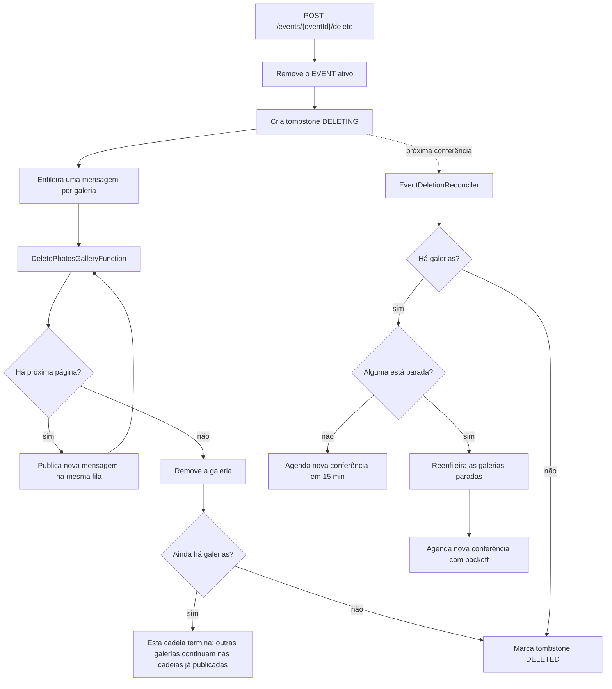

## Objetivo

A exclusão de um evento é assíncrona. A requisição remove o item ativo do evento, cria um tombstone de exclusão e coloca as galerias na fila. A limpeza das fotos e das galerias acontece depois, em páginas.

Esse desenho cria uma pergunta operacional importante:

> O que acontece se a fila, um worker ou a publicação da próxima página falhar depois que o evento já saiu do Studio?

O <code>EventDeletionReconciler</code> existe para responder a essa pergunta. Ele usa o estado persistido no DynamoDB como fonte da verdade, detecta exclusões que deixaram de avançar e recria o trabalho necessário na fila.

Ele não tenta reconstruir a execução a partir de logs nem depende de recuperar a mensagem exata que falhou.

## Visão geral



O caminho normal e o reconciliador convergem para o mesmo estado final: nenhuma galeria restante e tombstone em <code>DELETED</code>.

## Componentes envolvidos

| Componente | Papel |
| --- | --- |
| <code>DeleteEvent</code> | Inicia a exclusão e enfileira as galerias. |
| <code>DynamoDbEventRepository</code> | Cria e mantém o tombstone de exclusão. |
| <code>DeletePhotosGalleryFunction</code> | Remove fotos em páginas de até 250 e continua a cadeia pela SQS. |
| <code>DynamoDbGalleryRepository</code> | Mantém o lease da galeria e atualiza <code>updatedAt</code> quando uma página começa. |
| <code>DeletePhotosGalleryQueue</code> | Transporta as páginas de exclusão. |
| <code>DeletePhotosGalleryQueueDLQ</code> | Recebe mensagens que esgotaram as tentativas. |
| <code>EventDeletionReconcilerFunction</code> | Verifica periodicamente exclusões vencidas e recria trabalho perdido. |
| GSI1 | Índice esparso das exclusões de evento que ainda precisam de conferência. |

## Como a exclusão fica recuperável desde o início

<code>DynamoDbEventRepository.delete</code> não apaga o evento e depois tenta lembrar que havia uma limpeza pendente. Ele faz as duas alterações na mesma transação:

1. remove o item ativo <code>EVENT</code>;
2. cria um item <code>EVENT_DELETION</code>.

O tombstone começa com os campos de controle abaixo:

```ts
status = 'DELETING'
requestedAt = now
reconcileAttempts = 0

GSI1PK = 'EVENT_DELETION#PENDING'
GSI1SK = now + 30 minutos
```

A chave do tombstone segue o padrão:

```text
PK = USER#<photographerId>
SK = EVENT_DELETION#<eventId>
```

A transação garante que o evento não fique invisível para o usuário sem que exista um registro persistente dizendo que a limpeza ainda está pendente.

### A primeira conferência

A constante é:

```ts
FIRST_RECONCILE_DELAY_MS = 30 * MINUTE_MS
```

A primeira conferência não é imediata. O fluxo normal recebe uma janela para concluir sozinho antes de o reconciliador considerar interferir.

No estado atual da infraestrutura, a fila de exclusão usa:

| Parâmetro | Valor |
| --- | ---: |
| Visibility timeout | 360 s |
| <code>maxReceiveCount</code> | 5 |
| Lote do event source mapping | 1 mensagem |
| Concorrência máxima do worker | 30 |
| Timeout de <code>DeletePhotosGalleryFunction</code> | 60 s |

O tombstone entra na GSI já com a primeira conferência marcada para 30 minutos depois de <code>requestedAt</code>.

## Como DeleteEvent coloca o trabalho na fila

Depois de criar o tombstone, <code>DeleteEvent</code> lista as galerias ainda existentes e publica uma mensagem para cada uma:

```ts
await this.publisher.publish({
  type: 'GALLERY',
  pgId,
  eventId,
  galleryId: gallery.id,
  cursor: undefined,
  eventDeleting: true,
});
```

Quando todas foram publicadas, o caso de uso chama:

```ts
await this.repository.markDeletionQueued(pgId, eventId);
```

Isso grava <code>queuedAt</code> no tombstone.

### Repetição durante a fase de enfileiramento

O tombstone também distingue dois estados de progresso da solicitação:

- <code>QUEUEING</code>: o tombstone existe, mas <code>queuedAt</code> ainda não foi gravado;
- <code>QUEUED</code>: a fase inicial de publicação terminou.

Se uma nova chamada de exclusão encontra o evento ativo já removido:

- sem tombstone, o evento é considerado inexistente;
- com tombstone <code>QUEUED</code>, a chamada retorna sem reenfileirar tudo;
- com tombstone ainda em <code>QUEUEING</code>, o caso de uso lista as galerias novamente e repete a publicação.

Isso cobre uma falha da requisição original no meio do loop que enfileira várias galerias.

## Como o worker avança por uma galeria

Uma mensagem <code>GALLERY</code> chega ao <code>DeletePhotosGalleryFunction</code>. Para cada página, <code>ProcessDeleteAllPhotosGallery</code> executa esta sequência:

1. tenta <code>claimDeleting</code>;
2. consulta até 250 fotos a partir do <code>cursor</code>;
3. remove os objetos correspondentes do S3;
4. remove os registros correspondentes do DynamoDB;
5. libera o claim da galeria;
6. se houver <code>nextCursor</code>, publica uma nova mensagem;
7. se não houver, remove a galeria e tenta concluir o evento.

A continuação usa a mesma fila:

```ts
if (validNextCursor) {
  await this.publisher.publish({
    type: 'GALLERY',
    pgId: input.pgId,
    eventId: input.eventId,
    galleryId: input.galleryId,
    cursor: photos.nextCursor,
    eventDeleting: input.eventDeleting,
    galleryDeleting: input.galleryDeleting,
  });
}
```

Uma galeria grande, portanto, forma uma cadeia de mensagens. Cada mensagem representa uma página, e não a galeria inteira.

## O updatedAt como sinal de progresso

O reconciliador não considera uma exclusão parada apenas porque ela começou há muito tempo.

Ele procura **ausência de progresso**.

O sinal de progresso da galeria é <code>updatedAt</code>. Toda vez que uma página consegue assumir a galeria, <code>claimDeleting</code> grava:

```ts
SET deletingAttemptId = :attempt,
    deletingLeaseUntil = :lease,
    updatedAt = :updatedAt
```

O lease vale atualmente 90 segundos:

```ts
DELETING_LEASE_MS = 90_000
```

Assim, enquanto novas páginas continuam começando, <code>updatedAt</code> também continua avançando.

Exemplo:

```text
12:00:00  página 1 faz claim -> updatedAt = 12:00:00
12:00:03  página 2 faz claim -> updatedAt = 12:00:03
12:00:06  página 3 faz claim -> updatedAt = 12:00:06
...
```

Uma exclusão pode ser grande e durar bastante sem ser considerada travada. O que importa é se a galeria continua renovando esse marcador.

## Como o reconciliador roda

A infraestrutura agenda <code>EventDeletionReconcilerFunction</code> com EventBridge:

```yaml
Events:
  Reconcile:
    Type: Schedule
    Properties:
      Schedule: rate(15 minutes)
```

Portanto, a Lambda acorda a cada 15 minutos. Ela não é acionada pela SQS nem pela DLQ.

O handler cria <code>ReconcileEventDeletions</code>, executa o caso de uso e registra o resumo:

```ts
const result = await reconciler.execute();

logger.info(
  'Reconciliação de exclusões de evento concluída',
  result,
);
```

O resultado possui:

```ts
{
  examined,
  completed,
  requeuedGalleries,
  failed
}
```

Se ao menos uma exclusão falhar durante a reconciliação, o handler lança erro no final para que a execução apareça como falha nas métricas da Lambda. As outras exclusões do mesmo lote continuam sendo examinadas.

## Como ele encontra exclusões vencidas

Cada execução considera no máximo 50 tombstones:

```ts
const MAX_DELETIONS_PER_RUN = 50;

const due = await this.events.listDueDeletions(
  now,
  MAX_DELETIONS_PER_RUN,
);
```

<code>listDueDeletions</code> não faz <code>Scan</code>. Ele consulta a GSI1:

```ts
KeyConditionExpression:
  'GSI1PK = :pk AND GSI1SK <= :now'
```

com:

```text
GSI1PK = EVENT_DELETION#PENDING
GSI1SK <= agora
```

<code>GSI1SK</code> funciona como a data da próxima conferência. O índice devolve primeiro as exclusões mais atrasadas porque a consulta usa <code>ScanIndexForward: true</code>.

Isso transforma a GSI em uma fila persistente de trabalho de reconciliação.

## O algoritmo de reconciliação

Para cada tombstone vencido, o reconciliador lista as galerias que ainda existem para o evento:

```ts
const galleries =
  await this.galleries.listByEvent(pgId, eventId);
```

Essa consulta usa <code>ConsistentRead: true</code>.

A partir daí existem três situações.

### 1. Não existe mais nenhuma galeria

```ts
if (galleries.length === 0) {
  await this.events.completeDeletion(pgId, eventId);
  return undefined;
}
```

A limpeza física já terminou, mas o tombstone ainda estava em <code>DELETING</code>.

O reconciliador conclui o estado mesmo que o último worker tenha morrido depois de remover a última galeria e antes de atualizar o evento.

### 2. Existem galerias, mas todas continuam ativas

O critério de travamento é:

```ts
now.getTime() - Date.parse(gallery.getUpdatedAt())
  >= GALLERY_STALL_MS
```

com:

```ts
GALLERY_STALL_MS = 15 * MINUTE_MS
```

Se nenhuma galeria ultrapassou 15 minutos sem atualizar <code>updatedAt</code>, o reconciliador não publica nada.

Ele apenas agenda uma nova conferência:

```ts
ACTIVE_RECHECK_DELAY_MS = 15 * MINUTE_MS
```

e **não** incrementa <code>reconcileAttempts</code>.

A mensagem é: a exclusão ainda está em andamento; volte depois.

### 3. Uma ou mais galerias estão paradas

Para cada galeria parada, o reconciliador publica:

```ts
await this.publisher.publish({
  type: 'GALLERY',
  pgId,
  eventId,
  galleryId: gallery.id,
  cursor: undefined,
  eventDeleting: true,
});
```

Ele não tenta recuperar o cursor antigo.

Ele cria uma nova cadeia a partir do estado atual.

## Por que o reconciliador usa cursor undefined

Esse é o ponto central da recuperação.

Considere uma galeria com 10.000 fotos. Uma cadeia pode ter removido as primeiras 4.000 antes de parar.

O DynamoDB agora contém somente:

```text
foto 4001
foto 4002
...
foto 10000
```

Quando o reconciliador publica com <code>cursor: undefined</code>, o próximo <code>listByGallery(..., undefined, 250)</code> não volta à foto 1, porque as fotos 1 a 4000 já não existem.

A primeira página é formada pelas primeiras fotos **ainda presentes**.

```text
Antes da falha:
1 ... 4000 removidas
4001 ... 10000 presentes

Reinício sem cursor:
4001 ... 4250
```

A recuperação não depende de saber onde a mensagem anterior estava. O estado remanescente no DynamoDB define o trabalho restante.

Essa propriedade permite recuperar:

- mensagem perdida entre páginas;
- publicação que falhou depois de uma página ser removida;
- mensagens que esgotaram as tentativas e chegaram à DLQ;
- worker interrompido antes de publicar a continuação;
- falha depois de liberar o claim;
- interrupção externa da cadeia de mensagens.

## Coordenação com o lease da galeria

Reenfileirar do início pode coexistir temporariamente com uma mensagem antiga ainda viva. O worker se protege com <code>claimDeleting</code>.

A condição é:

```ts
attribute_exists(PK) AND
(
  attribute_not_exists(deletingLeaseUntil)
  OR deletingLeaseUntil < :now
)
```

Enquanto existe um lease válido, outra tentativa recebe <code>BUSY</code>.

O claim grava um <code>deletingAttemptId</code> novo e um lease de 90 segundos. A liberação exige que o <code>attemptId</code> ainda seja o mesmo e que o lease ainda esteja válido.

O reconciliador espera 15 minutos sem progresso antes de considerar uma galeria parada. Esse prazo é muito maior que o lease de 90 segundos. Na recuperação normal, portanto, o lease de um worker morto já expirou.

<Note>
  O lease evita dois workers donos da mesma galeria ao mesmo tempo. O reconciliador resolve outro problema: ausência prolongada de qualquer worker que continue a operação.
</Note>

## Backoff depois de uma recuperação

Se ao menos uma galeria foi reenfileirada, o reconciliador conta uma tentativa e não volta a conferir o mesmo evento a cada 15 minutos.

O atraso é:

```text
1 h
2 h
4 h
8 h
16 h
24 h
24 h
...
```

A implementação é:

```ts
Math.min(
  HOUR_MS * 2 ** Math.min(previousAttempts, 10),
  24 * HOUR_MS,
)
```

Depois de reenfileirar, <code>rescheduleDeletionReconcile</code>:

- move <code>GSI1SK</code> para a próxima data;
- grava <code>lastReconciledAt</code>;
- incrementa <code>reconcileAttempts</code>.

A função agendada continua rodando a cada 15 minutos, mas o tombstone só volta a ser elegível quando `GSI1SK <= agora`.

Portanto, "reconferir em 1 hora" significa **tornar elegível em 1 hora**. A execução efetiva acontece no primeiro tick de 15 minutos que encontrar o tombstone vencido.

## Como a exclusão termina

Quando uma página não possui <code>nextCursor</code>, o worker remove a galeria com <code>deleteGalleryAfterEventDeleting</code>.

Depois consulta as galerias restantes:

```ts
const remaining =
  await this.galleryRepository.listByEvent(pgId, eventId);

if (remaining.length === 0) {
  await this.eventRepository.completeDeletion(pgId, eventId);
}
```

<code>completeDeletion</code> muda o tombstone:

```text
DELETING -> DELETED
```

e remove:

```text
GSI1PK
GSI1SK
```

Sem essas chaves, o tombstone deixa de participar do índice <code>EVENT_DELETION#PENDING</code>.

O item não é apagado. Ele permanece como tombstone histórico com <code>status = DELETED</code> e <code>deletedAt</code>.

O reconciliador também chama <code>completeDeletion</code> quando encontra zero galerias. Assim, tanto o caminho normal quanto a rotina de recuperação podem concluir a operação.

## Proteções contra repetição e consistência eventual

A GSI1 é eventualmente consistente. Um tombstone recém-concluído pode aparecer brevemente em uma leitura atrasada do índice.

As escritas de conclusão e reagendamento usam condições sobre o estado persistido.

<code>completeDeletion</code> só aplica a transição se:

```text
o item existe
e status = DELETING
```

<code>rescheduleDeletionReconcile</code> usa a mesma exigência.

Se o tombstone já estiver em <code>DELETED</code>, uma visão atrasada da GSI não o faz voltar para <code>DELETING</code> nem recria trabalho de reconciliação.

## Falhas que o reconciliador cobre

### A próxima mensagem nunca foi publicada

Uma página terminou, o claim foi liberado e a publicação da continuação falhou.

Não há lease válido e não existe mensagem capaz de avançar.

Depois de 15 minutos sem novo <code>updatedAt</code>, o reconciliador reenfileira a galeria sem cursor.

### A mensagem foi para a DLQ

A SQS tentou entregar a mensagem até atingir <code>maxReceiveCount</code>.

A mensagem deixa a fila principal, mas o tombstone permanece <code>DELETING</code> e a galeria continua existindo.

O reconciliador não lê a DLQ. Ele percebe a parada pelo estado no DynamoDB e cria uma nova mensagem.

Isso é deliberadamente diferente de um redrive: a recuperação é orientada pelo estado restante, não pela mensagem morta.

### A requisição caiu durante o enfileiramento inicial

O evento ativo já foi removido e o tombstone existe, mas nem todas as galerias receberam sua primeira mensagem.

Uma repetição da própria solicitação pode retomar a fase <code>QUEUEING</code>.

Se isso não acontecer, a primeira conferência do tombstone ocorre depois de 30 minutos. Galerias que não avançaram podem ser detectadas como paradas e reenfileiradas.

### O último worker removeu tudo, mas não concluiu o tombstone

Na próxima conferência:

```text
listByEvent -> []
```

O reconciliador executa <code>completeDeletion</code>.

### Algumas galerias avançam e outra para

O reconciliador não reinicia o evento inteiro.

Ele calcula <code>stalled</code> por galeria e publica apenas as que ficaram pelo menos 15 minutos sem renovar <code>updatedAt</code>.

As galerias ativas continuam intocadas.

## Exemplo completo

Suponha um evento com uma galeria grande.

```text
12:00  solicitação de exclusão
       EVENT ativo é removido
       tombstone DELETING é criado
       primeira conferência = 12:30
       galeria é enfileirada

12:01  páginas começam a ser processadas
12:02  updatedAt continua avançando
...
12:10  uma continuação deixa de chegar ao worker

12:30  reconciliador examina o tombstone
       a galeria está há mais de 15 min sem progresso
       publica GALLERY com cursor = undefined
       reconcileAttempts passa a 1
       próxima conferência fica elegível em ~1 h

12:31  novo worker consulta o estado atual
       fotos já apagadas não aparecem
       a limpeza continua nas fotos restantes

12:40  última página termina
       galeria é removida
       nenhuma galeria resta
       tombstone -> DELETED
       GSI1PK/GSI1SK são removidos
```

Se a recuperação das 12:30 também parar, a próxima tentativa usa o backoff seguinte. Depois da primeira tentativa contada, a próxima janela é de 2 horas, depois 4, e assim por diante, até o teto de 24 horas.

## O que o reconciliador não cobre

O escopo atual é **exclusão de evento**.

Ele procura tombstones <code>EVENT_DELETION#PENDING</code> e, ao reenfileirar, sempre envia <code>eventDeleting: true</code>.

Ele não reconcilia automaticamente:

- exclusão isolada de uma galeria iniciada com <code>galleryDeleting: true</code>;
- exclusão de fotos selecionadas (<code>type: 'SELECTED'</code>);
- processamento de imagem.

Esses fluxos podem usar a mesma infraestrutura de fila ou outros mecanismos de retry, mas não são fontes de trabalho para <code>ReconcileEventDeletions</code>.

<Warning>
  Não trate o reconciliador como substituto da DLQ. A DLQ continua sendo um sinal operacional de que mensagens falharam repetidamente. O reconciliador garante convergência da exclusão de evento; a DLQ ajuda a investigar a causa da falha.
</Warning>

## Observabilidade

O reconciliador registra um resumo em toda execução:

```text
Reconciliação de exclusões de evento concluída
```

com <code>examined</code>, <code>completed</code>, <code>requeuedGalleries</code> e <code>failed</code>.

Quando reenfileira galerias paradas, registra:

```text
Limpeza de evento parada; galerias reenfileiradas
```

com:

- <code>eventId</code>;
- <code>requestedAt</code>;
- quantidade de <code>galleries</code>;
- novo valor de <code>reconcileAttempts</code>.

Uma consulta útil no log group de <code>EventDeletionReconcilerFunction</code>:

```sql
fields @timestamp, @message
| filter @message like /Limpeza de evento parada/
| sort @timestamp desc
```

Para acompanhar um evento específico:

```sql
fields @timestamp, @message
| filter @message like /EVENT_ID/
| sort @timestamp asc
```

A <code>DeletePhotosGalleryQueueDLQ</code> também possui alarme baseado em <code>ApproximateNumberOfMessagesVisible</code>. Uma mensagem na DLQ e um reenfileiramento pelo reconciliador podem ser dois sinais do mesmo incidente, mas são mecanismos independentes.

## Invariantes importantes

1. **O estado persistido é a fonte da verdade.** A mensagem SQS é transporte; o tombstone e as galerias dizem se a operação terminou.
2. **O evento removido continua rastreável.** A mesma transação que remove o item ativo cria o tombstone <code>DELETING</code>.
3. **Uma exclusão saudável não é reiniciada só por ser longa.** O reconciliador verifica <code>updatedAt</code> por galeria.
4. **Uma recuperação não depende do cursor perdido.** <code>cursor: undefined</code> consulta somente os itens que ainda existem.
5. **O lease serializa os workers.** Uma mensagem de recuperação não precisa presumir que todas as mensagens antigas desapareceram.
6. **O backoff impede recuperação agressiva.** Tentativas reais de reconciliação recuam de 1 hora até 24 horas.
7. **A conclusão é idempotente.** Um tombstone já <code>DELETED</code> não volta ao índice pendente por uma leitura atrasada da GSI.
8. **Falhas de uma exclusão não bloqueiam as demais.** O reconciliador processa cada tombstone em <code>try/catch</code> próprio e contabiliza <code>failed</code>.

## Onde olhar no código

| Assunto | Caminho |
| --- | --- |
| Início da exclusão | <code>services/api/src/application/events/DeleteEvent.ts</code> |
| Tombstone, GSI e reagendamento | <code>services/api/src/infra/dynamodb/DynamoDbEventRepository.ts</code> |
| Constantes de tempo e backoff | <code>services/api/src/domain/event/EventDeletion.ts</code> |
| Algoritmo do reconciliador | <code>services/api/src/application/events/ReconcileEventDeletions.ts</code> |
| Handler agendado | <code>services/api/src/handlers/schedule/eventDeletionReconciler.ts</code> |
| Worker de exclusão | <code>services/api/src/application/galleries/DeleteAllPhotosGallery.ts</code> |
| Handler da fila | <code>services/api/src/handlers/sqs/deletePhotosGalleryProcessor.ts</code> |
| Claim e lease da galeria | <code>services/api/src/infra/dynamodb/DynamoDbGalleryRepository.ts</code> |
| Configuração das Lambdas, SQS, DLQ e schedule | <code>infra/template.yaml</code> |

## Modelo mental

O reconciliador pode ser resumido assim:

```text
O evento ainda está DELETING?
        |
        v
Chegou a hora de conferir?
        |
        v
Ainda existem galerias?
   |              |
  não            sim
   |              |
   v              v
DELETED     Alguma sem progresso
            há >= 15 min?
               |       |
              não     sim
               |       |
               v       v
          conferir   reenfileirar
          em 15 min  sem cursor
                       |
                       v
                 aplicar backoff
```

A função não tenta preservar a execução anterior. Ela verifica se o objetivo final foi alcançado e, quando necessário, cria trabalho suficiente para o sistema continuar convergindo até ele.
