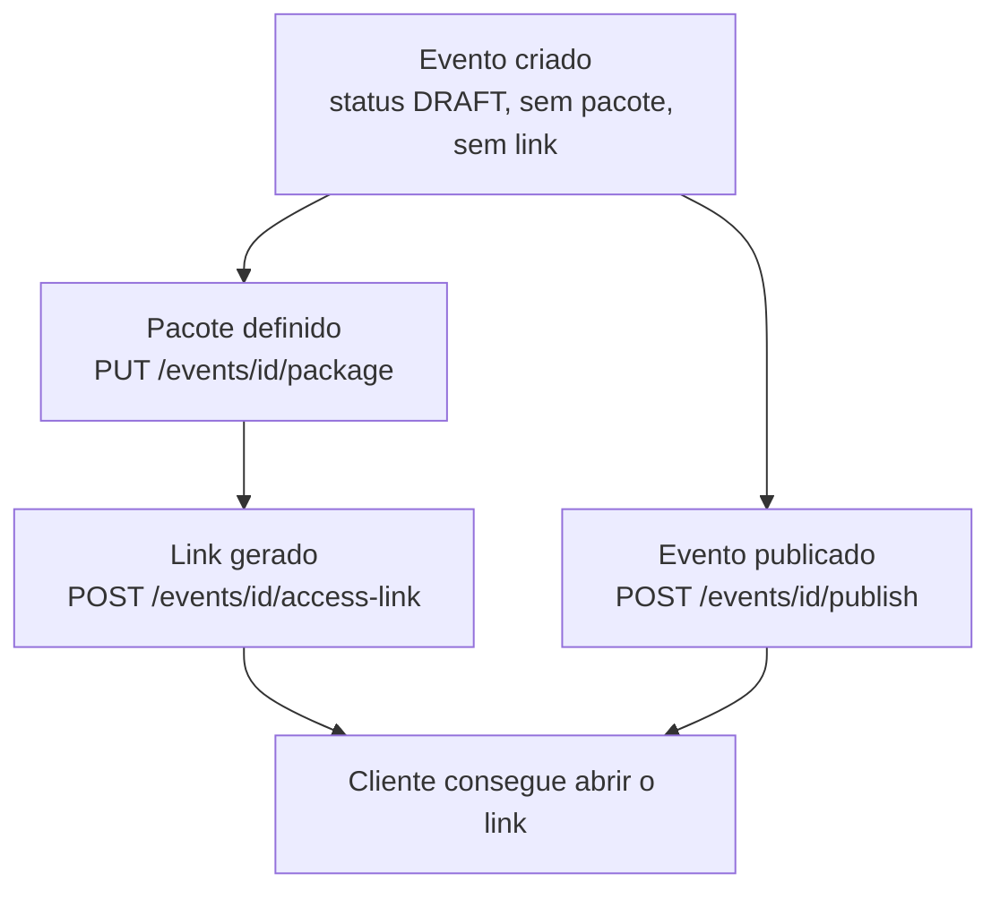
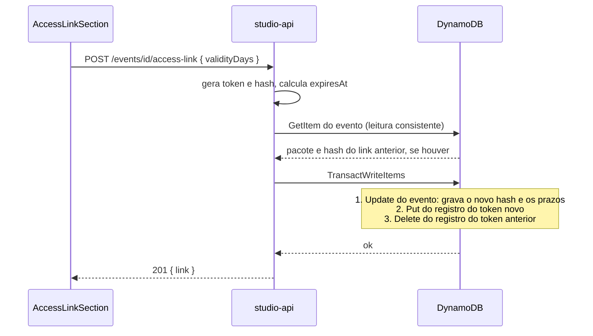

## Objetivo

Preparar um evento para que o cliente consiga abrir as galerias, escolher fotos e fechar um pedido. Isso exige três coisas, feitas pelo fotógrafo no Lumora Studio:

1. **Definir o pacote**: o combinado comercial (valor, fotos incluídas, preço de fotos adicionais).
2. **Publicar o evento**: tirá-lo de `DRAFT`.
3. **Gerar o link de acesso**: o endereço, com um token secreto, que o cliente recebe.

Esta página descreve essas três operações, as regras que as ligam e o que acontece quando elas disputam entre si. O que o cliente faz com o link está em [Acesso do cliente](/developers/flows/public-access).

## Visão de ponta a ponta



As setas mostram dependências, não uma sequência obrigatória. A tabela abaixo mostra o que cada operação exige.

| Operação | Exige pacote | Exige evento publicado | Exige link |
| --- | --- | --- | --- |
| Definir o pacote | não | não | não |
| Publicar o evento | não | não | não |
| Gerar o link | **sim** | não | não |
| O cliente abrir o link | já garantido pelo link | **sim** | **sim**, o atual e dentro do prazo |

Duas consequências:

- Gerar o link **não** exige que o evento esteja publicado. O fotógrafo pode gerar o link antes de publicar. O cliente só passa a conseguir abrir o link quando o evento for publicado.
- Publicar **não** exige pacote nem link. Um evento publicado sem link simplesmente não tem como ser aberto por ninguém.

## Definir o pacote

**Rota:** `PUT /events/{eventId}/package`, com o pacote inteiro no corpo.

```json
{
  "priceCents": 80000,
  "includedPhotos": 30,
  "extraPhotoPriceCents": 2500,
  "billing": "OUTSIDE"
}
```

Os valores acima são fictícios.

### Campos

| Campo | Limites | Significado |
| --- | --- | --- |
| `priceCents` | inteiro de 1 a 10.000.000 | Valor do pacote, em centavos. |
| `includedPhotos` | inteiro de 1 a 10.000 | Quantas fotos o pacote inclui. |
| `extraPhotoPriceCents` | `null` ou inteiro de 1 a 10.000.000 | Preço de cada foto além das incluídas. `null` significa que **não se vendem fotos adicionais**. |
| `billing` | `OUTSIDE` ou `PLATFORM` | Quem cobra o pacote. |

`billing` muda a conta do pedido:

- `OUTSIDE`: o fotógrafo já recebeu o pacote por fora. O pedido cobra **somente** as fotos adicionais. O pacote entra no total como zero.
- `PLATFORM`: o pedido cobra o pacote e as fotos adicionais.

Mesmo em `OUTSIDE`, `priceCents` é obrigatório e maior que zero. Ele não entra no total, mas o pacote precisa ser válido.

A presença de `extraPhotoPriceCents` também define o **teto de seleção** do cliente:

| `extraPhotoPriceCents` | Teto de fotos que o cliente pode selecionar |
| --- | --- |
| `null` | `includedPhotos`. O cliente não consegue passar disso. |
| um valor | Sem teto. O que passar de `includedPhotos` é cobrado como adicional. |

O teto é aplicado na [seleção de fotos](/developers/flows/photo-selection) do cliente, e a conta do valor é feita na criação do pedido.

### Sequência

1. O controller valida o corpo com `EventPackageSchema`.
2. `SetEventPackage` repete a validação na regra de domínio (`assertValidEventPackage`), para qualquer chamador que não passe pelo contrato HTTP.
3. `DynamoDbEventRepository.setPackage` executa um `UpdateItem` que substitui o atributo `package` do evento inteiro.
4. A resposta é o evento atualizado (`EventDto`), lido da própria escrita com `ReturnValues: ALL_NEW`.

Como o pacote é **substituído inteiro**, repetir a chamada com o mesmo corpo dá o mesmo resultado.

### O pacote trava com o primeiro pedido

A condição da escrita é `attribute_exists(PK) AND orderCount = 0`.

`orderCount` é um atributo do evento, incrementado na transação que abre o primeiro pedido. Portanto:

- **Sem pedido**, o pacote muda livremente.
- **Com qualquer pedido**, o pacote fica fixo e a API responde 409 `EVENT_PACKAGE_LOCKED`.

`orderCount` **nunca diminui**. Cancelar o pedido não destrava o pacote. O código registra isso de forma explícita: cada pedido congela os valores combinados com o cliente, e a contagem representa "já existiu pedido com este pacote".

A escrita distingue os erros pelo item que o DynamoDB devolve quando a condição falha (`ReturnValuesOnConditionCheckFailure: ALL_OLD`):

| Situação | Resposta |
| --- | --- |
| O evento não existe, ou é de outro fotógrafo | 404 `NOT_FOUND` |
| O evento existe e `orderCount` é maior que zero | 409 `EVENT_PACKAGE_LOCKED` |
| Corpo fora dos limites | 400 `VALIDATION_ERROR` |

### Disputa entre mudar o pacote e abrir o primeiro pedido

As duas operações escrevem no mesmo item do evento, com condições que se excluem:

| Operação | Condição sobre o evento |
| --- | --- |
| Definir o pacote | `orderCount = 0` |
| Abrir o pedido | o pacote gravado é **igual** ao que o pedido leu, e a escrita soma 1 em `orderCount` |

O DynamoDB serializa escritas condicionais no mesmo item. Então:

- Se a mudança do pacote vence, a abertura do pedido encontra um pacote diferente, é recusada e relê o evento.
- Se a abertura vence, `orderCount` passa a 1 e a mudança do pacote responde `EVENT_PACKAGE_LOCKED`.

Não existe um pedido calculado sobre um pacote que já foi trocado.

### Mudar o pacote com uma seleção em andamento

Antes do primeiro pedido, o fotógrafo pode mudar o pacote enquanto o cliente já tem fotos selecionadas. Não há bloqueio para isso. Os efeitos são:

- O teto é recalculado a partir do pacote gravado. Selecionar mais fotos passa a obedecer ao pacote novo.
- Se o novo pacote **deixa de vender adicionais** e o cliente já selecionou mais fotos que as incluídas, a seleção existente fica acima do teto. Ela não é apagada. Na hora de finalizar, o pedido é recusado com 409 `SELECTION_LIMIT` (`ExtraPhotosNotForSaleError`) até o cliente desmarcar fotos.

### No frontend

`EventPackageSection` mostra o formulário. Valores em reais são convertidos para centavos por `parseReaisToCents`. Quando `orderCount` é maior que zero, os campos ficam somente leitura.

## Publicar o evento

**Rota:** `POST /events/{eventId}/publish`, sem corpo.

`PublishEvent` chama `DynamoDbEventRepository.publish`, um `UpdateItem` condicionado a `status = DRAFT`.

| Estado atual do evento | Resultado |
| --- | --- |
| `DRAFT` | Passa a `PUBLISHED`. |
| `PUBLISHED` | Nenhuma escrita útil: a condição falha, o código reconhece que o item devolvido já está publicado e responde com o estado atual. Repetir é seguro. |
| `ARCHIVED` | 409 `EVENT_NOT_PUBLISHABLE`. |

Não há rota para voltar a `DRAFT`. O arquivamento existe na entidade e no repositório, mas não há rota nem tela que o aciona.

No frontend, **Publicar evento** pede confirmação e só é oferecido a eventos em `DRAFT`. A tela exige que não haja alterações pendentes na galeria aberta, porque publicar libera ao cliente o que está salvo, e não o rascunho local.

## Gerar o link de acesso

**Rota:** `POST /events/{eventId}/access-link`, com `validityDays` de 1 a 5 (dias inteiros).

**Resposta:** 201 com `{ "link": "..." }`. O endereço tem o formato `{PUBLIC_APP_URL}/g/{token}`.

### O token

`CryptoTokenGenerator` gera 32 bytes aleatórios, codificados em base64url sem padding. O resultado tem sempre 43 caracteres. O que o sistema guarda é o **hash SHA-256 do token**, em hexadecimal.

| Valor | Onde existe |
| --- | --- |
| `token` (em claro) | Na resposta desta chamada, e depois só na URL que o cliente recebeu. |
| `tokenHash` | No DynamoDB e no contexto interno do backend. Nunca sai para o cliente. |

O token em claro não é recuperável. Se o fotógrafo perder o link, a única saída é gerar outro. Por isso a tela mostra o link uma única vez e bloqueia o diálogo contra fechamento acidental.

### Sequência



1. `CreateEventAccessLink` pede um token a `EventAccessToken`, que valida `validityDays` (`accessLinkTtlMs`) e calcula o fim da validade.
2. `DynamoDbEventAccessTokenRepository.replace` lê o evento com leitura consistente. A leitura serve a duas coisas: confirmar que o evento existe e tem pacote, e descobrir o hash do link anterior.
3. Uma transação com até três operações aplica tudo ou nada:

| Operação | Condição | Efeito |
| --- | --- | --- |
| `Update` do evento | existe pacote **e** o link atual ainda é o lido (ou continua sem link) | Grava `accessTokenHash`, `accessLinkCreatedAt` e `accessLinkExpiresAt`, e **remove** `accessLinkRevokedAt`. |
| `Put` do registro do token | o registro não existe | Cria o item `PUBLIC_TOKEN#{hash}` que o authorizer consulta. |
| `Delete` do registro anterior | nenhuma | Apaga o item do link substituído. |

### Garantias

**Um único link por evento.** A condição do `Update` compara o hash lido com o hash gravado. Se outra chamada gerou um link entre a leitura e a transação, a condição falha, a transação é cancelada e a resposta é 409 `CONFLICT`. Não existem dois links válidos ao mesmo tempo.

**O link anterior deixa de valer na mesma escrita.** O registro antigo é apagado na transação, e o evento passa a apontar para o hash novo.

**O pacote precisa existir na escrita.** Além da leitura inicial, a condição do `Update` exige `attribute_exists(package)`. Se o evento perdeu o pacote entre os dois passos, a transação falha e a resposta é 409 `EVENT_PACKAGE_REQUIRED`. Na prática o pacote não pode ser removido por nenhuma rota; a condição existe como segunda barreira.

**Evento excluído no meio.** Se o evento foi excluído entre a leitura e a transação, o `Update` falha sem devolver item. O código interpreta isso como evento inexistente (404).

### Erros

| Situação | Resposta |
| --- | --- |
| Evento inexistente ou de outro fotógrafo | 404 `NOT_FOUND` |
| Evento sem pacote | 409 `EVENT_PACKAGE_REQUIRED` |
| Outro link foi gerado ao mesmo tempo | 409 `CONFLICT` |
| `validityDays` fora de 1 a 5 | 400 `VALIDATION_ERROR` |

### O estado do link no `EventDto`

`GET /events/{eventId}` devolve um objeto `accessLink`, ou `null` se nunca houve link:

```json
{
  "createdAt": "2026-10-09T12:00:00.000Z",
  "expiresAt": "2026-10-12T12:00:00.000Z",
  "revokedAt": null
}
```

O DTO nunca traz o token nem o hash. Os instantes são ISO 8601 em UTC; no banco são epoch em milissegundos.

O frontend deriva um estado a partir desse objeto (`accessLinkStatus`):

| Estado | Condição |
| --- | --- |
| `NONE` | Não há link. |
| `ACTIVE` | O instante atual é anterior a `expiresAt` e não há revogação vencida. |
| `EXPIRED` | Não há revogação vencida e o instante atual é igual ou posterior a `expiresAt`. |
| `REVOKED` | `revokedAt` existe e já passou. Tem precedência sobre `EXPIRED`. |

Os prazos são exclusivos: no instante exato do vencimento, o link já não vale. A tela agenda uma nova renderização para esse instante, sem consultar o servidor.

<Note>
  Atualmente nenhum código grava `accessLinkRevokedAt`. A regra de acesso, o DTO e a tela já tratam a revogação, mas o único código que toca o atributo é a geração de um novo link, que o remove. O estado `REVOKED` existe como previsão. Um comentário no domínio associa a revogação à conclusão do pedido. Não há código de pagamento no repositório, então essa conclusão ainda não existe.
</Note>

### `PUBLIC_APP_URL`

O prefixo do link vem da variável de ambiente `PUBLIC_APP_URL` da função `studio-api`. No template atual o valor está fixo em `http://localhost:5173`. Um link gerado em outro ambiente precisa que o template seja ajustado. A variável é lida na hora de gerar o link; ela não é validada.

## A regra que decide se o cliente entra

`canAccessEvent`, em `domain/event/EventAccess.ts`, é uma função pura. Recebe o evento, o hash do token apresentado e o instante. Devolve verdadeiro somente se **todas** estas condições valem:

1. O evento está em `PUBLISHED`.
2. O evento tem um link e o hash apresentado é o do link **atual**.
3. Não há revogação no passado.
4. O instante é anterior a `accessLink.expiresAt`.

Observações:

- A validade vem do link gravado **no evento**, e não do registro do token. Um link substituído ou vencido deixa de valer na leitura seguinte, mesmo que uma resposta do authorizer ainda esteja em cache.
- `event.expiresAt` **não** entra na regra. Ele é um prazo do evento (retenção), não a janela de acesso do cliente. Atualmente é apenas armazenado.
- A mesma regra existe em forma de condição do DynamoDB, para as escritas do cliente: `LINK_GRANTS_ACCESS`, em `infra/dynamodb/eventConditions.ts`. As duas versões precisam mudar juntas. Um comentário no arquivo da condição registra a correspondência.

Um pedido já aberto não depende da janela de seleção. Ver o pedido exige apenas que o link seja o atual do evento. Cancelá-lo exige o link valendo, como abrir um pedido.

## Dados envolvidos

Os identificadores são fictícios.

| Item | `PK` | `SK` | Atributos desta página |
| --- | --- | --- | --- |
| Evento | `USER#{sub}` | `EVENT#{eventId}` | `package`, `orderCount`, `status`, `accessTokenHash`, `accessLinkCreatedAt`, `accessLinkExpiresAt`, `accessLinkRevokedAt` |
| Registro do token | `PUBLIC_TOKEN#{tokenHash}` | `PUBLIC_GALLERY` | `id` (o `sub` do fotógrafo), `eventId`, `tokenHash`, `expiresAt`, `createdAt`, `updatedAt` |

O registro do token fica numa partição própria, indexada pelo hash. É assim que o authorizer encontra dono e evento a partir do token, sem ler o evento. Ele não é a fonte da validade: o authorizer só confirma que o token existe e tem o formato correto. Veja [Acesso do cliente](/developers/flows/public-access#etapa-1-o-authorizer).

A chave de ordenação do registro é o literal `PUBLIC_GALLERY`, nome anterior à mudança do link de galeria para evento. O link hoje é do evento e alcança todas as suas galerias.

## O que acontece com o link quando o evento é excluído

`DynamoDbEventRepository.delete` lê o hash do link e, na mesma transação que remove o evento e cria o tombstone, apaga o registro do token. Um link gerado entre a leitura e a transação pode sobrar como registro órfão. Ele não autoriza nada: o evento não existe mais, e `canAccessEvent` nega. Veja [Reconciliação da exclusão de eventos](/developers/flows/event-deletion-reconciliation).

## Onde está no código

| Assunto | Caminho |
| --- | --- |
| Rotas e erros | `services/api/src/handlers/api/studioApi.ts` |
| Controllers | `services/api/src/controllers/EventController.ts` |
| Pacote | `application/events/commands/SetEventPackage.ts`, `domain/event/EventPackage.ts` |
| Publicação | `application/events/commands/PublishEvent.ts` |
| Link | `application/events/access/` (`CreateEventAccessLink`, `GenerateEventAccessToken`) |
| Persistência do link | `infra/dynamodb/DynamoDbEventAccessTokenRepository.ts` |
| Regra de acesso | `domain/event/EventAccess.ts`, `domain/event/EventAccessToken.ts` |
| Condição equivalente no banco | `infra/dynamodb/eventConditions.ts` |
| Geração do token | `infra/crypto/CryptoTokenGenerator.ts` |
| Telas | `apps/web/src/studio/events/` (`EventPackageSection`, `AccessLinkSection`, `PublishEventDialog`) |

Os caminhos de `services/api` são relativos a `src`.
