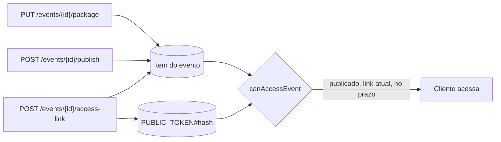

Antes de o cliente abrir uma galeria, três coisas precisam existir no evento: um **pacote**, o status `PUBLISHED` e um **link de acesso** dentro do prazo. Cada uma tem sua própria rota na `studio-api`, e as três são independentes entre si na escrita. A regra que as combina só é aplicada quando o cliente usa o link.

| Requisito | Exigido para gerar o link | Exigido para o cliente acessar |
| --- | --- | --- |
| Pacote definido | Sim | Indiretamente: o link só existe se o pacote existia |
| Evento em `PUBLISHED` | Não | Sim |
| Link atual, não vencido e não revogado | — | Sim |

A ordem na tela não é imposta pela API. É possível gerar o link de um evento em `DRAFT`: o link é criado, mas o cliente não consegue usá-lo até o evento ser publicado. A seção **Link do cliente** do Lumora Studio mostra um aviso nesse caso.

## Definir o pacote

O pacote é o combinado comercial do evento. Ele é único por evento e vale para todas as galerias.

**Entrada:** `PUT /events/{eventId}/package`.

| Campo | Regra | Significado |
| --- | --- | --- |
| `priceCents` | inteiro de 1 a 10.000.000 | Valor do pacote, em centavos |
| `includedPhotos` | inteiro de 1 a 10.000 | Fotos incluídas no pacote. É o teto da seleção do cliente quando não há venda de adicionais. |
| `extraPhotoPriceCents` | inteiro de 1 a 10.000.000, ou `null` | Preço de cada foto além das incluídas. `null` significa que o evento não vende fotos adicionais. |
| `billing` | `OUTSIDE` ou `PLATFORM` | `OUTSIDE`: o fotógrafo já recebeu o pacote por fora. `PLATFORM`: o pedido cobra o pacote. |

**Sequência:**

1. O controller valida o id do evento e o corpo com `EventPackageSchema`. Id malformado responde 404 sem consultar o banco.
2. `SetEventPackage` chama `assertValidEventPackage`, que repete as mesmas regras no domínio, para quem chegar por outro caminho que não o HTTP.
3. `DynamoDbEventRepository.setPackage` grava o pacote inteiro com um `UpdateItem` condicionado a `attribute_exists(PK) AND orderCount = 0`.

**Garantias:**

- **O pacote é substituído inteiro.** Repetir a mesma chamada produz o mesmo resultado.
- **O pacote trava no primeiro pedido.** A abertura de um pedido incrementa `orderCount` na mesma transação que cria o pedido, e `orderCount` nunca é decrementado, nem quando o pedido é cancelado. A partir daí, a condição da escrita falha e a resposta é 409 `EVENT_PACKAGE_LOCKED`. O motivo é que cada pedido congela os valores da compra.
- **Isolamento.** A chave do evento inclui o `sub` do fotógrafo. Um evento de outro fotógrafo não é encontrado e responde 404.

**Resposta:** 200 com o evento atualizado, incluindo `package`.

No Lumora Studio, `EventPackageSection` converte o valor digitado em reais para centavos com `parseReaisToCents`, aplica os mesmos limites antes de enviar e bloqueia o formulário quando `orderCount > 0`.

## Publicar o evento

**Entrada:** `POST /events/{eventId}/publish`, sem corpo.

**Sequência:** `PublishEvent` chama `DynamoDbEventRepository.publish`, que executa um único `UpdateItem` de `DRAFT` para `PUBLISHED`, condicionado a `attribute_exists(PK) AND status = DRAFT`.

Quando a condição falha, o repositório lê o item devolvido pela própria falha (`ReturnValuesOnConditionCheckFailure: ALL_OLD`), sem uma leitura extra:

| Item devolvido | Resultado |
| --- | --- |
| Nenhum | 404: o evento não existe para este fotógrafo. |
| Status `PUBLISHED` | 200 com o estado atual. Repetir a publicação é uma operação sem efeito. |
| Outro status (`ARCHIVED`) | 409 `EVENT_NOT_PUBLISHABLE`. |

**Garantias:**

- A transição é atômica e não depende de uma leitura anterior.
- Não há caminho de volta para `DRAFT`. A tela pede confirmação por isso.
- A publicação não exige pacote nem link. Ela também não consulta galerias nem fotos.

No Lumora Studio, o botão **Publicar** aparece só em eventos em `DRAFT`. Se o formulário de detalhes tiver alterações não salvas, a tela pede para salvar ou descartar antes de abrir a confirmação.

### Arquivar

A transição `archive` (`PUBLISHED` para `ARCHIVED`) existe na entidade `Event` e no repositório, com o mesmo tratamento de repetição. Ela não está exposta: não há rota nem caso de uso. Atualmente nenhum evento chega a `ARCHIVED`.

## Gerar o link do cliente

O evento tem **um único link**, que dá acesso a todas as suas galerias. O token não é recuperável depois de gerado, por isso gerar de novo substitui o anterior.

**Entrada:** `POST /events/{eventId}/access-link`, com `validityDays`, inteiro de 1 a 5. O Lumora Studio sugere 3 dias.

**Sequência:**

1. O controller valida o corpo com `CreateAccessLinkInputSchema`.
2. `EventAccessToken.create` converte os dias em milissegundos com `accessLinkTtlMs`, que recusa valores fora da faixa, e pede um token ao `CryptoTokenGenerator`: 32 bytes aleatórios em base64url (43 caracteres). O hash é o SHA-256 do token, em hexadecimal.
3. `DynamoDbEventAccessTokenRepository.replace` lê o evento com leitura consistente, projetando só `accessTokenHash` e `package`:
   - evento inexistente: 404;
   - sem pacote: 409 `EVENT_PACKAGE_REQUIRED`.
4. O repositório executa uma transação:

| Operação | Condição | Efeito |
| --- | --- | --- |
| `Update` do evento | pacote existe e `accessTokenHash` é o lido no passo 3 (ou não existe, no primeiro link) | Grava `accessTokenHash`, `accessLinkCreatedAt` e `accessLinkExpiresAt`. Remove `accessLinkRevokedAt`. |
| `Put` de `PUBLIC_TOKEN#{hash}` / `PUBLIC_GALLERY` | não existir | Registro do token com `id` (o `sub` do dono), `eventId`, `tokenHash` e `expiresAt` |
| `Delete` do token anterior | — | Só quando havia link. O token antigo deixa de ser reconhecido. |

5. `CreateEventAccessLink` monta o endereço `{PUBLIC_APP_URL}/g/{token}`.

**Resposta:** 201 com `{ link }`. É a única vez em que o token em claro sai do backend. No banco fica apenas o hash, e o `EventDto` expõe só as datas do link em `accessLink`.

**Garantias:**

- **Um link por evento.** A leitura do passo 3 só descobre o hash anterior. Quem garante a unicidade é a condição sobre `accessTokenHash` na transação: se outro link for gerado entre a leitura e a escrita, a transação é cancelada e a resposta é 409 `CONFLICT`.
- **Substituição atômica.** O link novo passa a valer e o anterior deixa de valer na mesma transação. Não há janela com dois links válidos nem sem nenhum.
- **Sem link sem preço.** A existência do pacote é verificada antes e de novo na condição da escrita. Um cliente nunca abre uma galeria sem pacote.
- **O hash não vaza.** Na entidade `Event`, o hash fica num campo privado real (`#accessTokenHash`), que não aparece em JSON, logs nem DTOs.

Se a transação falhar por condição, o repositório distingue os casos pelo item devolvido: evento excluído depois da leitura (404), pacote removido (409 `EVENT_PACKAGE_REQUIRED`) ou outro link gerado ao mesmo tempo (409 `CONFLICT`).

No Lumora Studio, `AccessLinkSection` mostra o link só logo após a geração. Depois disso, a tela mostra apenas o estado, calculado por `accessLinkStatus` com as mesmas regras do backend: **Ativo**, **Expirado**, **Encerrado** ou nenhum link. O estado é recalculado quando o prazo vence, mesmo com a página aberta.

## Quando o link dá acesso

A regra fica em `canAccessEvent`, uma função pura do domínio. O acesso é concedido somente quando todas as condições são verdadeiras:

1. o evento está em `PUBLISHED`;
2. o hash do token apresentado é o `accessTokenHash` atual do evento;
3. o link não foi revogado, ou a revogação ainda não chegou;
4. o instante atual é anterior a `accessLinkExpiresAt`.

Os prazos são exclusivos: no instante exato do vencimento, o acesso já acabou. Um prazo ilegível nega o acesso. `expiresAt` do evento não participa: ele é um prazo de retenção, não a janela de acesso do cliente.

As escritas da área pública repetem essas condições na própria `ConditionExpression`, pela constante `LINK_GRANTS_ACCESS`. Assim, um link substituído ou vencido entre a leitura e a escrita não consegue gravar.

<Note>
  `ValidateEventAccessToken` só autentica o token: formato e existência do registro. Prazo e revogação não são verificados nessa etapa, porque um link vencido ou revogado ainda precisa ser reconhecido para dar acesso às compras do cliente. Token malformado e token desconhecido falham com o mesmo erro, para não revelar qual foi o caso.
</Note>

## Erros

| Situação | Status | `code` |
| --- | --- | --- |
| Id do evento malformado, evento inexistente ou de outro fotógrafo | 404 | `NOT_FOUND` |
| Corpo ausente ou JSON inválido | 400 | `INVALID_REQUEST` ou `INVALID_JSON` |
| Campos fora das regras | 400 | `VALIDATION_ERROR` |
| Pacote alterado depois de existir pedido | 409 | `EVENT_PACKAGE_LOCKED` |
| Publicar evento arquivado | 409 | `EVENT_NOT_PUBLISHABLE` |
| Gerar link sem pacote | 409 | `EVENT_PACKAGE_REQUIRED` |
| Outro link gerado ao mesmo tempo | 409 | `CONFLICT` |

## Limites atuais

- **Revogação sem escritor.** O modelo prevê `accessLinkRevokedAt` no evento e `revokedAt` no registro do token, gravados quando o pedido é concluído. Hoje nenhum código grava esses campos. A geração de um novo link apenas remove `accessLinkRevokedAt`.
- **Registros de token sem expiração física.** A tabela não tem TTL. O registro `PUBLIC_TOKEN#` de um link vencido continua no banco até ser substituído por outro link ou até o evento ser excluído.
- **`PUBLIC_APP_URL` fixo no template.** O template define `http://localhost:5173` para a `studio-api`. O link devolvido aponta para esse endereço em qualquer stack publicada com o template atual.
- **Sem arquivamento.** Veja [Arquivar](#arquivar).
