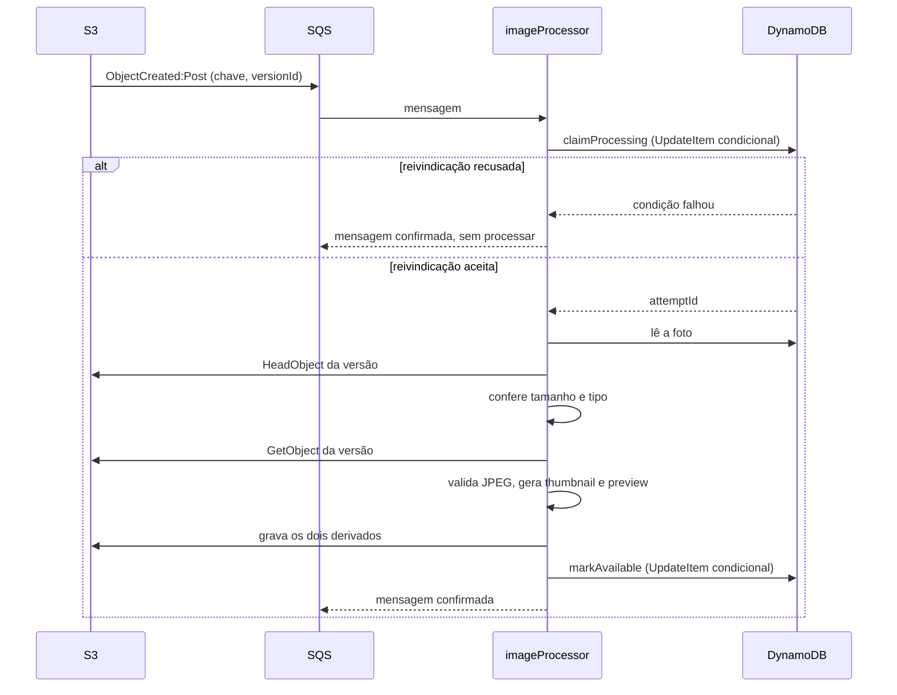
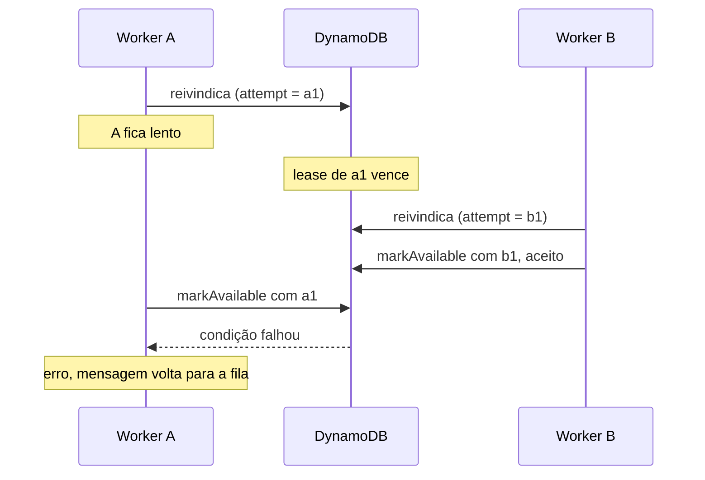
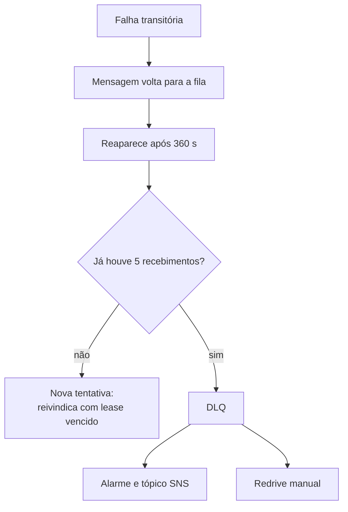

## Objetivo

Para cada original que chega ao S3: confirmar que ele corresponde ao que foi autorizado, gerar uma miniatura e uma preview e levar a foto a um estado final, `AVAILABLE` ou `FAILED`.

O fluxo precisa produzir o resultado certo mesmo quando a mesma mensagem chega duas vezes, quando um worker morre no meio do trabalho e quando um worker lento termina depois de outro já ter assumido.

## Por que o processamento é assíncrono

- **O upload não espera.** Decodificar e redimensionar um JPEG de dezenas de megabytes leva segundos. O navegador envia centenas de arquivos sem depender disso.
- **A API não toca nos bytes.** A `studio-api` tem 256 MB e 10 segundos. O processamento roda em outra função, dimensionada para imagens.
- **A chegada é confirmada por quem recebeu.** O evento parte do S3, não do navegador. Um cliente não consegue declarar uma foto como enviada.
- **Falhas são absorvidas pela fila.** Uma falha passageira vira reentrega, sem ação do usuário.

## Sequência



### Etapas do caso de uso

`ProcessUploadedPhoto`, em `services/api/src/application/photos`, executa as etapas abaixo. O nome entre parênteses é o valor do campo `stage` nos logs de erro.

1. **Reivindicar** (`claim`). Tenta assumir o processamento da foto para esta versão do objeto. Se não conseguir, encerra sem erro.
2. **Ler a foto** (`getPhoto`). Obtém o tamanho e o tipo declarados no registro.
3. **Inspecionar o original** (`headOriginal`). `HeadObject` na versão reivindicada.
4. **Conferir metadados** (`validate`). Tamanho e `Content-Type` do objeto precisam ser iguais aos do registro.
5. **Baixar o original** (`getOriginal`). `GetObject` na versão reivindicada, inteiro em memória.
6. **Validar o conteúdo** (`validate`). O sharp lê os metadados e confirma que o formato é JPEG.
7. **Gerar e gravar a miniatura** (`thumbnail`, `putThumbnail`).
8. **Gerar e gravar a preview** (`preview`, `putPreview`).
9. **Publicar** (`markAvailable`). Leva a foto a `AVAILABLE`.

A reivindicação vem antes de qualquer acesso ao S3. Mensagens duplicadas ou de versões tardias param no passo 1, sem custo de leitura de objeto.

## Semântica da fila

A fila é uma SQS standard. Ela garante entrega **pelo menos uma vez**, sem ordem. O desenho assume três consequências:

- a mesma mensagem pode ser entregue mais de uma vez;
- o S3 pode publicar mais de um evento para o mesmo objeto;
- uma mensagem pode ser reprocessada muito depois, por exemplo em um redrive da DLQ.

A configuração relevante:

| Parâmetro | Valor | Efeito |
| --- | --- | --- |
| Tamanho do lote | 1 | Cada invocação trata uma mensagem. |
| `ReportBatchItemFailures` | habilitado | Só a mensagem que falhou volta para a fila. |
| Visibility timeout | 360 s | Tempo até uma mensagem não confirmada reaparecer. |
| `maxReceiveCount` | 5 | Recebimentos antes de a mensagem ir para a DLQ. |
| Concorrência máxima | 30 | Limite de invocações simultâneas do processador. |

### O que o handler faz com cada mensagem

| Conteúdo | Tratamento |
| --- | --- |
| Evento de teste do S3 (`s3:TestEvent`) | Ignorado. O S3 envia esse evento ao configurar a notificação. |
| Chave fora do padrão `photos/.../original.jpeg` | Registrado como aviso e ignorado. |
| Evento sem `versionId` | Erro. A mensagem volta para a fila. |
| Evento válido | Encaminhado ao caso de uso. |

A chave vem codificada no evento do S3. O handler a decodifica antes de interpretá-la.

## Os campos de controle

O processamento é coordenado por quatro atributos do item da foto no DynamoDB. Não há lock externo nem tabela auxiliar.

| Campo | Papel |
| --- | --- |
| `sourceVersionId` | A versão do objeto aceita como original. Fixada na primeira reivindicação. |
| `processingAttemptId` | UUID da tentativa que detém o processamento agora. |
| `processingLeaseUntil` | Instante, em milissegundos, até o qual essa tentativa é a dona. |
| `completedAttemptId` | UUID da tentativa que concluiu. Indica onde estão os derivados publicados. |

## Reivindicação

`claimProcessing` é um único `UpdateItem` condicional. Não há leitura prévia nem transação.

**O que grava:** `status = PROCESSING`, `sourceVersionId`, um novo `processingAttemptId`, `processingLeaseUntil = agora + 90 s` e `updatedAt`.

**Quando é aceito:** a foto existe e uma destas situações é verdadeira:

- **Primeira chegada.** A foto está em `PENDING_UPLOAD` e ainda não tem `sourceVersionId`.
- **Retomada.** A foto está em `PROCESSING`, com o **mesmo** `sourceVersionId`, e o lease venceu ou não existe.

Qualquer outra situação recusa a reivindicação:

| Estado da foto | Resultado |
| --- | --- |
| Não existe | Recusada. Um evento órfão não recria a foto. |
| `PROCESSING`, mesma versão, lease válido | Recusada. Outra tentativa está trabalhando. |
| `PROCESSING`, outra versão | Recusada, mesmo com lease vencido. |
| `AVAILABLE` ou `FAILED` | Recusada. O processamento já terminou. |

Uma reivindicação recusada **não é um erro**. O caso de uso retorna normalmente, e a mensagem é confirmada e removida da fila.

### Resposta perdida

O SDK da AWS repete automaticamente uma chamada cuja resposta se perdeu. Se o primeiro `UpdateItem` foi aplicado e a resposta não chegou, a repetição falha na condição, porque o lease recém-gravado ainda é válido.

Para não tratar a própria vitória como derrota, o repositório pede `ReturnValuesOnConditionCheckFailure: ALL_OLD` e examina o item devolvido. Se ele contém **exatamente** o `attemptId` gerado nesta chamada, com a mesma versão e lease válido, a reivindicação é considerada aceita.

O `attemptId` é gerado dentro de `claimProcessing`, a cada chamada. Outra invocação da mesma mensagem gera outro UUID e nunca se reconhece nesse item.

## Lease

O lease resolve um problema específico: um worker que reivindicou a foto e morreu antes de concluir. Sem prazo, a foto ficaria presa em `PROCESSING` para sempre, porque nenhuma outra tentativa poderia assumir.

Com o lease, a posse é temporária. Passados 90 segundos, a reentrega da mensagem pode reivindicar de novo.

<Note>
  O lease não é renovado durante o processamento, e não é um TTL do DynamoDB. Ele é só um número comparado nas condições de escrita.
</Note>

### Os três tempos

```
timeout da Lambda (60 s)  <  lease (90 s)  <  visibility timeout da fila (360 s)
```

Cada desigualdade tem um motivo:

- **Timeout menor que o lease.** A Lambda é encerrada aos 60 segundos. Um worker saudável nunca está vivo quando seu lease vence, então dois workers não processam a mesma foto ao mesmo tempo em operação normal.
- **Lease menor que o visibility timeout.** Quando a mensagem reaparece, aos 360 segundos, o lease da tentativa anterior já venceu. A reentrega consegue reivindicar, em vez de ser recusada e descartada.

A constante `PROCESSING_LEASE_MS` fica em `DynamoDbPhotoRepository.ts`. O timeout e o visibility timeout ficam no template. Os três valores precisam ser alterados em conjunto.

## Versão do original

O bucket é versionado. Cada envio para a mesma chave cria uma nova versão, e o evento do S3 traz o `versionId`.

Isso importa porque o presigned POST é válido por 15 minutos e pode ser usado mais de uma vez. Um segundo envio com o mesmo ticket substituiria o objeto corrente. Sem versionamento, um worker poderia ler bytes diferentes dos que originaram o evento.

O processador se protege em dois pontos:

- **Na reivindicação**, a primeira versão a chegar é gravada em `sourceVersionId`. Qualquer outra versão é recusada dali em diante, inclusive depois de o lease vencer.
- **Na leitura**, `HeadObject` e `GetObject` são feitos com `VersionId`. O processador lê exatamente a versão reivindicada, e não a versão corrente.

Resultado: uma foto é processada a partir de uma única versão, imutável, do começo ao fim.

## Conclusão

`markAvailable` e `markFailed` usam o mesmo `UpdateItem` condicional, mudando só o estado de destino.

**O que grava:** o novo `status`, `completedAttemptId` e `updatedAt`. Remove `processingAttemptId` e `processingLeaseUntil`.

**Quando é aceito:** todas estas condições são verdadeiras:

- a foto está em `PROCESSING`;
- `processingAttemptId` é o desta tentativa;
- `sourceVersionId` é o desta tentativa;
- o lease ainda não venceu.

A condição sobre `processingAttemptId` é o que impede um worker antigo de concluir depois que outro assumiu.

### Conclusão repetida

Se a condição falhar, o repositório examina o item devolvido. Se a foto já está no estado de destino, com a mesma versão e com `completedAttemptId` igual ao desta tentativa, a operação já tinha sido aplicada. O retorno é tratado como sucesso.

Em qualquer outro caso, a conclusão lança erro, e a mensagem volta para a fila.

## Cenários

### Mensagem duplicada durante o processamento

1. O worker A reivindica a foto. O lease vale por 90 segundos.
2. Uma segunda entrega da mesma mensagem chega ao worker B.
3. B tenta reivindicar. A foto está em `PROCESSING`, mesma versão, lease válido. Recusada.
4. B retorna sem erro e não lê nada do S3.
5. A conclui normalmente.

### Worker morre no meio do trabalho

1. O worker A reivindica a foto e falha, por exemplo com timeout ao gravar um derivado.
2. A mensagem não é confirmada. Ela reaparece após 360 segundos.
3. O worker B recebe a mensagem. O lease de A venceu há muito tempo.
4. B reivindica: `PROCESSING`, mesma versão, lease vencido. Aceita, com um novo `attemptId`.
5. B processa e conclui.

### Worker atrasado tenta concluir depois de outro



1. A reivindica com `attemptId = a1` e fica lento.
2. O lease de `a1` vence. B reivindica com `attemptId = b1`.
3. B grava seus derivados em `attempts/b1/` e conclui. `completedAttemptId = b1`.
4. A grava seus derivados em `attempts/a1/` e tenta concluir.
5. A condição falha: a foto não está mais em `PROCESSING`, e `processingAttemptId` não é `a1`. O item devolvido tem `completedAttemptId = b1`, que não é `a1`. Não é uma repetição.
6. A lança erro. A mensagem de A volta para a fila e, na reentrega, a reivindicação é recusada porque a foto está em `AVAILABLE`. A mensagem é confirmada.

A não sobrescreve nada de B, por dois motivos independentes:

- **no DynamoDB**, a condição sobre `processingAttemptId` barra a escrita;
- **no S3**, cada tentativa grava em sua própria pasta. Os arquivos de `a1` ficam órfãos, mas a API serve os de `b1`.

Com o timeout da Lambda menor que o lease, esse cenário não ocorre em operação normal. A proteção existe para o caso em que essa relação seja violada.

### Segundo envio para a mesma chave

1. O navegador envia o arquivo. O S3 cria a versão `v1` e publica um evento.
2. O mesmo ticket é usado de novo. O S3 cria a versão `v2` e publica outro evento.
3. O evento de `v1` reivindica a foto. `sourceVersionId = v1`.
4. O evento de `v2` tenta reivindicar. A foto já tem outra versão. Recusada.
5. A foto é processada a partir de `v1`, mesmo que `v2` seja a versão corrente do objeto.

Vale também para a ordem inversa: a primeira versão a reivindicar vence, seja qual for.

### Redrive da DLQ

Uma mensagem reprocessada dias depois carrega o mesmo `versionId`. Se a foto ainda está em `PROCESSING` com essa versão e o lease venceu, a reivindicação pode ser aceita. Para concluir o processamento, a versão fixada ainda precisa existir no S3.

<Warning>
  A retenção de 14 dias da DLQ não garante a preservação do original. O redrive reinicia a retenção da mensagem, mas não o prazo de expiração de 15 dias da versão não corrente no S3. Redrives sucessivos podem manter a mensagem depois de a versão ter sido removida. Antes de retomar, confira a existência de `sourceVersionId`. A reinicialização da retenção é descrita na [documentação do SQS](https://docs.aws.amazon.com/AWSSimpleQueueService/latest/SQSDeveloperGuide/sqs-configure-dead-letter-queue-redrive.html).
</Warning>

## Derivados

`SharpProcessor`, em `services/api/src/shared/sharp`, gera os dois arquivos.

| Derivado | Dimensão | Ajuste | Formato | Qualidade |
| --- | --- | --- | --- | --- |
| Miniatura | 400 × 400 | `cover`: preenche o quadrado, cortando o excedente | WebP | 75 |
| Preview | até 1920 × 1920 | `inside`: cabe no quadrado, sem cortar | WebP | 80 |

Características comuns:

- A imagem é rotacionada conforme a orientação EXIF antes do redimensionamento.
- A saída não carrega os metadados do original. O sharp os descarta por padrão, e o código não pede para mantê-los.
- `limitInputPixels` de 100 milhões de pixels recusa imagens com dimensões absurdas, uma proteção contra bombas de descompressão.
- Os objetos são gravados com `Cache-Control: public, max-age=31536000, immutable`.

### Uma pasta por tentativa

Os derivados ficam em `photos/{ownerId}/{eventId}/{galleryId}/{photoId}/attempts/{attemptId}/`.

Como o caminho inclui o `attemptId`, duas tentativas nunca gravam no mesmo objeto. A leitura usa `completedAttemptId` para escolher a pasta publicada. Veja o [ADR-008](/developers/adr/008-derivatives-per-attempt).

O sufixo `-v1` no nome dos arquivos vem de `IMAGE_PROCESSING_VERSION`. Ele identifica a versão das regras de geração, e não a tentativa.

<Note>
  A miniatura e a preview são servidas por URLs públicas da distribuição de mídia, e a preview recebe marca d'água. Veja [Reprocessamento e mídia](/developers/flows/reprocessing-and-media).
</Note>

## Erros e recuperação

O processador distingue dois tipos de falha.

### Falha permanente

O conteúdo não pode produzir derivados válidos, e repetir não mudaria o resultado. É sinalizada por `InvalidPhotoContentError`.

| Causa | Detectada em |
| --- | --- |
| Tamanho do objeto diferente do registrado | `Photo.assertOriginalMatches` |
| `Content-Type` do objeto diferente do registrado | `Photo.assertOriginalMatches` |
| Arquivo ilegível ou corrompido | `SharpProcessor.validateJpeg` |
| Formato real diferente de JPEG | `SharpProcessor.validateJpeg` |
| Falha do sharp ao redimensionar | `SharpProcessor.process` |

**Tratamento:** a foto é marcada como `FAILED` pela tentativa que a detém, o caso de uso registra um aviso e retorna sem erro. A mensagem é confirmada. Não há nova tentativa.

Se a própria gravação de `FAILED` falhar, o erro é propagado e a mensagem volta para a fila.

### Falha transitória

Qualquer outro erro: falha de rede, throttling, erro do S3 ou do DynamoDB, timeout da função.

**Tratamento:** o erro é propagado. Quando consegue responder, o handler inclui a mensagem em `batchItemFailures`. Um timeout da função também deixa a mensagem para nova tentativa, sem resposta parcial.

O estado depende de onde a falha ocorreu. Depois de uma reivindicação aplicada e antes da conclusão, a foto fica em `PROCESSING`. Se a reivindicação falhar antes de gravar, ela pode continuar em `PENDING_UPLOAD`. Se uma escrita de conclusão for aplicada e sua resposta se perder, a foto pode já estar no estado final. A falha, sozinha, não determina o estado persistido.



### Depois da DLQ

Uma mensagem na DLQ esgotou os recebimentos permitidos sem ser confirmada. Ela pode corresponder a uma foto em `PENDING_UPLOAD` ou `PROCESSING`, ou até falhar antes de identificar uma foto, como no caso de corpo inválido. Consulte a mensagem, os logs e o item persistido antes de decidir a recuperação. A entrada na DLQ não muda o estado da foto nem dispara recuperação automática.

A DLQ tem retenção configurada de 14 dias. Na fila standard, a ida à DLQ preserva o timestamp de enfileiramento original, portanto o tempo já passado na fila principal conta nesse prazo. A recuperação é operacional: investigar a causa, verificar a versão do original e fazer o redrive para a fila principal. Veja [Solução de problemas](/developers/operations/troubleshooting#mensagens-na-dlq).

No frontend, o polling desiste após 3 minutos sem mudança e mostra que há fotos ainda em processamento.

## Garantias

- **Uma versão por foto.** O original processado é sempre a primeira versão reivindicada.
- **No máximo um dono por vez.** Enquanto o lease vale, nenhuma outra tentativa assume.
- **Só o dono conclui.** Uma tentativa que perdeu a posse não altera o estado da foto.
- **Derivados publicados são consistentes.** Miniatura e preview servidas vêm da mesma tentativa, a que concluiu.
- **`AVAILABLE` só depois dos arquivos.** A foto só muda de estado depois que os dois derivados foram gravados.
- **Repetição segura.** Reivindicação e conclusão reconhecem a própria repetição.
- **O evento não é tocado.** O processador não escreve no item do evento. Não há contador de progresso a manter em sincronia.

## Onde olhar no código

| Assunto | Caminho |
| --- | --- |
| Consumo da fila | `services/api/src/handlers/imageProcessor.ts` |
| Orquestração e classificação de falhas | `services/api/src/application/photos/ProcessUploadedPhoto.ts` |
| Reivindicação e conclusão | `services/api/src/repositories/dynamodb/DynamoDbPhotoRepository.ts` |
| Geração de derivados | `services/api/src/shared/sharp/SharpProcessor.ts` |
| Leitura por versão e gravação | `services/api/src/repositories/s3/S3PhotoStorage.ts` |
| Testes de concorrência | `DynamoDbPhotoRepository.dynamodb.spec.ts`, no mesmo diretório do repositório |
