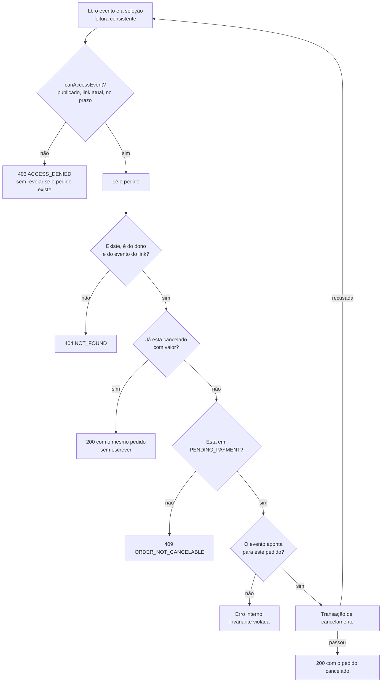
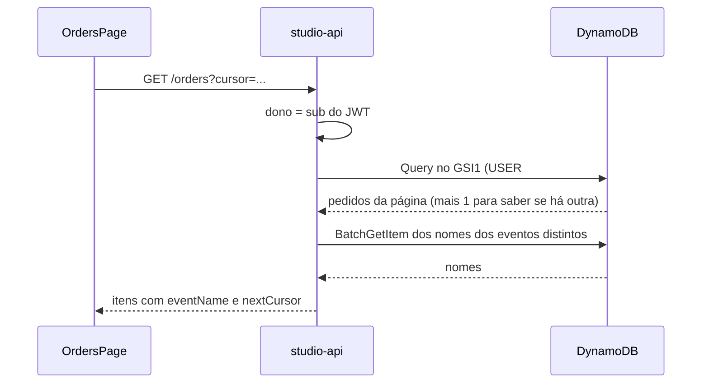

Esta página complementa [Criação de pedidos](/developers/flows/order-creation). Ela cobre as duas outras operações sobre pedidos que existem hoje: o **cancelamento**, feito pelo cliente, e a **lista**, vista pelo fotógrafo.

## Cancelar um pedido

### Objetivo

Permitir que o cliente desfaça um pedido que **ainda espera pagamento**, devolvendo a seleção ao estado editável, de modo que:

- repetir o cancelamento, mesmo ao mesmo tempo, devolva o mesmo pedido cancelado;
- um pedido que já saiu de `PENDING_PAYMENT` não seja alterado;
- o valor e os itens do pedido cancelado sejam preservados, para o fotógrafo ainda vê-lo;
- cancelar nunca libere a seleção congelada por **outro** pedido.

### A rota

**`POST /public/orders/{orderId}/cancel`**, sem corpo, com o header `x-access-token`.

A resposta é 200 com o pedido em `CANCELED`, com o valor que tinha. O formato é o mesmo `PublicOrder` de [Criação de pedidos](/developers/flows/order-creation#a-rota).

<Note>
  A API implementa o cancelamento, mas **o frontend do cliente não o chama**. Hoje não existe botão de cancelar na área pública. O fluxo é coberto por testes de integração com o DynamoDB Local.
</Note>

### Sequência de `CancelOrder.execute`



Ordem das verificações, e o motivo:

1. **O link antes do pedido.** Sem direito, a resposta é 403 e não diz se o pedido existe.
2. **Dono e evento vêm do link.** Um pedido de outro evento, ou de outro fotógrafo, responde 404, igual a um pedido inexistente.
3. **Repetir devolve o cancelado.** Se o pedido já está `CANCELED` com valor, a resposta é o próprio pedido, **sem nova escrita**. Isso vale mesmo que depois dele o cliente tenha aberto outro pedido.
4. **Só `PENDING_PAYMENT` cancela.** `CONFIRMED` (pago, ou de valor zero) não volta atrás. `ASSEMBLING` ainda precisa terminar. Um pedido descartado na montagem (`CANCELED` sem valor) também responde 409. Todos esses casos respondem 409 `ORDER_NOT_CANCELABLE`.
5. **Um pedido publicado e não pago é o ativo do evento.** Se o evento não aponta para ele, o código lança erro interno: é uma invariante, e não um caso de negócio.

A transação recusada faz o caso de uso **reler** e decidir de novo, até `MAX_CANCEL_ATTEMPTS` (3) vezes. Passando disso, 409 `CONFLICT`.

### A transação de cancelamento

`DynamoDbOrderRepository.cancel` envia duas atualizações atômicas:

| # | Item | Operação | Condição | Efeito |
| --- | --- | --- | --- | --- |
| 1 | Pedido | `Update` | O pedido existe e `status = PENDING_PAYMENT` | `status = CANCELED` e `updatedAt` |
| 2 | Evento | `Update` | O link vale para selecionar (`LINK_GRANTS_ACCESS`) **e** `activeOrderId` é **este** pedido | Remove `activeOrderId` |

Garantias:

- **Cancelar libera a seleção, e só a deste pedido.** A condição `activeOrderId = {este pedido}` impede que um cancelamento tardio solte a seleção de um pedido aberto depois.
- **Concorrência.** Se dois cancelamentos chegam juntos, só um passa a condição `PENDING_PAYMENT`. O outro é recusado, relê, encontra o pedido já cancelado e devolve o mesmo resultado. Todos respondem 200.
- **Só sai de `PENDING_PAYMENT`.** Se o pedido saiu desse estado entre a leitura e a escrita, a condição falha e nada é gravado.
- **Link vencido entre a leitura e a escrita.** A condição do evento exige o link valendo. O pedido e a seleção congelada ficam como estavam, e a chamada é negada.

O que **não** muda:

| Item | Por quê |
| --- | --- |
| `quote` e os itens do pedido | O cancelado mantém o valor e as fotos. É por isso que continua na lista do fotógrafo, com o valor que tinha. |
| As chaves do GSI1 | O pedido continua na lista. |
| `orderCount` do evento | **Não desce.** O pacote continua travado. Já existiu pedido com aqueles valores. |
| Os itens de seleção | Continuam. O cliente pode refinar a seleção que tinha e finalizar de novo, abrindo um **novo** pedido, com id e montagem novos. |

### Cancelar exige o link valendo

Como abrir um pedido, cancelar reabre a seleção, então exige o link valendo para selecionar (`canAccessEvent`): evento publicado, link atual e dentro do prazo.

A consequência é que, com o link **vencido**, o cliente ainda vê o pedido (ver não exige a janela), mas **não consegue cancelá-lo**. Como não existe pagamento, hoje um `PENDING_PAYMENT` de um link vencido permanece nesse estado. O fotógrafo não tem rota para cancelar. Esta é uma limitação atual, e não uma regra de negócio registrada.

### Erros

| Situação | Resposta |
| --- | --- |
| Link substituído, vencido, revogado ou evento fora do ar | 403 `ACCESS_DENIED` |
| Pedido inexistente, de outro evento ou de outro fotógrafo | 404 `NOT_FOUND` |
| Pedido `CONFIRMED`, `ASSEMBLING` ou descartado | 409 `ORDER_NOT_CANCELABLE` |
| Cancelamento recusado repetidamente | 409 `CONFLICT` |
| `orderId` fora do formato | 400 `VALIDATION_ERROR` |

## Lista de pedidos do fotógrafo

### Objetivo

Mostrar ao fotógrafo todos os pedidos dos seus eventos, do mais recente ao mais antigo, com o nome do evento, sem custo por pedido e sem que um fotógrafo veja o pedido de outro.

### A rota

**`GET /orders`**, no Studio (JWT), com `?cursor=` opcional. Não há filtro por evento nem por estado.

Resposta, com valores fictícios:

```json
{
  "items": [
    {
      "id": "01JEXAMPLEORDER00000000A",
      "eventId": "01JEXAMPLEEVENT0000000000A",
      "eventName": "Casamento de Ana e Bruno",
      "status": "PENDING_PAYMENT",
      "currency": "BRL",
      "quote": {
        "selectedPhotos": 32,
        "includedPhotos": 30,
        "extraPhotos": 2,
        "packageCents": 80000,
        "extraPhotoPriceCents": 2500,
        "extrasCents": 5000,
        "totalCents": 85000
      },
      "createdAt": "2026-10-09T15:00:00.000Z",
      "updatedAt": "2026-10-09T15:00:04.000Z"
    }
  ],
  "nextCursor": "eyJ..."
}
```

O DTO (`OrderDto`) não traz dono, o retrato do pacote nem a montagem.

### Quais pedidos entram

Só o pedido **publicado** tem as chaves do GSI1. Portanto a lista contém:

| Estado | Na lista |
| --- | --- |
| `ASSEMBLING` | Não. Ainda não foi publicado. |
| `PENDING_PAYMENT` | Sim |
| `CONFIRMED` | Sim |
| `CANCELED` com valor | Sim, com o valor que tinha |
| `CANCELED` sem valor (descartado) | Não. Nunca foi publicado. |

### Como a lista é lida



1. **Dono pelo token.** `ListOrders.execute` recebe o `sub` do JWT. O cursor só **posiciona** a leitura na lista dele.
2. **Query no GSI1**, com `GSI1PK = USER#{dono}` e `GSI1SK` começando por `ORDER#`, em ordem decrescente. A chave de ordenação é `ORDER#{createdAt}`, a data de criação em ISO 8601 UTC, então a ordem é cronológica. A consulta pede 21 itens: 20 da página e **1 a mais** para saber se existe outra página sem devolver um cursor para uma página vazia.
3. **Os itens são validados** com um schema. Um item sem os campos exigidos, ou cujo `ownerId` não seja o do dono da consulta, lança erro interno.
4. **Nomes em lote.** `ListOrders` junta os `eventId` distintos da página e pede os nomes numa única leitura (`getNames`, `BatchGetItem` de até 100 chaves, com repetição das chaves não processadas). **Nunca uma leitura por pedido.** A chave do evento leva o dono, então o id de um evento alheio não encontra nada.
5. **Evento inexistente.** Se o evento já não existe (foi excluído), `eventName` é `null`. A tela mostra "Evento excluído". A exclusão de um evento **não remove os pedidos dele**.

### O cursor

O cursor da lista é **só uma posição**: a data (`at`) e o id do último pedido (`after`), mais o escopo `ORDERS`. Não leva chave da tabela nem dono. Quem decodifica remonta a chave completa com o dono da identidade autenticada.

Consequências:

- Um cursor de outro tipo de lista, com formato inválido ou com chave da tabela é recusado com 400 `INVALID_CURSOR`.
- Um cursor produzido para outro fotógrafo só posiciona a leitura **dentro da lista do chamador**. Não dá acesso aos pedidos do outro.

### Consistência

O GSI1 é eventualmente consistente, e a `Query` do índice não oferece leitura consistente. Um pedido recém-publicado pode levar um instante para aparecer na lista. Os dados do pedido gravados nas escritas do próprio fluxo são fortemente consistentes; apenas a **lista** pode estar atrasada.

### Permissão

A `studio-api` recebe permissão de `dynamodb:Query` no ARN do índice `GSI1`, separada da permissão na tabela. O repositório da lista (`DynamoDbOrderListRepository`) é somente leitura. A escrita dos pedidos fica em `DynamoDbOrderRepository`, que só a `public-api` usa.

### No frontend

`OrdersPage` usa `useInfiniteQuery` (chave `['studio', 'orders', sub]`) e mostra cada pedido em `OrderRow`, somente leitura:

| Elemento | Conteúdo |
| --- | --- |
| Evento | O nome, com link para o evento, ou "Evento excluído" |
| Data | `createdAt`, no fuso do navegador |
| Fotos | `quote.selectedPhotos` |
| Total | `quote.totalCents` em reais |
| Estado | `PENDING_PAYMENT`: Aguardando pagamento. `CONFIRMED`: Confirmado. `CANCELED`: Cancelado. |

O botão **Carregar mais pedidos** pede a página seguinte com o `nextCursor`.

## Onde está no código

| Assunto | Caminho |
| --- | --- |
| Cancelamento | `services/api/src/application/orders/CancelOrder.ts` |
| Transação de cancelamento | `infra/dynamodb/DynamoDbOrderRepository.ts` (`cancel`) |
| Lista | `application/orders/ListOrders.ts`, `controllers/OrderController.ts` |
| Leitura do índice | `infra/dynamodb/DynamoDbOrderListRepository.ts`, `infra/dynamodb/cursor.ts` |
| Tipos | `domain/order/OrderList.ts` |
| DTO | `contracts/order/OrderDtoSchema.ts`, `contracts/order/toOrderDto.ts` |
| Frontend | `apps/web/src/studio/orders/` |
| Testes | `application/orders/tests/`, `handlers/api/publicOrders.dynamodb.spec.ts`, `handlers/api/studioOrders.dynamodb.spec.ts` |
