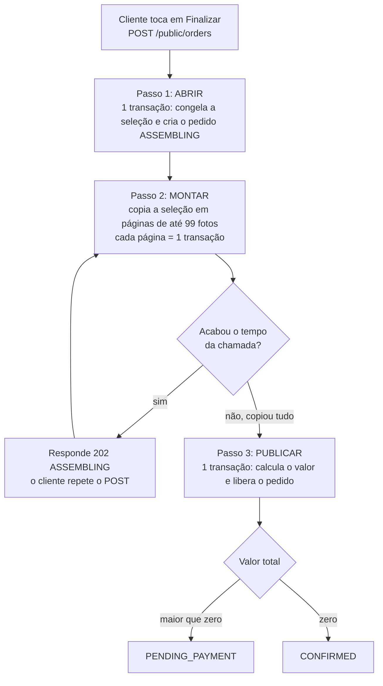
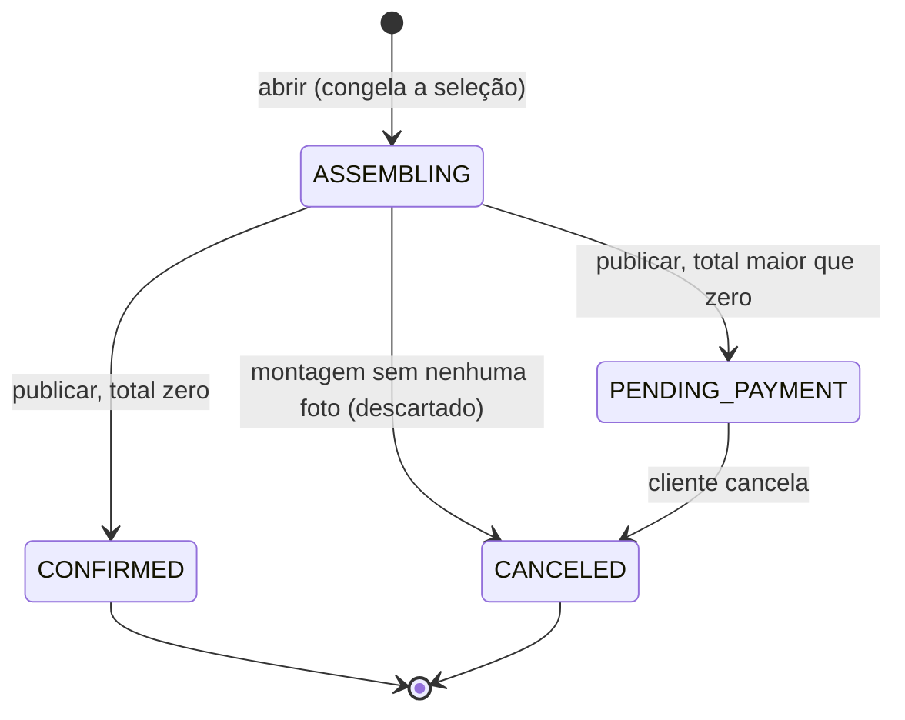
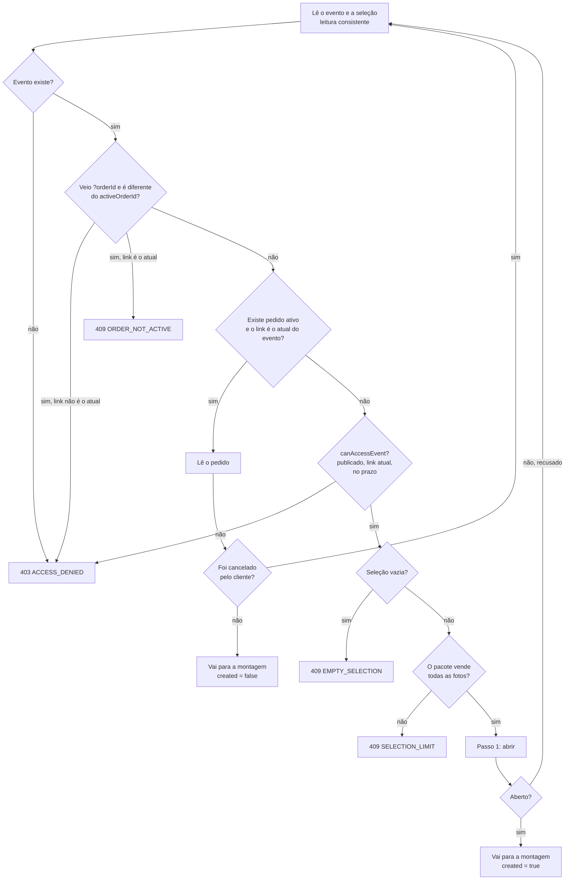
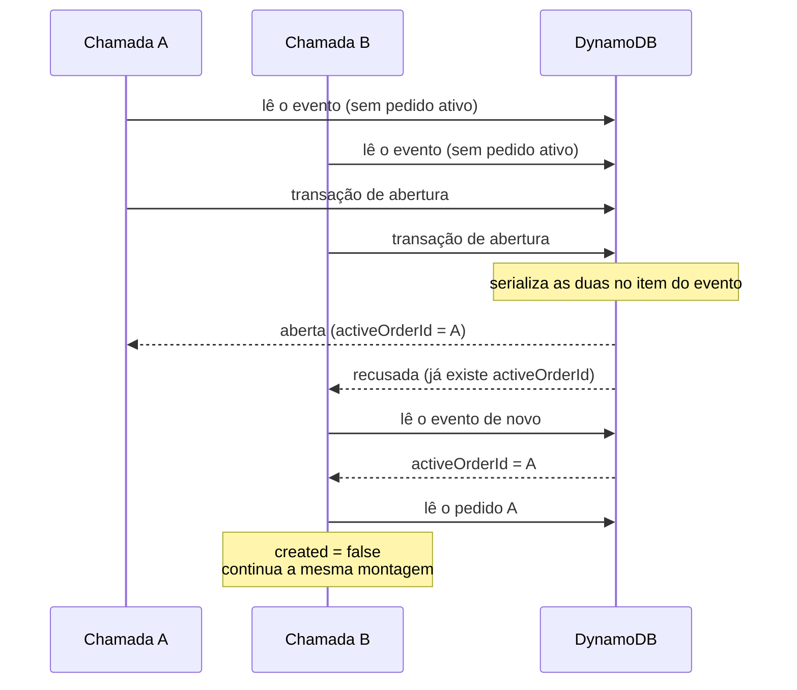
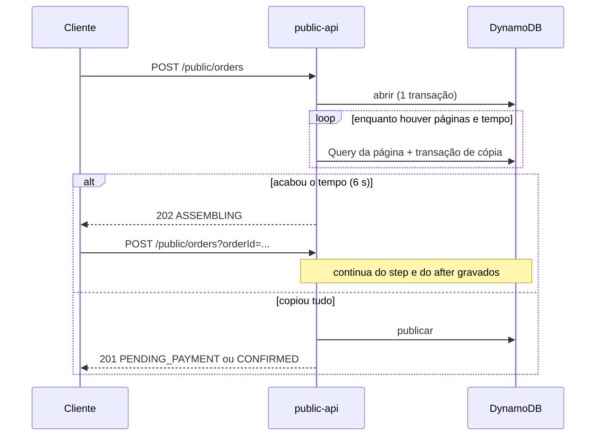

## Objetivo

Transformar a seleção de fotos do cliente num **pedido** com valor definido, de modo que:

1. o valor seja calculado **no servidor**, a partir do pacote gravado no evento. O cliente não envia total nem itens;
2. exista **no máximo um pedido ativo por evento**, mesmo com várias chamadas simultâneas;
3. a seleção **pare de mudar** assim que o pedido existe, e os itens do pedido sejam exatamente os da seleção congelada;
4. repetir a chamada, ou perdê-la no meio, **nunca duplique nem corrompa** o pedido;
5. uma seleção grande, que não cabe numa transação do DynamoDB, seja copiada de forma **retomável**.

Muita coisa acontece ao mesmo tempo: o cliente pode tocar em **Finalizar** duas vezes, em dois aparelhos, o fotógrafo pode excluir fotos durante a cópia e a função tem 10 segundos. Esta página descreve o fluxo e as proteções, na ordem em que o código as aplica.

Pré-requisitos: [Seleção de fotos](/developers/flows/photo-selection) e [Acesso do cliente](/developers/flows/public-access). O cancelamento e a lista do fotógrafo estão em [Cancelamento e lista de pedidos](/developers/flows/order-cancellation-and-listing).

<Note>
  **Atualmente não existe pagamento.** Um pedido com valor a pagar termina em `PENDING_PAYMENT` e não sai desse estado, a não ser por cancelamento do cliente. Não há gateway, webhook, reconciliação nem entrega dos originais no código. Só o pedido de valor zero é confirmado (`CONFIRMED`).
</Note>

## Visão em uma página



Os três passos existem porque **a seleção não cabe numa transação**. O DynamoDB limita uma transação a 100 itens. Sem fotos adicionais à venda, o teto da seleção é o número de fotos incluídas no pacote, que pode chegar a 10.000. Com adicionais, não há teto. Por isso o fluxo separa:

| Passo | O que garante | Quantas escritas |
| --- | --- | --- |
| **Abrir** | Um único pedido por evento, e a seleção congelada. | 1 transação |
| **Montar** | A cópia completa e retomável da seleção para itens do pedido. | 1 transação por página, quantas forem necessárias |
| **Publicar** | O valor só existe sobre uma cópia completa e atual. | 1 transação |

## Vocabulário

| Termo | Significado |
| --- | --- |
| **Seleção** | Os itens `SEL#` das galerias do evento, mais `selectionCount` e `selectionRevision` no evento. |
| **Congelar** | Gravar `activeOrderId` no evento. Com esse atributo, toda escrita de seleção do cliente é recusada. |
| **Revisão** | `selectionRevision`: número que só cresce a cada mudança da seleção. |
| **Montagem** (`assembly`) | A cópia da seleção para itens do pedido. Tem id próprio e guarda onde parou. |
| **Passo** (`step`) | Contador da montagem. Sobe a cada página copiada e serve para que só uma chamada grave cada página. |
| **Publicar** | Tirar o pedido de `ASSEMBLING` com o valor calculado. |
| **Pacote do pedido** | Cópia do pacote do evento no instante em que a seleção foi congelada. O valor sai dela. |

## Estados do pedido



| Estado | Significado | Seleção | Aparece na lista do fotógrafo |
| --- | --- | --- | --- |
| `ASSEMBLING` | A seleção está sendo copiada. Sem valor. | Congelada | Não |
| `PENDING_PAYMENT` | Montado, com valor a pagar. | Congelada | Sim |
| `CONFIRMED` | Montado, com valor zero. Não passa por pagamento. | Congelada | Sim |
| `CANCELED` com valor | O cliente cancelou o pedido que esperava pagamento. | Liberada | Sim, com o valor que tinha |
| `CANCELED` sem valor | Descartado: a montagem terminou sem nenhuma foto. | Liberada | Não (nunca foi publicado) |

Os dois `CANCELED` se distinguem pela presença de `quote` e `assembly`: `isCanceled` só aceita o cancelado depois de publicado.

## A rota

**`POST /public/orders`**, sem corpo, com o header `x-access-token`. Query opcional: `?orderId=`.

O corpo é vazio **de propósito**. O pedido é a seleção do evento, e o valor é calculado no servidor. Qualquer total ou lista de itens que um cliente mal-intencionado enviasse seria ignorado.

| Resposta | Quando |
| --- | --- |
| **201** com o pedido | Esta chamada abriu o pedido e ele já saiu da montagem. |
| **200** com o pedido | O pedido já existia (aberto por outra chamada) e está montado. |
| **202** com o pedido em `ASSEMBLING` | A cópia não terminou no tempo da chamada. **Repetir o POST continua de onde parou.** |

O corpo da resposta (`PublicOrder`) tem `id`, `status`, `currency` (sempre `BRL`), `createdAt` e `quote`. `quote` é `null` em `ASSEMBLING`. O DTO não traz dono, evento, pacote nem itens.

```json
{
  "id": "01JEXAMPLEORDER00000000A",
  "status": "PENDING_PAYMENT",
  "currency": "BRL",
  "createdAt": "2026-10-09T15:00:00.000Z",
  "quote": {
    "selectedPhotos": 32,
    "includedPhotos": 30,
    "extraPhotos": 2,
    "packageCents": 80000,
    "extraPhotoPriceCents": 2500,
    "extrasCents": 5000,
    "totalCents": 85000
  }
}
```

Os valores são fictícios.

### `?orderId=`: continuar ou devolver, nunca trocar

A tela que **já conhece** um pedido o pede pelo id. Com `?orderId=`, a chamada só continua ou devolve **aquele** pedido. Se ele já não é o pedido ativo do evento, a resposta é 409 `ORDER_NOT_ACTIVE` e **nenhum outro pedido é aberto**.

O motivo: se o pedido foi cancelado em outra aba, a seleção atual pode ser outra, e o cliente não a revisou. Abrir um pedido novo sobre ela cobraria algo que o cliente não viu.

## Decisão inicial de `CreateOrder.execute`

O caso de uso começa lendo o evento e escolhe um de vários caminhos. Cada leitura do evento traz juntos o pacote, o contador, a revisão e o `activeOrderId`.



Pontos que explicam o desenho:

- **Um pedido já aberto é do evento, não da janela de seleção.** O ramo "existe pedido ativo" exige apenas que o link seja **o atual do evento** (`ownsAccessToken`). Ele não exige prazo nem publicação. Então o cliente continua vendo e retomando o próprio pedido mesmo depois de a janela de seleção fechar. Só **abrir** um pedido novo exige o link valendo para selecionar.
- **Um link substituído não alcança o pedido.** `ownsAccessToken` compara o hash do token apresentado com o do link atual. Quem tem o link antigo recebe 403 e não descobre se há pedido.
- **A releitura é a resposta a toda disputa.** Sempre que uma escrita é recusada ou o pedido lido já foi cancelado, o caso de uso volta ao topo e **lê de novo**. Ele faz no máximo `MAX_OPEN_ATTEMPTS` (3) leituras; depois responde 409 `CONFLICT`.
- **O pacote pode ter mudado depois da seleção.** Antes de abrir, `quote(selection.count, package)` é calculado só para validar. Sem adicionais à venda, uma seleção acima das fotos incluídas não tem preço e vira 409 `SELECTION_LIMIT` (`ExtraPhotosNotForSaleError`).

## Passo 1: abrir o pedido

`DynamoDbOrderRepository.open` executa **uma transação** com dois itens:

| # | Item | Operação | Condições | Efeito |
| --- | --- | --- | --- | --- |
| 1 | Evento | `Update` | Todas as quatro abaixo | `activeOrderId = {orderId}` e `orderCount` +1 |
| 2 | Pedido (`ORDER#{id}` / `META`) | `Put` | O item não existe | Cria o pedido `ASSEMBLING`, com o retrato do pacote |

Condições do item 1, na mesma expressão:

| Condição | O que protege |
| --- | --- |
| O link vale para selecionar (`LINK_GRANTS_ACCESS`) | Não se abre pedido com link vencido, substituído ou evento despublicado. |
| Não existe `activeOrderId` | **Um único pedido ativo por evento.** Duas chamadas simultâneas disputam esta condição. |
| `selectionRevision` é a lida | O pedido congela **exatamente** a seleção que foi lida e validada. Se uma foto entrou ou saiu depois da leitura, a revisão mudou e a abertura é recusada. |
| O pacote gravado é igual ao lido | O valor é calculado sobre o pacote que foi lido. Cada campo (`priceCents`, `includedPhotos`, `extraPhotoPriceCents`, `billing`) é comparado, inclusive o caso `null`. |

O item 1 faz **duas coisas ao mesmo tempo**:

- `activeOrderId` **congela a seleção**. As escritas de seleção exigem que o atributo não exista.
- `orderCount` +1 **trava o pacote**. A alteração do pacote exige `orderCount = 0`.

Resultados:

| Resultado | Quando | O que o caso de uso faz |
| --- | --- | --- |
| `OPENED` | A transação passou | Segue para a montagem |
| `REJECTED` | Alguma condição do evento falhou | Lê o evento de novo e decide (pode encontrar o pedido que outra chamada abriu) |
| Erro `Order id already exists` | O `Put` do pedido falhou | Lança erro interno. Não é um caminho esperado: o id é um ULID gerado na própria chamada. |

### Duas chamadas simultâneas



Quem perde não abre outro pedido: relê, encontra o do vencedor e **trabalha na mesma montagem**.

## Passo 2: montar o pedido

A montagem copia a seleção do evento para **itens do pedido** (`ORDER#{id}` / `ITEM#{assemblyId}#{photoId}`). A cópia é feita galeria por galeria, em páginas.

### Estado da montagem

Fica no próprio registro do pedido, em `assembly`:

| Campo | Significado |
| --- | --- |
| `id` | Identifica esta montagem. Uma montagem nova tem id novo. |
| `selectionRevision` | Revisão da seleção em que a montagem se baseia. |
| `galleryIds` | As galerias **ativas** no início, na ordem da cópia. Galerias em exclusão ficam de fora. |
| `galleryIndex` | Em qual galeria a cópia está. Igual ao número de galerias quando terminou. |
| `after` | A última foto copiada na galeria atual, ou `null` no começo dela. |
| `copied` | Quantos itens já foram copiados. O valor do pedido sai deste número. |
| `step` | Sobe a cada página gravada. |

`assemblyFinished` é `galleryIndex >= galleryIds.length`.

### Começar uma montagem

`startAssembly` grava `assembly` no pedido com `galleryIndex = 0`, `after = null`, `copied = 0`, `step = 0`. A escrita é condicionada a:

- o pedido existir e estar `ASSEMBLING`;
- não haver montagem (primeira vez) **ou** a montagem atual ser a que está sendo substituída (`assembly.id = :replacing`).

Se a condição falhar, outra chamada começou antes. `startAssembly` devolve `null` e o caso de uso **relê o pedido**.

### Copiar uma página

`copyNextPage` faz:

1. `Query` dos itens de seleção da galeria atual (`GALLERY#{galleryId}`, prefixo `SEL#`), com **leitura consistente** e `Limit = 99`, começando depois de `after`.
2. Descarta itens cujo `ownerId` ou `eventId` não sejam os do pedido.
3. Calcula o novo estado: se a leitura devolveu `LastEvaluatedKey`, `after` avança; senão, `galleryIndex` avança e `after` volta a `null`. `copied` soma as fotos copiadas e `step` soma 1.
4. Envia **uma transação** que grava, juntos, o ponto de parada e os itens:

| Item da transação | Operação | Condição |
| --- | --- | --- |
| Registro do pedido | `Update` de `assembly.galleryIndex`, `after`, `copied`, `step` | O pedido existe, está `ASSEMBLING`, a montagem é **esta** (`assembly.id`) e `assembly.step` é o **passo que esta chamada leu** |
| Até 99 itens | `Put` de `ORDER#{id}` / `ITEM#{assemblyId}#{photoId}` | nenhuma |

O limite de 99 existe para somar 100 com o registro do pedido, o teto de uma transação.

**Por que ponto de parada e itens vão juntos.** Eles mudam atomicamente. Se a Lambda morrer no meio, ou os itens e o avanço foram gravados, ou nenhum dos dois. Não há "itens copiados mas contados de menos", nem "contados mas sem item".

**Por que a condição no `step`.** Só quem leu o passo anterior grava o próximo. Assim cada página é contada uma vez, mesmo com duas chamadas copiando ao mesmo tempo. A que chega atrasada recebe `null` (condição falhou) e **relê o pedido**, seguindo do ponto que a outra deixou.

**Uma galeria vazia** também consome uma chamada: a página não tem itens, mas o `Update` avança `galleryIndex`.

### O orçamento de tempo

A `public-api` tem timeout de 10 segundos. O tempo da chamada para copiar é limitado por `ASSEMBLY_BUDGET_MS` (6 segundos), contados do início da chamada. O resto fica para as leituras, a página em andamento e a publicação. O limite é conferido antes de cada página.



### Montagens substituídas e itens órfãos

Os itens de cada montagem ficam separados pelo `assemblyId`, e **nunca são apagados**. Uma chamada atrasada que ainda grava na montagem antiga não toca nos itens da montagem publicada. Os itens da montagem publicada são os itens do pedido.

Itens de montagens substituídas (veja [revisão que mudou](#o-fotógrafo-exclui-fotos-selecionadas-durante-a-montagem)) permanecem na partição do pedido. Não há limpeza. Eles não afetam o pedido: os itens do pedido são, por definição, os da montagem referenciada em `assembly`. Hoje nenhum código lê os itens de um pedido.

## Passo 3: publicar

Com a cópia completa, o caso de uso:

1. Se `copied = 0`, **descarta** o pedido (veja adiante).
2. Calcula o valor: `quote(assembly.copied, pacoteDoPedido)`. O pacote é o **retrato** gravado ao abrir, não o do evento.
3. Define o estado: `CONFIRMED` se `totalCents = 0`, senão `PENDING_PAYMENT` (`statusAfterAssembly`).
4. Chama `publish`.

### A transação de publicação

| # | Item | Operação | Condição | Efeito |
| --- | --- | --- | --- | --- |
| 1 | Pedido | `Update` | O pedido existe, está `ASSEMBLING`, a montagem é **esta** e terminou **no passo lido** | `status`, `quote` e as chaves do GSI1 (entra na lista do fotógrafo) |
| 2 | Evento | `ConditionCheck` | `selectionRevision` é a da montagem **e** `activeOrderId` é este pedido | nenhum |

A condição do item 2 é o que impede publicar um valor sobre uma cópia desatualizada. Se a revisão do evento mudou depois da cópia, a seleção que foi copiada já não é a atual.

Resultados (`PublishOutcome`):

| Resultado | Causa | O que o caso de uso faz |
| --- | --- | --- |
| `PUBLISHED` | Passou | Devolve o pedido montado |
| `ORDER_CHANGED` | A condição do pedido falhou: outra chamada publicou, trocou ou avançou a montagem | Relê o pedido e segue |
| `SELECTION_CHANGED` | A revisão do evento mudou, ou o evento não aponta mais para o pedido | Recomeça a montagem (veja abaixo) |

### O fotógrafo exclui fotos selecionadas durante a montagem

Enquanto a seleção está congelada, ela **só pode perder fotos**. O fotógrafo não é barrado pelo congelamento: excluir uma foto selecionada remove o item da seleção e sobe `selectionRevision` na mesma transação (veja [Seleção de fotos](/developers/flows/photo-selection#quando-o-fotógrafo-exclui-fotos-selecionadas)).

A montagem trata isso em dois pontos:

- **No início da chamada.** A revisão de uma montagem nova é a lida antes de qualquer leitura da seleção feita pela chamada. Se o pedido já tem montagem com revisão **menor** que a atual, ela é substituída por uma nova, com itens novos. Se tiver revisão **maior** (outra chamada começou depois da leitura desta), esta chamada relê a revisão.
- **Na publicação.** `SELECTION_CHANGED` indica que a revisão mudou depois da cópia. A chamada relê a revisão, começa **outra montagem**, com id novo, e copia de novo do zero.

O limite é `MAX_ASSEMBLY_RESTARTS` (3) recomeços numa chamada. Passando disso, 409 `CONFLICT`, e o cliente repete.

Perder uma página para outra chamada **não conta** como recomeço: a outra chamada avançou a mesma montagem.

### Montagem sem nenhuma foto

Se o fotógrafo excluir **todas** as fotos selecionadas, a cópia termina com `copied = 0`. Um pedido sem fotos não faz sentido, então `discardEmpty` executa uma transação:

| # | Item | Efeito |
| --- | --- | --- |
| 1 | Pedido | `status = CANCELED`, sem `quote` (condição: a montagem ainda é esta e está no passo lido) |
| 2 | Evento | Remove `activeOrderId` (condição: aponta para este pedido) |

A seleção volta a aceitar escritas. `orderCount` **não desce**. A resposta ao cliente é 409 `EMPTY_SELECTION`. O pedido descartado nunca entra na lista do fotógrafo.

## O cálculo do valor

`quote(selectedPhotos, pacote)` é uma função pura em `domain/order/Quote.ts`, e usa `Money`, que só aceita centavos inteiros seguros.

| Termo | Cálculo |
| --- | --- |
| `extraPhotos` | `max(0, selectedPhotos − includedPhotos)` |
| `includedPhotos` (na `quote`) | `selectedPhotos − extraPhotos`: as fotos efetivamente cobertas pelo pacote |
| `packageCents` | `priceCents` se `billing = PLATFORM`; **zero** se `OUTSIDE` |
| `extrasCents` | `extraPhotoPriceCents × extraPhotos` |
| `totalCents` | `packageCents + extrasCents` |

Se há fotos adicionais e `extraPhotoPriceCents` é `null`, a função lança `ExtraPhotosNotForSaleError`.

Exemplos, todos fictícios, com `includedPhotos = 30` e `extraPhotoPriceCents = 2500`:

| `billing` | `priceCents` | Fotos | `packageCents` | `extrasCents` | `totalCents` | Estado |
| --- | --- | --- | --- | --- | --- | --- |
| `PLATFORM` | 80000 | 20 | 80000 | 0 | 80000 | `PENDING_PAYMENT` |
| `PLATFORM` | 80000 | 32 | 80000 | 5000 | 85000 | `PENDING_PAYMENT` |
| `OUTSIDE` | 80000 | 20 | 0 | 0 | 0 | `CONFIRMED` |
| `OUTSIDE` | 80000 | 32 | 0 | 5000 | 5000 | `PENDING_PAYMENT` |

O número de fotos do cálculo é `assembly.copied`, **o que foi de fato copiado**, e não o contador do evento. Uma foto excluída antes da publicação não é cobrada.

O frontend calcula a mesma conta (`selectionPrice`) só para mostrar uma **prévia**. O teste `tests/selection-price-parity.test.ts` falha se as duas divergirem. O valor do pedido é sempre o do servidor.

## Cenários e proteções

| Cenário | O que acontece | Mecanismo |
| --- | --- | --- |
| O cliente toca em Finalizar duas vezes, ou em dois aparelhos | Um único pedido. Uma das chamadas abre; a outra relê e continua a mesma montagem. | Condição de que não exista `activeOrderId` |
| A chamada repete depois de o pedido sair da montagem | Devolve o mesmo pedido, com 200. | Ramo "existe pedido ativo" |
| A Lambda expira no meio da cópia | O pedido fica `ASSEMBLING`. A próxima chamada continua do `step` e do `after` gravados. | Estado da montagem gravado junto com os itens |
| Cliente fecha a aba durante a montagem | O pedido segue `ASSEMBLING` e a seleção congelada, até alguém repetir o `POST` com o link do evento. | Nada o finaliza sozinho; veja os limites |
| Duas chamadas copiam a mesma montagem | Cada página é contada uma vez. A que perde relê. | Condição `assembly.step` |
| Uma chamada atrasada tenta gravar depois de a montagem ser publicada, trocada ou de o pedido ser cancelado | Não grava nada. | Condição de `ASSEMBLING` e de `assembly.id` |
| O fotógrafo exclui fotos selecionadas durante a cópia | Nova montagem sobre a revisão nova; o valor só cobre as fotos que sobraram. | `selectionRevision` e `SELECTION_CHANGED` |
| O fotógrafo exclui todas as fotos selecionadas | Pedido descartado, seleção liberada, 409 `EMPTY_SELECTION`. | `discardEmpty` |
| O fotógrafo tenta mudar o pacote durante a abertura | Uma das duas vence; nunca há pedido sobre pacote trocado. | Condições mútuas em `orderCount` e no pacote |
| O pacote mudou entre a seleção e a abertura, e deixou de vender adicionais | 409 `SELECTION_LIMIT`; nenhum pedido é aberto. | `quote` antes de abrir |
| O link é substituído com o pedido em andamento | O link antigo recebe 403. O link novo, do mesmo evento, continua e vê o pedido. | `ownsAccessToken`; o pedido é do evento, não do link |
| O link vence com o pedido aberto | O cliente ainda vê e retoma o pedido com o link atual. Não consegue abrir outro. | O ramo do pedido ativo não exige a janela |
| A tela mostra um pedido que foi cancelado em outra aba | 409 `ORDER_NOT_ACTIVE`. Nenhum pedido novo é aberto. | `?orderId=` |
| O pedido foi publicado por uma chamada e cancelado pelo cliente logo depois | 409 `CONFLICT`. Repetir abre outro pedido sobre a seleção liberada. | `settled` |
| A seleção muda sem parar durante a abertura ou a montagem | Depois de 3 leituras ou 3 recomeços, 409 `CONFLICT`. | `MAX_OPEN_ATTEMPTS` e `MAX_ASSEMBLY_RESTARTS` |

## O frontend

`OrderReview` mostra o botão do contador:

| Situação | Botão | Ação |
| --- | --- | --- |
| Sem pedido | **Revisar pedido** | Abre o diálogo com o valor da seleção (prévia) e o botão **Finalizar pedido** |
| Com pedido (`orderId` na seleção) | **Ver pedido** | Chama `POST /public/orders?orderId=...` para mostrar o pedido congelado |

**Revisar pedido** e **Finalizar pedido** ficam desabilitados com a seleção vazia, com a seleção acima do que o pacote vende, ou enquanto algum toque ainda não chegou à API (o pedido fecharia outra seleção que a da tela).

`useFinishOrder` conduz as chamadas:

1. Chama `POST /public/orders`. Se a resposta é `ASSEMBLING` (202), **repete** até o pedido sair da montagem, até 20 chamadas. Depois disso lança `OrderStillAssemblingError`.
2. Depois de receber o id em `ASSEMBLING`, **toda** chamada seguinte vai com `?orderId=`. Isso vale para as repetições da montagem, para as de falha transitória e para um novo "Finalizar" após falha. Sem o id, um pedido cancelado no meio viraria outro.
3. Falhas transitórias (rede, 5xx e `CONFLICT`) são repetidas até 3 vezes, com espera de 1, 2 e 4 segundos, **apenas se o id do pedido já é conhecido**. Sem ele, o pedido pode ter sido aberto antes de a resposta se perder e cancelado logo depois. Nesse caso a tentativa termina, a seleção é lida de novo, e só um novo "Finalizar" do cliente chama a API outra vez.
4. No fim, com sucesso ou não, a seleção é lida de novo.

As mensagens ao cliente cobrem seleção vazia, seleção acima do pacote, pedido ainda em preparação e pedido cancelado.

## Respostas de erro

| Situação | Status e `code` |
| --- | --- |
| Link substituído, vencido, revogado ou evento fora do ar (ao abrir) | 403 `ACCESS_DENIED` |
| Seleção vazia, ou montagem que terminou sem fotos | 409 `EMPTY_SELECTION` |
| Seleção acima do que o pacote vende | 409 `SELECTION_LIMIT` |
| `?orderId=` de um pedido que já não é o ativo | 409 `ORDER_NOT_ACTIVE` |
| Seleção ou montagem mudando sem parar | 409 `CONFLICT` |
| `orderId` fora do formato | 400 `VALIDATION_ERROR` |
| Falha inesperada | 500 `INTERNAL_ERROR` |

## Dados

Os identificadores são fictícios.

| Item | `PK` | `SK` | Conteúdo |
| --- | --- | --- | --- |
| Pedido | `ORDER#{orderId}` | `META` | `id`, `ownerId`, `eventId`, `status`, `currency`, `package` (retrato), `quote`, `assembly`, `createdAt`, `updatedAt` e, depois de publicado, `GSI1PK` e `GSI1SK` |
| Item do pedido | `ORDER#{orderId}` | `ITEM#{assemblyId}#{photoId}` | `orderId`, `assemblyId`, `ownerId`, `eventId`, `galleryId`, `photoId` |
| Evento | `USER#{sub}` | `EVENT#{eventId}` | `activeOrderId`, `orderCount`, `selectionCount`, `selectionRevision`, `package` |

O pedido tem partição própria, `ORDER#{orderId}`, que **não leva o dono**. O registro guarda `ownerId` e `eventId`, e **quem lê confere os dois**. `CancelOrder` faz essa conferência e responde 404 para um pedido de outro evento, igual ao de um pedido inexistente. `CreateOrder` obtém o id do próprio evento; se o pedido lido não bater com o dono e o evento, trata como violação de invariante (erro interno).

Na publicação, o pedido ganha `GSI1PK = USER#{ownerId}` e `GSI1SK = ORDER#{createdAt}`, que o colocam na lista do fotógrafo.

## Limites e pontos de atenção

Os itens abaixo seguem a classificação de [Limitações e pontos futuros](/developers/limitations).

**Limitação atual: não existe pagamento.** `PENDING_PAYMENT` só sai desse estado por cancelamento do cliente. O fotógrafo não tem rota para cancelar.

**Limitação atual: sem finalização automática.** Um pedido `ASSEMBLING` só avança quando alguém repete `POST /public/orders` com o link do evento. Nenhum reconciliador o finaliza. A seleção permanece congelada até lá. O pedido não aparece na lista do fotógrafo.

**Ponto de atenção: fotos excluídas depois da publicação.** A exclusão de uma foto selecionada continua permitida depois que o pedido está publicado. O pedido guarda seus itens e o valor calculados na publicação. Nenhum código os recalcula ou os revisa quando uma foto é excluída. Como não existem pagamento nem entrega, isso ainda não tem efeito visível. Merece verificação antes de implementar o pagamento. Não foi reproduzido.

**Ponto de atenção: itens de montagens substituídas.** Ficam sem limpeza na partição do pedido. É consequência deliberada de nunca apagar itens de montagem, que é o que protege o pedido publicado de chamadas atrasadas.

**Trade-off aceito: o pedido é do evento.** Mudar o link não cancela o pedido. Quem tem o link atual o vê.

## Onde está no código

| Assunto | Caminho |
| --- | --- |
| Rota e erros | `services/api/src/handlers/api/publicApi.ts` |
| Caso de uso | `application/orders/CreateOrder.ts` |
| Estados, tipos e contrato do repositório | `domain/order/Order.ts` |
| Valor | `domain/order/Quote.ts`, `domain/money/Money.ts` |
| Persistência | `infra/dynamodb/DynamoDbOrderRepository.ts` |
| Condições compartilhadas | `infra/dynamodb/eventConditions.ts` |
| Chaves | `infra/dynamodb/keys.ts` (`orderKey`, `orderItemKey`, `photographerOrdersGsi1`) |
| DTO | `contracts/order/PublicOrderSchema.ts`, `contracts/order/toPublicOrderDto.ts` |
| Frontend | `apps/web/src/public/` (`OrderReview`, `usePublicOrder`, `selectionPrice`) |
| Testes de concorrência | `handlers/api/publicOrders.dynamodb.spec.ts` (DynamoDB Local) |

Os caminhos de `services/api` são relativos a `src`.
