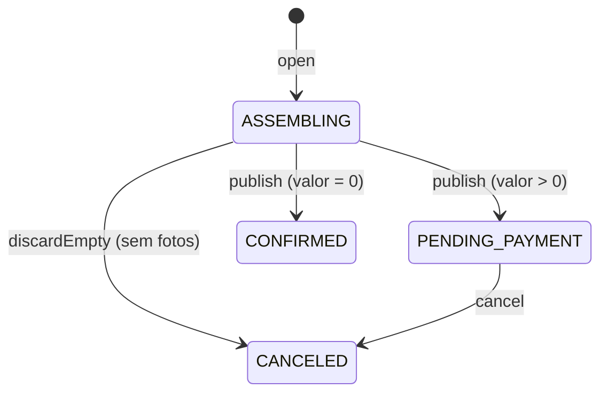

O pedido fecha a seleção do cliente. O valor sai do pacote gravado no evento e do número de fotos selecionadas, nunca de algo enviado pelo cliente. A seleção não cabe numa transação (sem adicionais à venda não há teto), então o pedido nasce em dois passos: uma transação **congela** a seleção, e uma **montagem** copia os itens aos poucos.

Este fluxo não inclui pagamento. O pedido para em `PENDING_PAYMENT`, e nenhum código o leva adiante. Veja [Limitações](/developers/limitations).

A seleção está em [Seleção de fotos](/developers/flows/photo-selection), e o pacote em [Pacote, publicação e link do cliente](/developers/flows/event-publishing-and-access-link).

## Estados

| Estado | Significado |
| --- | --- |
| `ASSEMBLING` | O pedido congelou a seleção e está copiando os itens. Não tem valor. |
| `PENDING_PAYMENT` | Montado, com valor a pagar. |
| `CONFIRMED` | Montado com valor zero. Nasce confirmado, sem passar por gateway. |
| `CANCELED` | O cliente cancelou o pedido que esperava pagamento, ou a montagem terminou sem nenhuma foto. |

Há dois `CANCELED` diferentes. O cancelado pelo cliente foi publicado antes e guarda o valor que tinha, e continua na lista do fotógrafo. O descartado na montagem nunca foi publicado, não tem valor e não entra na lista.

## Cotação

`quote` calcula o valor em centavos, só a partir do pacote do pedido e da quantidade de fotos:

| Campo | Cálculo |
| --- | --- |
| `extraPhotos` | `max(0, selectedPhotos - includedPhotos)` |
| `includedPhotos` | `selectedPhotos - extraPhotos` |
| `packageCents` | Preço do pacote se `billing = PLATFORM`; zero se `OUTSIDE`. |
| `extrasCents` | `extraPhotos * extraPhotoPriceCents` |
| `totalCents` | `packageCents + extrasCents` |

Com `OUTSIDE`, o fotógrafo já recebeu o pacote por fora e só as fotos adicionais são cobradas. Se há fotos além das incluídas e o pacote não vende adicionais, a cotação lança `ExtraPhotosNotForSaleError`. Isso pode acontecer se o pacote mudou depois da seleção, e a resposta é 409 `SELECTION_LIMIT`. Os valores usam `Money`, que só aceita inteiros em centavos.

## Criar o pedido

**Rota:** `POST /public/orders`, sem corpo, com `orderId` opcional na query. Qualquer total ou lista de itens que o cliente enviar é ignorado.

### Passo 1: abrir

`CreateOrder.execute` lê o evento com o retrato da seleção e decide:

| Situação | Resultado |
| --- | --- |
| `orderId` pedido, mas o pedido ativo do evento é outro | `OrderNotActiveError`, 409 `ORDER_NOT_ACTIVE`. Se o link nem é o atual, 403. |
| O evento já tem pedido ativo e o link é o atual | Continua a montagem desse pedido. `created` é falso. |
| Sem pedido ativo e o link não permite selecionar | `EventAccessDeniedError`, 403. |
| Seleção vazia | `EmptySelectionError`, 409 `EMPTY_SELECTION`. |
| Seleção acima das incluídas sem adicionais à venda | `ExtraPhotosNotForSaleError`, 409 `SELECTION_LIMIT`. |
| Caso contrário | `open` abre o pedido. |

Um pedido já aberto pertence ao link, não à janela de seleção: um link vencido ou revogado continua dando acesso às compras. Para continuar um pedido basta o link ser o atual do evento. Para abrir um novo, o link precisa valer para selecionar.

`DynamoDbOrderRepository.open` executa uma transação de duas operações:

| Operação | Condição | Efeito |
| --- | --- | --- |
| `Update` do evento | link dá acesso, sem pedido ativo, `selectionRevision` igual à lida e pacote igual ao lido | `SET activeOrderId` e `ADD orderCount 1` |
| `Put` do pedido (`ORDER#{id}` / `META`) | não existir | Cria o pedido em `ASSEMBLING`, com o retrato do pacote. |

Essa transação faz três coisas:

- **Congela a seleção.** Com `activeOrderId` definido, as escritas de seleção e de desmarcação são recusadas (`SELECTION_LOCKED`).
- **Garante um pedido por evento.** Dois `POST` ao mesmo tempo disputam a mesma condição `attribute_not_exists(activeOrderId)`, e só um vence.
- **Trava o pacote.** `orderCount` passa a ser maior que zero, e `PUT .../package` responde 409 `EVENT_PACKAGE_LOCKED`.

O pedido guarda um **retrato do pacote** do instante do congelamento, e a escrita confere que o pacote do evento ainda é o lido. O valor sai dele.

Se a transação for recusada (link, seleção ou pacote mudaram, ou outro pedido foi aberto), o caso de uso lê o evento de novo e decide, até `MAX_OPEN_ATTEMPTS` (3) vezes. Depois disso, a resposta é `WriteConflictError`: 409 `CONFLICT`.

### Passo 2: montar

A montagem copia a seleção para itens que pertencem só ao pedido (`ITEM#{assemblyId}#{photoId}`), galeria por galeria, guardando no pedido onde parou.

1. **Começar.** `startAssembly` grava no pedido uma `assembly` com id novo, a revisão da seleção lida e a lista de galerias **ativas** na ordem da cópia. Uma galeria em exclusão fica de fora, porque está perdendo suas fotos. A escrita só vale se o pedido está `ASSEMBLING` e sem montagem (ou com a montagem que está sendo substituída).
2. **Copiar páginas.** `copyNextPage` lê a próxima página da seleção da galeria atual, com leitura consistente e até 99 itens, e grava numa única transação: o `Update` do pedido (`galleryIndex`, `after`, `copied`, `step`) e um `Put` por foto. 99 é o limite de 100 itens da transação, descontado o `Update`. Cada item da seleção é conferido contra `ownerId` e `eventId` do pedido.
3. **Publicar.** Com todas as galerias copiadas, `publish` calcula a cotação sobre `assembly.copied` e grava, numa transação, o status, a `quote` e a posição no GSI1 do fotógrafo.

### Chamadas concorrentes e retomada

A API tem 10 segundos por chamada. `ASSEMBLY_BUDGET_MS` reserva 6 segundos para copiar. Se o tempo acaba, a chamada devolve o pedido em `ASSEMBLING`, e a resposta é **202**. Repetir o `POST` continua de onde parou.

Várias chamadas podem montar o mesmo pedido sem se atrapalhar, por causa de duas condições:

- A página só é gravada se `assembly.id` é o da montagem lida, o status é `ASSEMBLING` e `assembly.step` é o passo lido. Cada página soma uma vez, e uma chamada atrasada não grava nada.
- Os itens de uma montagem nunca são apagados, e os de cada montagem ficam separados. Uma montagem atrasada não toca nos da publicada.

Uma chamada que perde a disputa recarrega o pedido e segue do ponto que a outra deixou.

### Quando a seleção muda no meio

Enquanto o pedido está `ASSEMBLING`, a seleção está congelada, mas o fotógrafo ainda pode excluir fotos selecionadas. A exclusão apaga o item da seleção e sobe `selectionRevision`. Por isso:

- A montagem vale para a revisão lida antes da primeira cópia.
- `publish` inclui um `ConditionCheck` no evento: `selectionRevision` igual à da montagem e `activeOrderId` igual ao pedido. Se a revisão mudou, a publicação responde `SELECTION_CHANGED` e a próxima volta começa **outra montagem**, com itens novos, sobre a revisão nova, até `MAX_ASSEMBLY_RESTARTS` (3). Depois disso, 409 `CONFLICT`.
- Perder uma página para outra chamada não conta como recomeço: a outra avançou a mesma montagem.

A seleção congelada só pode perder fotos. Se a montagem terminar sem nenhuma foto copiada, `discardEmpty` marca o pedido como `CANCELED` e remove `activeOrderId` do evento na mesma transação, reabrindo a seleção. A resposta é 409 `EMPTY_SELECTION`. `orderCount` não desce.

### Respostas

| Situação | Status |
| --- | --- |
| Pedido aberto por esta chamada e montado | 201 |
| Pedido já existente, montado | 200 |
| Pedido ainda em `ASSEMBLING` | 202 |

`toPublicOrderDto` devolve `id`, `currency`, `createdAt`, `status` e `quote`. Em `ASSEMBLING`, `quote` é `null`. A resposta não traz dono, evento, retrato do pacote nem montagem.

## Cancelar o pedido

**Rota:** `POST /public/orders/{orderId}/cancel`, sem corpo.

`CancelOrder` exige o link valendo para selecionar, já que cancelar reabre a seleção. O link é verificado **antes** do pedido, para a resposta não revelar se ele existe. Um pedido de outro evento responde como inexistente (404).

| Estado do pedido | Resultado |
| --- | --- |
| `PENDING_PAYMENT` | Cancela. |
| `CANCELED` (pelo cliente) | Devolve o pedido cancelado. Repetir é inofensivo. |
| `ASSEMBLING`, `CONFIRMED` ou descartado na montagem | 409 `ORDER_NOT_CANCELABLE` |

`cancel` executa uma transação de duas operações:

| Operação | Condição | Efeito |
| --- | --- | --- |
| `Update` do pedido | existe e está `PENDING_PAYMENT` | Status `CANCELED` |
| `Update` do evento | link dá acesso e `activeOrderId` é este pedido | `REMOVE activeOrderId` |

O valor, os itens e a posição no GSI1 permanecem. A seleção volta a aceitar escritas. **`orderCount` não desce**, então o pacote continua travado depois do primeiro pedido, mesmo cancelado. Se a transação for recusada, o caso de uso relê e decide, até `MAX_CANCEL_ATTEMPTS` (3).

## Lista do fotógrafo

**Rota:** `GET /orders`, no Studio, autenticada por JWT, com `cursor` opcional.

`ListOrders` consulta o GSI1 na partição `USER#{sub}`, com `begins_with(GSI1SK, 'ORDER#')`, em ordem decrescente de data, 20 por página. O dono vem só do token. O repositório lê um pedido a mais para saber se há outra página, e o cursor é validado contra essa lista.

- **Só pedidos publicados.** O item entra no GSI1 em `publish`. Um pedido `ASSEMBLING` ainda não está na lista, e um `CANCELED` depois da publicação continua, com o valor que tinha.
- **Nome do evento.** Os nomes da página saem de uma única leitura em lote, um por evento. Se o evento não existe mais, `eventName` é `null`.
- **Leitura eventual.** O índice não oferece leitura consistente, então um pedido recém-publicado pode levar um instante para aparecer.

No Lumora Studio, `OrdersPage` e `OrderRow` mostram evento e data, fotos, total e estado, somente leitura.

## Frontend do cliente

`useFinishOrder` finaliza a seleção.

- **Repetição da montagem.** Enquanto a resposta for 202, repete o `POST` até o pedido sair com valor, no máximo `MAX_ASSEMBLY_CALLS` (20) vezes.
- **Preso ao pedido.** Depois que o servidor devolve o pedido em montagem, toda chamada seguinte leva `orderId`. Sem o id, um pedido cancelado no meio viraria outro, sobre uma seleção que o cliente não revisou.
- **Falhas transitórias.** Rede, 5xx e 409 `CONFLICT` são repetidos até 3 vezes, com espera de 1 s, 2 s e 4 s, e só quando o id do pedido já é conhecido. Sem ele, a tentativa termina, a seleção é lida de novo e só um novo "Finalizar" do cliente chama outra vez.
- **Revisão.** `OrderReview` mostra o valor linha a linha: pacote, adicionais e total. O preço da seleção que a tela mostra enquanto o cliente escolhe vem de `pricing` em `GET /public/selection`; o valor cobrado é sempre o calculado no servidor.

## Erros

| Situação | Status | `code` |
| --- | --- | --- |
| Link inválido, vencido, revogado ou substituído | 403 | `ACCESS_DENIED` |
| Seleção vazia, ou montagem sem nenhuma foto | 409 | `EMPTY_SELECTION` |
| Seleção acima das incluídas sem adicionais à venda | 409 | `SELECTION_LIMIT` |
| `orderId` pedido já não é o ativo do evento | 409 | `ORDER_NOT_ACTIVE` |
| Cancelar pedido que não espera pagamento | 409 | `ORDER_NOT_CANCELABLE` |
| Pedido de outro evento ou inexistente | 404 | `NOT_FOUND` |
| Escritas simultâneas esgotaram as tentativas | 409 | `CONFLICT` |
| `orderId` malformado | 400 | `VALIDATION_ERROR` |

## Garantias e limites

- **Um pedido ativo por evento.** `activeOrderId` é condição de `open`.
- **O valor não depende do cliente.** O total sai do retrato do pacote e de `assembly.copied`.
- **Retomável.** Cada página grava junto o ponto de parada. Uma chamada interrompida, ou duas simultâneas, convergem para o mesmo pedido.
- **Sem pagamento.** O pedido `PENDING_PAYMENT` aguarda um pagamento que nenhum código processa. O pedido de valor zero é o único que chega a `CONFIRMED`.
- **Pacote travado depois do primeiro pedido.** `orderCount` nunca desce, nem com cancelamento. É deliberado: cada pedido congela os valores da compra, e `EventPackageLockedError` registra isso. Em consequência, a API não altera o pacote de um evento que já teve pedido.
- **Um pedido por vez.** Depois de cancelar, o cliente pode finalizar a seleção de novo e abrir outro pedido. O fotógrafo vê todos na lista.
