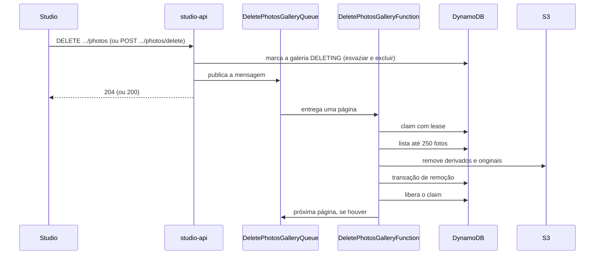

Excluir fotos mexe em dois armazenamentos (S3 e DynamoDB) e em contadores do evento, e pode envolver milhares de arquivos. Por isso as três operações do Studio respondem rápido e delegam a remoção a um worker, por uma fila SQS. A API só registra a intenção.

| Operação | Rota | O que acontece |
| --- | --- | --- |
| Excluir fotos escolhidas | `POST /events/{eventId}/galleries/{galleryId}/photos/delete` | Remove as fotos listadas. |
| Esvaziar a galeria | `DELETE /events/{eventId}/galleries/{galleryId}/photos` | Remove todas as fotos e mantém a galeria. |
| Excluir a galeria | `DELETE /events/{eventId}/galleries/{galleryId}` | Remove todas as fotos e depois a galeria. |

A exclusão do evento inteiro usa o mesmo worker e está em [Reconciliação da exclusão de eventos](/developers/flows/event-deletion-reconciliation). Esta página trata das operações que não passam pelo tombstone do evento.

## Visão de ponta a ponta

## O worker e a fila

`DeletePhotosGalleryFunction` consome a fila `DeletePhotosGalleryQueue`. A configuração relevante vem do template:

| Configuração | Valor | Motivo |
| --- | --- | --- |
| `BatchSize` | 1 | Uma página de até 250 fotos por invocação cabe no timeout. |
| `Timeout` da função | 60 s | |
| `VisibilityTimeout` da fila | 360 s | Seis vezes o timeout da função. |
| `maxReceiveCount` | 5 | Depois da quinta recepção a mensagem vai para a DLQ. |
| `MaximumConcurrency` | 30 | Teto de invocações simultâneas. |
| Retenção da DLQ | 14 dias | Com alarme quando há ao menos uma mensagem. |
| `ReportBatchItemFailures` | ligado | Só a mensagem que falhou volta à fila. |

A mensagem tem um `type` que escolhe o caminho: `GALLERY` (esvaziar ou excluir a galeria) e `SELECTED` (fotos escolhidas).

## Excluir fotos escolhidas

**Rota:** `POST /events/{eventId}/galleries/{galleryId}/photos/delete`, com `photoIds`: de 1 a 5.000 ids.

**Sequência na API:**

1. O controller valida os ids do caminho e o corpo com `DeletePhotosInputSchema`.
2. `RequestDeleteSelectedPhotos` remove ids repetidos, gera um `operationId` aleatório e publica **uma** mensagem `SELECTED` com todos os ids e `step: 0`.
3. A resposta é 200, sem corpo.

<Note>
  A API não consulta a galeria nem as fotos antes de publicar. O dono entra na mensagem (`pgId`, vindo do token), e o worker só encontra fotos na partição do fotógrafo e do evento. Ids que não existem são ignorados. A rota, por isso, responde 200 para uma galeria inexistente ou de outro fotógrafo, sem efeito algum.
</Note>

### O worker, passo a passo

`ProcessDeleteSelectedPhotos` trata no máximo 250 ids por mensagem. Se sobram ids, publica uma nova mensagem com `step + 1` e os ids restantes.

1. **Claim do passo.** `claimDeletingOperation` grava o item `DELETE_SELECTED#{operationId}#{step}` na partição do evento, sob a condição de ele não existir ou ter o lease vencido. O lease dura 90 segundos. Se o claim não é obtido, outra entrega da mensagem está trabalhando nesse passo, e esta termina sem fazer nada.
2. **Leitura das fotos.** Cada id é lido com `get`. Foto que não existe é ignorada.
3. **S3.** `deleteMany` remove, no bucket de mídia, a preview e a miniatura (usando `completedAttemptId` da foto para achar a pasta `attempts/`) e, no bucket de originais, o `original.jpeg`. Remover chave ausente é sucesso no S3, então repetir a página é seguro.
4. **DynamoDB.** A transação de remoção, descrita abaixo.
5. **Libera o claim** do passo, apagando o item de lease.
6. **Próximo passo**, se houver ids restantes.

A ordem importa: **o S3 é limpo antes do DynamoDB**. Se a invocação falhar no meio, os registros ainda existem e a mensagem, ao voltar, repete a página. O contrário deixaria objetos no S3 sem registro que os apontasse.

O `step` faz parte da chave do lease, então cada passo da mesma operação tem o próprio claim. Repetições são inofensivas porque cada remoção é idempotente.

## Esvaziar a galeria

**Rota:** `DELETE /events/{eventId}/galleries/{galleryId}/photos`. Resposta: 204.

1. `RequestDeleteAllPhotosGallery` chama `markDeleting`, que grava `status = DELETING` na galeria, condicionado a ela existir e pertencer ao fotógrafo. Repetir regrava o mesmo estado.
2. Publica a mensagem `GALLERY`, sem cursor.

Se a publicação falhar, a galeria já está em `DELETING` e a resposta é de erro. Repetir a chamada marca de novo e publica de novo.

`ProcessDeleteAllPhotosGallery` trata uma página por mensagem:

1. `claimDeleting` obtém o lease da galeria (`deletingAttemptId` e `deletingLeaseUntil`), válido por 90 segundos. Galeria ocupada por outra tentativa lança `GalleryDeletionInProgressError`, e a mensagem volta para a fila. Galeria inexistente significa que a exclusão já terminou, e a mensagem é descartada.
2. Lista até 250 fotos a partir do cursor.
3. Remove os derivados e originais no S3.
4. Executa a transação de remoção no DynamoDB.
5. Libera o lease.
6. Se há `nextCursor`, publica a mensagem da próxima página e termina.
7. Sem cursor, conclui: `completeDeleting` devolve a galeria para `ACTIVE`.

Uma galeria grande forma, portanto, uma cadeia de mensagens: cada uma é uma página. O detalhe do lease, do progresso e do reconciliador está em [Reconciliação da exclusão de eventos](/developers/flows/event-deletion-reconciliation).

## Excluir a galeria

**Rota:** `DELETE /events/{eventId}/galleries/{galleryId}`. Resposta: 204.

1. `DeleteGallery` lê a galeria e chama `assertCanBeDeleted`. A galeria principal é recusada com 409 `DEFAULT_GALLERY_NOT_DELETABLE`.
2. Marca a galeria como `DELETING`.
3. Publica a mensagem `GALLERY` com `galleryDeleting: true`.

O worker segue o mesmo caminho de esvaziar, e a diferença está no passo final. Com `galleryDeleting`, em vez de `completeDeleting`, chama `galleryRepository.delete`, que executa uma transação:

| Operação | Condição | Efeito |
| --- | --- | --- |
| `Delete` da galeria | existe, é do fotógrafo e `isDefault = false` | Remove a galeria. |
| `Update` do evento | existe e `galleryCount > 0` | `galleryCount - 1` |

A recusa da galeria principal acontece em dois pontos: em `assertCanBeDeleted`, antes de qualquer remoção, e na condição `isDefault = false` da escrita final.

## A transação de remoção das fotos

`DynamoDbPhotoRepository.deleteMany` divide as fotos em lotes de 25 e executa uma transação por lote. Cada foto gera três remoções, e o lote termina com uma atualização do evento. O total máximo é 76 itens, abaixo do limite de 100 de uma transação.

| Operação | Condição | Finalidade |
| --- | --- | --- |
| `Delete` da foto | `attribute_exists(PK)` | Sem a condição, duas exclusões sobrepostas decrementariam o contador pela mesma foto. |
| `Delete` do fingerprint | — | Libera o arquivo para ser enviado de novo. |
| `Delete` do item da seleção | existe, se a foto foi lida como selecionada; não existe, caso contrário | Tira a foto da seleção do cliente. |
| `Update` do evento | `registeredPhotoCount >= n` e, se houve seleção liberada, `selectionCount >= liberadas` | Decrementa `registeredPhotoCount`. |

Antes da transação, `selectedAmong` lê em lote quais fotos estavam selecionadas. A condição do `Delete` da seleção prende essa leitura. Sem ela, uma seleção feita entre a leitura e a escrita ficaria órfã e contaria para sempre. Se a seleção muda no meio, a transação é cancelada, a mensagem volta pela fila e a nova leitura vê o estado atual.

Para as fotos que estavam selecionadas, o `Update` do evento também faz `selectionCount - n` e `selectionRevision + 1`. Assim, excluir uma foto selecionada devolve a vaga do teto do pacote e sinaliza a mudança para quem lê a seleção ou monta um pedido. Veja [Seleção de fotos](/developers/flows/photo-selection) e [Pedidos](/developers/flows/orders).

Na exclusão do evento, o item do evento já não existe, e o worker passa `eventDeleted` para pular o `Update`.

## Efeito sobre outras operações

- **Registro de fotos.** A transação de registro tem uma condição sobre a galeria: ela não pode estar em `DELETING`. Enviar fotos para uma galeria em exclusão responde 409 `GALLERY_DELETING`.
- **Visão do cliente.** A galeria `DELETING` não é visível para o cliente: `canView` exige `status = ACTIVE`. Ela some da sessão e `GET /public/photos` responde 404.
- **Seleção do cliente.** A galeria também precisa estar ativa para selecionar e desmarcar.
- **Pedido em montagem.** A montagem do pedido só copia a seleção de galerias ativas.

## No Studio

No Lumora Studio, `GalleryPanel` tem dois caminhos:

- **Fotos escolhidas.** O fotógrafo marca fotos no rascunho da galeria e salva. `DeletePhotosDialog` confirma (**Excluir e salvar**) e chama `POST .../photos/delete`. Em seguida, `useDeleteGalleryPhotos` remove os ids das listagens em cache e recarrega as galerias.
- **Todas as fotos.** **Excluir todas as fotos** abre `DeleteAllPhotosDialog` e chama `DELETE .../photos`. `useDeleteAllGalleryPhotos` recarrega a lista de fotos, as galerias e o resumo de upload.

Enquanto `gallery.status` é `DELETING`, a tela esconde os botões de envio e de exclusão e troca a grade por `DeletingPhotosNotice`.

Não há controle na tela para excluir a galeria. A operação existe só na API.

## Erros

| Situação | Status | `code` |
| --- | --- | --- |
| Id do evento ou da galeria malformado | 404 | `NOT_FOUND` |
| Galeria inexistente ou de outro fotógrafo (esvaziar e excluir) | 404 | `NOT_FOUND` |
| Excluir a galeria principal | 409 | `DEFAULT_GALLERY_NOT_DELETABLE` |
| `photoIds` ausente, vazio ou com mais de 5.000 ids | 400 | `VALIDATION_ERROR` |
| Enviar fotos para uma galeria em exclusão | 409 | `GALLERY_DELETING` |

## Falhas e recuperação

| Falha | Comportamento |
| --- | --- |
| Invocação interrompida no meio de uma página | O lease vence em 90 segundos e a mensagem, que ficou invisível por 360 segundos, é entregue de novo. Remoções repetidas são inofensivas. |
| Publicação da próxima página falhou | A invocação falha e a mensagem atual volta para a fila. A repetição lista de novo a partir do cursor da mensagem, e as fotos já removidas não aparecem. |
| Mensagem esgotou 5 recepções | Vai para a DLQ, com alarme. Não há redrive automático. |
| Falha na publicação inicial | A galeria já está `DELETING`. Repetir a chamada marca de novo e publica de novo. |

<Warning>
  Só a exclusão de **evento** tem um reconciliador que reenfileira trabalho parado. Esvaziar e excluir uma galeria não têm. Se a cadeia de mensagens se perder (por exemplo, na DLQ), a galeria permanece em `DELETING`, sem aceitar fotos nem ser vista pelo cliente, até alguém repetir a operação ou reenfileirar a mensagem. Repetir a chamada recomeça do início da galeria e é seguro.
</Warning>

## Garantias e limites

- **O S3 é limpo antes do DynamoDB.** Uma falha intermediária nunca deixa registro apontando para arquivo inexistente sem que a repetição o corrija.
- **Contadores consistentes.** `registeredPhotoCount`, `selectionCount` e `selectionRevision` mudam na mesma transação que remove as fotos.
- **Sem cascata para o pedido.** Itens de pedidos já montados (`ITEM#...`) não são alterados pela exclusão de fotos.
- **Mensagem única com até 5.000 ids.** `SELECTED` publica todos os ids numa única mensagem, e o worker os processa em passos de 250.
