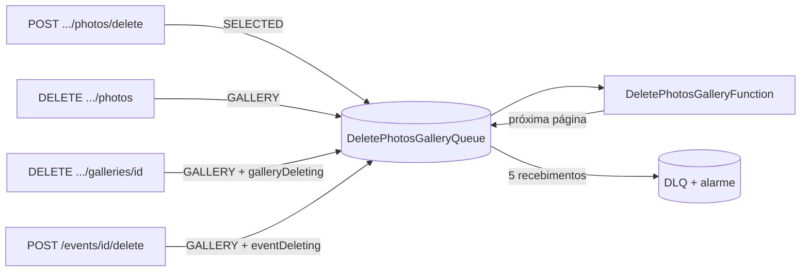
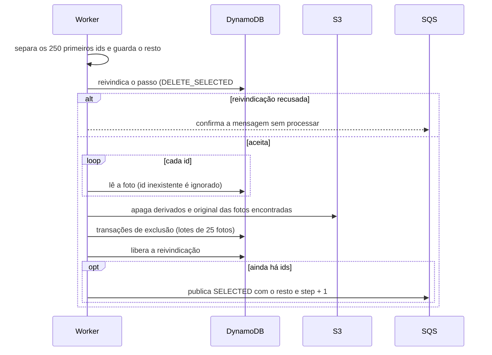

## Objetivo

Remover fotos (originais, derivados e registros) sem prender a requisição HTTP, mesmo quando são milhares, de modo que:

- repetir um passo, ou perdê-lo no meio, **não corrompa** contadores nem deixe registros órfãos;
- a seleção do cliente e os contadores do evento acompanhem as fotos removidas;
- um erro persistente apareça num alarme, e não passe em silêncio.

Esta página cobre a exclusão de fotos pelo Studio. A exclusão de evento tem fluxo próprio, em [Reconciliação da exclusão de eventos](/developers/flows/event-deletion-reconciliation), e compartilha o mesmo worker.

## Quatro formas de pedir

| Operação | Rota | Mensagem na fila | Estado da galeria | O que termina |
| --- | --- | --- | --- | --- |
| Excluir fotos escolhidas | `POST /events/{eventId}/galleries/{galleryId}/photos/delete` | `SELECTED` | Não muda | As fotos listadas |
| Excluir todas as fotos da galeria | `DELETE /events/{eventId}/galleries/{galleryId}/photos` | `GALLERY` | `DELETING`, depois volta a `ACTIVE` | As fotos; a galeria permanece |
| Excluir a galeria | `DELETE /events/{eventId}/galleries/{galleryId}` | `GALLERY` com `galleryDeleting` | `DELETING`, depois removida | As fotos e a galeria |
| Excluir o evento | `POST /events/{eventId}/delete` | `GALLERY` com `eventDeleting`, uma por galeria | Removida com o evento | Tudo; veja o outro fluxo |

Todas as mensagens vão para a mesma fila (`DeletePhotosGalleryQueue`) e são consumidas pela mesma função (`DeletePhotosGalleryFunction`). O campo `type` da mensagem escolhe o caminho.

## O que muda de uma forma para outra

As duas famílias de mensagem avançam de maneiras diferentes:

| | `SELECTED` | `GALLERY` |
| --- | --- | --- |
| O que a mensagem carrega | A lista de ids, até 5.000 | Um cursor de posição na galeria |
| Tamanho do passo | Até 250 ids | Até 250 fotos |
| Controle de repetição | Um lease **por passo**, em item próprio | Um lease **da galeria**, no item dela |
| Próximo passo | Nova mensagem `SELECTED` com os ids restantes e `step` + 1 | Nova mensagem `GALLERY` com o cursor |
| Quem retoma um passo parado | Só a fila (retries e DLQ) | A fila e, na exclusão de evento, o reconciliador |

## Excluir fotos escolhidas (`SELECTED`)

### Pedido

1. O controller valida o corpo (`DeletePhotosInputSchema`): `photoIds` com 1 a 5.000 strings.
2. `RequestDeleteSelectedPhotos` remove ids repetidos, gera um `operationId` (UUID) e publica **uma** mensagem `SELECTED` com `step: 0`.
3. A resposta é 200 sem dados. A API **não confere** se as fotos existem nem se a galeria é do fotógrafo: a conferência acontece no worker.

Como o worker lê cada foto pela chave `(dono, evento, galeria, foto)`, o id de uma foto alheia simplesmente não é encontrado e é ignorado.

### Passo

`ProcessDeleteSelectedPhotos.execute`, para uma mensagem:

**Reivindicação do passo.** É um `UpdateItem` num item `DELETE_SELECTED#{operationId}#{step}`, na partição do evento. A condição aceita o passo se o item não existe **ou** o lease dele venceu (90 segundos, o mesmo `PROCESSING_LEASE_MS` do processamento de imagens). Reivindicar um passo que outra entrega está executando é recusado, e a mensagem é confirmada sem fazer nada. A repetição de uma resposta perdida é reconhecida pelo `attemptId`, como na reivindicação de processamento.

**Ordem: primeiro o S3, depois o DynamoDB.** `S3PhotoStorage.deleteMany` apaga, para cada foto, a miniatura e a preview da tentativa publicada (`completedAttemptId`) no bucket de mídia e o original no bucket de originais. Só depois o repositório remove os registros. Isso torna a repetição segura:

- Apagar uma chave que não existe é sucesso no S3.
- Se o DynamoDB falhar depois do S3, os registros continuam, a mensagem volta e o passo repete sem efeito no S3.
- Se o worker morrer depois de excluir tudo e antes de publicar o próximo passo, a repetição lê cada foto, não encontra nenhuma (já excluídas), pula a exclusão e publica o próximo passo.

**Exclusão no DynamoDB.** `PhotoRepository.deleteMany` processa as fotos em lotes de 25. Cada lote é **uma transação** que, para cada foto, apaga o registro (condicionado a existir), o fingerprint e o item da seleção; e, no evento, ajusta os contadores. O detalhe dos contadores e da seleção está em [Seleção de fotos](/developers/flows/photo-selection#quando-o-fotógrafo-exclui-fotos-selecionadas).

Efeitos de uma foto excluída:

| Item | Efeito |
| --- | --- |
| Registro da foto | Removido. A condição `attribute_exists` impede que duas exclusões sobrepostas decrementem o contador pela mesma foto. |
| Fingerprint | Removido. **O mesmo arquivo pode ser enviado de novo** à galeria. |
| Item da seleção | Removido, e o contador e a revisão da seleção são ajustados na mesma transação. |
| `registeredPhotoCount` | Decrementado. |

**Liberar e avançar.** Depois da exclusão, o worker apaga o item de reivindicação (condicionado ao `attemptId`) e publica o passo seguinte, se sobrou algum id. A reivindicação do passo seguinte é outra chave, `step + 1`.

### Falhas

Qualquer erro no passo é relançado como `Failed to delete selected photos`. O handler inclui a mensagem em `batchItemFailures`, e só ela volta à fila. Depois de 5 recebimentos, a mensagem vai à DLQ e o alarme `DeletePhotosGalleryDlqAlarm` dispara.

Não existe reconciliador agendado para `SELECTED`. A recuperação depende da fila, da DLQ e de um redrive manual.

<Note>
  Quando a reivindicação de um passo é recusada, a mensagem é **confirmada**. Isso evita processar o mesmo passo duas vezes, mas assume que a entrega que detém o lease vá terminar o trabalho. Se essa entrega falhar depois de a duplicata ter sido confirmada, a recuperação passa pelo retry da outra entrega. É o mesmo padrão descrito para o processador de imagens em [Limitações e pontos futuros](/developers/limitations). Não foi reproduzido.
</Note>

## Excluir todas as fotos ou a galeria (`GALLERY`)

### Pedido

| Operação | O caso de uso | Antes de publicar |
| --- | --- | --- |
| Excluir todas as fotos | `RequestDeleteAllPhotosGallery` | `markDeleting`: a galeria passa a `DELETING` |
| Excluir a galeria | `DeleteGallery` | Recusa a galeria principal (`assertCanBeDeleted`) e chama `markDeleting` |

Em ambos, a resposta é 204 depois de a mensagem ser publicada.

`markDeleting` é um `UpdateItem` condicionado à existência da galeria e ao dono. Repetir sobre uma galeria já `DELETING` regrava o mesmo estado. A galeria em `DELETING`:

- **recusa novas fotos** (409 `GALLERY_DELETING` no registro de upload), para que uma foto registrada depois da última página do worker não fique sem galeria;
- **sai da sessão do cliente**;
- continua na lista do Studio, com `status: DELETING`. A tela troca a grade por "Excluindo as fotos desta galeria".

Se a publicação da mensagem falhar, a galeria fica `DELETING` sem mensagem. Repetir o pedido republica.

### Página

`ProcessDeleteAllPhotosGallery.execute`, uma página por mensagem:

1. **Reivindica a galeria** (`claimDeleting`): `UpdateItem` com lease de 90 segundos (`DELETING_LEASE_MS`). Se outra entrega detém o lease, lança `GalleryDeletionInProgressError`, e a mensagem volta à fila para tentar depois. Se a galeria não existe mais, encerra sem erro.
2. **Lê até 250 fotos** da galeria a partir do cursor.
3. **Apaga no S3** e depois **no DynamoDB**, como em `SELECTED`.
4. **Libera o lease.**
5. **Se há cursor**, publica a próxima página com o mesmo cursor e as mesmas marcas (`eventDeleting`, `galleryDeleting`). **Se não há**, finaliza conforme a marca:

| Marca | Finalização |
| --- | --- |
| nenhuma (excluir todas as fotos) | `completeDeleting`: a galeria volta a `ACTIVE` |
| `galleryDeleting` | `GalleryRepository.delete`: transação que remove a galeria e decrementa `galleryCount` |
| `eventDeleting` | Remove a galeria e conclui o tombstone do evento se foi a última. Veja o outro fluxo. |

O `updatedAt` da galeria é atualizado a cada página. Na exclusão de evento, o reconciliador usa esse valor como sinal de progresso. Para o detalhamento de leases, cursores e backoff, veja [Reconciliação da exclusão de eventos](/developers/flows/event-deletion-reconciliation).

## No Studio

| Ação | Como a tela se comporta |
| --- | --- |
| Marcar fotos para excluir | A marcação fica num **rascunho local** da galeria. Nada é enviado. |
| **Salvar alterações** | Envia o novo nome (se mudou) e, depois, as exclusões numa única requisição `POST .../photos/delete`. Em seguida remove as fotos das listas em cache e recarrega as galerias. |
| **Excluir todas as fotos** | Pede confirmação, chama `DELETE .../photos` e recarrega a lista, o resumo de envio e as galerias. A grade mostra o aviso de exclusão enquanto a galeria está `DELETING`. |

A exclusão de galeria isolada **não tem tela**; só a API.

## O que a exclusão não faz

**Derivados de tentativas anteriores.** Só os da tentativa publicada (`completedAttemptId`) são apagados. Uma foto reprocessada deixa os derivados da tentativa anterior em `attempts/{attemptId}/`. Nada os remove.

**Bytes do original no S3.** O bucket de originais é **versionado**. Apagar a chave sem `VersionId` cria um delete marker. As versões anteriores permanecem como não correntes, e a regra de ciclo de vida só as expira **15 dias** depois de se tornarem não correntes. Portanto os bytes de uma foto excluída podem permanecer no bucket por esse período. O bucket de mídia não é versionado. Esta é a combinação da configuração atual do bucket e da chamada de exclusão; não há remoção definitiva por versão no código.

**Pedidos publicados.** A exclusão de uma foto selecionada não atualiza um pedido já publicado. Veja [Criação de pedidos](/developers/flows/order-creation#limites-e-pontos-de-atenção).

**Fotos em processamento.** Excluir uma foto enquanto ela é processada é seguro: se o worker de imagens não encontrar mais o registro, ele descarta o que gravou. Veja [Processamento de imagens](/developers/flows/image-processing#foto-excluída-durante-o-processamento).

## Onde está no código

| Assunto | Caminho |
| --- | --- |
| Rotas | `services/api/src/handlers/api/studioApi.ts` |
| Pedido e passo de `SELECTED` | `application/photos/commands/DeleteSelectedPhotos.ts` |
| Pedido e página de `GALLERY` | `application/galleries/commands/DeleteAllPhotosGallery.ts`, `DeleteGallery.ts` |
| Consumo da fila | `handlers/sqs/deletePhotosGalleryProcessor.ts` |
| Exclusão no DynamoDB | `infra/dynamodb/DynamoDbPhotoRepository.ts` (`deleteMany`, `claimDeletingOperation`) |
| Leases e estado da galeria | `infra/dynamodb/DynamoDbGalleryRepository.ts` |
| Exclusão no S3 | `infra/s3/S3PhotoStorage.ts` (`deleteMany`) |
| Mensagens | `contracts/gallery/DeletePhotosGallerySchema.ts` |
| Frontend | `apps/web/src/studio/galleries/` (`GalleryPanel`, `useDeleteGalleryPhotos`, `useDeleteAllGalleryPhotos`) |

Os caminhos de `services/api` são relativos a `src`.
