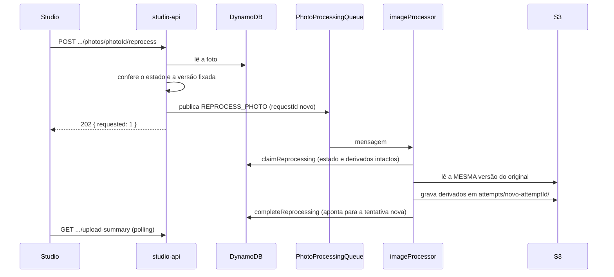

## Objetivo

Gerar de novo a miniatura e a preview de uma foto **a partir do original que já está no S3**, sem reenviar o arquivo, de modo que:

- a foto **continue visível** com os derivados atuais enquanto a nova tentativa roda;
- repetir o pedido, ou receber a mesma mensagem duas vezes, não corrompa a foto;
- um reprocessamento que falha **não piore** o estado da foto.

O caso de uso típico é recuperar uma foto em `FAILED`. A API também aceita fotos `AVAILABLE`, mas a tela só oferece o botão para as que falharam.

## Quem pede e o que acontece



**A API só publica o job.** Ela não altera o estado nem os derivados da foto. Quem altera é o worker, ao concluir.

## Os pedidos

### Uma foto

**Rota:** `POST /events/{eventId}/galleries/{galleryId}/photos/{photoId}/reprocess`, sem corpo.

`RequestPhotoReprocessing`:

1. Lê a foto na partição do dono. Foto inexistente, de outra galeria ou de outro fotógrafo responde 404 `NOT_FOUND`. Um id malformado também, sem consultar o banco.
2. Confere `canBeReprocessed`: o estado é `AVAILABLE` ou `FAILED` **e** existe `sourceVersionId`. Senão, 409 `PHOTO_NOT_REPROCESSABLE`. Isso cobre fotos em `PENDING_UPLOAD` e `PROCESSING`.
3. Publica uma mensagem `REPROCESS_PHOTO` na fila de processamento e responde **202** com `{ "requested": 1 }`.

A mensagem:

```json
{
  "type": "REPROCESS_PHOTO",
  "pgId": "…",
  "eventId": "…",
  "galleryId": "…",
  "photoId": "…",
  "sourceVersionId": "…",
  "requestId": "…"
}
```

`sourceVersionId` é a versão do original que a foto já tem fixada. `requestId` é um UUID **novo a cada requisição HTTP**.

`requested` conta jobs publicados, não resultados. O resultado de cada foto aparece depois no estado persistido.

### Todas as fotos com falha do evento

**Rota:** `POST /events/{eventId}/photos/reprocess-failures`, sem corpo.

`RequestEventFailuresReprocessing`:

1. `listFailedByEvent` percorre as fotos do evento com leituras consistentes, filtrando as `FAILED` que têm `sourceVersionId`. O custo é proporcional ao número de fotos do evento, não ao de falhas.
2. Sem falhas, responde `{ "requested": 0 }` e não publica nada.
3. Com falhas, publica um job por foto com `SendMessageBatch` (lotes de 10, até 10 lotes em paralelo) e responde **202** com `{ "requested": n }`.

O `SendMessageBatch` responde sucesso mesmo quando parte das mensagens é recusada. O publicador confere as entradas com falha e lança erro se houver alguma. Uma falha no meio **não é tratada como sucesso**: repetir o pedido republica as fotos que continuam `FAILED`, com `requestId` novos.

## A reivindicação

O `imageProcessor` é a mesma função do processamento inicial. O `ImageJobNormalizer` reconhece a mensagem pelo `type`, remonta a chave do original a partir dos ids e a entrega ao caso de uso com `reprocessRequestId`. Uma mensagem `REPROCESS_PHOTO` que não passa na validação é registrada como malformada e descartada sem retry.

O reprocessamento difere do processamento inicial **somente na reivindicação e na conclusão**. A leitura do S3, o sharp e a gravação dos derivados são os mesmos.

`claimReprocessing` é um único `UpdateItem` condicionado a todas estas condições:

| Condição | Por quê |
| --- | --- |
| A foto existe | Um job órfão não recria a foto. |
| O estado é `AVAILABLE` ou `FAILED` | Não se reprocessa uma foto que ainda está sendo processada. |
| `sourceVersionId` é o da mensagem | Só a versão fixada. |
| Não há lease ativo | Só uma tentativa por vez. |
| `reprocessRequestId` não é o desta mensagem | Uma mensagem já concluída não roda de novo. |

**O que grava:** apenas `processingAttemptId` (um UUID novo) e `processingLeaseUntil` (90 segundos). **O estado e `completedAttemptId` não mudam.** É por isso que a foto continua visível, com os derivados atuais, durante todo o reprocessamento. Ela **não aparece em `PROCESSING`** no resumo do evento.

### Reivindicação recusada

Quando a condição falha, o repositório lê o item devolvido e classifica o motivo:

| Motivo | Situação |
| --- | --- |
| `PHOTO_MISSING` | A foto foi excluída. |
| `NOT_ELIGIBLE` | O estado não é `AVAILABLE` nem `FAILED`. |
| `VERSION_MISMATCH` | A versão fixada é outra. |
| `ALREADY_HANDLED` | Já existe uma conclusão registrada para este `requestId`. |
| `IN_PROGRESS` | Há um lease ativo de outra tentativa. |

A recusa **não é erro**. O worker registra um aviso (`Reprocessamento recusado`, com o motivo), incrementa a métrica `ReprocessRefused` e confirma a mensagem. Não há retry, porque repetir não mudaria o resultado.

Como no processamento inicial, a repetição de uma resposta perdida é reconhecida pelo `attemptId` gerado na própria chamada.

## A conclusão

### Sucesso

`completeReprocessing` aplica um `UpdateItem` que:

- põe a foto em `AVAILABLE`;
- aponta `completedAttemptId` para a **tentativa nova**, cujos derivados estão em `attempts/{novo attemptId}/`;
- grava `previewWidth` e `previewHeight` da nova preview;
- registra `reprocessRequestId` e `reprocessAttemptId`;
- remove `processingAttemptId`, `processingLeaseUntil` e `failureReason`.

As condições: a foto existe, está `AVAILABLE` ou `FAILED`, o `processingAttemptId` é o desta tentativa, a versão é a fixada e o lease não venceu.

Como cada tentativa grava numa pasta própria e a troca de `completedAttemptId` é uma única escrita, **os derivados publicados mudam atomicamente**. Quem lê vê a tentativa antiga ou a nova, nunca uma mistura de miniatura de uma e preview da outra.

Os derivados da tentativa anterior **não são apagados**. As URLs antigas continuam funcionando, e nada limpa os objetos antigos.

### Conteúdo recusado

Se o original não pode produzir derivados válidos (`InvalidPhotoContentError`), `rejectReprocessing` registra `reprocessRequestId` e `reprocessAttemptId`, remove o lease e **mantém o estado e os derivados atuais**. Uma foto `FAILED` continua `FAILED`. Uma foto `AVAILABLE` continua `AVAILABLE` com os derivados que tinha. O reprocessamento nunca derruba uma foto pronta.

Como o job lê **a mesma versão do original**, uma foto cujo conteúdo é de fato inválido volta a falhar do mesmo jeito. O reprocessamento resolve falhas cuja causa foi corrigida no processamento, e não conteúdo corrompido.

### Falha transitória

Erros de rede, throttling ou timeout propagam, a mensagem volta à fila e segue o mesmo caminho do processamento inicial: até 5 recebimentos, depois a DLQ e o alarme. Depois de o lease vencer, a nova entrega reivindica de novo.

### Foto excluída no meio

Se o registro da foto desaparece durante o trabalho, a conclusão falha com `PhotoNotFoundError`. O worker descarta o que ele mesmo gravou: o original e os derivados desta tentativa.

## Repetição e idempotência

| Situação | Resultado |
| --- | --- |
| A mesma mensagem é entregue duas vezes durante a execução | A segunda é recusada (`IN_PROGRESS`) e confirmada. |
| A mesma mensagem é entregue de novo depois de concluída | Recusada com `ALREADY_HANDLED`. |
| O fotógrafo pede duas vezes (dois `requestId`) | Dois jobs. Se o primeiro ainda roda, o segundo é recusado por lease ativo. Se já terminou, o segundo reprocessa de novo. |
| Resposta de conclusão perdida | A repetição é reconhecida por `reprocessAttemptId`. |

O `reprocessRequestId` guarda **só o último** pedido concluído. A reentrega de um pedido mais antigo, depois de outro ter concluído, não é reconhecida e reprocessa de novo. O custo é refazer o trabalho; o resultado é equivalente. O comentário do código registra esse pior caso como aceito.

O reprocessamento **não mexe** em contadores do evento nem na seleção do cliente. A foto permanece `AVAILABLE` ou `FAILED` o tempo todo, e o item da seleção não depende dos derivados.

## No Studio

- O botão de reprocessar aparece por foto, **só nas fotos `FAILED`**. O botão **Reprocessar falhas** da seção de envio cobre o evento inteiro.
- A foto não muda de estado quando o pedido é aceito. Sem outro sinal, o resumo do evento não teria motivo para voltar a consultar. Por isso o Studio mantém um **acompanhamento do pedido** (`reprocessWatch`), por usuário e evento, durante a sessão da aba.
- O acompanhamento guarda quantas falhas devem restar quando tudo o que foi pedido terminar (`settledAt`). Enquanto o total de `FAILED` estiver acima disso, o resumo é consultado a cada 5 segundos. Quando chega ao esperado, o acompanhamento para.
- Como no envio, o polling é suspenso depois de 3 minutos sem mudança nos contadores.

Erros mostrados: foto ainda em processamento (409), foto inexistente (404) e falha genérica.

## Permissões e fila

A `studio-api` tem `sqs:SendMessage` na fila de processamento, para publicar o job. Ela não consome a fila. O consumo, o redrive e a DLQ são os do processamento inicial: `PhotoProcessingQueue`, lote de 1, 5 recebimentos, DLQ de 14 dias e alarme.

## Onde está no código

| Assunto | Caminho |
| --- | --- |
| Pedidos | `services/api/src/application/photos/commands/RequestPhotoReprocessing.ts` |
| Controllers e rotas | `controllers/PhotoController.ts`, `handlers/api/studioApi.ts` |
| Mensagem | `contracts/photo/ImageJobMessageSchema.ts` |
| Normalização | `controllers/ImageJobNormalizer.ts` |
| Reivindicação e conclusão | `infra/dynamodb/DynamoDbPhotoRepository.ts` (`claimReprocessing`, `completeReprocessing`, `rejectReprocessing`) |
| Execução | `application/photos/commands/ProcessUploadedPhoto.ts` |
| Publicação em lote | `infra/sqs/SQSPublisher.ts` |
| Frontend | `apps/web/src/studio/events/` (`reprocessWatch`, `useReprocessEventFailures`) e `studio/galleries/` (`ReprocessPhotoButton`, `useReprocessPhoto`) |

Os caminhos de `services/api` são relativos a `src`.
