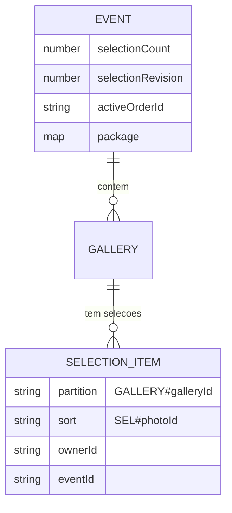
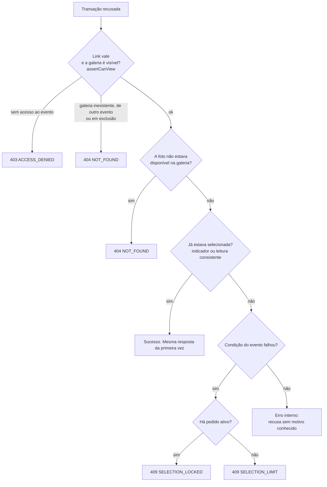
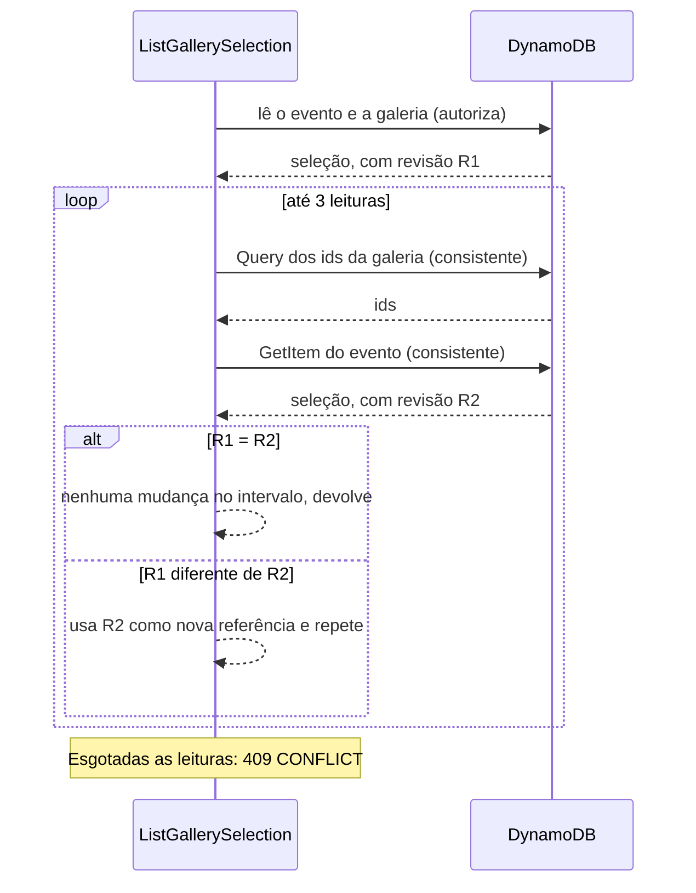

## Objetivo

Deixar o cliente do link escolher as fotos que quer, em várias galerias do mesmo evento, de forma que:

- **repetir** uma marcação ou desmarcação não conte duas vezes;
- **duas abas** (ou dois aparelhos) marcando ao mesmo tempo não passem do teto do pacote;
- o total exibido seja o do **evento inteiro**, somando as galerias;
- depois que o pedido é aberto, a seleção **pare de mudar**.

A seleção é a entrada do pedido: o pedido nasce congelando exatamente a seleção do evento. O pedido está descrito em [Criação de pedidos](/developers/flows/order-creation). O acesso do cliente ao link está em [Acesso do cliente](/developers/flows/public-access).

## O que é a seleção no banco

A seleção é formada por **itens** e por **três atributos no evento**.

| Parte | Onde | Conteúdo |
| --- | --- | --- |
| Item da seleção | `PK = GALLERY#{galleryId}`, `SK = SEL#{photoId}` | `ownerId`, `eventId`, `galleryId`, `photoId`, `selectedAt`. Um item por foto selecionada. |
| `selectionCount` | Item do evento | Quantas fotos o evento tem selecionadas, somando todas as galerias. |
| `selectionRevision` | Item do evento | Número que **só cresce**. Sobe na mesma transação de toda mudança da seleção. |
| `activeOrderId` | Item do evento | O pedido que congelou a seleção. Ausente enquanto não há pedido ativo. |



Três decisões de modelagem explicam o resto da página:

**O contador fica no evento, e não na galeria.** O teto do pacote vale para o evento inteiro. Com o contador num único item, o limite pode ser conferido **na própria escrita**, por condição, sem somar galerias.

**A partição da seleção é a galeria e não leva o dono.** A chave é `GALLERY#{galleryId}`. Quem lê a seleção de uma galeria **precisa provar antes** que a galeria pertence ao evento do link (ou ao fotógrafo autenticado). Todas as leituras fazem isso primeiro. Os itens guardam também `ownerId` e `eventId`, e as escritas e a cópia para o pedido conferem esses valores como segunda barreira.

**`selectionRevision` existe para leituras coerentes.** O contador e a lista de ids vêm de leituras diferentes. A revisão permite saber se nada mudou entre elas. Veja [Ler a seleção](#ler-a-seleção).

### O teto de seleção

O teto sai do pacote gravado no evento (`selectionLimit`):

| Pacote | Teto |
| --- | --- |
| `extraPhotoPriceCents` é `null` (sem adicionais) | `includedPhotos` |
| `extraPhotoPriceCents` tem valor | Nenhum. O que passar de `includedPhotos` é cobrado. |
| Evento sem pacote | Não há seleção: o link só existe com pacote. |

A mesma regra existe em dois lugares: em `selectionLimit`, no domínio, e na condição `BELOW_SELECTION_LIMIT` da escrita do DynamoDB. O comentário no código pede que as duas mudem juntas.

## Rotas

Todas passam pelo authorizer do link e usam dono e evento do contexto dele.

| Rota | Caso de uso | Resposta de sucesso |
| --- | --- | --- |
| `GET /public/selection?galleryId=` | `ListGallerySelection` | A seleção da galeria e o total do evento |
| `PUT /public/selection/{photoId}?galleryId=` | `SelectGalleryPhoto` | `{ photoId, selected: true }` |
| `DELETE /public/selection/{photoId}?galleryId=` | `DeselectGalleryPhoto` | `{ photoId, selected: false }` |
| `GET /events/{eventId}/galleries/{galleryId}/selection` | `GetStudioGallerySelection` | Fotos selecionadas, com o nome do arquivo (Studio) |
| `GET /events/{eventId}/galleries/{galleryId}/selection/export` | `GetStudioGallerySelection.exportText` | Texto para o filtro do Lightroom (Studio) |

## Selecionar uma foto

### A ideia central

Os casos de uso **tentam a escrita primeiro** e só consultam o banco depois, para descobrir **por que** ela foi recusada. A regra de negócio fica na condição da transação, e não numa leitura anterior. Uma leitura seguida de escrita deixaria duas abas passarem juntas do teto.

### A transação

`DynamoDbGallerySelectionRepository.select` envia uma transação com quatro itens:

| # | Item | Operação | Condição | Efeito |
| --- | --- | --- | --- | --- |
| 1 | Evento | `Update` | Link vale (`LINK_GRANTS_ACCESS`), **e** não há pedido ativo, **e** abaixo do teto | `selectionCount` +1 e `selectionRevision` +1 |
| 2 | Galeria | `ConditionCheck` | A galeria existe e está `ACTIVE` | nenhum |
| 3 | Foto | `ConditionCheck` | A foto existe nessa galeria e está `AVAILABLE` | nenhum |
| 4 | Item da seleção | `Put` | O item **não existe** | Cria o item |

`LINK_GRANTS_ACCESS` exige, numa só expressão: evento `PUBLISHED`, `accessTokenHash` igual ao token apresentado, `accessLinkExpiresAt` no futuro e sem revogação no passado. É a versão em condição de `canAccessEvent`, descrita em [Pacote, publicação e link de acesso](/developers/flows/event-package-and-access-link#a-regra-que-decide-se-o-cliente-entra).

A chave da foto leva o id da galeria. Uma foto de **outra galeria** não é encontrada, e a condição do item 3 falha.

### Por que repetir é seguro

O item 4 só entra se não existir. Se a foto já estava selecionada, a condição do `Put` falha e **a transação inteira é cancelada**. O contador não sobe. O caso de uso então trata esse cancelamento como sucesso.

O contador só aumenta junto com um item novo. Não há como o contador e os itens divergirem por causa de repetições.

### Decidir o motivo da recusa

Quando a transação é cancelada, o DynamoDB informa **qual condição de cada item falhou**. `select` devolve `SELECTED` ou um `REJECTED` com quatro indicadores: `event`, `gallery`, `photo`, `selection`. `SelectGalleryPhoto` decide a resposta nesta ordem:



A ordem importa:

- **O link vem antes de tudo.** Sem direito, a resposta não revela se a galeria existe.
- **"Já selecionada" vem antes do teto e do pedido.** Marcar de novo uma foto já marcada responde sucesso mesmo com o teto atingido ou com a seleção congelada. A repetição é inofensiva.
- **Pedido ativo vem antes de teto.** Uma seleção congelada nunca responde "limite".

O último ramo, a recusa sem motivo conhecido, só acontece se o estado mudou entre a escrita e as leituras (por exemplo, a galeria entrou em exclusão). O código lança erro interno em vez de adivinhar.

### Erros

| Situação | Resposta |
| --- | --- |
| Link substituído, vencido ou evento não publicado | 403 `ACCESS_DENIED` |
| Galeria de outro evento, inexistente ou em exclusão | 404 `NOT_FOUND` |
| Foto inexistente, de outra galeria, em processamento, com falha ou excluída | 404 `NOT_FOUND` |
| Seleção congelada por um pedido | 409 `SELECTION_LOCKED` |
| Teto do pacote atingido | 409 `SELECTION_LIMIT` |
| Muitas escritas simultâneas no evento | 409 `CONFLICT` |

## Desmarcar uma foto

`DeselectGalleryPhoto` segue o mesmo desenho. A transação tem três itens:

| # | Item | Operação | Condição | Efeito |
| --- | --- | --- | --- | --- |
| 1 | Evento | `Update` | Link vale **e** não há pedido ativo | `selectionCount` −1 e `selectionRevision` +1 |
| 2 | Galeria | `ConditionCheck` | A galeria existe e está `ACTIVE` | nenhum |
| 3 | Item da seleção | `Delete` | O item **existe** e o `eventId` dele é o do link | Remove o item |

O item precisa existir, então desmarcar uma foto que não está marcada cancela a transação e o contador **não desce**. O `eventId` na condição impede que um link de outro evento mexa na seleção desta galeria.

Ordem da decisão quando a transação é recusada: link (403), galeria (404), "a foto já não estava selecionada" (sucesso) e, por fim, pedido ativo (409 `SELECTION_LOCKED`).

Desmarcar **não confere a foto**. Se uma foto selecionada deixou de estar pronta, desmarcá-la continua liberando a vaga.

## Ler a seleção

`GET /public/selection?galleryId=` devolve:

```json
{
  "photoIds": ["01JEXAMPLEPHOTO000000000A", "01JEXAMPLEPHOTO000000000B"],
  "selectedCount": 12,
  "limit": 30,
  "pricing": { "packageCents": 0, "includedPhotos": 30, "extraPhotoPriceCents": 2500 },
  "orderId": null
}
```

Os valores são fictícios.

| Campo | Significado |
| --- | --- |
| `photoIds` | Ids selecionados **nesta galeria**, na ordem das chaves. |
| `selectedCount` | Total do **evento**, somando as galerias. |
| `limit` | O teto, ou `null` quando se vendem adicionais. |
| `pricing` | Os termos do pacote que entram na conta. `packageCents` já vem zerado quando o pacote foi pago por fora. `null` se o evento não tem pacote. |
| `orderId` | O pedido que congelou a seleção, ou `null`. |

### Por que a leitura é cercada pela revisão

Os ids vêm de uma `Query` na partição da galeria. O total vem do item do evento. São duas leituras, e uma marcação pode acontecer entre elas, deixando `photoIds` e `selectedCount` inconsistentes entre si.

`ListGallerySelection` resolve com a revisão:



Revisão igual nas duas pontas quer dizer que **nenhuma mudança da seleção aconteceu no intervalo**. Isso vale mesmo que o contador tenha ido e voltado ao mesmo valor, o que só o contador não revelaria. A leitura que autoriza é a mesma que abre o intervalo, então o evento não é lido a mais.

Depois de `MAX_SELECTION_READS` (3) tentativas sem estabilizar, a resposta é 409 `CONFLICT`, e o cliente repete.

## Seleção congelada

Enquanto o evento tem `activeOrderId`:

- `select` e `deselect` falham na condição do evento e respondem 409 `SELECTION_LOCKED`.
- `GET /public/selection` continua funcionando e devolve `orderId`, que o frontend usa para mostrar "Ver pedido" e desabilitar os botões.

O `activeOrderId` é gravado na transação que abre o pedido e removido quando o pedido é cancelado ou descartado na montagem. Veja [Criação de pedidos](/developers/flows/order-creation) e [Cancelamento e lista de pedidos](/developers/flows/order-cancellation-and-listing).

A seleção congelada pode **perder fotos** (o fotógrafo as exclui), e isso muda a revisão. É essa propriedade que o pedido usa para detectar que a seleção mudou durante a montagem.

## Quando o fotógrafo exclui fotos selecionadas

A exclusão de fotos é assíncrona e passa por `PhotoRepository.deleteMany`. Quando uma foto excluída estava selecionada, a seleção sai junto, na **mesma transação** que apaga a foto.

Passos, para cada lote de fotos:

1. Uma leitura consistente (`BatchGetItem`) descobre quais fotos do lote têm item de seleção.
2. A transação apaga, para cada foto: o registro da foto, o fingerprint e o item da seleção. A condição do item da seleção **prende a leitura**: `attribute_exists` se foi lida como selecionada, `attribute_not_exists` se não foi.
3. No evento, `registeredPhotoCount` desce em n. Se alguma foto do lote estava selecionada (k fotos), `selectionCount` desce em k e `selectionRevision` sobe em 1. As condições exigem `registeredPhotoCount >= n` e `selectionCount >= k`.

Se alguém selecionar ou desmarcar uma foto entre a leitura e a escrita, a condição do item da seleção falha, a transação é cancelada e a mensagem da fila volta. Na nova tentativa, a leitura reflete o estado atual. Sem a condição, uma seleção feita no meio ficaria órfã, contando para sempre.

Essa exclusão **não exige** que não haja pedido ativo. O fotógrafo pode excluir uma foto selecionada mesmo com a seleção congelada. O efeito sobre o pedido está em [Criação de pedidos](/developers/flows/order-creation#o-fotógrafo-exclui-fotos-selecionadas-durante-a-montagem).

Na exclusão do evento inteiro, o item do evento já não existe: os itens da seleção são apagados e nenhum contador é atualizado.

## Concorrência

Toda marcação de um evento escreve **no mesmo item** (o evento), para atualizar o contador. Isso é deliberado: é o que faz o teto valer. A consequência é contenção.

- Transações concorrentes sobre o mesmo item podem ser canceladas com `TransactionConflict`. `sendTransaction` repete até 3 vezes, com backoff e jitter, apenas nesse caso.
- Se o conflito persistir, `unexpectedCancellation` devolve `WriteConflictError`, que a `public-api` responde com 409 `CONFLICT`.
- No frontend, as mudanças de uma mesma galeria entram numa **fila de uma por vez** (`scope` da mutation), e uma mudança é repetida até 3 vezes se a resposta for `CONFLICT`. Toques seguidos chegam em ordem e não disputam o contador entre si.

O custo dessa escolha é que todas as marcações de um evento concentram escritas num único item.

## Visão do fotógrafo

No Studio, a aba **Seleção** de cada galeria mostra as fotos que o cliente escolheu, com o nome do arquivo enviado.

`GetStudioGallerySelection.execute`:

1. Lê a galeria do fotógrafo autenticado (`GalleryRepository.get`). Galeria de outro fotógrafo, de outro evento ou inexistente é 404, e só então a seleção é lida.
2. `listSelectedPhotos` lê os ids da seleção e busca os registros das fotos em lotes de 100 (`BatchGetItem`, com tentativas para chaves não processadas) para obter `originalName`. Fotos sem registro ficam de fora.

### Exportar para o Lightroom

`GET .../selection/export` devolve o texto para o filtro de biblioteca do Lightroom (Texto, Nome do arquivo, Contém), que trata termos separados por vírgula como alternativas.

`lightroomFilter` monta o texto assim:

- Remove a extensão do nome. O objetivo é achar o RAW ou o JPEG do catálogo a partir do arquivo enviado.
- Descarta repetições, quando dois envios só diferem na extensão.
- Separa por `", "`.
- Nomes que o filtro **não representa** ficam fora do texto e voltam em `unsupported`: os que têm espaço ou vírgula, começam com `!` ou `+`, ou terminam com `+`. Eles virariam outros termos e achariam fotos que não estão na seleção.

A resposta traz `text`, `count` (fotos cujo nome entrou no texto) e `unsupported`. A tela copia o texto e avisa os nomes que precisam ser procurados à mão. A cópia é feita direto no clique para funcionar no Safari, que só permite escrever na área de transferência dentro do gesto do usuário.

## No frontend do cliente

| Peça | Papel |
| --- | --- |
| `useGallerySelection` | Lê `GET /public/selection` da galeria. A chave de cache não leva o token (o cache é por link). |
| `useToggleSelection` | Marca e desmarca. A tela muda **na hora** e volta ao que era se a API recusar. No fim, relê a seleção. |
| `useSelectionOnScreen` | Calcula a seleção exibida: a do servidor com as mudanças em andamento por cima, na ordem dos toques. Uma mudança recusada sai sozinha, sem levar os toques seguintes. |
| `SelectionCounter` | Mostra `12/30` quando há teto, o total sem teto, o valor da seleção e os avisos de limite e de seleção enviada. |
| `selectionPrice` | Calcula a prévia do valor com a mesma conta do servidor. |

O valor mostrado na tela é uma **prévia**. O valor do pedido é sempre calculado no servidor ao finalizar. `tests/selection-price-parity.test.ts` compara `selectionPrice` com `quote`, do backend, para impedir que as duas contas divirjam.

Mensagens ao cliente quando a API recusa: teto atingido (`SELECTION_LIMIT`), seleção enviada (`SELECTION_LOCKED`) ou falha genérica. Recusa de acesso derruba a tela inteira, como em [Acesso do cliente](/developers/flows/public-access#como-o-frontend-reage-ao-vencimento).

## Onde está no código

| Assunto | Caminho |
| --- | --- |
| Rotas e erros | `services/api/src/handlers/api/publicApi.ts` |
| Casos de uso | `application/galleries/selection/` |
| Regras e portas | `domain/gallery/GallerySelection.ts`, `domain/gallery/GalleryAccess.ts` |
| Persistência | `infra/dynamodb/DynamoDbGallerySelectionRepository.ts`, `infra/dynamodb/selectionTally.ts` |
| Condições de escrita | `infra/dynamodb/eventConditions.ts` |
| Exclusão de fotos selecionadas | `infra/dynamodb/DynamoDbPhotoRepository.ts` (`deleteMany`) |
| Frontend do cliente | `apps/web/src/public/` (`useGallerySelection`, `SelectionCounter`, `selectionPrice`) |
| Frontend do Studio | `apps/web/src/studio/galleries/GallerySelectionPanel.tsx`, `useGallerySelection.ts` |

Os caminhos de `services/api` são relativos a `src`.
