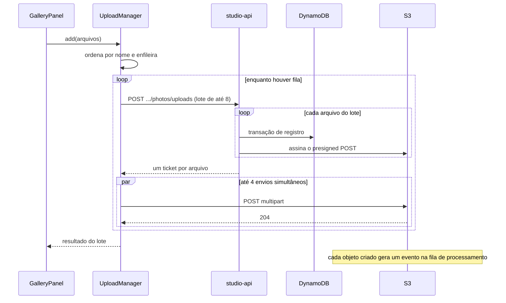

## Objetivo

Levar arquivos JPEG de até 50 MB do computador do fotógrafo até o S3, em lotes de centenas ou milhares, de forma que o envio possa falhar e ser retomado sem duplicar fotos.

O princípio do fluxo: **a API nunca recebe os bytes**. Ela registra a intenção de envio e emite uma credencial temporária. O navegador envia o arquivo direto ao S3.

## Visão de ponta a ponta

O que acontece depois que o objeto chega ao S3 está em [Processamento de imagens](/developers/flows/image-processing).

## Ponto de entrada

No frontend, `GalleryPanel` recebe arquivos de três origens: seleção de arquivos, seleção de pasta e arrastar e soltar. As três convergem na função `enqueue`.

Antes de enfileirar, `partitionPhotoFiles` descarta o que a API recusaria: arquivos que não são JPEG, ocultos, vazios, maiores que 50 MB ou com nome longo demais. O filtro existe porque a API valida o lote inteiro: um único arquivo inválido faria a requisição toda responder 400.

## Etapa 1: registro e emissão do ticket

**Rota:** `POST /events/{eventId}/galleries/{galleryId}/photos/uploads`

**Corpo:** uma lista `files` com 1 a 50 itens. Cada item tem `uploadItemId`, `name`, `size`, `contentType` e `lastModified`.

`uploadItemId` é um identificador gerado pelo navegador. A API não o armazena: ele é devolvido na resposta para o cliente associar cada ticket ao seu arquivo.

Para cada arquivo, em ordem, o caso de uso `RequestPhotoUploads`:

1. cria a entidade `Photo` em `PENDING_UPLOAD`, com um novo ULID e o fingerprint;
2. chama `PhotoRepository.register`;
3. decide se emite um presigned POST.

### A transação de registro

`register` executa uma transação com quatro operações:

| Operação | Condição | Finalidade |
| --- | --- | --- |
| `Put` do fingerprint | não existir | Impede registrar o mesmo arquivo duas vezes na galeria. |
| `Put` da foto | não existir | Cria o registro. |
| `Update` do evento, `ADD registeredPhotoCount 1` | evento existir | Mantém o contador de fotos registradas e impede registrar em evento já removido. |
| `ConditionCheck` da galeria | galeria existir | Impede registrar foto em galeria inexistente ou de outro fotógrafo. |

Os quatro efeitos são atômicos. Se qualquer condição falhar, nada é gravado.

### Deduplicação por fingerprint

O fingerprint é o SHA-256 de nome, tamanho e data de modificação do arquivo. Ele identifica "o mesmo arquivo escolhido de novo". Não é um hash do conteúdo e não prova igualdade de bytes.

Quando o fingerprint já existe, a condição do primeiro `Put` falha e o DynamoDB devolve o item existente, graças a `ReturnValuesOnConditionCheckFailure: ALL_OLD`. O repositório lê a foto apontada por ele e responde `created: false`. Nenhuma foto nova é criada e nenhum contador é incrementado.

A chave do fingerprint inclui a galeria. O mesmo arquivo em outra galeria do mesmo evento é uma foto nova.

### Quando a API emite um ticket

| Situação da foto | Ticket |
| --- | --- |
| Recém-criada | Emitido |
| Já registrada, em `PENDING_UPLOAD`, e o original **não** está no S3 | Emitido de novo |
| Já registrada, em `PENDING_UPLOAD`, e o original **está** no S3 | `upload: null` |
| Já registrada, em qualquer outro estado | `upload: null` |

Para a segunda e a terceira linhas, a API consulta o S3 com `ListObjectsV2` na chave exata do original. Um erro nessa consulta é propagado; ele não é interpretado como "o original não existe".

`upload: null` significa "não há nada a enviar". O cliente marca o arquivo como concluído e reaproveitado.

Essa tabela é o que torna o envio retomável: selecionar de novo a mesma pasta faz a API devolver ticket só para o que falta.

### O presigned POST

`S3PhotoStorage.createPresignedUpload` gera um formulário POST assinado, válido por 15 minutos. A policy do formulário fixa, no próprio S3:

- a **chave exata** do objeto;
- o **`Content-Type`**;
- o **tamanho exato**, com `content-length-range` de mínimo e máximo iguais ao tamanho declarado.

O navegador não consegue usar o ticket para gravar em outra chave, enviar outro tipo ou um arquivo de outro tamanho. Essa é a razão de usar POST e não PUT: veja o [ADR-005](/developers/adr/005-presigned-post-upload).

A chave é `photos/{ownerId}/{eventId}/{galleryId}/{photoId}/original.jpeg`. Ela não contém o nome original do arquivo.

### Resposta

Um item por arquivo, na ordem do pedido, com `uploadItemId`, `upload` (o ticket, ou `null`) e `photo` (o DTO).

## Etapa 2: envio ao S3

`uploadWithPresignedPost`, em `lib/storageClient.ts`, monta um `FormData` com os campos do ticket e o arquivo por último, e envia com `XMLHttpRequest`. O campo do arquivo precisa vir depois dos campos cobertos pela policy.

O S3 responde 2xx quando aceita o objeto. Nesse momento:

- o `UploadManager` marca o arquivo como `done`;
- a foto **continua em `PENDING_UPLOAD`** no DynamoDB.

O navegador não avisa a API de que o envio terminou. A confirmação vem do evento que o S3 publica na fila.

## O agendamento no navegador

O `UploadManager` não pede tickets para a fila inteira. Com 1.000 arquivos e tickets de 15 minutos, os últimos expirariam antes de serem usados.

Em vez disso, ele mantém uma **reserva** pequena de tickets prontos:

- cada pedido cobre 8 arquivos, o dobro do pool de 4 envios;
- um novo pedido é feito quando a reserva cai a 4 ou menos;
- há no máximo um pedido de tickets em andamento.

Assim o envio não para à espera de tickets, e cada ticket é usado pouco depois de emitido.

Cada seleção de arquivos é ordenada por nome em ordem natural antes de ser acrescentada à fila. A API registra as fotos sequencialmente dentro de cada pedido, mas a galeria é listada por ULID, não por nome. Seleções posteriores e retries podem alterar a ordem de registro, e `ulid()` não garante a sequência entre ids gerados no mesmo milissegundo.

## Falhas e recuperação

### No navegador

| Falha | Tratamento |
| --- | --- |
| Rede ou 5xx, ao pedir tickets ou ao enviar | Até 3 tentativas, com espera sorteada entre 0 e um teto que dobra a cada tentativa, limitado a 10 s. |
| 403 do S3 no envio | Tipicamente ticket expirado. O manager pede um novo ticket, uma única vez, e reenvia. Se a API responder `upload: null`, o arquivo é dado como concluído. |
| 4xx da API, resposta inválida | Sem repetição. O arquivo fica como `failed`. |
| Falha ao pedir tickets de um lote | Todos os arquivos do lote ficam como `failed`. |

A falha de um arquivo não interrompe os demais. Os arquivos em `failed` permanecem na fila, e **Tentar novamente** os recoloca.

### Interrupção do lote

Fechar a aba, recarregar ou sair da conta descarta a fila, que vive só em memória. No servidor ficam fotos em `PENDING_UPLOAD` sem original.

A recuperação é manual: o fotógrafo seleciona os mesmos arquivos de novo. O fingerprint leva às mesmas fotos, e a API emite ticket só para as que ainda não têm original.

Não há limpeza automática de fotos que ficam em `PENDING_UPLOAD` para sempre.

### Na API

| Falha | Resposta |
| --- | --- |
| Galeria inexistente ou de outro fotógrafo | 404 |
| Arquivo fora do contrato | 400 `VALIDATION_ERROR`, para o lote inteiro |
| Conflito de transação persistente | 409 `CONFLICT` |

O lote não é atômico. A API processa os arquivos em sequência, e uma falha no décimo arquivo acontece depois de os nove primeiros terem sido registrados. Como o registro é idempotente pelo fingerprint, repetir o pedido devolve as nove fotos já existentes sem duplicá-las.

## Garantias

- **Um arquivo, uma foto por galeria.** O fingerprint e a transação impedem duplicatas, mesmo com pedidos repetidos ou simultâneos.
- **O que foi autorizado é o que chega.** Chave, tipo e tamanho são fixados pela policy do POST e conferidos de novo pelo processador.
- **Nada é dado como pronto pelo cliente.** O estado da foto só avança por evento do S3.
- **O registro exige que o evento ainda exista.** `registeredPhotoCount` é incrementado na mesma transação; a exclusão definitiva posterior pode remover o evento mesmo com fotos e limpar o conteúdo de forma assíncrona.

## O que o fluxo não garante

- **Igualdade de conteúdo.** Dois arquivos diferentes com mesmo nome, tamanho e data de modificação são tratados como o mesmo.
- **Envio único por ticket.** O presigned POST pode ser usado mais de uma vez dentro da validade. Cada uso cria uma nova versão do objeto. O processamento lida com isso fixando a primeira versão. Veja [Processamento de imagens](/developers/flows/image-processing#versão-do-original).
- **Reenvio de foto com falha.** Uma foto em `FAILED` recebe `upload: null`. Selecionar o mesmo arquivo de novo não a reprocessa.

## Acompanhamento pelo frontend

Como o processamento é assíncrono, o frontend precisa descobrir quando as fotos ficam prontas. Ele faz isso por polling de um resumo por evento.

**Rota:** `GET /events/{eventId}/upload-summary`

**Resposta:** `total` e `byStatus`, com a contagem de fotos em cada estado.

A contagem é derivada na hora: a API percorre os itens `PHOTO#` do evento com leituras consistentes, projetando só o `status`. Não há contador armazenado. As páginas de uma mesma leitura não formam um retrato único no tempo; a consulta seguinte corrige eventuais diferenças.

### Regras do polling

`useEventUploadSummary` consulta a cada 5 segundos, conforme estas regras:

| Condição | Consulta? |
| --- | --- |
| Alguma galeria do evento tem envio local em andamento | Sim |
| Há fotos em `PENDING_UPLOAD` ou `PROCESSING` e os contadores mudaram recentemente | Sim |
| Não há fotos nesses estados | Não |
| Os contadores não mudam há tempo demais | Não |

O limite de estagnação existe porque `PENDING_UPLOAD` também conta fotos de lotes abandonados, cujo original nunca vai chegar. Sem o limite, o polling não terminaria.

O limite depende do que ainda está pendente:

- **3 minutos** quando há fotos em `PROCESSING`;
- **1 minuto** quando só restam fotos em `PENDING_UPLOAD`. É uma heurística para lotes abandonados, não uma confirmação de ausência do original. O arquivo pode estar no S3 enquanto a entrega do evento ou a reivindicação está atrasada ou falhando.

Quando a contagem de `AVAILABLE` muda, o hook invalida as listas de fotos do evento, para a grade buscar as novas miniaturas.

### Listagem e miniaturas

`GET /events/{eventId}/galleries/{galleryId}/photos` devolve 24 fotos por página, em ordem crescente de ULID. Para cada foto, a API gera uma URL assinada de leitura da miniatura, válida por 10 minutos.

A chave da miniatura depende de `completedAttemptId`, a tentativa que concluiu o processamento.

<Note>
  Atualmente a URL de miniatura é gerada para toda foto, sem verificar o estado nem a existência do derivado. Quando o objeto não existe, o S3 recusa o acesso. Uma foto em `FAILED` pode ter miniatura se a geração da preview falhou depois de a miniatura ser gravada. Veja [Limitações](/developers/limitations#limitações-atuais).
</Note>

## Onde olhar no código

| Assunto | Caminho |
| --- | --- |
| Filtro de arquivos | `apps/web/src/studio/galleries/photoFiles.ts` |
| Fila e agendamento | `apps/web/src/studio/galleries/uploadManager.ts` |
| Envio ao S3 | `apps/web/src/lib/storageClient.ts` |
| Polling do resumo | `apps/web/src/studio/hooks/useEventUploadSummary.ts` |
| Caso de uso de registro | `services/api/src/application/photos/RequestPhotoUploads.ts` |
| Transação de registro | `services/api/src/repositories/dynamodb/DynamoDbPhotoRepository.ts` |
| Assinatura do POST | `services/api/src/repositories/s3/S3PhotoStorage.ts` |
| Chaves do S3 | `services/api/src/shared/storage/S3KeyBuilder.ts` |
