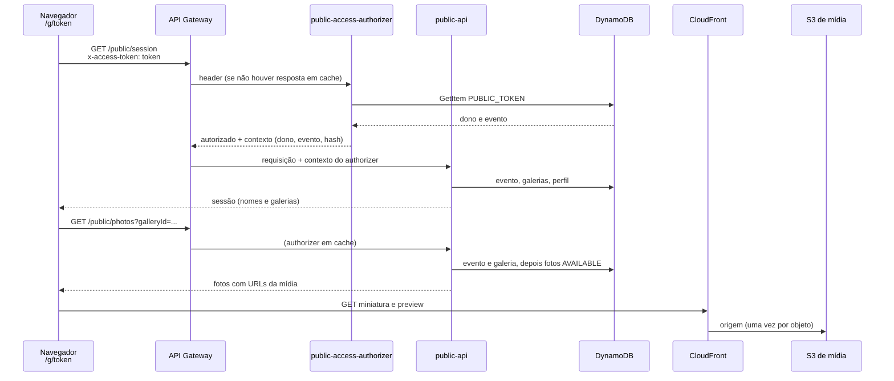
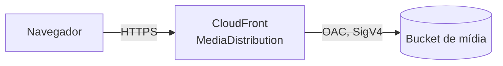

## Objetivo

Permitir que o cliente abra `/g/{token}`, veja as galerias do evento e navegue pelas fotos **sem conta e sem login**. A prova de acesso é o token que vem no endereço.

O fluxo precisa garantir três coisas:

1. O cliente só alcança o **evento** a que o link pertence, e todas as suas galerias.
2. Um link substituído, vencido ou de um evento não publicado deixa de dar acesso.
3. Nenhum identificador interno (fotógrafo, evento, chaves do S3) chega ao cliente.

Como o link é gerado e o que o pacote define está em [Pacote, publicação e link de acesso](/developers/flows/event-package-and-access-link). O que o cliente faz depois de entrar, marcar fotos, está em [Seleção de fotos](/developers/flows/photo-selection).

## Visão de ponta a ponta



## Duas camadas de decisão

O acesso é decidido em duas camadas, com responsabilidades diferentes:

| Camada | Onde | Pergunta que responde | Resultado em cache |
| --- | --- | --- | --- |
| **Autenticação do token** | `public-access-authorizer`, antes da API | "Este token existe e a quem pertence?" | Sim, por 60 segundos, por valor de token |
| **Autorização da operação** | Cada operação da `public-api`, contra o evento | "Este link pode ver (ou selecionar) agora?" | Não |

O authorizer **só autentica**. Ele não confere o estado do evento, a validade nem a substituição do link. A resposta dele é guardada em cache pelo API Gateway e vale para todas as rotas, então qualquer regra que mude com o tempo precisa ser conferida de novo em cada operação.

Esse é o motivo de a regra [`canAccessEvent`](/developers/flows/event-package-and-access-link#a-regra-que-decide-se-o-cliente-entra) rodar na `public-api`, sobre o evento lido naquele momento, e não no authorizer.

## Etapa 0: o navegador

Rota `/g/:token/*`, carregada sob demanda (`PublicRoutes`).

1. `PublicLayout` valida o **formato** do token no endereço (43 caracteres de base64url). Se não bater, mostra "Este link não está disponível" sem chamar a API.
2. O token vira um cliente de API próprio (`createPublicApi`), que anexa o header `x-access-token` em toda chamada. O token fica **só na memória** desse cliente. Não é gravado em `localStorage`, `sessionStorage` nem cookie. Recarregar a página parte do token que está no endereço.
3. Cada token tem seu próprio `QueryClient`. A chave do escopo é o token: ao trocar de link, o cache anterior é descartado e nada de um evento aparece em outro.
4. `PublicSessionGate` só renderiza as páginas filhas depois que `GET /public/session` for aceita.

## Etapa 1: o authorizer

`publicAccessAuthorizer` é uma Lambda authorizer do API Gateway, com resposta simples (`EnableSimpleResponses`) e cache de 60 segundos (`ReauthorizeEvery: 60`). A fonte de identidade é o header `x-access-token`.

Sequência (`ValidateEventAccessToken`):

1. O valor precisa ser uma string que case com `^[A-Za-z0-9_-]{43}$`. Senão, `InvalidAccessTokenError`.
2. O token é transformado em SHA-256 (hexadecimal). O hash é a chave de busca; o token em claro não é gravado nem registrado em log.
3. `DynamoDbEventAccessTokenRepository.get` faz `GetItem` em `PUBLIC_TOKEN#{hash}` / `PUBLIC_GALLERY`.
4. Registro ausente ou incompleto (sem dono, evento ou `expiresAt`) também vira `InvalidAccessTokenError`.

Token **malformado** e **desconhecido** falham com o mesmo erro. O chamador não descobre qual dos dois foi.

| Resultado | O que o authorizer devolve |
| --- | --- |
| Token reconhecido | `isAuthorized: true` e o contexto `{ pgId, eventId, tokenHash }` |
| `InvalidAccessTokenError` | `isAuthorized: false` e contexto vazio |
| Qualquer outro erro (por exemplo, falha do DynamoDB) | O erro propaga. O gateway responde 500 e **não guarda** uma negação em cache. |

O contexto `{ pgId, eventId, tokenHash }` é a **única fonte** de dono e evento nas rotas públicas. Nenhuma rota aceita esses valores por path, query ou corpo. É a mesma regra do Studio, onde o dono vem só do `sub` do JWT.

<Note>
  O authorizer **não** compara o instante atual com `expiresAt` do registro do token, nem consulta o evento. Um link vencido ainda é reconhecido; quem o nega é a operação, ao ler o evento. Isso permite que operações específicas usem uma regra mais branda que "ver e selecionar". Por exemplo, ver um pedido já aberto exige apenas que o link seja o atual do evento, sem exigir que o prazo de seleção esteja valendo.
</Note>

### O que o cache de 60 segundos significa

| Situação | O que acontece |
| --- | --- |
| O fotógrafo gera um novo link; o antigo estava sendo usado | O token antigo pode continuar passando pelo authorizer por até 60 segundos. Cada operação lê o evento, vê que o hash apresentado não é o atual e responde 403 `ACCESS_DENIED`. O cliente não vê dados. |
| O link vence | O authorizer segue autorizando. A operação nega pelo prazo do link. |
| O evento deixa de estar publicado | O mesmo: o authorizer autoriza, a operação nega. |
| Token desconhecido | A negação pode ficar em cache pelo mesmo prazo. |

A consequência é que **o authorizer nunca é a barreira de prazo ou de substituição**. Ele é só a barreira de identidade.

## Etapa 2: abrir a sessão

**Rota:** `GET /public/session`.

`GetPublicSession` chama `PublicAccessService.openSession`:

1. Lê o evento do dono e do evento do contexto, com leitura consistente.
2. Nega (`EventAccessDeniedError`) se o evento não existe, não tem link ou `canAccessEvent` é falso.
3. Lista as galerias do evento e **filtra** com `canView`, que exige que a galeria seja do evento, do mesmo dono e esteja `ACTIVE`. Galerias em `DELETING` não aparecem.
4. Só depois lê o perfil do fotógrafo para obter o nome. O direito de acesso é decidido antes dessa leitura: um link negado não toca no perfil.

**Resposta** (`PublicSession`):

```json
{
  "event": { "name": "Casamento de Ana e Bruno", "eventDate": "2026-11-14" },
  "photographer": { "name": "Fotógrafa Exemplo" },
  "access": { "expiresAt": "2026-10-12T12:00:00.000Z" },
  "galleries": [{ "id": "01JEXAMPLEGALLERY00000000A", "name": "Galeria principal", "isDefault": true }]
}
```

Os valores são fictícios. A resposta **não** traz id de evento, id de fotógrafo, e-mail, token nem hash. Se o perfil não for encontrado, `photographer.name` é uma string vazia.

`access.expiresAt` é o fim da validade do link, lido do **evento**.

### Como o frontend reage ao vencimento

Com a página aberta, o vencimento do link não gera requisição por conta própria. `usePublicSession` agenda uma nova consulta de `GET /public/session` para o instante `access.expiresAt`:

- Se o servidor ainda aceitar (relógio do navegador adiantado), a consulta se repete a cada 60 segundos.
- Se recusar, o cabeçalho e o conteúdo são trocados por "Este link não está disponível".

Qualquer chamada recusada em qualquer página também derruba a tela inteira para essa mensagem (`useLinkRefused`), de modo que nada do evento permaneça na tela de um link recusado. A tela é a mesma para link malformado, desconhecido, vencido, substituído ou de evento fora do ar. O cliente não sabe qual foi o caso.

## Etapa 3: listar as fotos de uma galeria

**Rota:** `GET /public/photos?galleryId={id}&cursor={opaco}&limit={n}`.

### Sequência

1. O controller valida a query (`PublicPhotoListQuerySchema`). `limit` aceita só dígitos, de 1 a 200, e vale 60 se ausente.
2. `PublicAccessService.assertCanView` lê **em paralelo** o evento e a galeria pedida, ambos na partição do dono e do evento do contexto. Uma galeria de outro evento não é encontrada, porque a chave leva o evento do token.
3. Ordem das recusas, para não revelar a existência de galerias a quem não tem acesso:
   - sem acesso ao evento: 403 `ACCESS_DENIED`, antes de qualquer informação sobre a galeria;
   - com acesso, mas galeria inexistente, de outro evento ou em exclusão: 404 `NOT_FOUND`.
4. `listAvailableByGallery` lê as fotos da galeria em ordem de chave, **só as `AVAILABLE`**.
5. Para cada foto, o caso de uso monta as URLs de miniatura e de preview a partir da tentativa publicada (`completedAttemptId`) e da base da mídia.

### Paginação

O cursor desta rota é diferente do cursor do Studio. Ele carrega **só a posição** (o id da última foto lida) e o **escopo** da consulta (`AVAILABLE#{galleryId}`). Nenhuma chave da tabela, e portanto nenhum id de dono ou de evento, sai para o cliente. Quem decodifica remonta a partição a partir do contexto do authorizer.

Um cursor de outra galeria, com formato inválido ou com a chave da tabela é recusado com 400 `INVALID_CURSOR`.

O filtro `AVAILABLE` é aplicado **depois** da leitura. Para fechar uma página sem ler fotos já lidas, cada leitura pede só o que falta (`Limit` igual ao tamanho da página menos o que já foi coletado), com até 4 leituras por requisição. Consequências:

- Uma página pode vir com menos fotos que `limit`, ou até vazia, e **ainda trazer `nextCursor`**.
- A lista só terminou quando `nextCursor` está ausente.
- A leitura é eventualmente consistente, o que custa metade. Uma foto que acabou de ficar pronta pode levar um instante para aparecer.

O frontend trata isso: se uma página chega vazia com continuação, ele pede a seguinte sozinho. A primeira página usa o padrão (60 fotos); as seguintes pedem 200.

### Resposta

```json
{
  "items": [
    {
      "id": "01JEXAMPLEPHOTO000000000A",
      "name": "IMG_0001.jpg",
      "width": 1600,
      "height": 1067,
      "thumbnailUrl": "https://example.cloudfront.net/photos/.../thumb-v1.webp",
      "previewUrl": "https://example.cloudfront.net/photos/.../preview-v1.webp"
    }
  ],
  "nextCursor": "eyJ..."
}
```

Os valores são fictícios. `width` e `height` são da preview e podem ser `null` em fotos publicadas antes de as dimensões serem gravadas. O frontend os usa para reservar o espaço da foto antes de baixá-la.

`name` é o nome do arquivo que o fotógrafo enviou. A grade do cliente não o exibe; ela rotula as fotos como "Foto N".

O DTO público (`toPublicPhotoDto`) não traz evento, galeria, dono, fingerprint, tamanho, estado, datas nem chave do S3.

## Entrega da mídia

As miniaturas e as previews **não passam pela API**. O navegador as busca direto no CloudFront.



| Aspecto | Configuração atual |
| --- | --- |
| Buckets | **Dois**. O de originais não tem relação com a distribuição. O de mídia guarda só miniaturas e previews. |
| Acesso ao bucket de mídia | Bloqueado ao público. Somente a distribuição lê, por Origin Access Control (`sigv4`, `always`). A bucket policy restringe `s3:GetObject` à distribuição pelo ARN. |
| Distribuição | HTTP/2 e HTTP/3, `redirect-to-https`, somente `GET` e `HEAD`, compressão ligada, `PriceClass_All`, política de cache gerenciada `CachingOptimized`. |
| Cache dos objetos | Os derivados são gravados com `Cache-Control: public, max-age=31536000, immutable`. |
| Invalidação | Não existe e não é necessária: cada tentativa de processamento grava em `attempts/{attemptId}/`, então uma nova tentativa produz uma **nova URL**. |
| Base das URLs | Variável `MEDIA_BASE_URL`, preenchida pelo template com o domínio da distribuição. `MediaUrlBuilder` exige `https` e codifica cada segmento da chave. |

A separação em dois buckets é intencional, e o template registra o motivo: a distribuição só enxerga o bucket de mídia, então nenhum erro de configuração do CDN alcança um original.

<Warning>
  As URLs de mídia **não são assinadas**. Quem tiver a URL de uma miniatura ou preview consegue baixá-la, mesmo depois de o link do cliente vencer ou ser substituído. A barreira é a dificuldade de adivinhar a URL: a chave contém o `sub` do fotógrafo, o ULID do evento, da galeria e da foto e o UUID da tentativa. Atualmente nada no template restringe o acesso ao CDN por link, cookie ou URL assinada. Esse é o comportamento implementado hoje, não uma garantia de sigilo.
</Warning>

A entrega dos **originais** ao cliente (download após a compra) não existe no código atual.

## Respostas de erro

| Situação | Origem | Status e `code` |
| --- | --- | --- |
| Token malformado ou desconhecido | API Gateway, via authorizer | Resposta do gateway; a `public-api` não é invocada. O frontend trata 401 e 403 como link indisponível. |
| Contexto do authorizer ausente ou inválido | `getPublicAccess` | 401 `UNAUTHENTICATED` |
| Link substituído, vencido, revogado ou evento não publicado | `EventAccessDeniedError` | 403 `ACCESS_DENIED` |
| Galeria de outro evento, inexistente ou em exclusão | `GalleryNotFoundError` | 404 `NOT_FOUND` |
| Parâmetros inválidos | validação | 400 `VALIDATION_ERROR` |
| Cursor inválido | `InvalidCursorError` | 400 `INVALID_CURSOR` |
| Erro inesperado | catch geral | 500 `INTERNAL_ERROR`, com mensagem genérica |

## Limites e permissões

- Throttling por rota: 20 requisições por segundo, com rajada de 40, em cada rota `/public/*`.
- CORS: o gateway aceita qualquer origem, com os headers `Content-Type`, `Authorization` e `x-access-token`.
- A `public-api` tem permissões apenas no DynamoDB (`GetItem`, `Query`, `PutItem`, `UpdateItem`, `DeleteItem`, `ConditionCheckItem`). Não acessa S3 nem SQS. Os `Put`, `Update` e `Delete` existem para as escritas de seleção e de pedido.
- O authorizer tem somente `dynamodb:GetItem`.
- Timeout padrão da função: 10 segundos.

## Onde está no código

| Assunto | Caminho |
| --- | --- |
| Rotas e erros | `services/api/src/handlers/api/publicApi.ts` |
| Authorizer | `handlers/authorizer/publicAccessAuthorizer.ts`, `application/events/access/ValidateEventAccessToken.ts` |
| Contexto do authorizer | `http/getPublicAccess.ts` |
| Regras de acesso | `application/public/PublicAccessService.ts`, `domain/gallery/GalleryAccess.ts`, `domain/event/EventAccess.ts` |
| Sessão | `application/public/GetPublicSession.ts` |
| Fotos | `application/photos/queries/ListPublicGalleryPhotos.ts`, `contracts/photo/toPublicPhotoDto.ts` |
| URLs de mídia | `shared/storage/MediaUrlBuilder.ts`, `shared/storage/S3KeyBuilder.ts` |
| Infraestrutura | `infra/template.yaml` (`PublicAccessAuthorizerFunction`, `PublicApiFunction`, `MediaBucket`, `MediaDistribution`) |
| Frontend | `apps/web/src/public/` (`PublicLayout`, `publicApi`, `usePublicSession`, `useGalleryPhotos`) |

Os caminhos de `services/api` são relativos a `src`.
