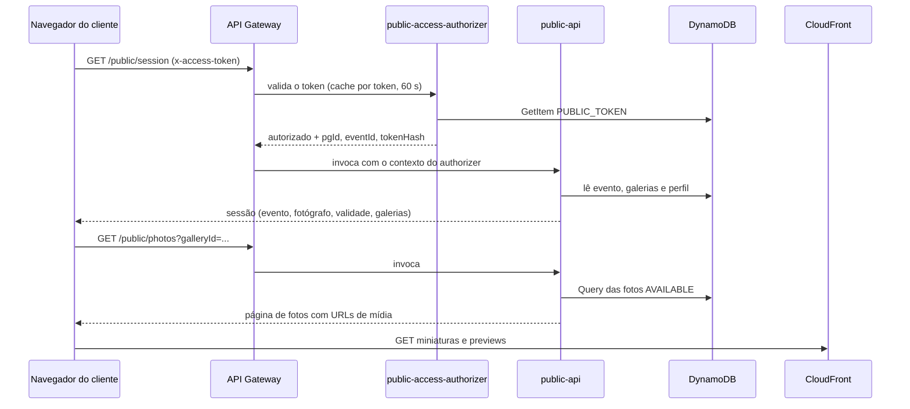

O cliente não tem conta. Ele chega por um link `/g/{token}` e todas as chamadas dele usam o token, não um JWT do Cognito. Este fluxo cobre a entrada do cliente: autenticar o token, abrir a sessão do evento e listar as fotos. A seleção e o pedido, que usam a mesma entrada, estão em páginas próprias.

O link é gerado pelo fotógrafo. Veja [Pacote, publicação e link do cliente](/developers/flows/event-publishing-and-access-link).

## Visão de ponta a ponta



## Duas camadas de verificação

O acesso é decidido em duas etapas, com responsabilidades diferentes.

| Camada | Onde | O que verifica |
| --- | --- | --- |
| Autenticação do token | `publicAccessAuthorizer` | O token tem 43 caracteres base64url e existe um registro `PUBLIC_TOKEN#{sha256}`. |
| Direito de acesso | `public-api`, em cada operação | O evento está `PUBLISHED`, o token é o do link atual, o link não venceu nem foi revogado e a galeria pertence ao evento e está ativa. |

A divisão existe por causa do cache. A resposta do authorizer fica em cache por token e vale para todas as rotas, com `ReauthorizeEvery: 60` no template. Se o prazo e a revogação fossem decididos ali, um link vencido continuaria aceito até o cache expirar. Por isso o authorizer só autentica, e cada rota da `public-api` confere o direito de novo, contra o link registrado no evento. Um link substituído ou vencido deixa de valer na leitura seguinte.

### O authorizer

`publicAccessAuthorizer` é um Lambda authorizer com resposta simples (`EnableSimpleResponses`). A identidade é o header `x-access-token`.

1. `ValidateEventAccessToken` confere o formato com a expressão `^[A-Za-z0-9_-]{43}$`.
2. Calcula o SHA-256 do token e lê `PUBLIC_TOKEN#{hash}` / `PUBLIC_GALLERY`.
3. Registro ausente ou incompleto (sem dono, evento ou `expiresAt`) é tratado como token desconhecido.

Token malformado e token desconhecido falham com o mesmo `InvalidAccessTokenError`, para não revelar qual foi o caso. O authorizer responde `isAuthorized: false`, e o API Gateway devolve 403 sem invocar a `public-api`.

Em caso de sucesso, o authorizer injeta `pgId`, `eventId` e `tokenHash` no contexto. Falha de infraestrutura, como um erro do DynamoDB, é propagada: o gateway responde 500 e não guarda a negação em cache.

<Note>
  Prazo e revogação **não** são verificados no authorizer. Um link vencido ou revogado ainda precisa ser reconhecido para dar acesso às compras do cliente, e o registro `PUBLIC_TOKEN#` guarda `expiresAt` e `revokedAt` sem aplicá-los.
</Note>

### Dono e evento nunca vêm do cliente

`getPublicAccess` lê só o contexto do authorizer e o valida com zod. O cliente informa no máximo o `galleryId` e, na seleção, o `photoId`, na query ou no path. Esses ids são tratados como entrada não confiável: só são usados depois de encontrados na partição do evento do token (`USER#{pgId}#EVENT#{eventId}`). Um id de outro evento resulta numa chave que não existe.

## Abrir a sessão

**Rota:** `GET /public/session`.

`GetPublicSession` devolve o necessário para abrir a experiência:

| Campo | Conteúdo |
| --- | --- |
| `event` | `name` e `eventDate` |
| `photographer` | `name`, ou texto vazio se o perfil não for encontrado |
| `access.expiresAt` | Fim da validade do link, lido do evento |
| `galleries` | `id`, `name` e `isDefault` das galerias que o cliente pode ver |

**Sequência:**

1. `PublicAccessService.openSession` lê o evento e aplica `canAccessEvent`. Sem acesso, lança `EventAccessDeniedError`.
2. Só então lista as galerias do evento e filtra com `canView`, que exige galeria do mesmo evento e do mesmo dono, com status `ACTIVE`. Galerias em exclusão ficam de fora.
3. Por último, lê o perfil do fotógrafo. O direito de acesso é decidido antes dessa leitura, então uma falha no perfil não disputa com a negação.

A resposta não traz ids de evento ou de fotógrafo, e-mail, token nem hash.

## Listar as fotos

**Rota:** `GET /public/photos`, com `galleryId`, `cursor` opcional e `limit` opcional.

| Parâmetro | Regra |
| --- | --- |
| `galleryId` | Obrigatório, no formato de id de galeria. |
| `cursor` | Valor opaco devolvido como `nextCursor`. |
| `limit` | Só dígitos, sem zero à esquerda, de 1 a 200. Padrão 60. `1e2`, ` 50` e `60.0` são recusados, não convertidos. |

**Sequência:**

1. O controller valida a query com `PublicPhotoListQuerySchema`.
2. `ListPublicGalleryPhotos` repete a regra do limite no caso de uso, para quem chegar fora do HTTP.
3. `assertCanView` carrega o evento e a galeria em paralelo. O evento é decidido primeiro: sem acesso, 403 `ACCESS_DENIED`, sem revelar se a galeria existe. Com acesso, uma galeria que o cliente não pode ver responde 404.
4. `listAvailableByGallery` consulta as fotos da galeria.
5. Cada foto vira um `PublicPhotoDto`, com URLs de mídia montadas pelo servidor.

### Consulta e paginação

A consulta é um `Query` na partição do evento com `begins_with(SK, 'PHOTO#{galleryId}#')`, em ordem crescente, e um filtro por `status = AVAILABLE`. Só fotos prontas aparecem. Fotos em `PENDING_UPLOAD`, `PROCESSING` ou `FAILED` ficam fora.

O filtro roda depois da leitura, então uma página pode ter menos itens do que o pedido. Para fechar a página, o repositório repete a leitura pedindo só o que falta e continua da última chave lida, até encher a página, esgotar a galeria ou chegar a `MAX_FILTERED_READS` (4 leituras). A leitura é eventualmente consistente, o que custa metade: uma foto que acabou de ficar pronta pode aparecer só na leitura seguinte.

O cursor é a posição da última chave lida, com escopo `AVAILABLE#{galleryId}`. O cursor de outra galeria é recusado com 400 `INVALID_CURSOR`. Como o cursor guarda só a posição dentro da galeria, ele não carrega a partição de outro evento.

### A foto na resposta

`toPublicPhotoDto` devolve apenas o que a grade e o lightbox usam:

| Campo | Observação |
| --- | --- |
| `id`, `name` | `name` é o nome original do arquivo. |
| `width`, `height` | Dimensões da preview. `null` em fotos publicadas antes de as dimensões serem gravadas. |
| `thumbnailUrl`, `previewUrl` | URLs de mídia. |

A resposta não traz evento, galeria, dono, fingerprint, tamanho, estado, datas nem chave S3.

### URLs de mídia

`MediaUrlBuilder` concatena a base `MEDIA_BASE_URL` com a chave do derivado. A base é o domínio da distribuição CloudFront do bucket de mídia, fornecido pelo template, e precisa ser `https`. A chave vem de `S3KeyBuilder.derivatives`, usando `completedAttemptId` da foto para apontar a pasta `attempts/{attemptId}/` que foi publicada:

```
https://{distribuição}/photos/{ownerId}/{eventId}/{galleryId}/{photoId}/attempts/{attemptId}/thumb-v1.webp
```

As URLs **não são assinadas**. A distribuição lê o bucket de mídia por Origin Access Control, que só contém miniaturas e previews. Os originais ficam em outro bucket e nenhuma distribuição os enxerga. Quem conhece a URL de um derivado consegue baixá-lo; a proteção é o caminho imprevisível (ULIDs) e o fato de que só derivados ficam nesse bucket. O processamento que grava os derivados está em [Processamento de imagens](/developers/flows/image-processing).

## Limites de taxa

Cada rota `/public/*` declara `RouteSettings` no template: 20 requisições por segundo, com rajada de 40. O excesso recebe 429 do gateway, sem invocar o Lambda. O limite vale para a rota inteira, somado entre todos os links: o HTTP API não separa por token nem por IP, então um link abusivo consome a cota dos demais.

## Erros

| Situação | Status | `code` |
| --- | --- | --- |
| Header ausente, token malformado ou desconhecido | 403 do gateway | — |
| Contexto do authorizer ausente | 401 | `UNAUTHENTICATED` |
| Link vencido, revogado ou substituído, ou evento fora de `PUBLISHED` | 403 | `ACCESS_DENIED` |
| Galeria de outro evento, inexistente ou em exclusão | 404 | `NOT_FOUND` |
| Query inválida | 400 | `VALIDATION_ERROR` |
| Cursor inválido ou de outra galeria | 400 | `INVALID_CURSOR` |
| Taxa excedida | 429 | — |

Link vencido, revogado, substituído e evento não publicado respondem igual, para não revelar o motivo.

## Frontend

A área pública é a rota `/g/:token/*`, carregada sob demanda, em `apps/web/src/public`.

- **Token só em memória.** `PublicLayout` valida o formato do token e cria um cliente HTTP preso a ele (`createPublicApi`), que envia `x-access-token` em toda chamada. O token não vai para `localStorage`, `sessionStorage` nem cookie. Recarregar a página parte do token da URL.
- **Cache por link.** Cada token tem o próprio `QueryClient`, descartado quando o link muda. Nada de um link aparece em outro, e o cache não se mistura com o do Studio.
- **Portão da sessão.** `PublicSessionGate` só renderiza as páginas depois de a sessão ser aceita. Recusa (401 ou 403) mostra a tela de link indisponível em qualquer endereço sob `/g/:token`, inclusive quando a recusa chega com a página aberta, e o cabeçalho deixa de mostrar o evento.
- **Vencimento com a página aberta.** `usePublicSession` agenda uma nova consulta da sessão para o instante de `access.expiresAt`. Quem decide é o servidor: se ele ainda aceitar o link (relógio do navegador adiantado), a conferência se repete a cada 60 segundos.
- **Rotas.** `/g/:token` abre a lista de galerias, e `/g/:token/galerias/:galleryId` abre a grade de fotos. Uma galeria que não está na sessão nem chega a ser pedida à API.
- **Grade.** `VirtualPhotosGrid` só monta as linhas perto da tela. A primeira página usa o padrão da API (60 fotos). As seguintes pedem 200, o teto, e são carregadas com antecedência de linhas conforme a rolagem. O lightbox (`PhotoLightbox`) navega por swipe, setas e `Esc`.
- **Orçamento de bundle.** O build falha se a área pública carregar o Amplify ou passar de 200 KB (gzip) de JavaScript ou 20 KB de CSS no carregamento inicial (`publicChunkGuard`).

## Limites atuais

- **Sem URLs assinadas.** A mídia é pública para quem tiver a URL. Veja [URLs de mídia](#urls-de-mídia).
- **Taxa compartilhada.** O limite de `/public/*` é da rota inteira, não por link.
- **CORS aberto.** A API aceita qualquer origem, com o header `x-access-token` liberado.
