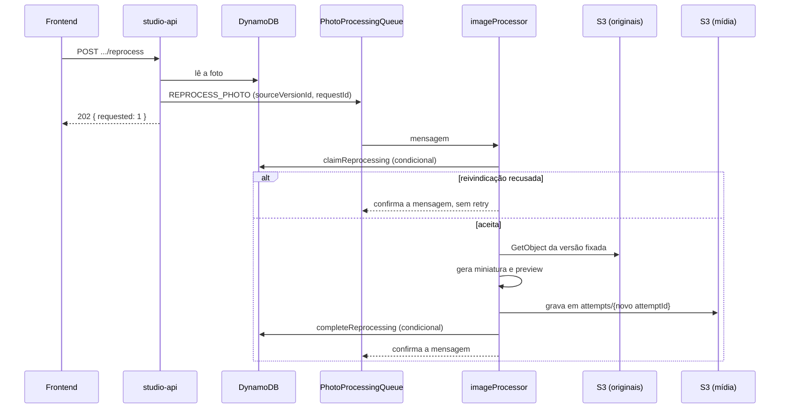

## Objetivo

Duas partes do ciclo de vida da foto ficam depois do upload e do processamento inicial:

- **Reprocessar.** Gerar de novo os derivados de uma foto a partir do mesmo original, por pedido do fotógrafo.
- **Entregar a mídia.** Servir miniatura e preview ao navegador por URLs públicas de uma distribuição CloudFront, sem expor o original.

Esta página descreve as duas e a marca d'água aplicada à preview. O processamento inicial está em [Processamento de imagens](/developers/flows/image-processing).

## Reprocessamento

### Pontos de entrada

| Rota | Efeito | Resposta |
| --- | --- | --- |
| `POST /events/{eventId}/galleries/{galleryId}/photos/{photoId}/reprocess` | Pede o reprocessamento de uma foto. | `202` com `{ "requested": 1 }` |
| `POST /events/{eventId}/photos/reprocess-failures` | Pede o reprocessamento de todas as fotos do evento em `FAILED`. | `202` com `{ "requested": n }` |

As duas rotas exigem o JWT do fotógrafo e só alcançam fotos da partição dele. A resposta `202` significa que as mensagens foram publicadas na fila, não que o trabalho terminou.

### Sequência

### Validações na API

`RequestPhotoReprocessing` lê a foto na partição do fotógrafo e aplica duas regras:

| Condição | Resultado |
| --- | --- |
| A foto não existe | `404 NOT_FOUND` |
| O status não é `AVAILABLE` nem `FAILED`, ou a foto não tem `sourceVersionId` | `409 PHOTO_NOT_REPROCESSABLE` |

Uma foto sem `sourceVersionId` nunca chegou a ter um original fixado, então não há de onde regenerar. Uma foto em `PENDING_UPLOAD` ou `PROCESSING` ainda não terminou o primeiro processamento.

A API **não altera o registro da foto**. Ela só publica uma mensagem do tipo `REPROCESS_PHOTO` com `pgId`, `eventId`, `galleryId`, `photoId`, `sourceVersionId` e um `requestId` novo (UUID). Por isso, repetir o pedido publica outro job; quem decide se o segundo job faz alguma coisa é a reivindicação no processador.

### Reprocessamento em lote

`POST /events/{eventId}/photos/reprocess-failures`:

1. Confirma que o evento existe. Se não existir, `404 NOT_FOUND`.
2. Consulta com leitura consistente as fotos do evento, filtrando `FAILED` com `sourceVersionId` presente.
3. Publica uma mensagem por foto, em lotes de 10 com até 10 lotes em paralelo.
4. Responde `202` com o total de mensagens.

Se qualquer entrada do lote for recusada pela fila, a rota falha. O fotógrafo recupera repetindo o pedido: a consulta devolve de novo as fotos que continuam em `FAILED`, e a reivindicação descarta as que já foram tratadas.

### Fila e processador

As mensagens vão para a mesma `PhotoProcessingQueue` do processamento inicial, e a `studio-api` recebe a URL pela variável `PHOTO_PROCESSING_QUEUE_URL`. A fila, o visibility timeout (360 s), o `maxReceiveCount` (5) e a DLQ são os descritos em [Infraestrutura](/developers/architecture/infrastructure#sqs).

O `imageProcessor` normaliza as duas origens de mensagem no mesmo formato. Para uma mensagem `REPROCESS_PHOTO`, a origem é `REPROCESS` e a chave do original é montada por `S3KeyBuilder.original`. Mensagem malformada é descartada sem retry.

### Reivindicação

Antes de qualquer acesso ao S3, `claimReprocessing` faz um `UpdateItem` condicional. Ele só é aceito quando todas as condições abaixo valem ao mesmo tempo:

- o status é `AVAILABLE` ou `FAILED`;
- o `sourceVersionId` da foto é igual ao da mensagem;
- não há lease de processamento, ou o lease está vencido;
- o `reprocessRequestId` registrado é diferente do `requestId` da mensagem.

Aceita, a reivindicação grava um `processingAttemptId` novo e um `processingLeaseUntil` de 90 segundos. **Ela não muda o status nem o `completedAttemptId`.** Enquanto o worker trabalha, a foto continua `AVAILABLE` (ou `FAILED`) e os derivados já publicados continuam sendo servidos.

Recusada, o processador registra um aviso com o motivo, incrementa a métrica `ReprocessRefused` e confirma a mensagem, sem retry:

| Motivo | Significado |
| --- | --- |
| `PHOTO_MISSING` | A foto deixou de existir, por exemplo por exclusão. |
| `NOT_ELIGIBLE` | O status não é `AVAILABLE` nem `FAILED`. |
| `VERSION_MISMATCH` | O `sourceVersionId` da mensagem não é o da foto. |
| `ALREADY_HANDLED` | Este `requestId` já foi aplicado. |
| `IN_PROGRESS` | Outro worker tem um lease válido. |

### Conclusão

O worker baixa a versão fixada do original, valida o JPEG, gera os dois derivados e os grava sob `attempts/{attemptId}/`, com o `attemptId` da reivindicação. Em seguida há dois desfechos:

| Desfecho | Operação | Efeito no registro |
| --- | --- | --- |
| Sucesso | `completeReprocessing` | Status `AVAILABLE`, novo `completedAttemptId`, dimensões da preview, `reprocessRequestId` e `reprocessAttemptId`. Remove `processingAttemptId`, `processingLeaseUntil` e `failureReason`. |
| Conteúdo inválido (`InvalidPhotoContentError`) | `rejectReprocessing` | Mantém status e derivados antigos. Só registra `reprocessRequestId` e `reprocessAttemptId`. |

A troca de `completedAttemptId` é o que faz a nova versão aparecer para o fotógrafo e para o cliente. Enquanto ela não acontece, a leitura continua apontando para a pasta anterior. Uma reentrega da mesma mensagem é reconhecida porque `reprocessAttemptId` já é igual à tentativa e o `sourceVersionId` é o mesmo.

Erros transitórios (S3, DynamoDB, falha do sharp) propagam e a mensagem volta para a fila, como no processamento inicial.

### Consequências

- **O reprocessamento usa o mesmo original.** A versão fixada em `sourceVersionId` não muda. Uma foto que falhou porque o arquivo é inválido falha de novo, e `rejectReprocessing` apenas registra isso. Para trocar o arquivo, a foto precisa ser enviada outra vez.
- **A pasta anterior fica órfã.** `attempts/{attemptId antigo}` não é apagado depois que um novo `completedAttemptId` é publicado.
- **Pedidos repetidos geram jobs repetidos.** Cada clique publica uma mensagem nova com `requestId` próprio. Se já existe um lease válido, o job extra é recusado como `IN_PROGRESS`.
- **O tempo do lease vale também aqui.** O worker tem 60 s, o lease dura 90 s e a visibilidade da mensagem é de 360 s, como em [Os três tempos](/developers/flows/image-processing#os-três-tempos).

### Frontend

A foto tem um botão de reprocessar (`ReprocessPhotoButton`, com o hook `useReprocessPhoto`). O evento tem uma ação para reprocessar todas as falhas (`useReprocessEventFailures`).

Como a rota responde `202` e a foto continua em `FAILED` até o worker terminar, o frontend mantém um acompanhamento por evento, em `reprocessWatch.ts`. Cada pedido registra o escopo (uma foto, as fotos com falha ou todas) e a lista de fotos continua sendo consultada enquanto houver pedido em andamento.

`reprocessErrorMessage` traduz os erros da API:

| Erro | Mensagem ao usuário |
| --- | --- |
| `409 PHOTO_NOT_REPROCESSABLE` | A foto ainda está sendo processada. |
| `404` | A foto não existe mais. |
| Outros | Mensagem genérica de falha. |

## Marca d'água

A marca d'água é aplicada pelo `SharpProcessor`, com `LumoraWatermark`, e **somente na preview**. A miniatura não tem marca.

| Aspecto | Valor |
| --- | --- |
| Origem | SVG embutido no bundle. |
| Texto | Nenhum. A Lambda não tem fontes, então a marca é só geometria: um anel, um ponto central e quatro traços. |
| Cor | Branco com opacidade de 0,30. |
| Tamanho da marca | `round(min(largura, altura) / 8)` (`WATERMARK_MARKS = 8`). |
| Espaçamento | A célula tem `max(tamanho, round(tamanho × 1,6))` (`WATERMARK_SPACING = 1.6`). |
| Padrão | Um bloco 2×2 com as marcas na diagonal, repetido com `tile: true`, de modo que as linhas ficam alternadas. |

Se a marca não puder ser gerada, o erro é `InvalidWatermarkError`. Ele **não** é um `InvalidPhotoContentError`. O processador o trata como falha comum: a mensagem volta para a fila, tenta de novo e, esgotadas as tentativas, vai para a DLQ. A foto não é marcada como `FAILED` por isso.

### Parâmetros dos derivados

| Derivado | Tamanho máximo | Ajuste | Qualidade | Marca d'água |
| --- | --- | --- | --- | --- |
| Miniatura | 600 × 600 | `inside` | 75 | Não |
| Preview | 1920 × 1920 | `inside` | 80 | Sim |

Os dois são WebP, sem EXIF. O sharp lê no máximo 100 milhões de pixels (`limitInputPixels`).

<Note>
  Os derivados já publicados não são regenerados quando a marca ou os parâmetros mudam. Para aplicar uma regra nova a fotos existentes é preciso reprocessá-las.
</Note>

## Mídia e CloudFront

### Dois buckets

Originais e derivados ficam em buckets diferentes:

| Bucket | Conteúdo | Quem lê |
| --- | --- | --- |
| `PhotosBucket` | Originais enviados pelo navegador. Versionado. | Funções Lambda com permissão explícita. O navegador só grava, por presigned POST. |
| `MediaBucket` | Miniaturas e previews. | Somente a distribuição CloudFront. |

O `MediaBucket` é privado: acesso público bloqueado, ACLs desabilitadas (`BucketOwnerEnforced`), criptografia AES256 e uma bucket policy que nega acesso sem TLS. A policy também permite `s3:GetObject` ao serviço `cloudfront.amazonaws.com`, restrito ao ARN da `MediaDistribution`. Nenhum outro principal lê o bucket pela internet.

O motivo da separação é que um erro de configuração do CDN nunca alcança os originais: a distribuição só enxerga o bucket de mídia.

### Distribuição

A `MediaDistribution` acessa o bucket por um `MediaOriginAccessControl` (sigv4, sempre assinando). Configuração:

| Item | Valor |
| --- | --- |
| Protocolos | HTTP/2 e HTTP/3 |
| Redirecionamento | HTTP para HTTPS |
| Métodos | `GET` e `HEAD` |
| Compressão | Habilitada |
| Política de cache | `CachingOptimized` (gerenciada pela AWS) |
| Classe de preço | `PriceClass_All` |

Os derivados são gravados com `Cache-Control: public, max-age=31536000, immutable`. Como o caminho inclui o `attemptId`, um derivado novo nunca reutiliza uma URL antiga, então não é preciso invalidar o cache.

### URLs

A URL pública de um derivado é `MEDIA_BASE_URL` mais a chave do objeto. O `MediaUrlBuilder` monta cada segmento com `encodeURIComponent` e exige que a base seja `https`; sem isso a função não inicia. A variável vem do domínio da distribuição e está definida na `studio-api` e na `public-api`.

| Quem lista | Rota | O que devolve |
| --- | --- | --- |
| Fotógrafo | `GET /events/{eventId}/galleries/{galleryId}/photos` | `thumbnailUrl` e `previewUrl` de **cada** foto da página, em qualquer estado. |
| Cliente | Lista pública da galeria | `thumbnailUrl` e `previewUrl` somente das fotos `AVAILABLE`. |

As URLs não expiram nem são assinadas. Quem conhece a URL consegue baixar o derivado. O acesso é controlado em quem recebe a lista: ela exige o JWT do fotógrafo ou o token do link do cliente. Veja [Acesso público do cliente](/developers/flows/public-client-access).

A chave do derivado depende do `completedAttemptId`. Uma foto que ainda não concluiu não tem essa pasta, e a URL aponta para um objeto que não existe. O navegador mostra a imagem quebrada. A lista pública evita isso por listar só fotos `AVAILABLE`.

### Permissões

| Função | Mídia | Originais |
| --- | --- | --- |
| `imageProcessor` | `PutObject` e `DeleteObject` em `photos/*` | `GetObject`, `GetObjectVersion` e `DeleteObject` em `photos/*` |
| Função de exclusão de fotos | Apaga os derivados | Apaga os originais |

Veja [Exclusão de fotos e galerias](/developers/flows/photo-and-gallery-deletion) para o ciclo de limpeza dos dois buckets.

## Falhas e recuperação

| Situação | O que acontece |
| --- | --- |
| Fila indisponível no pedido | A rota falha e nada foi alterado. O fotógrafo repete. |
| Publicação parcial no lote | A rota falha. Repetir republica as fotos que ainda estão em `FAILED`. |
| Worker morre no meio | A mensagem reaparece após o visibility timeout. O lease vencido permite assumir. |
| Conteúdo inválido | `rejectReprocessing`. Os derivados antigos continuam servidos. |
| Marca d'água não gerada | Retry e depois DLQ. A foto não muda de estado. |
| Mensagem de uma versão antiga do original | Recusada como `VERSION_MISMATCH`. |

## Onde olhar no código

| Assunto | Arquivo |
| --- | --- |
| Pedido de reprocessamento | `services/api/src/application/photos/commands/RequestPhotoReprocessing.ts` |
| Reivindicação e conclusão | `services/api/src/infra/dynamodb/DynamoDbPhotoRepository.ts` |
| Orquestração do processamento | `services/api/src/application/photos/commands/ProcessUploadedPhoto.ts` |
| Handler da fila | `services/api/src/handlers/sqs/imageProcessor.ts` |
| Marca d'água e derivados | `services/api/src/infra/sharp/LumoraWatermark.ts`, `SharpProcessor` |
| URLs de mídia | `services/api/src/shared/storage/MediaUrlBuilder.ts` |
| Infraestrutura | `infra/template.yaml` (`MediaBucket`, `MediaDistribution`, `MediaOriginAccessControl`) |
| Acompanhamento no frontend | `apps/web/src/studio/events/reprocessWatch.ts`, `reprocessMessages.ts` |
